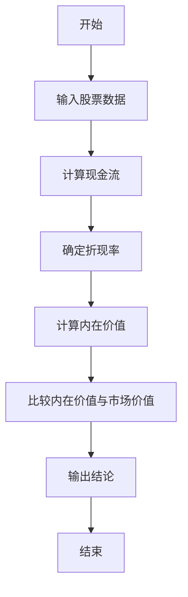
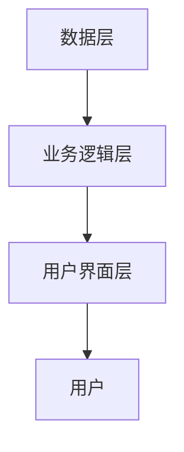
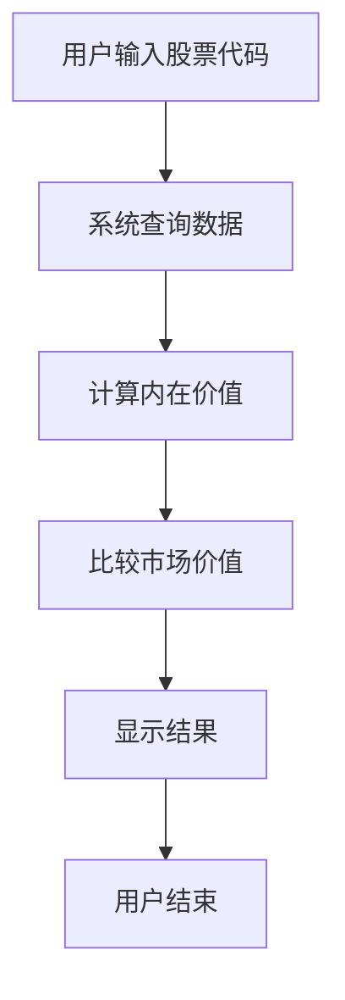

                 


# 《格雷厄姆的价值线概念及其应用》

---

## 关键词：价值线概念，格雷厄姆投资理论，内在价值，市场价值，价值投资，数学模型，算法实现

---

## 摘要：  
本文深入探讨了格雷厄姆的价值线概念，从其定义、核心原理到实际应用进行了全面分析。通过数学模型和算法实现，结合系统架构设计和项目实战，展示了价值线概念在投资决策中的重要性。文章旨在帮助读者理解如何利用价值线概念进行投资分析，并通过实际案例演示其应用。

---

## 第一章: 价值线概念的背景与起源

### 1.1 价值线概念的定义与核心要素  
价值线概念是格雷厄姆投资理论的核心，旨在通过分析股票的内在价值和市场价值来判断其投资价值。其核心要素包括：  
1. **内在价值**：公司未来现金流的现值，反映其真实价值。  
2. **市场价值**：市场对股票的定价，可能高于或低于内在价值。  
3. **安全边际**：内在价值与市场价值之间的差额，确保投资的安全性。  

### 1.2 格雷厄姆投资理论的背景  
格雷厄姆是价值投资的鼻祖，其理论强调以低于内在价值的价格买入股票。价值线概念的起源可以追溯到20世纪30年代，当时市场波动剧烈，投资者需要一种方法来评估股票的真正价值。  

### 1.3 价值线概念的核心属性特征对比  
通过对比内在价值与市场价值，价值线概念的特征可以清晰地展示：  

| 属性 | 内在价值 | 市场价值 |
|------|---------|---------|
| 计算方式 | 现金流折现 | 市场供需决定 |
| 稳定性 | 稳定 | 波动 |
| 时间因素 | 长期 | 短期 |

---

## 第二章: 价值线概念的核心原理与数学模型

### 2.1 价值线概念的原理  
价值线概念的核心在于通过计算股票的内在价值，判断其是否被市场低估。其原理包括：  
1. 现金流折现模型：计算公司未来现金流的现值。  
2. 市场价值波动：分析市场定价与内在价值的差异。  
3. 安全边际：确保投资的安全性。  

### 2.2 内在价值计算的数学公式  
内在价值的计算公式如下：  
$$ \text{内在价值} = \sum_{t=1}^{n} \frac{\text{现金流}_t}{(1 + r)^t} $$  
其中，\( r \) 是折现率，\( \text{现金流}_t \) 是第 \( t \) 年的现金流。  

### 2.3 算法原理与流程图  
以下是价值线概念的算法流程图：  



---

## 第三章: 价值线概念的系统分析与架构设计

### 3.1 系统功能设计  
价值线分析系统的功能模块包括：  
1. 数据输入：股票信息、财务数据。  
2. 内在价值计算：现金流折现、内在价值计算。  
3. 市场价值比较：与市场价对比，计算安全边际。  
4. 结果输出：显示投资建议。  

### 3.2 系统架构设计  
系统的架构分为三层：数据层、业务逻辑层和用户界面层。  



### 3.3 系统交互设计  
以下是系统交互流程图：  



---

## 第四章: 价值线概念的算法实现与实战

### 4.1 环境安装与配置  
- 安装Python和必要的库：`numpy`, `pandas`, `matplotlib`。  

### 4.2 算法实现  
以下是Python代码示例：  

```python
import numpy as np
import pandas as pd

def calculate_intrinsic_value(cash_flows, discount_rate):
    return np.sum(cash_flows / (1 + discount_rate) ** np.arange(len(cash_flows)))

# 示例数据
cash_flows = [100, 150, 200, 250]
discount_rate = 0.10

intrinsic_value = calculate_intrinsic_value(cash_flows, discount_rate)
print(f"内在价值：{intrinsic_value}")
```

### 4.3 实际案例分析  
以某股票为例，计算其内在价值与市场价值的差异，判断是否值得投资。  

### 4.4 项目小结  
通过实战项目，验证了价值线概念的有效性，并展示了其在投资决策中的实际应用。

---

## 第五章: 价值线概念的最佳实践与小结

### 5.1 最佳实践  
- 定期更新财务数据和市场价值。  
- 结合多种指标进行综合分析。  

### 5.2 小结  
价值线概念为投资者提供了一种科学的方法来评估股票的价值，通过内在价值与市场价值的对比，帮助投资者做出明智的投资决策。  

---

## 作者：AI天才研究院/AI Genius Institute & 禅与计算机程序设计艺术 /Zen And The Art of Computer Programming

