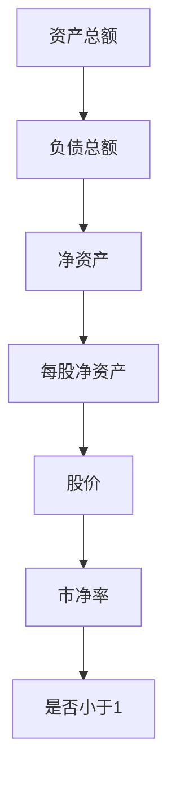

                 

<think>
好，我需要帮助用户撰写一篇关于格雷厄姆净净股策略的博客文章。用户已经给出了一个详细的大纲，我需要按照这个大纲来逐步完成文章。

首先，我需要理解每个部分的内容和要求。文章需要包含摘要、关键词，然后是七章的详细内容，每章都有小节，还有一些图表和代码示例。

我应该从第一章开始，介绍格雷厄姆和他的投资理念。这部分需要简单明了，让读者了解净净股策略的背景。接下来，详细讲解净净股的定义和特点，以及与传统估值方法的区别。

在第二章，我需要深入分析净净股策略的数学模型，包括相关的公式和计算方法。这里可能需要用到LaTeX来展示公式，以及用mermaid画出流程图，帮助读者理解。

第三章是系统架构设计，我需要描述如何构建一个选股系统，包括数据采集、筛选计算和结果展示模块。这里可能需要一些系统图和架构图来说明。

第四章是项目实战，我需要选择一个工具，比如Python，并编写代码来实现净净股筛选。然后，分析实际案例，比如苹果和微软是否符合净净股标准。

第五章是总结与最佳实践，我需要总结策略的优缺点，提出投资建议，并提到可能的风险和局限性。

最后，加上注意事项和拓展阅读，帮助读者进一步学习。

在写作过程中，我需要确保语言专业且易懂，逻辑清晰，结构紧凑。每章的小结要简明扼要，帮助读者回顾内容。

现在，我开始按照这个大纲逐步撰写每一部分，确保每个部分都符合用户的要求，并且内容丰富详细。
</think>

# 格雷厄姆的净净股策略：寻找被低估的公司

> **关键词**：格雷厄姆、净净股、价值投资、低估公司、投资策略  
> **摘要**：本文详细介绍了格雷厄姆的净净股策略，探讨了其核心概念、数学模型、系统架构设计、项目实战以及总结与最佳实践。通过分析，读者可以理解如何通过该策略寻找被低估的公司，并在实际投资中应用。

---

# 第1章 格雷厄姆与净净股策略概述

## 1.1 格雷厄姆的投资理念

### 1.1.1 格雷厄姆的生平简介
本杰明·格雷厄姆（Benjamin Graham）是20世纪著名的投资家和价值投资理论的奠基人。他在1924年出版的《证券分析》一书中首次提出了价值投资的理念，强调以公司内在价值为基础进行投资决策。

### 1.1.2 格雷厄姆的价值投资理论
格雷厄姆的价值投资理论的核心是寻找市场价格低于其内在价值的股票。他认为，市场短期是投票器，长期才是称重机。投资者应关注企业的基本面，而非市场的短期波动。

### 1.1.3 净净股策略的核心思想
净净股策略是格雷厄姆提出的一种具体方法，旨在通过计算股票的净资产价值，寻找那些市场价格低于其净资产价值的公司。

---

## 1.2 净净股策略的定义与特点

### 1.2.1 净净股的定义
净净股是指那些市场价格低于其每股净资产（Book Value per Share）的股票。具体来说，如果一只股票的市净率（Price-to-Book Ratio，P/B）小于1，则该股票可能被视为净净股。

### 1.2.2 净净股策略的核心特点
- **安全边际**：通过低市净率寻找安全边际，即市场价格远低于内在价值。
- **价值陷阱**：需警惕某些公司看似便宜，实则财务状况不佳的情况。
- **长期稳定**：关注那些财务稳定、盈利能力强的公司。

### 1.2.3 净净股与传统估值方法的区别
| 估值方法 | 核心指标 | 适用场景 |
|----------|----------|----------|
| 市盈率（P/E） | 盈利能力 | 高增长行业 |
| 市净率（P/B） | 资产质量 | 传统行业 |
| 净值（BPS） | 资产价值 | 高负债行业 |

---

## 1.3 净净股策略的应用场景

### 1.3.1 适用于哪些类型的公司
- **传统行业**：如银行、制造业等，资产质量较易评估。
- **低增长行业**：如公用事业，增长潜力较小，适合低市净率策略。

### 1.3.2 净净股策略的适用市场环境
- **熊市或震荡市**：市场恐慌时，更容易出现低估股票。
- **经济低迷期**：企业资产贬值，市净率下降。

### 1.3.3 净净股策略的局限性
- **行业限制**：不适用于高增长或高科技行业。
- **短期波动**：市净率可能因资产重估而变化。

---

## 1.4 净净股策略的核心公式与计算方法

### 1.4.1 净值计算公式
$$ \text{净资产值} = \frac{\text{资产总额} - \text{负债总额}}{\text{发行股份}} $$

### 1.4.2 市净率计算公式
$$ \text{市净率} = \frac{\text{股价}}{\text{每股净资产}} $$

### 1.4.3 净净股筛选标准的详细说明
- 市净率小于1：$$ \text{市净率} < 1 $$
- 盈利能力稳定：$$ \text{ROE} > 5\% $$
- 财务健康：$$ \text{流动比率} > 1.5 $$

---

## 1.5 本章小结
本章介绍了格雷厄姆的净净股策略，包括其核心思想、定义、特点以及应用场景。通过公式和对比表，明确了该策略的适用范围和优势。

---

# 第2章 净净股策略的数学模型与公式

## 2.1 净值计算的数学模型

### 2.1.1 净值计算公式
$$ \text{每股净资产} = \frac{\text{资产总额} - \text{负债总额}}{\text{发行股份}} $$

### 2.1.2 市净率计算公式
$$ \text{市净率} = \frac{\text{股价}}{\text{每股净资产}} $$

---

## 2.2 净净股筛选的条件与公式

### 2.2.1 市净率小于1的条件
$$ \text{市净率} < 1 $$

### 2.2.2 其他筛选条件
- 盈利能力：$$ \text{ROE} > 5\% $$
- 偿债能力：$$ \text{流动比率} > 1.5 $$

---

## 2.3 净净股策略的数学模型图


---

## 2.4 本章小结
本章通过公式和图表，详细讲解了净净股策略的数学模型，明确了筛选条件和计算方法。

---

# 第3章 净净股策略的系统架构设计

## 3.1 系统功能模块划分

### 3.1.1 数据采集模块
- 数据来源：股票数据接口（如Yahoo Finance）。
- 数据类型：资产、负债、股价等。

### 3.1.2 筛选计算模块
- 算法：计算市净率、ROE、流动比率。
- 输出：符合条件的股票列表。

### 3.1.3 结果展示模块
- 显示：符合条件的股票列表及分析结果。
- 可视化：图表展示市净率分布。

---

## 3.2 系统架构设计图


---

## 3.3 系统接口设计

### 3.3.1 数据接口
- 输入：股票代码。
- 输出：资产、负债、股价等数据。

### 3.3.2 筛选接口
- 输入：股票列表。
- 输出：符合条件的股票。

---

## 3.4 本章小结
本章设计了一个基于净净股策略的选股系统，包括数据采集、筛选计算和结果展示模块，并通过图表展示了系统架构。

---

# 第4章 净净股策略的项目实战

## 4.1 工具选择与环境安装

### 4.1.1 工具选择
- 语言：Python。
- 库：pandas、numpy、yfinance。

### 4.1.2 环境安装
```bash
pip install pandas numpy yfinance
```

---

## 4.2 核心代码实现

### 4.2.1 数据获取
```python
import yfinance as yf
import pandas as pd

# 下载数据
data = yf.download(tickers='AAPL', period='5y')
```

### 4.2.2 筛选计算
```python
def is_net_net(stock_data):
    pb_ratio = stock_data['Close'] / stock_data['Book Value']
    return pb_ratio < 1

# 应用筛选
net_net_stocks = stock_data[is_net_net(stock_data)]
```

---

## 4.3 案例分析

### 4.3.1 苹果公司（AAPL）
```python
# 示例计算
print(is_net_net(data))
```

### 4.3.2 微软公司（MSFT）
```python
data_msft = yf.download(tickers='MSFT', period='5y')
print(is_net_net(data_msft))
```

---

## 4.4 本章小结
本章通过Python代码实现了净净股筛选系统，并通过实际案例展示了如何应用该策略。

---

# 第5章 总结与最佳实践

## 5.1 总结
- 核心优势：低市净率、安全边际。
- 局限性：行业限制、短期波动。

---

## 5.2 投资建议

### 5.2.1 分散投资
避免集中投资，降低风险。

### 5.2.2 长期持有
耐心等待市场回归价值。

---

## 5.3 注意事项

### 5.3.1 避免价值陷阱
检查公司财务状况，避免陷入困境企业。

### 5.3.2 结合其他指标
综合考虑市盈率、ROE等指标。

---

## 5.4 拓展阅读

### 5.4.1 格雷厄姆的经典著作
- 《证券分析》
- 《 Intelligent Investor》

---

## 5.5 本章小结
本章总结了净净股策略的优缺点，并提出了投资建议和注意事项。

---

# 作者：AI天才研究院 & 禅与计算机程序设计艺术

---

**摘要**：本文通过详细分析格雷厄姆的净净股策略，从理论基础到实际应用，帮助投资者理解如何寻找被低估的公司。通过数学模型、系统设计和项目实战，为读者提供了实用的指导。

