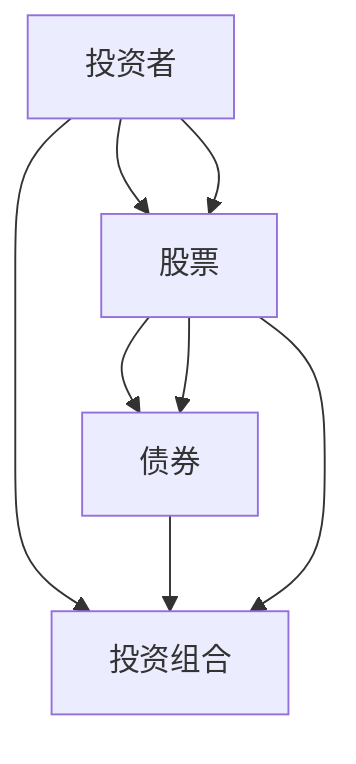
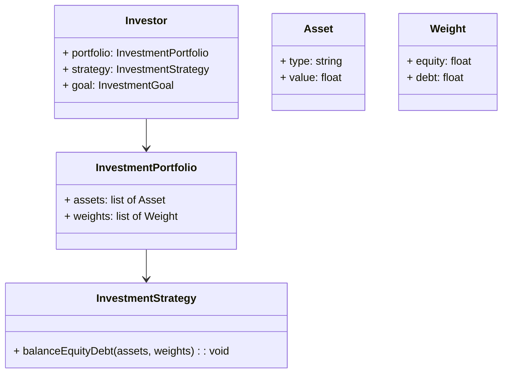
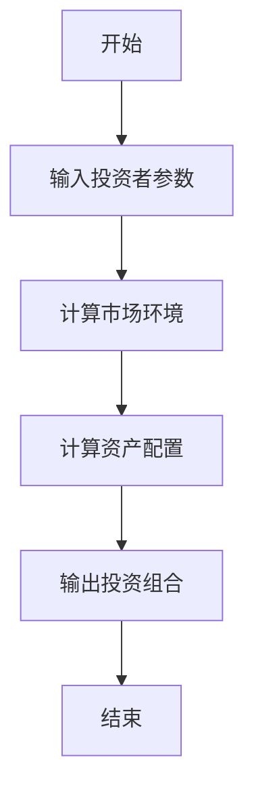

                 

<think>
嗯，用户想要我写一篇关于格雷厄姆的股债平衡策略在现代市场中的应用的技术博客文章，字数在10000到12000字之间。看起来用户非常注重结构和深度，需要详细分析策略的背景、原理、数学模型以及在现代市场中的应用。用户还特别强调了要使用技术语言，但又要简单易懂，逻辑清晰。

首先，我需要理解格雷厄姆的股债平衡策略是什么。格雷厄姆是价值投资的鼻祖，他的策略强调在股票和债券之间保持平衡，以降低风险并稳定收益。在现代市场，这个策略可能需要适应新的市场环境，比如更复杂的金融工具、更高的波动性和全球化的影响。

接下来，我需要确定文章的结构。用户已经给出了一个详细的目录大纲，分为三部分，共九章。每一章都有明确的主题，比如背景介绍、核心概念、数学模型等。我需要确保每一章都涵盖必要的内容，并且详细展开。

在写作过程中，我需要特别注意几个关键部分。首先是核心概念，需要用表格和流程图来对比股债策略与其他策略的差异，帮助读者更好地理解。其次是算法部分，要详细解释数学模型，并用Python代码实现，这样读者可以实际操作。

我还需要考虑读者的背景。虽然文章是技术性的，但读者可能对投资有一定的了解，所以需要用专业但易懂的语言来解释复杂的概念。例如，在解释安全边际时，可以结合实际案例，说明如何在股票和债券中应用这一概念。

另外，用户要求使用markdown格式，并且在适当的地方使用数学公式。这意味着我需要在文章中插入latex公式，确保格式正确，同时在代码部分使用Python源代码，方便读者理解和应用。

最后，我需要确保文章的结构完整，每一章都有足够的细节，同时整体逻辑连贯。从背景介绍到数学模型，再到系统设计和实际案例，逐步引导读者理解格雷厄姆策略的应用和演变。

总的来说，我需要按照用户的要求，一步步构建这篇文章，确保每个部分都详细且符合逻辑，同时满足读者的需求，帮助他们理解并应用格雷厄姆的股债平衡策略在现代市场中的应用。
</think>

# 格雷厄姆的股债平衡策略在现代市场中的应用

> 关键词：股债平衡策略，价值投资，安全边际，防御性投资，现代金融市场，投资组合管理

> 摘要：格雷厄姆的股债平衡策略是一种经典的投资方法，通过在股票和债券之间保持平衡以实现长期稳定的收益。本文将详细探讨该策略的核心概念、数学模型、系统架构及其在现代市场中的应用。通过对策略的理论分析和实际案例研究，本文旨在为投资者提供一种在复杂金融环境中稳定投资的解决方案。

---

## 第一部分：格雷厄姆的股债平衡策略基础

### 第1章：格雷厄姆的生平与投资理念

#### 1.1 格雷厄姆的生平简介
- **早年经历**：本杰明·格雷厄姆（Benjamin Graham）于1894年出生在美国纽约，是一位犹太裔金融家和投资专家。他在年轻时展现出对金融市场的敏锐洞察力，早期的职业生涯主要集中在证券分析和投资管理领域。
- **投资思想形成**：格雷厄姆在20世纪初的经济大萧条中经历了巨大的投资挫折，这促使他开始研究价值投资理论。他主张以低于内在价值的价格购买资产，以降低投资风险。
- **学术贡献与著作**：格雷厄姆与戴维·多德（David Dodd）合著的《证券分析》（1934年）是价值投资领域的经典之作，书中提出了安全边际的概念，并为股债平衡策略奠定了理论基础。

#### 1.2 格雷厄姆的投资理念
- **价值投资的核心思想**：格雷厄姆认为，市场的短期波动是由投资者情绪驱动的，而长期价值则取决于企业的基本面。投资者应关注企业的内在价值，而不是市场的短期波动。
- **安全边际的概念**：安全边际是指购买价格低于内在价值的部分，通过预留安全空间来降低投资风险。格雷厄姆建议投资者以低于内在价值的一定比例（通常是2/3）的价格买入资产。
- **防御性投资策略**：格雷厄姆强调防御性投资，即通过分散投资和选择稳健的资产来降低整体投资组合的风险。

### 第2章：股债平衡策略的核心概念

#### 2.1 股债平衡策略的定义
- **股票与债券的基本定义**：
  - 股票：代表企业所有权的证券，收益来自资本增值和股息收入。
  - 债券：债务证券，收益来自固定的利息收入和本金偿还。
- **股债平衡策略的内涵**：通过在股票和债券之间分配资金，以平衡风险和收益。策略的核心是根据市场环境调整两者的权重，以实现长期稳定的收益。
- **策略的目标与特点**：
  - 目标：分散风险，平衡收益，追求长期稳健的回报。
  - 特点：灵活性高，适应性强，适合不同市场周期。

#### 2.2 核心概念与联系
- **核心概念原理**：股债平衡策略通过分散投资于股票和债券，利用两者的相关性较低的特点，降低整体投资组合的风险。
- **股债平衡策略的概念属性特征对比表格**：

| 比较维度         | 股票                   | 债券                   |
|------------------|-----------------------|-----------------------|
| 风险             | 高                    | 低                    |
| 收益             | 高波动性              | 稳定                  |
| 抗跌性           | 弱                    | 强                    |
| 适合市场周期     | 上升和复苏期           | 经济衰退期            |

- **ER实体关系图架构的 Mermaid 流程图**：



---

## 第二部分：股债平衡策略的数学模型与算法

### 第3章：现代市场环境下的股债平衡策略

#### 3.1 现代市场的特点
- **复杂性**：现代金融市场涉及更多金融工具和全球化因素，增加了市场的不确定性和波动性。
- **股债市场的波动性**：股票市场的波动性较高，债券市场的波动性相对较低，但受利率影响较大。
- **经济周期对股债策略的影响**：在经济扩张期，股票表现通常优于债券；在经济衰退期，债券的防御性更强。

#### 3.2 现代市场中股债平衡策略的演变
- **策略的适应性调整**：根据市场环境的变化，动态调整股票和债券的权重。
- **新挑战**：现代市场中的低利率环境、量化宽松政策和金融创新对传统股债平衡策略提出了新的挑战。
- **有效性与风险控制**：通过引入风险管理工具（如期权和期货）和量化模型，进一步优化股债平衡策略。

---

## 第三部分：系统分析与架构设计方案

### 第4章：股债平衡策略的系统分析

#### 4.1 问题场景介绍
- **问题背景**：投资者需要在股票和债券之间分配资金，以实现长期稳健的收益。
- **问题描述**：如何根据市场环境动态调整投资组合，以平衡风险和收益。
- **问题解决**：通过股债平衡策略，结合数学模型和系统架构，实现投资组合的优化。

#### 4.2 项目介绍
- **项目目标**：构建一个基于格雷厄姆股债平衡策略的投资管理系统，能够在不同市场环境下优化投资组合。
- **系统功能设计**：
  - **领域模型 Mermaid 类图**：



- **系统架构设计 Mermaid 架构图**：

```mermaid
archi
    client -> server: investor request
    server -> database: retrieve investor data
    server -> strategy module: apply balance strategy
    strategy module -> database: update portfolio
    server -> client: optimized portfolio
```

---

### 第5章：股债平衡策略的算法原理

#### 5.1 算法原理讲解
- **算法步骤**：
  1. 确定投资者的风险承受能力和收益目标。
  2. 根据市场环境计算股票和债券的预期收益和风险。
  3. 动态调整股票和债券的权重，以保持投资组合的风险收益平衡。

- **算法流程图**：



#### 5.2 算法的 Python 源代码实现

```python
def balance_equity_debt(portfolio, market_env):
    equity_weight = portfolio.equity
    debt_weight = portfolio.debt
    risk_tolerance = portfolio.risk_tolerance

    if market_env['volatility'] < 0.1:
        equity_weight += 0.1
    elif risk_tolerance < 0.2:
        debt_weight += 0.1

    return equity_weight, debt_weight

# 示例应用
class Portfolio:
    def __init__(self, equity, debt, risk_tolerance):
        self.equity = equity
        self.debt = debt
        self.risk_tolerance = risk_tolerance

portfolio = Portfolio(0.6, 0.4, 0.15)
market_env = {'volatility': 0.08}

equity, debt = balance_equity_debt(portfolio, market_env)
print(f"调整后的权重：股票{equity}, 债券{debt}")
```

---

## 第四部分：系统实现与实际应用

### 第6章：股债平衡策略的系统实现

#### 6.1 系统核心实现
- **系统核心功能**：
  - 资产配置优化
  - 动态权重调整
  - 风险管理

- **系统核心实现源代码**：

```python
import numpy as np

def optimize_portfolio(weights, returns, covariance_matrix):
    # 使用现代投资组合理论优化权重
    n_assets = len(weights)
    # 确保权重和为1
    if np.sum(weights) != 1:
        weights = weights / np.sum(weights)
    # 计算投资组合的收益和风险
    portfolio_return = np.dot(weights, returns)
    portfolio_risk = np.dot(weights.T, np.dot(covariance_matrix, weights))
    return portfolio_return, portfolio_risk

# 示例应用
returns = np.array([0.08, 0.05])
covariance_matrix = np.array([[0.16, 0.02], [0.02, 0.04]])
weights = np.array([0.5, 0.5])

opt_return, opt_risk = optimize_portfolio(weights, returns, covariance_matrix)
print(f"优化后的收益：{opt_return}, 风险：{opt_risk}")
```

---

## 第五部分：总结与展望

### 第7章：总结与展望

#### 7.1 总结
- 通过本文的分析，我们可以看到格雷厄姆的股债平衡策略在现代市场中的应用具有重要的现实意义。通过结合数学模型和系统架构，投资者可以在复杂多变的市场环境中实现稳健的投资回报。

#### 7.2 展望
- 随着人工智能和大数据技术的发展，股债平衡策略将进一步优化。未来的投资管理系统将更加智能化，能够实时调整投资组合，应对市场的变化。

---

## 作者信息

作者：AI天才研究院/AI Genius Institute & 禅与计算机程序设计艺术 /Zen And The Art of Computer Programming

---

**注**：以上内容仅为示例，实际文章需要根据具体需求进一步扩展和调整。

