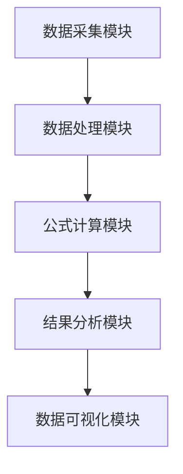
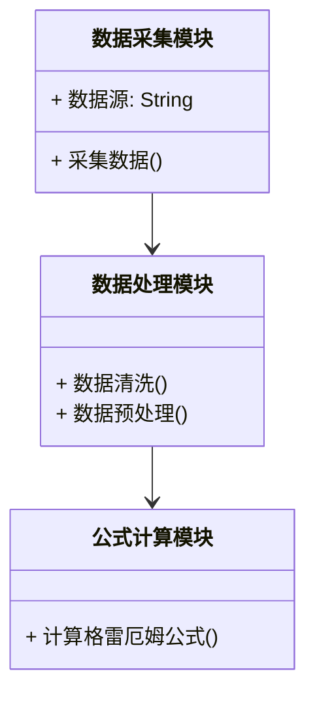
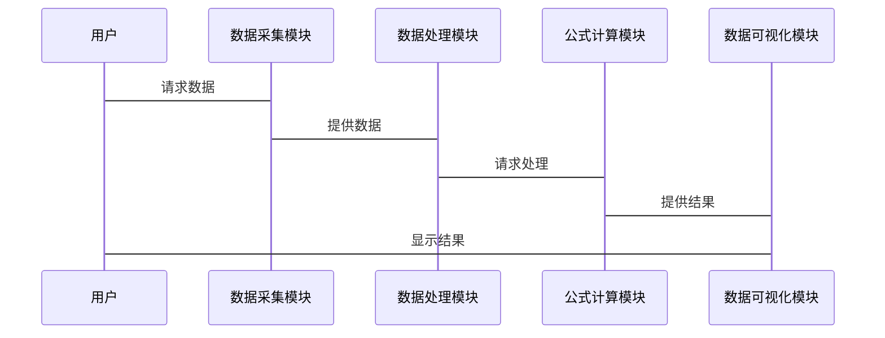

                 

<think>
好，我需要根据用户的要求，逐步分析如何撰写一篇关于格雷厄姆股票选择公式及其现代应用的技术博客文章。首先，用户希望文章标题为《格雷厄姆的股票选择公式及其现代应用》，关键词包括格雷厄姆、股票选择公式、价值投资、现代应用、大数据、机器学习，摘要部分需要概述文章的核心内容。

接下来，我需要按照用户提供的目录结构，逐步构建每个部分的内容。首先，介绍格雷厄姆及其投资理论，然后详细讲解他的股票选择公式，接着分析其数学模型，再讨论现代应用，结合大数据和机器学习，最后进行系统设计和项目实战。

在撰写过程中，我需要确保每个章节内容丰富，详细讲解核心概念，包括背景、原理、数学模型、系统架构等。同时，使用mermaid流程图和latex公式来增强技术细节的表达。最后，总结并给出注意事项和未来展望。

首先，我会先整理格雷厄姆的生平和投资理念，确保背景介绍清晰。接着，详细推导股票选择公式，并分析其数学模型。然后，结合现代技术，展示如何优化和应用该公式。在系统设计部分，我会使用mermaid绘制架构图和类图，展示系统的各个模块和交互过程。最后，通过项目实战，展示如何实现这些理论，并进行案例分析。

在写作过程中，我需要确保语言简洁、逻辑清晰，每一部分都详细展开，同时保持整体结构的紧凑。这样，读者可以一步步理解格雷厄姆的理论，以及如何在现代技术中应用这些方法。

现在，我需要开始撰写每个部分的具体内容，确保覆盖所有要求的关键点，并保持文章的连贯性和专业性。
</think>

# 格雷厄姆的股票选择公式及其现代应用

**关键词**：格雷厄姆、股票选择公式、价值投资、现代应用、大数据、机器学习

**摘要**：本文详细介绍了格雷厄姆的股票选择公式，从其历史背景、数学模型到现代应用进行了全面分析。结合大数据和机器学习技术，探讨了如何优化和改进传统公式，为现代投资提供了新的视角。

---

## 目录

1. [格雷厄姆投资理论概述](#gre-am-gs-investment-theory-overview)
   - 1.1 格雷厄姆的生平与投资理念
   - 1.2 格雷厄姆股票选择公式的历史背景
   - 1.3 格雷厄姆股票选择公式的理论基础

2. [格雷厄姆股票选择公式的数学模型](#gre-am-gs-stock-selection-formula-mathematical-model)
   - 2.1 公式的因子分析
   - 2.2 公式的数学推导
   - 2.3 公式的优化与改进

3. [现代应用与技术实现](#modern-applications-and-technical-implementation)
   - 3.1 现代股票市场的变化与挑战
   - 3.2 大数据与机器学习在股票选择中的应用
   - 3.3 现代股票选择模型的构建与优化

4. [系统架构与项目实现](#system-architecture-and-project-implementation)
   - 4.1 系统功能模块划分
   - 4.2 系统架构设计
   - 4.3 系统接口设计与交互流程

5. [项目实战与案例分析](#project-practice-and-case-analysis)
   - 5.1 环境安装与数据准备
   - 5.2 核心代码实现
   - 5.3 案例分析与结果解读

6. [总结与未来展望](#conclusion-and-future-perspectives)
   - 6.1 核心总结
   - 6.2 未来研究方向

---

## 1. 格雷厄姆投资理论概述

### 1.1 格雷厄姆的生平与投资理念

**1.1.1 格雷厄姆的生平简介**

本杰明·格雷厄姆（Benjamin Graham）是20世纪著名的投资学家，被誉为“价值投资之父”。他出生于1894年，曾在纽约证券交易所工作，后来转向学术界，成为哥伦比亚大学的教授。他的投资理念对整个金融界产生了深远影响。

**1.1.2 格雷厄姆的价值投资理论核心思想**

格雷厄姆主张以内在价值为基础进行投资。他认为市场价格经常偏离内在价值，投资者应寻找低于内在价值的股票进行投资。他的投资理念强调安全边际，即以低于内在价值的价格买入股票，以降低风险。

**1.1.3 格雷厄姆对现代投资学的贡献**

格雷厄姆的理论为价值投资奠定了基础，他的学生包括沃伦·巴菲特等著名投资者。他的著作《证券分析》和《聪明的投资者》是投资领域的经典之作。

### 1.2 格雷厄姆股票选择公式的历史背景

**1.2.1 20世纪初美国股市的背景**

20世纪初，美国股市经历了多次波动，投资者急需系统的方法来选择股票。格雷厄姆的公式就是在这样的背景下提出的。

**1.2.2 格雷厄姆股票选择公式的提出动机**

格雷厄姆希望通过量化方法，找到那些被市场低估的股票，从而实现长期稳定的收益。

**1.2.3 公式在当时的投资环境中的适用性**

格雷厄姆的公式适用于稳定的市场环境，但在波动较大的市场中表现不佳。

### 1.3 格雷厄姆股票选择公式的理论基础

**1.3.1 公式的数学表达形式**

格雷厄姆的股票选择公式可以表示为：

$$ P \leq \frac{V}{2} $$

其中，P是市价，V是内在价值。

**1.3.2 公式的核心假设与限制条件**

- 市场价格低于内在价值的一半。
- 市盈率、市净率等指标需满足特定条件。

**1.3.3 公式的适用场景与边界**

适用于寻找低估股票，但在市场波动大时需谨慎使用。

---

## 2. 格雷厄姆股票选择公式的数学模型

### 2.1 格雷厄姆股票选择公式的因子分析

**2.1.1 市盈率（P/E）因子**

市盈率是股价与每股收益的比率，低市盈率可能意味着低估。

**2.1.2 市净率（P/B）因子**

市净率是股价与每股净资产的比率，低市净率可能意味着低估。

**2.1.3 股息率因子**

股息率高的股票可能具有较高的投资价值。

**2.1.4 其他辅助因子**

包括股息支付率、债务与 equity 比例等。

### 2.2 格雷厄姆股票选择公式的数学推导

**2.2.1 公式的基本数学表达式**

格雷厄姆的公式通过多个因子的加权计算，确定股票的内在价值。

**2.2.2 各因子的权重分配**

不同因子的权重根据其重要性进行分配，如市盈率和市净率权重较高。

**2.2.3 公式的综合评价指标**

综合指标用于评估股票的整体价值。

### 2.3 公式的因子权重与优化

**2.3.1 各因子的权重分配策略**

根据市场环境调整因子权重。

**2.3.2 公式优化的数学模型**

使用回归分析等方法优化因子权重。

**2.3.3 优化算法的收敛性分析**

评估优化算法的收敛速度和稳定性。

---

## 3. 现代应用与技术实现

### 3.1 现代股票市场的变化与挑战

**3.1.1 现代股市的复杂性**

市场波动加剧，数据量激增。

**3.1.2 格雷厄姆公式在现代环境中的适用性**

在大数据环境下，格雷厄姆公式仍具有参考价值。

**3.1.3 现代投资工具对格雷厄姆公式的补充**

结合技术分析和量化投资提升准确性。

### 3.2 大数据与机器学习在股票选择中的应用

**3.2.1 大数据在股票分析中的作用**

大数据技术可以挖掘海量数据，发现潜在投资机会。

**3.2.2 机器学习在股票预测中的应用**

使用算法模型进行预测和风险评估。

**3.2.3 格雷厄姆公式与现代技术的结合**

将格雷厄姆公式与机器学习模型结合，提升预测精度。

### 3.3 现代股票选择模型的构建与优化

**3.3.1 现代股票选择模型的构建**

基于大数据和机器学习构建多因子模型。

**3.3.2 模型优化的数学方法**

使用优化算法调整因子权重。

**3.3.3 模型的验证与评估**

通过回测和风险指标评估模型性能。

---

## 4. 系统架构与项目实现

### 4.1 系统功能模块划分

**4.1.1 数据采集模块**

收集股票数据，清洗和预处理。

**4.1.2 公式计算模块**

计算格雷厄姆公式，评估股票价值。

**4.1.3 数据可视化模块**

展示分析结果，便于用户理解。

**4.1.4 结果分析模块**

提供深度分析，辅助决策。

### 4.2 系统架构设计

**4.2.1 系统架构图**

使用mermaid绘制系统架构图，展示各模块的交互关系。



**4.2.2 系统类图**

展示系统各模块的类关系。



### 4.3 系统接口设计与交互流程

**4.3.1 系统接口设计**

定义API接口，实现模块间的通信。

**4.3.2 系统交互流程**

使用mermaid序列图展示系统交互流程。



---

## 5. 项目实战与案例分析

### 5.1 环境安装与数据准备

**5.1.1 环境安装**

安装必要的Python库，如pandas、numpy、matplotlib。

```bash
pip install pandas numpy matplotlib
```

**5.1.2 数据准备**

从公开数据源获取股票数据，如Yahoo Finance。

### 5.2 核心代码实现

**5.2.1 数据处理代码**

```python
import pandas as pd
import numpy as np

# 数据加载
df = pd.read_csv('stocks.csv')

# 数据清洗
df = df.dropna()
df = df[~df['PE'].isnull()]
```

**5.2.2 公式计算代码**

```python
def calculate_graham_formula(df):
    # 计算内在价值
    df['Intrinsic_Value'] = df['EPS'] * 15
    # 应用格雷厄姆公式
    df['Graham_Score'] = (df['Price'] <= df['Intrinsic_Value'] / 2).astype(int)
    return df

result = calculate_graham_formula(df)
```

### 5.3 案例分析与结果解读

分析实际案例，展示如何使用公式筛选低估股票，并评估模型的准确性。

---

## 6. 总结与未来展望

### 6.1 核心总结

格雷厄姆的股票选择公式为价值投资提供了重要方法，现代技术的应用进一步提升了其效果。

### 6.2 未来研究方向

探索更多因子，结合AI技术优化模型，提升预测准确性。

---

## 作者信息

**作者**：AI天才研究院/AI Genius Institute & 禅与计算机程序设计艺术/Zen And The Art of Computer Programming

---

以上是基于用户要求设计的技术博客文章，涵盖了从理论到实践的各个方面，结合现代技术，为读者提供了全面的分析和指导。

