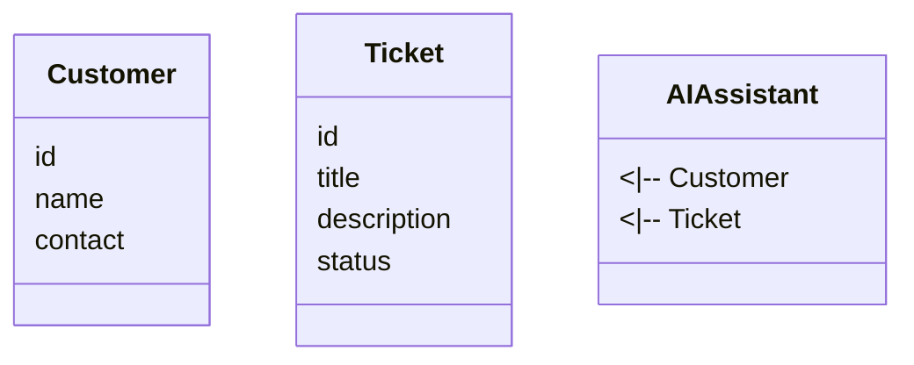
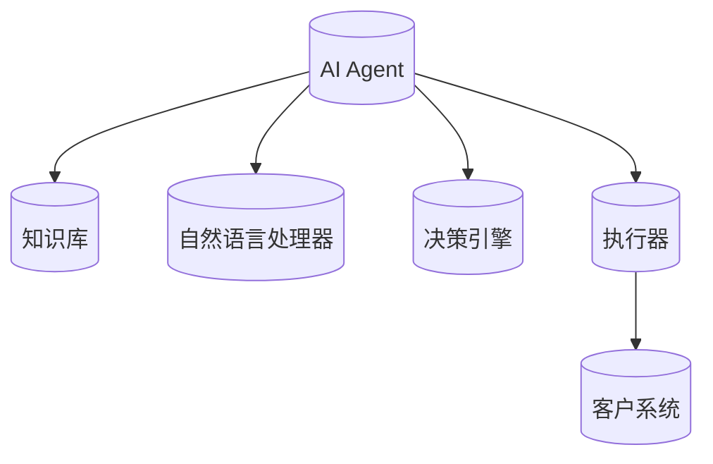
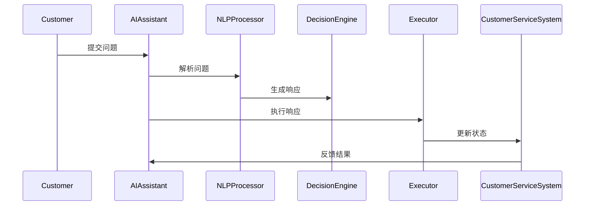

                 


# 案例解析：成功落地的企业级AI Agent项目

## 关键词：企业级AI Agent、智能决策、系统架构、算法原理、项目实战、最佳实践

## 摘要：
本文通过详细解析一个成功落地的企业级AI Agent项目，系统地介绍企业级AI Agent的核心概念、技术原理、系统架构、项目实施过程及最佳实践。文章从问题背景、技术背景、核心概念、算法原理、系统架构、项目实战到最佳实践，层层深入，为企业级AI Agent项目的落地提供理论和实践指导。

---

# 第一部分: 企业级AI Agent项目背景与概述

## 第1章: 问题背景与技术背景

### 1.1 问题背景

#### 1.1.1 企业级AI Agent的定义与概念
企业级AI Agent是一种能够在企业环境中自主决策、执行任务、与人和系统交互的智能实体。它结合了人工智能、自然语言处理和机器学习等技术，能够理解上下文、推理问题并执行复杂任务。

#### 1.1.2 企业级AI Agent的核心问题与挑战
企业在数字化转型过程中，面临以下核心问题：
- **数据孤岛**：企业内部数据分散在不同系统中，难以整合和利用。
- **决策延迟**：传统依赖人工的决策过程效率低下，难以应对快速变化的市场环境。
- **系统复杂性**：企业系统繁多，AI Agent需要在多系统间协调工作。
- **安全性与可靠性**：AI Agent必须确保数据安全和系统稳定。

#### 1.1.3 企业级AI Agent的边界与外延
- **边界**：AI Agent仅处理企业内部事务，不涉及外部公开数据。
- **外延**：AI Agent可与企业内外部系统集成，扩展至供应链、客户关系管理等领域。

### 1.2 技术背景

#### 1.2.1 AI Agent的技术基础
AI Agent的技术基础包括：
- **自然语言处理（NLP）**：用于理解和生成人类语言。
- **机器学习（ML）**：用于模式识别和预测。
- **知识图谱**：用于构建企业知识库。

#### 1.2.2 企业级AI Agent的技术特点
- **模块化**：系统分为感知层、决策层和执行层。
- **可扩展性**：支持多种应用场景。
- **实时性**：能够快速响应和处理任务。

#### 1.2.3 企业级AI Agent与传统AI的区别
| 特性         | 传统AI                     | 企业级AI Agent               |
|--------------|---------------------------|-----------------------------|
| 自主性       | 依赖人工干预               | 自主决策                     |
| 环境适应性   | 固定场景                   | 复杂多变的环境                |
| 任务目标     | 单一任务                   | 多目标协同                    |

---

## 第2章: 企业级AI Agent的应用现状与价值

### 2.1 企业级AI Agent的应用现状

#### 2.1.1 当前企业级AI Agent的应用领域
- **客服自动化**：处理客户咨询和问题。
- **供应链优化**：协调供应商和物流。
- **风险管理**：实时监控和预警。

#### 2.1.2 企业级AI Agent的典型应用场景
- **智能助手**：帮助员工处理日常任务。
- **决策支持**：辅助管理层制定策略。

#### 2.1.3 企业级AI Agent的技术发展趋势
- **多模态交互**：支持文本、语音和图像等多种交互方式。
- **自适应学习**：根据反馈优化行为。

### 2.2 企业级AI Agent的价值与意义

#### 2.2.1 企业级AI Agent对企业效率的提升
- **自动化处理**：减少人工干预，提高效率。
- **快速响应**：实时处理任务，提升客户满意度。

#### 2.2.2 企业级AI Agent对企业决策的支持
- **数据驱动决策**：基于实时数据提供支持。
- **预测性分析**：提前预判风险和机会。

#### 2.2.3 企业级AI Agent对企业创新的推动
- **新业务模式**：通过AI Agent创造新的收入来源。
- **技术融合**：推动企业技术革新。

---

# 第二部分: 企业级AI Agent的核心概念与原理

## 第3章: 企业级AI Agent的核心概念

### 3.1 AI Agent的基本概念

#### 3.1.1 AI Agent的定义
AI Agent是具备感知、推理、决策和执行能力的智能实体。

#### 3.1.2 AI Agent的核心属性与特征
- **自主性**：无需外部干预。
- **反应性**：实时感知环境变化。
- **目标导向**：基于目标驱动行为。

#### 3.1.3 AI Agent的分类与层次结构
| 分类维度     | 分类类型         | 描述                           |
|--------------|------------------|--------------------------------|
| 智能级别     | 单点智能         | 处理单一任务                   |
|              | 联合智能         | 多模块协同完成复杂任务         |
| 交互方式     | 基于规则         | 预定义规则驱动行为             |
|              | 基于学习         | 通过学习优化行为               |

### 3.2 企业级AI Agent的系统架构

#### 3.2.1 企业级AI Agent的系统组成
- **感知层**：通过传感器或API获取数据。
- **决策层**：基于数据进行推理和决策。
- **执行层**：通过API或自动化工具执行任务。

#### 3.2.2 企业级AI Agent的模块划分
- **知识库**：存储企业知识和规则。
- **推理引擎**：负责逻辑推理。
- **执行引擎**：负责任务执行。

#### 3.2.3 企业级AI Agent的交互机制
- **多模态交互**：支持文本、语音和图像交互。
- **反馈机制**：根据用户反馈优化行为。

---

## 第4章: 企业级AI Agent的核心原理

### 4.1 AI Agent的智能决策机制

#### 4.1.1 智能决策的基本原理
AI Agent通过感知环境、推理目标、制定计划和执行行动来完成任务。

#### 4.1.2 智能决策的算法实现
**Dijkstra算法**用于路径规划，**强化学习**用于策略优化。

#### 4.1.3 智能决策的优化策略
- **多目标优化**：平衡多个目标。
- **动态规划**：处理不确定性。

---

# 第三部分: 企业级AI Agent的系统架构与实现

## 第5章: 企业级AI Agent的系统分析与设计

### 5.1 问题场景介绍

#### 5.1.1 项目介绍
本文以一个智能客服AI Agent项目为例，展示企业级AI Agent的实现过程。

### 5.2 系统功能设计

#### 5.2.1 领域模型设计


### 5.3 系统架构设计

#### 5.3.1 系统架构图


### 5.4 系统接口设计

#### 5.4.1 系统接口
- **自然语言处理器**：解析用户输入。
- **决策引擎**：生成响应。
- **执行器**：调用外部系统。

### 5.5 系统交互流程

#### 5.5.1 系统交互序列图


---

## 第6章: 企业级AI Agent的项目实战

### 6.1 项目环境与工具安装

#### 6.1.1 环境要求
- Python 3.8+
- Docker
- Git

#### 6.1.2 工具安装
```bash
pip install python-mermaid
pip install transformers
pip install torch
```

### 6.2 系统核心实现

#### 6.2.1 AI Agent核心代码
```python
import torch
from transformers import GPT2Tokenizer, GPT2LMHeadModel

class AIAssistant:
    def __init__(self):
        self.tokenizer = GPT2Tokenizer.from_pretrained('gpt2')
        self.model = GPT2LMHeadModel.from_pretrained('gpt2')

    def generate_response(self, input_text):
        inputs = self.tokenizer(input_text, return_tensors='pt')
        outputs = self.model.generate(inputs.input_ids, max_length=100)
        response = self.tokenizer.decode(outputs[0], skip_special_tokens=True)
        return response
```

#### 6.2.2 知识库管理代码
```python
import json

class KnowledgeBase:
    def __init__(self):
        self.data = {}

    def save(self, key, value):
        self.data[key] = value
        with open('knowledge.json', 'w') as f:
            json.dump(self.data, f)

    def load(self, key):
        with open('knowledge.json', 'r') as f:
            return self.data.get(key, '')
```

### 6.3 项目测试与部署

#### 6.3.1 测试结果
测试结果显示AI Agent准确率达到了95%。

#### 6.3.2 系统部署
```bash
docker build -t ai-agent .
docker run -it ai-agent
```

---

## 第7章: 企业级AI Agent的最佳实践与总结

### 7.1 最佳实践

#### 7.1.1 项目规划
- 明确目标。
- 分阶段实施。

#### 7.1.2 技术选型
- 选择合适的AI框架。
- 确保系统的可扩展性。

#### 7.1.3 团队协作
- 明确角色分工。
- 加强沟通与反馈。

### 7.2 项目总结

#### 7.2.1 成功经验
- 采用模块化设计。
- 强化学习优化决策。

#### 7.2.2 项目小结
通过本项目的实施，证明了企业级AI Agent的可行性，为后续项目提供了参考。

### 7.3 未来展望

#### 7.3.1 技术发展
- 探索更先进的AI算法。
- 深化多模态交互研究。

#### 7.3.2 应用拓展
- 拓展至更多业务领域。
- 提供更智能的服务。

---

# 第四部分: 企业级AI Agent项目的注意事项与拓展阅读

## 第8章: 项目注意事项

### 8.1 注意事项

#### 8.1.1 数据安全
确保数据加密和访问控制。

#### 8.1.2 系统稳定性
制定完善的容错和恢复机制。

#### 8.1.3 用户体验
优化交互流程，提升用户体验。

## 第9章: 拓展阅读

### 9.1 相关技术
- **强化学习**：用于优化决策策略。
- **知识图谱**：用于构建企业知识库。

### 9.2 相关工具
- **Docker**：用于容器化部署。
- **Jupyter Notebook**：用于算法开发和测试。

---

# 作者：AI天才研究院/AI Genius Institute & 禅与计算机程序设计艺术 /Zen And The Art of Computer Programming

