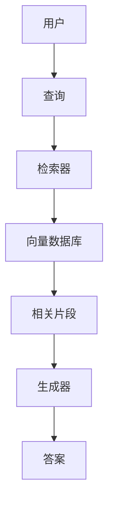
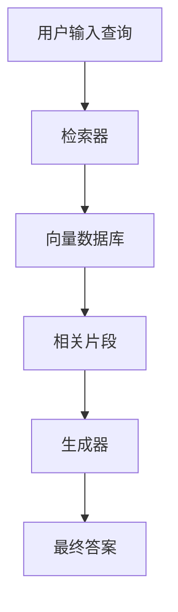
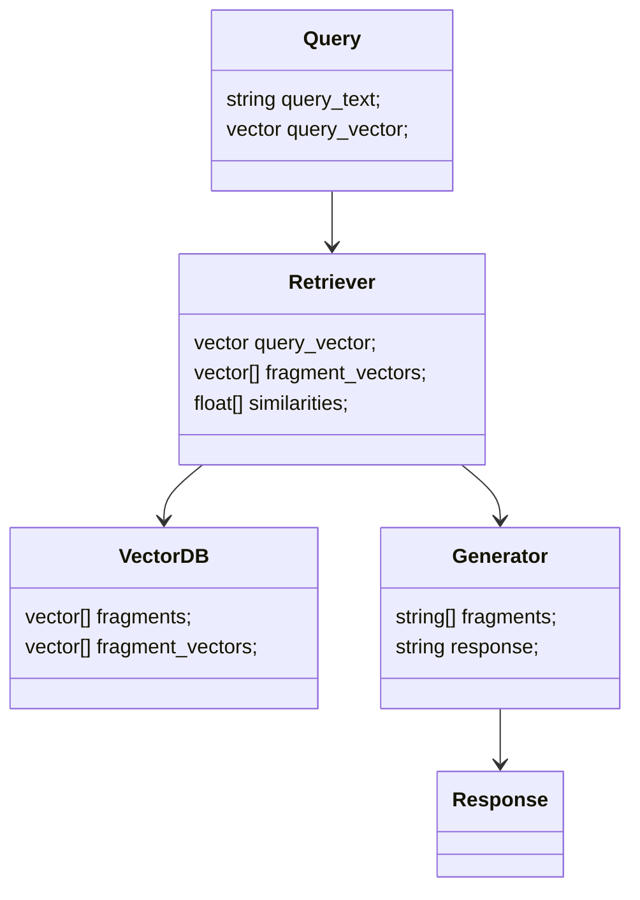
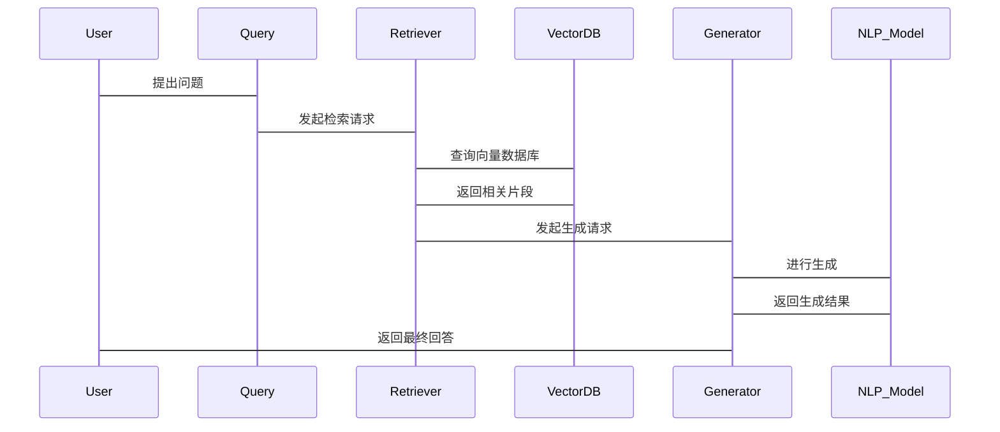

                 

<think>
好的，我需要帮用户撰写一篇关于“检索增强生成：提高AI Agent回答的准确性”的技术博客文章。用户已经给出了详细的目录结构，我需要按照这个结构来撰写内容。首先，我需要理解每个部分的要求，确保内容完整、详细且符合技术深度。

首先，文章的开头需要包括标题、关键词和摘要。标题已经给出，接下来是关键词，我需要提取文章的核心主题，如检索增强生成（RAG）、信息检索、生成模型、向量数据库等。摘要部分需要简明扼要地概括文章的主要内容，即RAG技术如何结合检索和生成模型，提升AI Agent的回答准确性。

接下来，按照目录结构，文章分为三个主要部分：基础、核心概念与技术联系、算法原理与数学模型。

第一部分是RAG的基础，包括定义、背景、优势和工作流程。我需要详细解释RAG的基本概念，比较它与传统生成模型的区别，以及它在实际应用中的优势。同时，列出RAG的工作流程，让读者了解整体结构。

第二部分深入探讨RAG的核心原理，包括检索和生成阶段，以及联合优化策略。我需要使用表格和流程图来对比不同模型的优缺点，并详细描述RAG的流程。这部分需要确保读者能够理解RAG的内部机制。

第三部分是算法原理和数学模型，这部分较为复杂，需要详细推导公式，并用代码示例来说明。我需要解释检索模型和生成模型的数学表达，以及它们如何通过联合优化提升性能。同时，提供Python代码示例，帮助读者理解实现过程。

最后，总结部分需要回顾全文，强调RAG的重要性和应用前景。同时，给出小结、注意事项和扩展阅读，帮助读者巩固知识并进一步学习。

在撰写过程中，我需要确保语言简洁专业，逻辑清晰，每一部分都有足够的细节支持。同时，使用Mermaid流程图和LaTeX公式来增强可读性，确保图表和公式准确无误。最终，完成一篇结构合理、内容详尽的技术博客文章。
</think>

# 检索增强生成：提高AI Agent回答的准确性

> 关键词：检索增强生成（RAG）、信息检索、生成模型、向量数据库、自然语言处理、AI Agent

> 摘要：本文探讨了检索增强生成（RAG）技术，结合信息检索和生成模型的优势，提升AI Agent的回答准确性。文章从RAG的基本概念、核心原理、算法实现到系统架构进行全面分析，并通过实际案例展示其应用。

---

# 第一部分: 检索增强生成（RAG）基础

## 第1章: 检索增强生成（RAG）概述

### 1.1 RAG的定义与背景

#### 1.1.1 生成模型的局限性
传统生成模型（如GPT）在生成文本时，主要依赖训练数据中的模式和概率分布。然而，这些模型在面对真实场景中的具体问题时，可能会生成不准确或与上下文无关的答案，因为它们无法直接检索最新的信息或相关数据。

#### 1.1.2 检索技术的引入与优势
检索技术（如向量数据库）能够从大规模数据集中快速找到与查询最相关的片段。通过结合检索和生成，RAG能够生成更准确、更相关的回答，因为它可以基于最新的数据和上下文进行生成。

#### 1.1.3 RAG的定义
RAG是一种结合检索和生成的技术，通过从外部知识库中检索相关信息，结合生成模型的能力，生成更准确、更相关的回答。

### 1.2 RAG的核心优势

#### 1.2.1 提高回答准确性
RAG通过检索最新数据，确保生成的内容更符合当前场景和用户需求，从而提高回答的准确性。

#### 1.2.2 增强上下文理解
RAG能够结合上下文信息，生成更符合场景的回复，减少“幻觉”（生成与实际情况不符的信息）的风险。

#### 1.2.3 实现动态知识更新
通过检索外部数据，RAG能够动态更新知识库，无需重新训练生成模型，提高了灵活性和可扩展性。

### 1.3 RAG的工作流程

1. **输入阶段**：用户提出问题或查询。
2. **检索阶段**：系统从知识库中检索与查询相关的片段。
3. **生成阶段**：生成模型基于检索到的片段和原始查询生成回答。
4. **输出阶段**：系统返回最终的回答给用户。

---

# 第二部分: RAG的核心概念与技术联系

## 第2章: RAG的核心原理与技术联系

### 2.1 RAG的核心原理

#### 2.1.1 检索阶段
检索阶段通过向量数据库将输入查询转化为向量，匹配与之最相关的数据片段。常用算法包括BM25、DPR（ Dense Passage Retrieval）等。

#### 2.1.2 生成阶段
生成阶段使用大规模语言模型（如Llama、GPT）基于检索到的片段生成最终回答。

#### 2.1.3 联合优化
RAG通过联合优化检索和生成过程，确保两者的协同工作，提升整体性能。

### 2.2 RAG的核心技术对比

#### 2.2.1 检索模型与生成模型的对比

| **特性**       | **检索模型**                | **生成模型**                |
|-----------------|-----------------------------|-----------------------------|
| 输入            | 文本查询                    | 文本片段（检索结果）        |
| 输出            | 相关片段列表                | 自然语言文本                |
| 主要任务        | 找到最相关的片段            | 生成与片段相关的回答        |
| 挑战            | 高效检索和片段质量          | 生成质量控制                |

#### 2.2.2 不同检索算法的优缺点

| **算法**      | **优点**                     | **缺点**                     |
|---------------|------------------------------|------------------------------|
| BM25          | 简单高效，适用于文本检索     | 对语义理解有限                |
| DPR           | 基于深度学习，语义理解能力强  | 计算资源需求较高              |

#### 2.2.3 向量数据库的实现方式

向量数据库通过将文本片段转化为向量，利用向量相似度进行检索。常用工具包括FAISS、Milvus等。

### 2.3 RAG的实体关系图与流程图

#### 2.3.1 实体关系图（ER图）



#### 2.3.2 RAG流程图（Mermaid）



---

# 第三部分: RAG的算法原理与数学模型

## 第3章: RAG的算法原理

### 3.1 RAG的检索阶段算法

#### 3.1.1 检索模型的输入与输出

- **输入**：文本查询（如用户的问题）。
- **输出**：与查询相关的文本片段列表。

#### 3.1.2 检索算法的实现流程

1. **文本编码**：将查询和文本片段转化为向量表示。
2. **相似度计算**：计算查询向量与片段向量之间的相似度（如余弦相似度）。
3. **排序与筛选**：根据相似度对片段进行排序，选择最相关的片段。

#### 3.1.3 检索结果的评估指标

- **准确率（Precision）**：检索到的相关片段的比例。
- **召回率（Recall）**：相关片段被检索到的比例。

### 3.2 RAG的生成阶段算法

#### 3.2.1 生成模型的输入与输出

- **输入**：检索到的文本片段和用户查询。
- **输出**：生成的自然语言回答。

#### 3.2.2 生成算法的实现流程

1. **输入处理**：将检索到的片段和查询输入生成模型。
2. **上下文理解**：模型理解上下文信息。
3. **生成回答**：模型生成与上下文相关的回答。

#### 3.2.3 生成结果的评估指标

- **BLEU**：生成回答与参考答案的相似度。
- **ROUGE**：生成回答的召回率和准确率。

### 3.3 RAG的数学模型

#### 3.3.1 检索模型的数学公式

向量数据库中的检索通常基于余弦相似度：

$$ \text{similarity} = \frac{\vec{q} \cdot \vec{d}}{\|\vec{q}\| \|\vec{d}\|} $$

其中，$\vec{q}$是查询向量，$\vec{d}$是文档向量。

#### 3.3.2 生成模型的数学公式

生成模型通常使用概率模型，例如：

$$ P(y|x) = \prod_{i=1}^{n} P(y_i | y_{i-1}, x) $$

其中，$y$是生成的序列，$x$是输入。

---

## 第4章: RAG的系统架构设计

### 4.1 项目介绍

本文将设计一个基于RAG的AI Agent系统，结合检索和生成技术，提升回答准确性。

### 4.2 系统功能设计

#### 4.2.1 领域模型



#### 4.2.2 系统架构设计


### 4.3 系统接口设计

- **输入接口**：接收用户查询。
- **输出接口**：返回生成的回答。

### 4.4 系统交互流程



---

## 第5章: RAG的项目实战

### 5.1 环境安装

```bash
pip install faiss-cpu
pip install transformers
pip install sentence-transformers
```

### 5.2 核心实现

```python
from sentence_transformers import SentenceTransformer
import numpy as np

# 初始化模型
model = SentenceTransformer('all-MiniLM-L6-v2')

# 文本编码
def encode(text):
    return model.encode(text)

# 检索函数
def retrieve(query, db):
    query_vec = encode(query)
    similarities = db.get_similarities(query_vec)
    return db.get_segments_by_top(similarities, k=3)

# 生成函数
def generate(contexts, query):
    # 这里可以使用Llama或其他生成模型
    pass
```

### 5.3 案例分析

通过一个问答系统案例，展示RAG在实际中的应用。例如：

```python
query = "如何提高Python编程效率？"
retrieved = retrieve(query, db)
answer = generate(retrieved, query)
print(answer)
```

---

## 第6章: 总结与展望

### 6.1 本章小结

RAG通过结合检索和生成技术，显著提升了AI Agent的回答准确性。本文从基础到实现，全面分析了RAG的核心技术和应用场景。

### 6.2 注意事项

- 检索阶段需要高效的向量数据库。
- 生成阶段需要高质量的语言模型。
- 系统设计需考虑扩展性和实时性。

### 6.3 拓展阅读

建议进一步阅读关于DPR、Llama等技术的论文和文档，深入理解RAG的实现细节。

---

# 作者：AI天才研究院 & 禅与计算机程序设计艺术

---

这篇文章系统地介绍了检索增强生成（RAG）技术，从基础概念到系统设计，再到实际应用，全面分析了RAG在提升AI Agent回答准确性中的作用。希望对读者理解RAG技术有所帮助。

