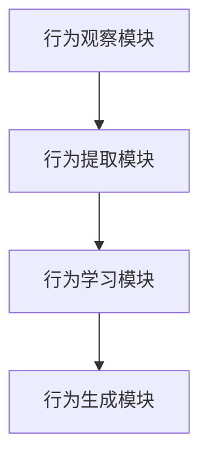
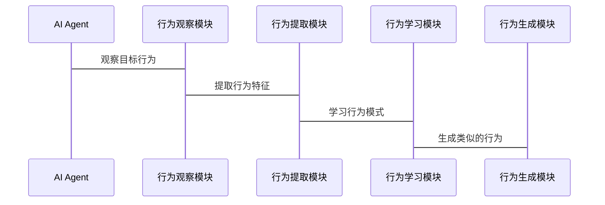

                 


# 模仿学习在AI Agent行为模式中的应用

> **关键词**：模仿学习、AI Agent、行为模式、算法原理、系统设计、项目实战

> **摘要**：模仿学习是一种通过观察和模仿来学习行为模式的机器学习方法，而AI Agent是一种能够自主决策和执行任务的智能体。本文详细探讨了模仿学习在AI Agent行为模式中的应用，从理论基础到算法实现，从系统设计到项目实战，全面分析了模仿学习如何帮助AI Agent理解和模仿人类或其他智能体的行为模式，从而提升其智能性和实用性。本文还通过实际案例分析，展示了模仿学习在AI Agent行为模式中的具体应用和效果。

---

## 第一章: 模仿学习与AI Agent概述

### 1.1 模仿学习的基本概念

#### 1.1.1 模仿学习的定义
模仿学习是一种基于观察和模仿的学习方法，旨在通过观察他人或智能体的行为模式，学习并生成类似的行为。其核心在于从经验中提取行为模式，并将其应用到新的情境中。

#### 1.1.2 模仿学习的核心特点
- **观察性**：依赖于对他人或智能体行为的观察。
- **模仿性**：通过模仿他人行为来学习。
- **适应性**：能够在不同环境中调整行为模式。
- **可解释性**：行为模式的生成过程具有较高的可解释性。

#### 1.1.3 模仿学习的应用场景
- 教学助手：通过模仿教师的行为模式，生成教学内容。
- 机器人控制：模仿人类动作，实现精准的操作。
- 聊天机器人：模仿人类对话模式，提升用户体验。

### 1.2 AI Agent的基本概念

#### 1.2.1 AI Agent的定义
AI Agent（人工智能代理）是一种能够感知环境、自主决策并执行任务的智能实体。它可以是一个软件程序，也可以是一个物理设备。

#### 1.2.2 AI Agent的行为模式
AI Agent的行为模式是指其在特定任务和环境中表现出的行为特征，包括任务驱动的行为、环境响应的行为以及交互驱动的行为。

#### 1.2.3 AI Agent的分类
- **简单反射型AI Agent**：基于简单的规则做出反应。
- **基于模型的AI Agent**：通过内部模型分析环境并做出决策。
- **目标驱动型AI Agent**：根据目标选择最优行为。

### 1.3 模仿学习与AI Agent的结合

#### 1.3.1 模仿学习在AI Agent中的作用
模仿学习可以帮助AI Agent从人类或其他智能体的行为中学习，从而快速掌握复杂的任务。

#### 1.3.2 模仿学习与AI Agent行为模式的关系
模仿学习通过提取行为模式，帮助AI Agent理解和生成类似的行为，从而增强其智能性和灵活性。

#### 1.3.3 模仿学习在AI Agent中的应用前景
模仿学习将推动AI Agent在教育、医疗、服务等领域的广泛应用，使其能够更自然地与人类交互。

---

## 第二章: 模仿学习的原理与算法

### 2.1 模仿学习的核心原理

#### 2.1.1 模仿学习的理论基础
模仿学习的理论基础包括行为主义、认知科学和机器学习，强调通过观察和模仿来实现行为的生成。

#### 2.1.2 模仿学习的数学模型
模仿学习的数学模型通常基于概率论和统计学，通过建模行为模式的概率分布，生成类似的行为。

#### 2.1.3 模仿学习的算法流程
1. 观察目标行为。
2. 提取行为特征。
3. 学习行为模式。
4. 生成类似的行为。

### 2.2 模仿学习的主要算法

#### 2.2.1 监督学习算法
- **线性回归**：通过拟合目标函数，学习行为模式。
- **支持向量机（SVM）**：通过分类或回归，实现行为的预测。

#### 2.2.2 强化学习算法
- **Q-learning**：通过奖励机制，学习最优行为策略。
- **Deep Q-Network（DQN）**：结合深度学习，提升行为决策的复杂度。

#### 2.2.3 对比学习算法
- **对比对齐网络（Contrastive Alignment Network）**：通过对比学习，增强行为模式的相似性。

### 2.3 模仿学习与其他学习方法的对比

#### 2.3.1 监督学习与模仿学习的区别
监督学习依赖于标注数据，而模仿学习依赖于行为模式的观察。

#### 2.3.2 强化学习与模仿学习的区别
强化学习通过奖励机制优化行为，而模仿学习通过模仿行为模式生成行为。

#### 2.3.3 半监督学习与模仿学习的区别
半监督学习结合标注数据和未标注数据，而模仿学习主要依赖于行为模式的观察。

---

## 第三章: AI Agent的行为模式分析

### 3.1 AI Agent行为模式的特点

#### 3.1.1 行为模式的可模仿性
AI Agent的行为模式可以通过模仿学习进行提取和生成。

#### 3.1.2 行为模式的可分解性
复杂的行为模式可以分解为多个简单的行为，便于学习和优化。

#### 3.1.3 行为模式的可优化性
通过模仿学习，可以不断优化行为模式，提升AI Agent的智能性。

### 3.2 AI Agent行为模式的分类

#### 3.2.1 基于任务的行为模式
- **任务驱动型**：根据任务目标生成行为。
- **任务无关型**：与任务无关的行为模式。

#### 3.2.2 基于环境的行为模式
- **静态环境型**：在静态环境中生成行为。
- **动态环境型**：在动态环境中生成行为。

#### 3.2.3 基于交互的行为模式
- **单向交互型**：仅进行单向交互的行为。
- **双向交互型**：与环境或用户进行双向交互的行为。

### 3.3 模仿学习对AI Agent行为模式的影响

#### 3.3.1 模仿学习如何影响行为模式的形成
通过模仿学习，AI Agent可以快速掌握复杂的行为模式。

#### 3.3.2 模仿学习如何优化行为模式的执行
通过优化行为模式，提升AI Agent在任务执行中的效率和准确性。

#### 3.3.3 模仿学习如何增强行为模式的适应性
通过模仿学习，AI Agent能够更好地适应不同的环境和任务需求。

---

## 第四章: 模仿学习算法的实现

### 4.1 基于监督学习的模仿学习算法

#### 4.1.1 算法原理
通过监督学习，AI Agent可以模仿教师的行为模式。

#### 4.1.2 算法实现
```python
import numpy as np

def mimic_learning(X, y):
    # 线性回归模型
    model = LinearRegression()
    model.fit(X, y)
    return model
```

### 4.2 基于强化学习的模仿学习算法

#### 4.2.1 算法原理
通过强化学习，AI Agent通过与环境的交互，逐步优化行为模式。

#### 4.2.2 算法实现
```python
import numpy as np

def reinforce_mimic(env, num_episodes=1000):
    # 初始化Q表
    Q = np.zeros(env.observation_space.shape)
    
    for episode in range(num_episodes):
        state = env.reset()
        while not done:
            action = np.argmax(Q[state])
            next_state, reward, done, _ = env.step(action)
            Q[next_state] += reward
    return Q
```

### 4.3 基于对比学习的模仿学习算法

#### 4.3.1 算法原理
通过对比学习，AI Agent可以更好地理解和生成行为模式。

#### 4.3.2 算法实现
```python
import tensorflow as tf

def contrastive_mimic(X, y):
    # 对比对齐网络
    encoder = tf.keras.Model(inputs=X, outputs=... )
    decoder = tf.keras.Model(inputs=..., outputs=X)
    model = tf.keras.Model(inputs=X, outputs=decoder(encoder(X)))
    model.compile(optimizer='adam', loss='binary_crossentropy')
    model.fit(X, y, epochs=100)
    return model
```

---

## 第五章: AI Agent行为模式的系统设计

### 5.1 系统架构设计

#### 5.1.1 系统功能模块
- **行为观察模块**：观察目标行为。
- **行为提取模块**：提取行为特征。
- **行为学习模块**：学习行为模式。
- **行为生成模块**：生成类似的行为。

#### 5.1.2 系统架构图


### 5.2 系统接口设计

#### 5.2.1 系统输入接口
- **输入行为数据**：目标行为的输入。
- **输入环境数据**：环境状态的输入。

#### 5.2.2 系统输出接口
- **输出行为模式**：生成的行为模式。
- **输出决策指令**：生成的决策指令。

### 5.3 系统交互设计

#### 5.3.1 交互流程
1. AI Agent观察目标行为。
2. AI Agent提取行为特征。
3. AI Agent学习行为模式。
4. AI Agent生成类似的行为。

#### 5.3.2 交互序列图


---

## 第六章: 项目实战——基于模仿学习的AI Agent实现

### 6.1 项目背景

#### 6.1.1 项目目标
实现一个基于模仿学习的AI Agent，能够模仿人类的行为模式。

#### 6.1.2 项目需求
- 提供行为观察接口。
- 提供行为提取功能。
- 提供行为学习功能。
- 提供行为生成功能。

### 6.2 项目实现

#### 6.2.1 环境安装
```bash
pip install numpy tensorflow scikit-learn
```

#### 6.2.2 核心代码实现

##### 行为观察模块
```python
import numpy as np

def observe_behavior(behavior_data):
    return np.array(behavior_data)
```

##### 行为提取模块
```python
import numpy as np

def extract_features(behavior_data):
    features = []
    for data in behavior_data:
        # 提取特征
        features.append(data['feature'])
    return np.array(features)
```

##### 行为学习模块
```python
import tensorflow as tf

def mimic_learning_model(input_shape, output_shape):
    model = tf.keras.Sequential([
        tf.keras.layers.Dense(64, activation='relu', input_shape=input_shape),
        tf.keras.layers.Dense(output_shape, activation='softmax')
    ])
    model.compile(optimizer='adam', loss='sparse_categorical_crossentropy')
    return model
```

##### 行为生成模块
```python
import numpy as np

def generate_behavior(model, input_data):
    prediction = model.predict(input_data)
    return prediction.argmax(axis=1)
```

#### 6.2.3 项目实现流程
1. 安装依赖库。
2. 实现行为观察模块。
3. 实现行为提取模块。
4. 实行行为学习模块。
5. 实现行为生成模块。

### 6.3 实际案例分析

#### 6.3.1 案例背景
假设我们希望AI Agent模仿人类在棋盘游戏中的行为模式。

#### 6.3.2 案例分析
通过观察人类玩家的行为数据，提取其行为特征，学习其行为模式，并生成类似的行为。

#### 6.3.3 案例结果
AI Agent能够模仿人类玩家的行为模式，在棋盘游戏中做出类似的人类决策。

### 6.4 项目小结

#### 6.4.1 项目总结
通过模仿学习，AI Agent能够快速掌握复杂的行为模式，提升其智能性和实用性。

#### 6.4.2 项目经验
- 确保行为数据的多样性和代表性。
- 优化行为提取和学习算法，提升行为生成的准确性和自然度。

---

## 第七章: 总结与展望

### 7.1 总结

#### 7.1.1 核心内容回顾
模仿学习是一种有效的机器学习方法，能够帮助AI Agent理解和生成复杂的行为模式。

#### 7.1.2 关键点总结
- 模仿学习的核心原理。
- AI Agent的行为模式分类。
- 模仿学习算法的实现。

### 7.2 展望

#### 7.2.1 未来研究方向
- 深度模仿学习。
- 多模态模仿学习。
- 跨领域模仿学习。

#### 7.2.2 注意事项
- 行为数据的多样性和代表性。
- 模仿学习算法的优化和改进。
- AI Agent行为模式的适应性和灵活性。

#### 7.2.3 最佳实践
- 组合使用多种模仿学习算法，提升AI Agent的行为生成能力。
- 定期更新行为模式，适应环境的变化。

---

## 作者信息

作者：AI天才研究院/AI Genius Institute & 禅与计算机程序设计艺术 /Zen And The Art of Computer Programming

---

以上就是《模仿学习在AI Agent行为模式中的应用》的完整目录和文章内容，您可以根据需要进一步调整和补充具体细节。

