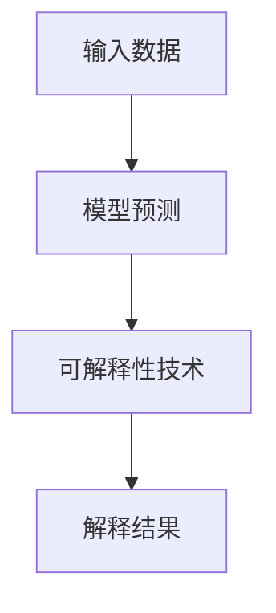
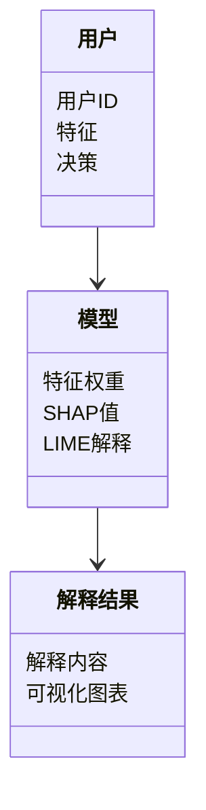

                 

<think>
好，我现在需要根据用户的请求，撰写一篇关于《模型可解释性技术在AI Agent中的应用》的技术博客文章。用户已经提供了详细的目录大纲，包括各个章节的内容和具体要求。我的任务是按照这个大纲，逐步完成每一部分的内容，确保逻辑清晰、结构紧凑，并且符合技术博客的专业要求。

首先，我需要理解每个章节的核心内容。第一部分是背景介绍，我需要解释模型可解释性的概念、重要性以及它与AI Agent的关系。第二部分是核心概念，需要详细讲解可解释性技术的原理和特征对比。接下来是算法原理，涉及具体的可解释性技术如LIME和SHAP的流程图和代码实现。然后是数学模型，需要推导公式并解释其应用。之后是系统分析与架构设计，介绍如何将可解释性技术集成到AI Agent系统中。最后是项目实战，通过实际案例展示可解释性技术的应用，并总结最佳实践和未来方向。

在撰写过程中，我需要确保每个章节都有足够的细节，并且符合用户的格式要求。例如，使用mermaid流程图来展示算法和系统架构，使用Python代码实现可解释性技术，并在必要时插入数学公式。此外，文章的结尾需要添加作者信息，以符合用户的格式要求。

为了确保文章的质量，我需要逐步检查每个部分是否覆盖了用户要求的核心内容，并且语言简洁明了，逻辑清晰。这样，最终的博客文章才能既专业又易于理解，满足读者的需求。
</think>

```markdown
# 模型可解释性技术在AI Agent中的应用

> 关键词：模型可解释性，AI Agent，可解释性技术，LIME，SHAP，系统架构设计

> 摘要：本文深入探讨了模型可解释性技术在AI Agent中的应用，从概念到算法，从系统架构到项目实战，全面解析了如何通过可解释性技术提升AI Agent的透明度和信任度。通过具体案例分析，展示了如何在实际项目中实现模型可解释性，并总结了最佳实践和未来发展方向。

---

## 第一部分: 模型可解释性技术在AI Agent中的应用概述

### 第1章: 模型可解释性概述

#### 1.1 模型可解释性的概念
模型可解释性是指人类能够理解模型的决策过程和结果的能力。在AI Agent中，这意味着AI Agent的决策过程需要透明，用户能够理解其行为背后的原因。可解释性是信任的基础，尤其是在高风险领域，如医疗、金融和自动驾驶。

#### 1.2 可解释性的重要性
- **信任与责任**：可解释性帮助用户信任AI Agent的决策，同时在出现问题时能够追责。
- **合规性**：许多行业法规要求AI系统必须具备可解释性，以确保符合法律和伦理标准。
- **改进与优化**：通过可解释性，开发者可以识别模型的局限性，进而优化模型性能。

#### 1.3 可解释性与AI Agent的关系
AI Agent的智能性依赖于模型的性能，而模型的可解释性则是AI Agent透明性和可信度的关键。通过可解释性技术，AI Agent能够更好地与人类交互，提升用户体验。

---

### 第2章: 模型可解释性技术的核心概念

#### 2.1 可解释性技术的原理
- **特征重要性**：通过分析模型对各个特征的依赖程度，确定哪些特征对决策起关键作用。
- **局部可解释性**：针对单个预测结果，分析其背后的特征贡献。
- **全局可解释性**：分析整个模型的行为，理解其整体决策模式。

#### 2.2 可解释性技术的特征对比
| 技术名称 | 原理 | 优点 | 缺点 |
|----------|------|------|------|
| LIME     | 局部线性近似 | 解释能力强 | 需要大量计算 |
| SHAP      | 解释模型的贡献值 | 全局与局部结合 | 实现复杂 |
| TreeSHAP  | 针对树模型的SHAP值 | 解释速度快 | 适用于树模型 |

#### 2.3 ER实体关系图架构
```mermaid
erDiagram
    usero01 {
        用户
        特征
        决策
    }
    modelo02 {
        模型
        解释结果
    }
    <odesign>
        用户 --> 特征
        特征 --> 模型
        模型 --> 决策
        模型 --> 解释结果
    }
```

---

### 第3章: 模型可解释性技术的算法原理

#### 3.1 常见可解释性技术的流程图


#### 3.2 LIME解释器的Python实现
##### 安装LIME库
```bash
pip install lime
```
##### 使用LIME解释模型的代码示例
```python
from lime import lime_tabular
import numpy as np

# 假设我们有一个分类模型model
model = ...  # 初始化模型

# 使用LIME解释器
explainer = lime_tabular.LimeTabularExplainer(X_train, feature_names=feature_names)

# 解释单个样本
sample = np.array([X_test[0]])
explanation = explainer.explain_model(model, sample)

# 打印解释结果
print(explanation.as_list())
```

---

### 第4章: 模型可解释性技术的数学模型与公式

#### 4.1 SHAP值的计算公式
SHAP值用于衡量每个特征对单个样本预测结果的贡献：
$$ \text{SHAP}(i) = \phi_i = \text{特征}_i \times \text{权重}_i $$

#### 4.2 LIME解释的线性模型
LIME通过局部线性近似来解释模型的预测结果：
$$ f(x) \approx \beta_0 + \beta_1 x_1 + \beta_2 x_2 + \dots + \beta_n x_n $$

---

## 第二部分: 模型可解释性技术的系统分析与架构设计

### 第5章: 系统分析与架构设计

#### 5.1 问题场景介绍
在设计一个AI Agent时，我们需要确保其决策过程可解释。例如，在医疗诊断AI Agent中，医生需要理解模型为何推荐某种治疗方案。

#### 5.2 系统功能设计


#### 5.3 系统架构设计


---

## 第三部分: 模型可解释性技术的项目实战

### 第6章: 项目实战

#### 6.1 环境安装与配置
```bash
pip install numpy pandas scikit-learn lime
```

#### 6.2 系统核心实现源代码
```python
import numpy as np
from sklearn.ensemble import RandomForestClassifier
from lime.lime_tabular import LimeTabularExplainer

# 数据准备
X_train, y_train = ...  # 训练数据
X_test, y_test = ...    # 测试数据

# 初始化模型
model = RandomForestClassifier().fit(X_train, y_train)

# 使用LIME解释模型
explainer = LimeTabularExplainer(X_train, feature_names=feature_names)
explanation = explainer.explain_model(model, X_test[0])

# 可视化解释结果
print(explanation.as_list())
```

#### 6.3 实际案例分析与详细解读
以自然语言处理任务为例，分析模型的可解释性。例如，情感分析模型中，关键词的权重可以帮助理解模型的决策过程。

---

## 第四部分: 最佳实践与总结

### 第7章: 最佳实践与总结

#### 7.1 小结
模型可解释性是AI Agent设计中的关键环节。通过可解释性技术，我们可以提升AI Agent的透明度和可信度，从而更好地服务于人类。

#### 7.2 注意事项
- 在选择可解释性技术时，需根据具体场景和需求进行权衡。
- 确保可解释性技术的实现不会显著降低模型性能。

#### 7.3 未来展望
随着AI技术的发展，模型可解释性技术将更加重要。未来的研究方向可能包括动态可解释性、多模态可解释性等。

---

## 作者：AI天才研究院/AI Genius Institute & 禅与计算机程序设计艺术 /Zen And The Art of Computer Programming
```

