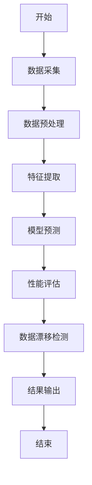
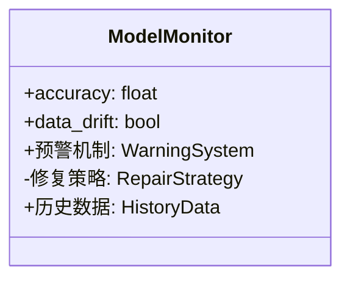
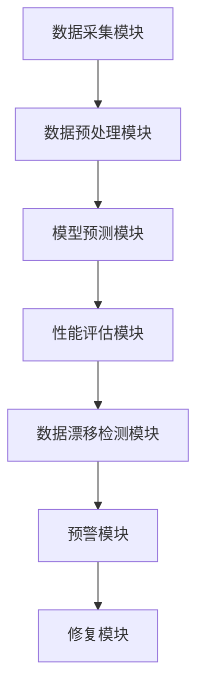
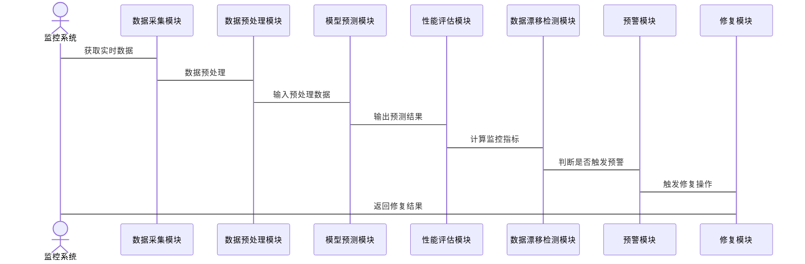

                 


# 模型监控：实时跟踪AI Agent的健康状态

> 关键词：数据漂移，模型退化，实时监控，AI Agent，模型性能评估，数据分布变化，机器学习模型

> 摘要：  
随着AI Agent在各个领域的广泛应用，模型监控成为确保其健康状态和性能稳定性的关键任务。本文从模型监控的背景出发，详细探讨其实现原理、算法设计、系统架构及项目实战，旨在帮助读者全面理解并掌握实时跟踪AI Agent健康状态的方法。通过分析数据漂移、模型退化等问题，结合具体案例，本文为构建高效可靠的模型监控系统提供了理论支持和实践指导。

---

## 第1章：模型监控的背景与核心概念

### 1.1 问题背景

#### 1.1.1 AI Agent的广泛应用  
AI Agent（智能体）在各个行业中发挥着越来越重要的作用，从推荐系统到自动驾驶，从智能客服到机器人助手，它们通过学习和推理完成复杂任务。然而，AI Agent的性能依赖于训练数据和模型，一旦数据分布发生变化或模型能力不足，就会导致性能下降，甚至引发安全风险。

#### 1.1.2 模型退化与数据漂移的挑战  
在实际应用中，模型可能会因为数据分布的变化（数据漂移）或训练数据与实际数据的不匹配而导致性能下降（模型退化）。这些问题会直接影响用户体验，甚至引发安全事故。例如，自动驾驶系统如果无法准确识别道路上的障碍物，可能会导致严重事故。

#### 1.1.3 模型监控的必要性  
模型监控是实时跟踪AI Agent健康状态的核心任务，旨在及时发现并修复模型性能下降的问题。通过监控，可以确保AI Agent在各种场景下的稳定性和可靠性。

### 1.2 问题描述

#### 1.2.1 模型健康状态的定义  
模型健康状态是指AI Agent在运行过程中是否能够准确完成预期任务。这需要从多个维度进行评估，包括模型的预测准确性、数据分布的变化程度以及模型的稳定性等。

#### 1.2.2 模型性能下降的原因  
模型性能下降的原因主要包括数据漂移、数据质量和分布变化、模型过拟合或欠拟合、环境变化等。这些问题可能导致模型在实际应用中表现不佳。

#### 1.2.3 数据分布变化的影响  
数据分布变化（Data Drift）是指实际数据与训练数据的分布差异增大，这会直接影响模型的性能。例如，在推荐系统中，用户行为的变化可能导致模型推荐的准确性下降。

### 1.3 问题解决

#### 1.3.1 监控的目标与方法  
模型监控的目标是实时检测模型性能下降和数据分布变化，及时发出预警并采取修复措施。常见的方法包括定期评估模型性能、监控数据分布变化、对比线上和离线模型表现等。

#### 1.3.2 实时跟踪的实现思路  
实时跟踪的核心思路是通过采集实时数据，计算模型性能指标，并与预设的阈值进行对比。如果发现性能下降或数据分布变化，立即触发修复流程。

#### 1.3.3 模型修复与优化策略  
模型修复可以采用重新训练模型、调整模型参数、更新特征工程等方法。优化策略包括定期更新训练数据、监控模型性能、动态调整模型结构等。

### 1.4 概念结构与核心要素

#### 1.4.1 模型监控的系统架构  
模型监控系统通常包括数据采集模块、性能评估模块、预警模块和修复模块。数据采集模块负责收集实时数据，性能评估模块计算模型指标，预警模块根据阈值触发预警，修复模块执行修复操作。

#### 1.4.2 核心要素的定义与关系  
核心要素包括：数据源、模型、监控指标、预警机制和修复策略。这些要素相互关联，共同构成了完整的模型监控系统。

#### 1.4.3 监控指标的选择与设计  
监控指标的选择应基于业务需求和模型特点。常用的指标包括准确率、召回率、F1值、AUC值等。数据分布变化的监控指标包括KL散度、JS散度等。

### 1.5 本章小结  
本章介绍了模型监控的背景、核心概念和实现思路，为后续章节的深入分析奠定了基础。

---

## 第2章：模型监控的核心概念与联系

### 2.1 核心概念原理

#### 2.1.1 数据漂移的检测方法  
数据漂移的检测方法包括统计方法（如KL散度、JS散度）和机器学习方法（如分布估计模型）。这些方法可以帮助我们判断数据分布是否发生变化。

#### 2.1.2 模型性能的评估指标  
模型性能的评估指标包括分类指标（如准确率、召回率）、回归指标（如均方误差）以及NLP任务指标（如BLEU分数）。这些指标可以帮助我们全面评估模型的性能。

#### 2.1.3 实时监控的技术实现  
实时监控的技术实现包括数据流处理（如使用Kafka或Flume）、实时计算框架（如Flink或Storm）以及可视化工具（如 Grafana 或 Prometheus）。

### 2.2 概念属性特征对比

| 概念         | 特征                     |
|--------------|--------------------------|
| 数据漂移     | 数据分布变化             |
| 模型退化     | 模型性能下降             |
| 实时监控     | 数据流处理、实时计算     |
| 监控指标     | 评估模型性能的核心指标   |

### 2.3 ER实体关系图

```mermaid
er
actor: 监控系统
model: AI Agent模型
metric: 监控指标
data_drift: 数据漂移
performance: 模型性能
```

### 2.4 本章小结  
本章详细分析了模型监控的核心概念及其关系，为后续章节的算法设计奠定了基础。

---

## 第3章：模型监控的算法原理

### 3.1 算法原理概述

#### 3.1.1 监控算法的基本流程  
监控算法的基本流程包括数据采集、数据预处理、特征提取、模型预测、性能评估和数据漂移检测。

#### 3.1.2 数据预处理与特征提取  
数据预处理包括数据清洗、归一化和特征工程。特征提取可以通过PCA或t-SNE等方法进行降维。

#### 3.1.3 模型性能评估与预测  
模型性能评估包括计算分类指标、回归指标等。模型预测可以通过实时数据输入模型，得到预测结果。

### 3.2 算法流程图



### 3.3 Python核心实现代码

```python
import numpy as np
from sklearn.metrics import accuracy_score

def model_performance_monitor(y_true, y_pred):
    accuracy = accuracy_score(y_true, y_pred)
    return accuracy

# 示例数据
y_true = np.array([0, 1, 2, 3, 4])
y_pred = np.array([0, 1, 2, 3, 4])
result = model_performance_monitor(y_true, y_pred)
print(result)  # 输出：1.0
```

### 3.4 数学模型与公式

#### 3.4.1 数据漂移检测  
KL散度公式：
$$ D_{KL}(P || Q) = \sum_{i} P(i) \log \frac{P(i)}{Q(i)} $$

#### 3.4.2 模型性能评估  
F1值公式：
$$ F1 = 2 \times \frac{precision \times recall}{precision + recall} $$

### 3.5 本章小结  
本章详细介绍了模型监控的算法原理，包括流程图和代码实现，帮助读者理解其实现细节。

---

## 第4章：系统分析与架构设计方案

### 4.1 问题场景介绍  
本章将从实际应用场景出发，分析模型监控系统的构建过程。

### 4.2 系统功能设计

#### 4.2.1 领域模型类图  


#### 4.2.2 系统架构图  


### 4.3 系统接口设计  
系统接口设计包括数据接口、模型接口和预警接口。数据接口负责与数据源交互，模型接口负责模型预测和评估，预警接口负责触发预警和修复操作。

### 4.4 系统交互序列图  


### 4.5 本章小结  
本章从系统架构的角度分析了模型监控的实现，为后续章节的项目实战提供了指导。

---

## 第5章：项目实战

### 5.1 环境安装  
项目实战需要安装以下依赖：
- Python 3.8+
- numpy
- scikit-learn
- matplotlib
- kafka-python

### 5.2 核心代码实现

#### 5.2.1 数据采集模块  
```python
from kafka import KafkaConsumer

def consume_data():
    consumer = KafkaConsumer('model_monitor_topic')
    for message in consumer:
        data = message.value
        yield data
```

#### 5.2.2 性能评估模块  
```python
def evaluate_model(y_true, y_pred):
    accuracy = accuracy_score(y_true, y_pred)
    return accuracy
```

#### 5.2.3 数据漂移检测模块  
```python
from scipy.stats import entropy

def calculate_kl_divergence(p, q):
    return entropy(p, q) / np.log(2)
```

### 5.3 案例分析与详细解读  
以一个分类任务为例，展示如何通过实时监控模型性能来检测数据漂移。假设我们训练了一个分类模型，并在实际应用中发现准确率下降。通过计算训练数据和当前数据的KL散度，发现数据分布发生了变化，触发预警并重新训练模型。

### 5.4 本章小结  
本章通过具体案例展示了模型监控系统的实现过程，帮助读者掌握实际操作方法。

---

## 第6章：最佳实践与小结

### 6.1 小结  
模型监控是确保AI Agent健康状态的关键任务。通过实时跟踪模型性能和数据分布变化，可以及时发现并修复问题，确保系统的稳定性和可靠性。

### 6.2 注意事项  
- 定期更新模型和数据，避免模型过时。
- 选择合适的监控指标和阈值，确保预警的有效性。
- 建立完善的修复机制，快速响应问题。

### 6.3 拓展阅读  
- 《机器学习实战》
- 《分布式系统监控与调试》
- 《实时数据流处理技术》

---

## 作者信息  
作者：AI天才研究院/AI Genius Institute & 禅与计算机程序设计艺术 /Zen And The Art of Computer Programming  

---

**全文完**

