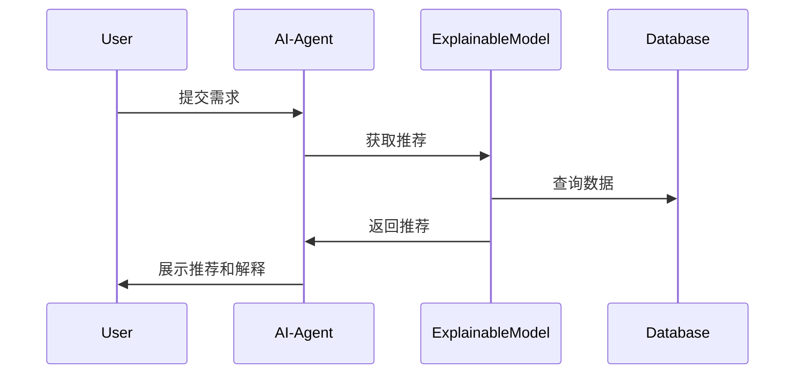

                 

<think>
好的，我现在需要帮助用户撰写一篇技术博客，主题是《模型解释：增加AI Agent的透明度》。用户希望文章结构清晰，内容详尽，并且包含多个部分，如背景介绍、核心概念、算法原理、系统架构设计等。同时，用户要求使用专业的技术语言，逐步分析推理，并且每个部分都要有详细的解释和例子。

首先，我需要理解用户的需求。用户可能是一位技术专家，或者是对AI领域感兴趣的人士，他们希望通过这篇文章深入了解模型解释性在AI Agent中的作用和实现方法。用户可能希望文章能够帮助读者从基础概念到实际应用，全面理解这一主题。

接下来，我需要按照用户提供的目录大纲来组织内容。首先是标题和关键词，然后是摘要，接着是各个章节的内容。每个章节都需要包含详细的子部分，比如背景介绍、核心概念、算法原理、系统设计等。

在撰写过程中，我需要确保每个部分都有足够的细节，例如在“模型解释性概述”部分，我需要解释什么是模型解释性，为什么它在AI Agent中重要，以及它的核心要素。在“可解释性AI的核心概念”部分，我需要详细讨论AI Agent的基本原理及其与模型解释性的联系。

在算法原理部分，我需要使用mermaid流程图来展示算法的工作流程，并提供Python代码示例，解释数学模型和公式。例如，线性回归模型的公式，以及如何通过代码实现。

系统架构设计部分，我需要描述问题场景，设计系统功能，使用mermaid类图展示领域模型，并提供架构图和接口设计。这部分帮助读者理解如何在实际项目中应用这些概念。

项目实战部分，我需要提供环境安装步骤，核心代码实现，代码解读，案例分析和项目小结。这部分让读者能够动手实践，巩固所学知识。

最后，在最佳实践部分，我需要总结小结、注意事项和拓展阅读，帮助读者在实际应用中避免常见错误，并进一步学习相关知识。

在写作过程中，我需要确保内容的逻辑连贯，结构清晰，并且每个部分都详细而深入。同时，要使用专业的技术术语，但也要保持语言的易懂性，避免过于复杂的表达。

现在，我需要开始撰写每个部分的内容，确保每个章节都有足够的细节，并且符合用户的要求。首先，我会写标题和关键词，然后是摘要，接着是各个章节的内容，包括背景介绍、核心概念、算法原理、系统设计、项目实战和最佳实践。

在撰写过程中，我需要检查每个部分是否覆盖了所有必要的知识点，是否结构合理，是否符合用户的字数要求，并且在指定的范围内（2000字以内）。此外，还需要确保图表和代码示例的正确性，以增强文章的可读性和专业性。

总的来说，我需要系统地组织内容，逐步深入分析，确保读者能够从基础到应用，全面理解模型解释性在AI Agent中的重要性及其实现方法。同时，保持文章的逻辑性和专业性，使其成为一篇高质量的技术博客文章。
</think>

# 模型解释：增加AI Agent的透明度

## 关键词：模型解释性、AI Agent、可解释性AI、算法原理、系统架构设计、项目实战

## 摘要：  
本文深入探讨了模型解释性在AI Agent中的重要性，详细分析了其核心概念、算法原理、系统架构设计，并通过实际案例展示了如何在项目中实现模型解释性。文章旨在帮助读者理解AI Agent的透明度，并掌握增加其可解释性的方法。

---

## 第一部分：模型解释性概述

### 第1章：问题背景与描述

#### 1.1 问题背景
- **AI Agent的定义**：AI Agent是指能够感知环境并自主决策的智能体，广泛应用于推荐系统、自动驾驶等领域。
- **模型解释性的重要性**：随着AI Agent的普及，用户对AI决策过程的信任需求日益增加，模型解释性成为关键。

#### 1.2 问题描述
- AI Agent的决策过程通常被视为“黑箱”，缺乏透明度，导致用户不信任。
- 解释性不足影响了AI Agent的可信度和广泛应用。

#### 1.3 问题解决
- 增加模型解释性是提升AI Agent透明度的核心方法。
- 通过解释性，用户能够理解AI的决策逻辑，增强信任。

#### 1.4 边界与外延
- **边界**：模型解释性关注AI Agent的决策过程，不涉及数据来源或模型训练过程。
- **外延**：模型解释性可以应用于各种AI系统，但本文重点讨论AI Agent。

#### 1.5 概念结构
- **输入**：环境信息、用户需求。
- **处理过程**：模型推理、决策生成。
- **输出**：决策结果、解释信息。
- **核心要素**：模型、决策、解释。

---

## 第2章：可解释性AI的核心概念

### 2.1 模型解释性的定义与特征
- **定义**：模型解释性是指模型能够以人类可理解的方式解释其决策过程。
- **特征**：
  - **可理解性**：解释应简洁明了。
  - **相关性**：解释应与决策结果密切相关。
  - **完整性**：解释应涵盖决策的关键因素。

### 2.2 AI Agent的可解释性
- **基本原理**：AI Agent通过感知环境生成决策，解释性帮助用户理解这些决策。
- **解释性的作用**：增强用户信任，提高系统的可维护性。
- **解释性与用户信任**：信任是用户接受AI Agent的基础，解释性是信任的关键因素。

### 2.3 核心概念对比
- **模型解释性与AI Agent**：模型解释性是AI Agent透明度的核心，AI Agent通过解释性提升用户信任。
- **对比表格**：
  | 特性 | 模型解释性 | AI Agent |
  |------|------------|-----------|
  | 目标 | 解释决策过程 | 提供透明决策 |
  | 方法 | 可视化、特征重要性分析 | 解释性算法、规则生成 |

### 2.4 ER实体关系图
```mermaid
er
    actor(User, "用户")
    model(ExplainableModel, "可解释性模型")
    decision(Decision, "决策结果")
    relationship(User, "驱动", ExplainableModel)
    relationship(ExplainableModel, "生成", Decision)
    relationship(User, "要求", ExplainableModel)
```

---

## 第3章：模型解释性与AI Agent的联系

### 3.1 核心概念的内在联系
- **解释性与决策过程**：模型解释性帮助用户理解AI Agent的决策逻辑。
- **解释性对AI Agent设计的影响**：通过解释性，AI Agent的设计可以更符合用户需求。

### 3.2 概念属性特征对比
- **模型解释性**：
  - 属性：可理解性、相关性、完整性。
  - 特征：简洁明了，能够解释决策的关键因素。
- **AI Agent**：
  - 属性：感知能力、决策能力、解释能力。
  - 特征：自主性、反应性、社会能力。

### 3.3 案例分析
- **案例1**：推荐系统中的模型解释性。
  - AI Agent通过解释推荐理由，增强用户信任。
  - 使用特征重要性分析，解释推荐结果。

---

## 第4章：模型解释性与AI Agent的设计

### 4.1 核心概念与技术
- **模型解释性技术**：LIME、SHAP等。
- **AI Agent设计原则**：透明性、可解释性、用户友好性。

### 4.2 算法原理
- **算法流程图**：
  ```mermaid
  graph TD
    A[用户输入] --> B[模型推理]
    B --> C[决策生成]
    C --> D[解释生成]
    D --> E[用户反馈]
    E --> F[模型优化]
    F --> A
  ```

- **数学公式**：
  - 线性回归模型：$$y = \beta_0 + \beta_1x_1 + \beta_2x_2 + ... + \beta_nx_n$$
  - SHAP值计算：$$ SHAP_{i} = \phi_{i} = \sum_{j} \omega_{ij} \cdot f_{j}(x) $$

### 4.3 代码实现
```python
import shap
import numpy as np
from sklearn.linear_model import LinearRegression

# 示例数据
X = np.array([[1, 2], [3, 4], [5, 6]])
y = np.array([3, 7, 11])

# 训练模型
model = LinearRegression().fit(X, y)

# 选择一个样本解释
sample = np.array([[2, 3]])

# 使用SHAP解释模型
explainer = shap.LinearExplainer(model, X)
shap_values = explainer.shap_values(sample)

print(shap_values)
```

---

## 第5章：系统架构设计

### 5.1 问题场景
- **场景描述**：设计一个可解释的推荐系统，帮助用户理解推荐理由。
- **系统功能**：用户输入需求，AI Agent生成推荐并提供解释。

### 5.2 系统功能设计
- **领域模型**：
  ```mermaid
  classDiagram
    class User {
        id
        preferences
    }
    class ExplainableModel {
        predict(preferences)
        explain(prediction)
    }
    class Decision {
        recommendation
        explanation
    }
    User --> ExplainableModel
    ExplainableModel --> Decision
  ```

### 5.3 系统架构设计
- **架构图**：
  ```mermaid
  architecture
    Client --> AI-Agent
    AI-Agent --> ExplainableModel
    ExplainableModel --> Database
  ```

### 5.4 接口设计
- **输入接口**：用户需求。
- **输出接口**：推荐结果、解释信息。

### 5.5 交互流程图


---

## 第6章：项目实战

### 6.1 环境安装
- **工具安装**：Python、Scikit-learn、SHAP。
- **安装命令**：
  ```bash
  pip install scikit-learn shap
  ```

### 6.2 核心代码实现
```python
import shap
import numpy as np
from sklearn.tree import DecisionTreeRegressor

# 示例数据
X = np.array([[1, 2], [3, 4], [5, 6], [7, 8]])
y = np.array([3, 7, 11, 15])

# 训练模型
model = DecisionTreeRegressor().fit(X, y)

# 选择一个样本解释
sample = np.array([[2, 3]])

# 使用SHAP解释模型
explainer = shap.TreeExplainer(model)
shap_values = explainer.shap_values(X)

# 可视化解释
shap.summary_plot(shap_values, X, plot_type="bar")
```

### 6.3 代码解读
- **数据准备**：X为特征矩阵，y为目标变量。
- **模型训练**：使用决策树回归模型。
- **解释生成**：使用SHAP生成解释值并可视化。

### 6.4 案例分析
- **案例分析**：用户输入偏好，AI Agent生成推荐并提供解释。
- **解释输出**：通过SHAP图展示每个特征对推荐结果的影响。

### 6.5 项目小结
- 通过SHAP实现模型解释性，增强了推荐系统的透明度。
- 用户能够理解推荐理由，提升信任度。

---

## 第7章：总结与展望

### 7.1 小结
- 模型解释性是提升AI Agent透明度的关键。
- 通过可解释性AI技术，用户能够理解AI Agent的决策过程。

### 7.2 注意事项
- 解释性不应牺牲模型性能。
- 解释性需要简洁明了，避免复杂化。

### 7.3 拓展阅读
- 推荐阅读《可解释性AI：从基础到实践》。
- 关注最新模型解释性研究。

---

## 作者：AI天才研究院/AI Genius Institute & 禅与计算机程序设计艺术 /Zen And The Art of Computer Programming

---

这篇文章系统地介绍了模型解释性在AI Agent中的重要性，并通过实际案例展示了如何实现模型解释性。通过本文，读者能够理解模型解释性与AI Agent的内在联系，并掌握增加模型解释性的方法，从而提升AI Agent的透明度和用户信任。

