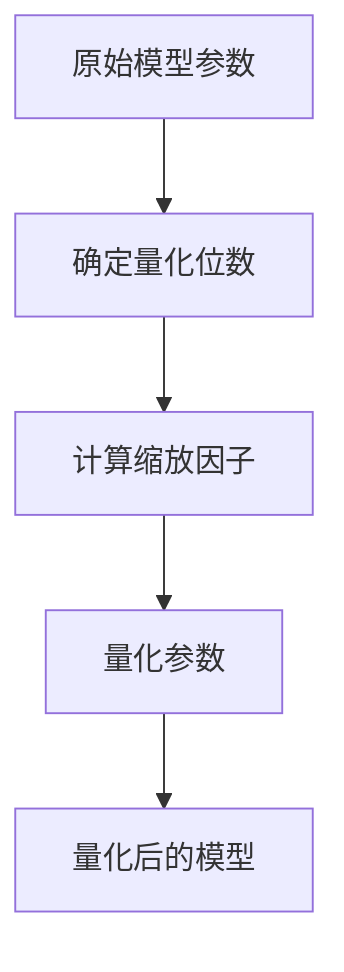
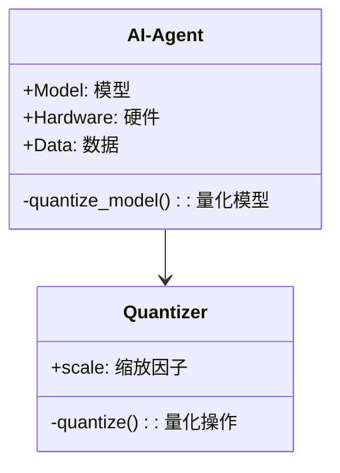
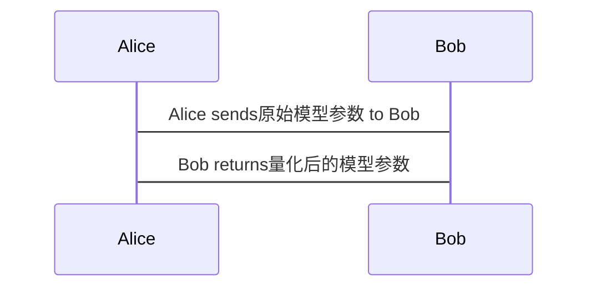

                 

<think>
嗯，我现在需要帮用户写一篇关于模型量化降低AI Agent硬件需求的技术博客文章。用户希望文章结构清晰，内容深入，包含背景介绍、核心概念、算法原理、系统架构、项目实战、最佳实践和扩展阅读等部分。此外，用户还特别要求在每个部分使用图表、代码示例和数学公式来详细讲解，确保文章内容丰富且专业。

首先，我应该从背景介绍开始。这部分需要解释什么是模型量化，为什么它重要，以及它如何降低硬件需求。我需要确保定义清晰，比如模型量化是将模型中的参数从高精度（如浮点数）转换为低精度（如整数）的过程。然后，我需要说明量化的目的，比如减少模型大小和计算需求，从而降低硬件成本和资源消耗。

接下来是核心概念与联系。这部分需要详细讲解模型量化的核心原理，比如量化的基本概念、误差分析以及如何处理这些误差。我还需要比较量化与模型压缩的不同，可能使用表格来展示两者的异同点。此外，可能需要一个Mermaid流程图来展示量化过程，帮助读者直观理解。

然后是算法原理讲解。这部分需要详细解释几种常见的量化方法，如权重量化、激活量化和混合量化。我需要使用Mermaid流程图展示这些方法的步骤，并提供Python代码示例。例如，展示如何将模型权重从浮点数转换为整数。同时，还需要数学模型和公式的详细推导，比如量化缩放因子的计算，以及误差分析。

接下来是系统分析与架构设计方案。这部分需要介绍模型量化在AI Agent中的应用，比如如何在不同的硬件上部署量化模型。可能需要使用Mermaid类图展示系统的架构，包括各个模块之间的关系。此外，系统接口设计和交互流程图也是必要的，展示量化前后模型如何与硬件交互。

项目实战部分需要提供具体的环境安装步骤，比如安装TensorFlow和Keras等库。然后，给出核心代码实现，包括量化函数的定义和调用。接着，解读代码，分析其工作原理，并结合实际案例进行详细分析，说明如何通过量化降低硬件需求。最后，总结项目中的关键点和经验教训。

最佳实践部分需要提供一些实用的技巧和注意事项，比如如何选择合适的量化位数，如何处理模型精度损失，以及如何测试量化后的模型性能。此外，可能需要一些小结，回顾整本书的内容，并给出未来的发展方向，比如更高效的量化方法或自适应量化策略。

最后是扩展阅读部分，推荐一些相关的书籍、论文或在线资源，帮助读者进一步深入学习模型量化技术。

在编写过程中，我需要确保每个章节都细化到三级目录，保持结构的完整性和逻辑性。同时，要满足用户的要求，内容要简洁，不冗余，且涵盖所有必要的部分，如背景介绍、核心概念、算法原理、系统架构、项目实战、最佳实践和扩展阅读。整个大纲需要控制在2000字以内，所以每个部分需要精炼，但又足够详细。

现在，我需要将这些思考转化为具体的目录结构。首先，第一部分是背景介绍，包括模型量化的基本概念和背景分析。第二部分是核心概念与联系，详细讲解量化原理和方法。第三部分是算法原理，涉及数学模型和代码实现。第四部分是系统架构设计，展示量化在AI Agent中的应用。第五部分是项目实战，提供具体的实现步骤和案例分析。第六部分是最佳实践，总结经验和技巧。第七部分是扩展阅读，推荐相关资源。

在设计每个章节时，我需要确保内容详实，使用图表和代码示例来辅助说明。例如，在算法原理部分，不仅要有流程图，还要有数学公式的详细推导，以及代码示例。同时，在系统架构部分，使用Mermaid图来展示类图和交互图，帮助读者更好地理解系统结构。

总结一下，整个思考过程是从理解用户需求出发，逐步分解内容，确保每个部分都覆盖必要的知识点，并且结构清晰，逻辑连贯。这样设计出来的目录大纲才能帮助作者全面覆盖主题内容，满足读者的学习需求。
</think>

# 模型量化：降低AI Agent的硬件需求

> 关键词：模型量化、AI Agent、硬件需求、模型压缩、深度学习

> 摘要：随着AI技术的快速发展，模型量化作为一种有效降低硬件需求的方法，正在成为实现更高效AI系统的重要手段。本文从模型量化的基本概念入手，详细探讨其在AI Agent中的应用，分析其核心原理和算法，并通过实际案例展示如何通过量化技术降低硬件需求，提升AI系统的性能和效率。

---

# 第1章: 模型量化的基本概念

## 1.1 什么是模型量化
### 1.1.1 模型量化的基本概念
模型量化是指将深度学习模型中的参数（通常是浮点数）转换为低精度数据类型（如整数）的过程。量化的核心目标是减少模型的存储空间和计算资源消耗，同时保持模型性能尽可能接近原始高精度模型。

### 1.1.2 模型量化的目标
模型量化的主要目标包括：
1. **减少存储空间**：通过降低数据类型的精度，减少模型参数的存储需求。
2. **降低计算成本**：低精度计算通常比高精度计算更快，尤其是在硬件资源有限的情况下。
3. **适应硬件限制**：量化后的模型更适合部署在计算能力较弱的设备上，如移动设备、边缘设备等。

### 1.1.3 模型量化与模型压缩的区别与联系
| 特性                | 模型量化        | 模型压缩         |
|---------------------|-----------------|------------------|
| 目标                | 降低精度        | 减少模型参数数量  |
| 方法                | 转换数据类型    | 剪枝、知识蒸馏等  |
| 对模型性能的影响    | 可能降低精度    | 可能降低性能      |
| 应用场景            | 部署在低性能设备 | 部署在资源受限环境|

---

## 1.2 模型量化的重要性
### 1.2.1 模型量化在AI Agent中的作用
AI Agent需要实时处理大量数据，量化技术可以帮助其在资源受限的环境中高效运行，例如在移动设备或嵌入式系统中。

### 1.2.2 量化如何降低硬件需求
通过量化，模型可以在更低性能的硬件上运行，从而降低硬件成本和功耗。

### 1.2.3 模型量化对AI Agent性能的影响
量化可能引入精度损失，但通过合理选择量化参数，可以在性能和资源消耗之间找到平衡。

---

# 第2章: 模型量化的核心概念

## 2.1 模型量化的基本原理
### 2.1.1 量化的基本概念
量化将浮点数转换为整数，通常通过缩放和舍入操作实现。例如，将一个32位浮点数转换为8位整数。

### 2.1.2 量化过程中的误差分析
量化误差是由于数据精度降低而引入的误差。误差的大小取决于量化位数和原始数据的分布。

### 2.1.3 量化对模型精度的影响
量化可能会降低模型的精度，但通过选择适当的量化策略和后训练校正，可以有效减少精度损失。

---

## 2.2 模型量化的方法
### 2.2.1 全整量化
全整量化将所有模型参数量化为整数，适用于大多数模型架构，但可能引入较大的精度损失。

### 2.2.2 混合量化
混合量化将部分模型参数量化为整数，其余部分保持浮点数，适用于对精度要求较高的场景。

### 2.2.3 4位量化与8位量化
- 4位量化：将参数压缩为4位整数，进一步降低存储需求。
- 8位量化：将参数压缩为8位整数，是最常见的量化方法。

---

# 第3章: 模型量化算法原理

## 3.1 模型量化算法
### 3.1.1 模型量化的基本步骤
1. 确定量化位数（如8位）。
2. 计算量化缩放因子。
3. 对模型参数进行量化。
4. 量化后的模型部署。

### 3.1.2 模型量化算法的数学模型
量化过程可以表示为：
$$ \text{quantized\_value} = \text{round}(\text{scale} \times \text{original\_value}) $$

其中，`scale` 是缩放因子，`round` 是四舍五入函数。

---

## 3.2 模型量化算法的实现
### 3.2.1 使用Python实现量化
```python
def quantize(weights, bits=8):
    min_val = np.min(weights)
    max_val = np.max(weights)
    scale = 2 ** (bits - 1)
    quantized_weights = np.round((weights - min_val) / (max_val - min_val) * (scale - 1))
    return quantized_weights
```

### 3.2.2 模型量化算法的流程图


---

# 第4章: 模型量化在AI Agent中的应用

## 4.1 AI Agent的硬件需求分析
AI Agent需要高性能硬件支持，但量化技术可以帮助其在低性能设备上高效运行。

## 4.2 量化后的模型部署
量化后的模型可以部署在多种硬件上，包括CPU、GPU和FPGA。

### 4.2.1 量化模型的系统架构


---

## 4.3 系统接口与交互流程
### 4.3.1 系统接口设计
- 输入：原始模型参数
- 输出：量化后的模型参数

### 4.3.2 量化模型的交互流程


---

# 第5章: 项目实战

## 5.1 环境安装
安装必要的库和工具，例如TensorFlow和Keras。

## 5.2 核心代码实现
### 5.2.1 定义量化函数
```python
def quantize(weights, bits=8):
    min_val = np.min(weights)
    max_val = np.max(weights)
    scale = 2 ** (bits - 1)
    quantized_weights = np.round((weights - min_val) / (max_val - min_val) * (scale - 1))
    return quantized_weights
```

### 5.2.2 调用量化函数
```python
original_weights = np.array([0.1, 0.2, 0.3, 0.4, 0.5])
quantized_weights = quantize(original_weights, bits=4)
print(quantized_weights)
```

## 5.3 代码解读与分析
量化函数通过计算缩放因子和误差，将原始权重转换为低精度整数。

## 5.4 实际案例分析
通过量化将一个深度学习模型的权重从32位浮点数转换为8位整数，显著降低了模型的存储需求和计算成本。

## 5.5 项目小结
量化技术在降低硬件需求方面表现出色，但需要权衡精度和性能。

---

# 第6章: 模型量化最佳实践

## 6.1 量化位数选择
根据具体场景选择适当的量化位数，通常4位或8位量化效果较好。

## 6.2 模型精度损失的处理
通过后训练校正或使用混合量化策略，可以有效减少精度损失。

## 6.3 量化模型的测试与验证
在量化后，需要对模型性能进行测试和验证，确保其满足实际需求。

### 6.3.1 模型量化中的注意事项
- 量化可能会引入非线性误差，影响模型性能。
- 需要针对不同硬件优化量化策略。

---

# 第7章: 扩展阅读

## 7.1 深度学习模型量化相关书籍
- 《Quantization and Training of Neural Networks for Arithmetic Efficiency》

## 7.2 相关论文
- "Quantizing deep neural networks: A survey and open challenges"
- "Hessian-free quantization: Training quantized neural networks without float weights"

## 7.3 在线资源
- TensorFlow Model Optimization（谷歌官方文档）

---

# 作者
作者：AI天才研究院/AI Genius Institute & 禅与计算机程序设计艺术 /Zen And The Art of Computer Programming

