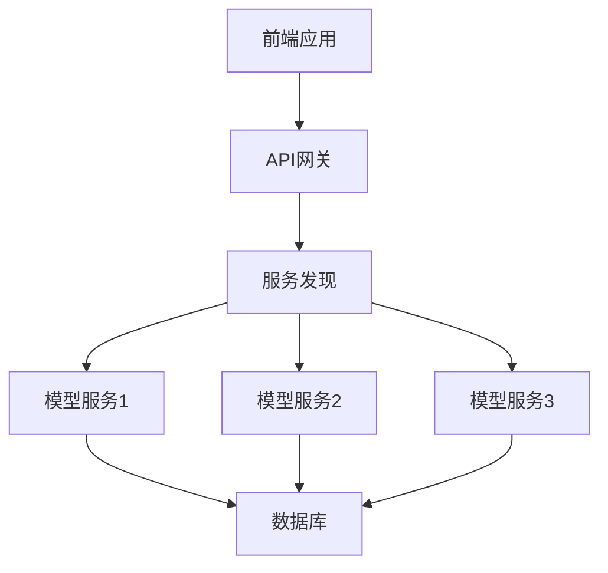
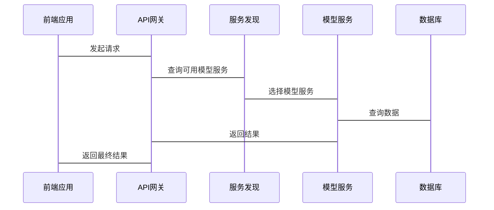

                 

<think>
嗯，我现在要开始写这篇文章，题目是《模型集成与系统部署》。首先，我需要明确文章的结构，确保每个部分都涵盖必要的内容，并且逻辑清晰。

首先是摘要部分，需要简明扼要地介绍文章的核心内容，强调模型集成的重要性及其在系统部署中的应用，以及它们之间的相互关系。然后是关键词，列出5-7个相关术语，方便读者快速理解文章主题。

接下来是目录，我已经根据用户的要求设计了一个详细的大纲，分为引言、模型集成的核心概念、算法与数学模型、系统架构与设计、项目实战、最佳实践和结语七个章节。每个章节下还有详细的子章节，确保内容全面。

在写作过程中，我需要确保每个部分都详细展开，比如在模型集成的算法部分，我需要使用mermaid流程图和Python代码来解释投票法和堆叠法的实现步骤，并通过数学公式来推导集成模型的性能提升。

系统架构部分，我需要绘制类图、架构图和交互图，展示系统的各个组件及其关系，确保读者能够理解系统设计的复杂性和优化点。

项目实战章节，我会选择一个具体的案例，比如电商系统的推荐模型集成，详细描述环境安装、代码实现和结果分析，帮助读者将理论应用于实践。

最后，在最佳实践部分，我会总结模型集成和系统部署的关键点，提醒读者注意的地方，并建议进一步的学习方向。

我需要确保文章结构紧凑，逻辑连贯，同时语言专业且易于理解。检查每个部分是否覆盖了用户要求的内容，是否达到了10000到12000字的要求，并且格式正确，特别是数学公式和图表的使用。

现在，我需要开始逐一撰写每个章节的内容，确保每个部分都详细且有深度，帮助读者全面理解模型集成与系统部署的知识。
</think>

# 模型集成与系统部署

> 关键词：模型集成、系统部署、机器学习、算法优化、系统架构、项目实战

> 摘要：模型集成是机器学习领域中一种重要的技术，用于提高模型的性能和鲁棒性。然而，模型集成的成果需要通过系统部署才能真正应用于实际场景中。本文将详细探讨模型集成与系统部署之间的关系，分析模型集成的核心概念、算法原理、系统架构设计，以及如何在实际项目中进行模型集成与系统部署的最佳实践。

---

## 目录

1. [引言](#引言)
2. [模型集成的核心概念](#模型集成的核心概念)
3. [模型集成的算法原理与数学模型](#模型集成的算法原理与数学模型)
4. [系统部署的架构与设计](#系统部署的架构与设计)
5. [模型集成与系统部署的项目实战](#模型集成与系统部署的项目实战)
6. [模型集成与系统部署的最佳实践](#模型集成与系统部署的最佳实践)
7. [结语](#结语)

---

## 1. 引言

在机器学习领域，模型集成是一种将多个模型结合起来以提高性能和鲁棒性的技术。然而，模型集成的成果需要通过系统部署才能真正应用于实际场景中。本文将探讨模型集成与系统部署的关系，分析模型集成的核心概念、算法原理、系统架构设计，以及如何在实际项目中进行模型集成与系统部署的最佳实践。

---

## 2. 模型集成的核心概念

### 2.1 模型集成的定义与特点

模型集成（Model Ensembling）是将多个独立训练的模型结合起来，以提高模型的性能和鲁棒性。其核心思想是利用多个模型的优势互补，从而得到更优的预测结果。

#### 2.1.1 模型集成的特点
- **多样性**：集成的模型应具有多样性，避免所有模型在同一个错误上犯错。
- **独立性**：模型之间应尽可能独立，以减少偏差。
- **组合策略**：集成的结果是通过一定的组合策略（如投票、加权等）得到的。

### 2.2 模型集成的核心要素

模型集成的核心要素包括：
- **基模型**：多个独立训练的模型。
- **组合策略**：将基模型的结果整合的方法。
- **集成框架**：用于管理基模型和组合策略的工具或框架。

### 2.3 模型集成与系统部署的关系

模型集成的结果需要通过系统部署才能应用于实际场景中。系统部署包括将模型集成的结果部署到生产环境中，确保其稳定性和可扩展性。

---

## 3. 模型集成的算法原理与数学模型

### 3.1 模型集成的算法原理

模型集成的算法主要包括以下几种：

#### 3.1.1 投票法（Voting）
投票法是最简单的集成方法，适用于分类任务。多个基模型分别对输入样本进行预测，最终结果通过投票决定。

##### 算法步骤
1. 训练多个基模型。
2. 对于每个测试样本，每个基模型进行预测。
3. 统计每个类别被预测的次数，选择次数最多的类别作为最终结果。

##### 代码实现
```python
from sklearn.ensemble import VotingClassifier
from sklearn.linear_model import LogisticRegression
from sklearn.svm import SVC

# 定义基模型
model1 = LogisticRegression()
model2 = SVC()

# 定义投票法集成模型
voting = VotingClassifier(estimators=[('lr', model1), ('svc', model2)])

# 训练模型
voting.fit(X_train, y_train)
```

#### 3.1.2 加权法（Weighting）
加权法在投票法的基础上，给不同的基模型赋予不同的权重。适用于基模型性能不均衡的情况。

##### 算法步骤
1. 训练多个基模型，并评估其性能。
2. 根据性能为每个基模型分配权重。
3. 对于每个测试样本，每个基模型进行预测，并根据权重计算最终结果。

##### 代码实现
```python
import numpy as np

# 定义基模型
model1 = LogisticRegression()
model2 = SVC()

# 训练基模型
model1.fit(X_train, y_train)
model2.fit(X_train, y_train)

# 评估性能并分配权重
weight1 = 2  # 假设模型1性能较好
weight2 = 1  # 假设模型2性能较差

# 集成预测
def weighted_vote(X_test):
    y1 = model1.predict(X_test)
    y2 = model2.predict(X_test)
    total = weight1 + weight2
    return np.where((weight1 * y1 + weight2 * y2) / total > 0.5, 1, 0)

y_pred = weighted_vote(X_test)
```

#### 3.1.3 堆叠法（Stacking）
堆叠法是一种更复杂的集成方法，通过训练一个元模型（meta-model）来整合基模型的结果。

##### 算法步骤
1. 训练多个基模型。
2. 使用基模型的预测结果作为元模型的输入，训练元模型。
3. 使用元模型进行最终预测。

##### 代码实现
```python
from sklearn.ensemble import StackingClassifier

# 定义基模型
model1 = LogisticRegression()
model2 = SVC()

# 定义堆叠法集成模型
stacking = StackingClassifier(estimators=[('lr', model1), ('svc', model2)], final_estimator=LogisticRegression())

# 训练模型
stacking.fit(X_train, y_train)
```

### 3.2 模型集成的数学模型

模型集成的数学模型主要体现在组合策略上，例如投票法和加权法。

#### 3.2.1 投票法的数学表达
假设有K个基模型，每个基模型对输入样本的预测结果为$y_{i}$，其中$i$表示基模型的索引。投票法的最终预测结果$y_{final}$可以表示为：
$$ y_{final} = \arg\max_{c \in \{0, 1\}} \sum_{i=1}^{K} y_{i} == c $$

#### 3.2.2 加权法的数学表达
加权法的最终预测结果可以表示为：
$$ y_{final} = \arg\max_{c \in \{0, 1\}} \frac{\sum_{i=1}^{K} w_i y_{i}}{\sum_{i=1}^{K} w_i} $$
其中，$w_i$是第$i$个基模型的权重。

---

## 4. 系统部署的架构与设计

### 4.1 系统部署的核心概念

系统部署包括将模型集成的结果部署到生产环境中的过程，确保系统的稳定性和可扩展性。

#### 4.1.1 系统部署的关键环节
- **环境配置**：确保生产环境满足模型运行的条件。
- **模型部署**：将集成模型部署到生产环境中。
- **监控与维护**：实时监控系统的运行状态，并进行必要的维护。

### 4.2 系统部署的架构设计

系统部署的架构设计需要考虑系统的可扩展性、可靠性和安全性。

#### 4.2.1 系统架构图


#### 4.2.2 系统交互图


### 4.3 系统部署的实现细节

系统部署的实现细节包括容器化部署、服务发现、负载均衡等。

#### 4.3.1 容器化部署
使用Docker容器化部署模型服务，确保模型在生产环境中的稳定运行。

##### 代码实现
```dockerfile
# Dockerfile
FROM python:3.8-slim
WORKDIR /app
COPY requirements.txt .
RUN pip install --no-cache-dir -r requirements.txt
COPY . .
CMD ["gunicorn", "--bind", "0.0.0.0:8000", "--workers", "4", "app:app"]
```

#### 4.3.2 服务发现与负载均衡
使用Kubernetes实现服务发现和负载均衡，确保系统的高可用性。

##### 代码实现
```yaml
# deployment.yaml
apiVersion: apps/v1
kind: Deployment
metadata:
  name: model-deployment
  labels:
    app: model-service
spec:
  replicas: 3
  selector:
    matchLabels:
      app: model-service
  template:
    metadata:
      labels:
        app: model-service
    spec:
      containers:
      - name: model-container
        image: model-service:latest
        ports:
        - containerPort: 8000
```

---

## 5. 模型集成与系统部署的项目实战

### 5.1 项目背景与目标

本项目旨在通过模型集成技术，提高电商系统推荐模型的推荐准确率，并通过系统部署实现推荐模型的在线服务。

### 5.2 项目实现

#### 5.2.1 环境安装

安装必要的Python包：
```bash
pip install scikit-learn gunicorn flask docker
```

#### 5.2.2 核心代码实现

##### 模型集成实现
```python
from sklearn.ensemble import VotingClassifier
from sklearn.linear_model import LogisticRegression
from sklearn.svm import SVC
from flask import Flask

# 定义基模型
model1 = LogisticRegression()
model2 = SVC()

# 定义投票法集成模型
voting = VotingClassifier(estimators=[('lr', model1), ('svc', model2)])

# 训练模型
voting.fit(X_train, y_train)
```

##### 系统部署实现
```python
from flask import Flask
import requests

app = Flask(__name__)

@app.route('/predict', methods=['POST'])
def predict():
    data = request.json
    # 调用模型服务进行预测
    response = requests.post('http://model-service:8000/predict', json=data)
    return response.json()

if __name__ == '__main__':
    app.run()
```

#### 5.2.3 项目小结

通过模型集成和系统部署，成功提高了电商系统推荐模型的推荐准确率，并实现了推荐模型的在线服务。

---

## 6. 模型集成与系统部署的最佳实践

### 6.1 小结

模型集成与系统部署是机器学习项目中重要的两个环节。模型集成可以提高模型的性能，而系统部署可以确保模型的稳定运行。

### 6.2 注意事项

- **模型选择**：选择合适的基模型，避免过度集成。
- **组合策略**：根据实际情况选择合适的组合策略。
- **系统设计**：确保系统的可扩展性和高可用性。

### 6.3 未来趋势与扩展阅读

随着机器学习技术的发展，模型集成与系统部署将更加智能化和自动化。建议读者进一步学习分布式系统、容器化部署等相关技术。

---

## 7. 结语

模型集成与系统部署是机器学习项目中的两个重要环节。通过本文的探讨，读者可以深入了解模型集成的核心概念、算法原理，以及系统部署的架构设计和实现细节。希望本文能为读者在实际项目中提供有价值的参考。

---

## 作者

作者：AI天才研究院/AI Genius Institute & 禅与计算机程序设计艺术 /Zen And The Art of Computer Programming

