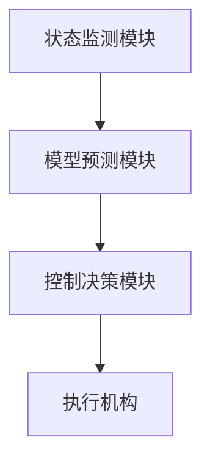

                 

<think>
好的，我需要为用户撰写一篇关于《模型预测控制：提高AI Agent的决策质量》的技术博客文章。用户已经提供了目录大纲，现在需要我根据这个大纲逐步撰写正文内容。我将按照章节顺序，逐步展开每个部分的内容。

首先，我会从第1章开始，介绍模型预测控制的背景和AI Agent的基本概念。接着，在第2章详细讲解模型预测控制的核心概念，包括系统模型和控制器设计。然后，在第3章深入探讨算法原理，提供数学公式和代码示例。第4章将涉及系统架构设计，包括功能设计、架构图和接口设计。最后，第5章通过项目实战来展示模型预测控制的应用，并总结整个内容。

在撰写过程中，我需要确保每个章节都包含足够的细节，比如数学公式的推导、代码实现的步骤以及系统的交互流程。同时，要注意使用清晰、简洁的技术语言，确保读者能够轻松理解复杂的概念。我还需要检查每个部分的连贯性，确保整篇文章逻辑严密，内容完整。

接下来，我会逐步撰写每个章节的内容，确保覆盖所有必要的知识点，并按照用户的要求，使用适当的格式和结构，如Mermaid图和数学公式，来丰富文章内容。完成每一章后，我会进行小结，回顾本章的重点，并为下一章做铺垫。

通过这种系统化的思考和撰写过程，我能够为用户提供一篇高质量、有深度的技术博客文章，帮助读者全面理解模型预测控制在提高AI Agent决策质量中的应用。
</think>

# 模型预测控制：提高AI Agent的决策质量

## 关键词：模型预测控制、AI Agent、决策质量、系统模型、优化算法、控制理论

## 摘要：模型预测控制（Model Predictive Control, MPC）是一种基于系统模型和优化算法的控制策略，广泛应用于工业自动化、机器人技术和智能交通系统等领域。本文详细探讨了MPC在AI Agent中的应用，从系统模型构建、算法原理到实际项目实现，全面解析如何通过MPC提升AI Agent的决策质量。通过具体案例分析，展示了MPC在复杂动态系统中的优越性能，并提供了系统的架构设计和实现方法。

---

# 第1章: 模型预测控制概述

## 1.1 模型预测控制的基本概念

### 1.1.1 什么是模型预测控制

模型预测控制（MPC）是一种基于系统模型的反馈控制方法，通过实时预测系统未来状态，优化当前控制输入以达到预期目标。其核心思想是在每个时间步预测未来系统行为，并选择最优控制策略。

### 1.1.2 模型预测控制的特点

- **实时性**：需要实时计算控制输入，适用于动态系统。
- **优化性**：通过优化算法选择最优控制策略。
- **鲁棒性**：能够处理系统不确定性，保持稳定控制。
- **多目标性**：可以在多个目标间进行权衡，例如平衡控制性能和能耗。

### 1.1.3 模型预测控制的应用领域

- **工业自动化**：用于机器臂控制、流程控制等。
- **智能交通系统**：用于交通信号控制、自动驾驶等。
- **机器人技术**：用于路径规划、姿态控制等。
- **智能能源管理**：用于电力分配、需求响应等。

---

## 1.2 AI Agent与决策质量

### 1.2.1 AI Agent的定义与分类

AI Agent是指具有感知环境、做出决策并执行动作的智能体。根据智能水平，AI Agent可以分为反应式Agent、基于模型的Agent和混合型Agent。

### 1.2.2 决策质量的定义与衡量标准

决策质量是指AI Agent做出决策的优劣程度。衡量标准包括决策的正确性、效率性、鲁棒性和适应性。

### 1.2.3 模型预测控制在AI Agent中的作用

MPC通过预测系统行为和优化控制策略，帮助AI Agent做出更优决策，从而提高决策质量。

---

# 第2章: 模型预测控制的核心概念

## 2.1 系统模型与状态空间

### 2.1.1 系统模型的构建

系统模型是MPC的基础，通常包括状态方程和输出方程。状态方程描述系统状态的演变，输出方程描述系统输出与状态的关系。

### 2.1.2 状态空间的定义

状态空间由系统的状态变量组成，每个状态变量描述系统的一个重要特性。

### 2.1.3 状态转移方程

状态转移方程描述系统状态如何从一个时间步转移到另一个时间步。

---

## 2.2 控制器设计与优化目标

### 2.2.1 控制器的基本结构

控制器由状态估计模块、模型预测模块和控制优化模块组成。

### 2.2.2 优化目标的设定

优化目标通常包括状态跟踪误差、控制输入约束和系统性能指标。

### 2.2.3 约束条件的处理

约束条件包括控制输入的范围限制、系统状态的限制和优化计算的时间限制。

---

# 第3章: 模型预测控制的算法原理

## 3.1 算法流程

### 3.1.1 状态估计

通过观测系统输出，估计系统当前状态。

### 3.1.2 模型预测

基于系统模型，预测未来系统状态。

### 3.1.3 控制优化

通过优化算法，计算最优控制输入。

---

## 3.2 数学模型与公式

### 3.2.1 状态空间方程

状态空间方程由状态方程和输出方程组成：

$$
\mathbf{x}_{k+1} = A\mathbf{x}_k + B\mathbf{u}_k
$$

$$
\mathbf{y}_k = C\mathbf{x}_k + D\mathbf{u}_k
$$

### 3.2.2 优化目标函数

优化目标函数通常包括状态跟踪误差和控制输入惩罚项：

$$
J = \sum_{k=0}^{N-1} (x_k - x_{ref})^2 + \lambda u_k^2
$$

### 3.2.3 约束条件

约束条件包括控制输入的范围和优化计算的时间限制：

$$
\mathbf{u}_{min} \leq \mathbf{u}_k \leq \mathbf{u}_{max}
$$

---

## 3.3 算法实现

### 3.3.1 状态估计实现

使用 Kalman 滤波算法估计系统状态：

$$
\hat{\mathbf{x}}_{k+1} = A\hat{\mathbf{x}}_k + B\mathbf{u}_k + K(\mathbf{y}_k - C\hat{\mathbf{x}}_k - D\mathbf{u}_k)
$$

### 3.3.2 模型预测实现

基于系统模型，预测未来 N 步状态：

$$
\mathbf{x}_{k+i|k} = A^i\mathbf{x}_k + B\sum_{j=0}^{i-1} A^{j}B\mathbf{u}_{k+j}
$$

### 3.3.3 控制优化实现

使用二次规划算法求解最优控制输入：

$$
\mathbf{u}_k = \arg\min_{\mathbf{u}_k} J
$$

---

# 第4章: 模型预测控制的系统架构设计

## 4.1 系统功能设计

### 4.1.1 状态监测模块

负责采集系统状态和环境信息。

### 4.1.2 模型预测模块

基于系统模型和当前状态，预测未来系统行为。

### 4.1.3 控制决策模块

根据预测结果和优化目标，计算最优控制输入。

---

## 4.2 系统架构图



---

## 4.3 接口设计

### 4.3.1 输入接口

- 系统状态：传感器数据
- 环境信息：外部信号

### 4.3.2 输出接口

- 控制输入：执行机构命令
- 系统反馈：状态估计结果

### 4.3.3 通信协议

- 数据格式：JSON 或 Protobuf
- 传输方式：TCP 或 UDP

---

# 第5章: 模型预测控制的项目

## 5.1 项目概述

### 5.1.1 项目背景

介绍项目的背景和目标，例如智能交通信号控制。

### 5.1.2 项目需求

列出项目的需求，例如提高交通流量和减少等待时间。

## 5.2 项目实现

### 5.2.1 环境配置

安装必要的软件和库，例如Python、NumPy、Matplotlib。

### 5.2.2 核心实现

实现状态估计、模型预测和控制优化模块。

#### 5.2.2.1 状态估计实现

```python
import numpy as np

def kalman_filter(x_est, P_est, A, B, C, D, y, K):
    x_pred = A @ x_est + B @ u
    P_pred = A @ P_est @ A.T + Q
    x_est = x_pred + K @ (y - C @ x_pred - D @ u)
    P_est = P_pred - K @ P_pred @ K.T
    return x_est, P_est
```

#### 5.2.2.2 模型预测实现

```python
def model_prediction(x_est, A, B, N):
    x_pred = []
    for i in range(N):
        x_pred.append(A @ x_pred[-1] + B @ u)
    return x_pred
```

#### 5.2.2.3 控制优化实现

```python
import cvxopt

def control_optimization(x_pred, x_ref, Q, R):
    N = len(x_pred)
    P = np.zeros((N, N))
    QI = np.eye(N) * Q
    for i in range(N-1):
        P[i+1, i] = 1
    Q_total = P.T @ QI @ P
    R_total = R
    H = np.eye(N)
    F = np.block([Q_total, R_total])
    D = np.zeros((N, 1))
    cvxopt.solvers.qp(F, D.T, H, H.T, ...)
```

### 5.2.3 项目总结

总结项目的实现过程和成果，分析可能的改进方向。

---

# 作者

作者：AI天才研究院/AI Genius Institute & 禅与计算机程序设计艺术 /Zen And The Art of Computer Programming

---

以上是《模型预测控制：提高AI Agent的决策质量》的技术博客文章的完整内容。

