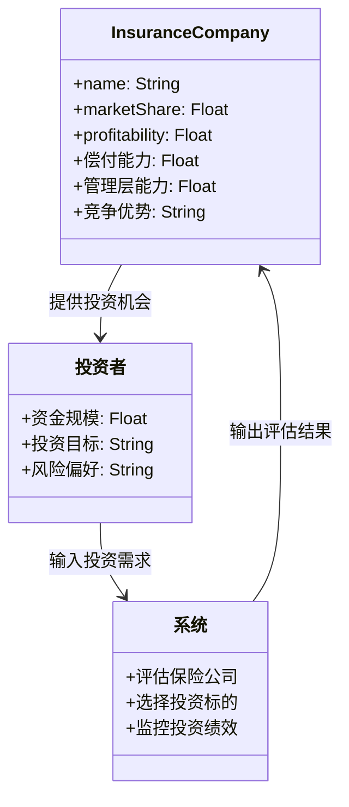
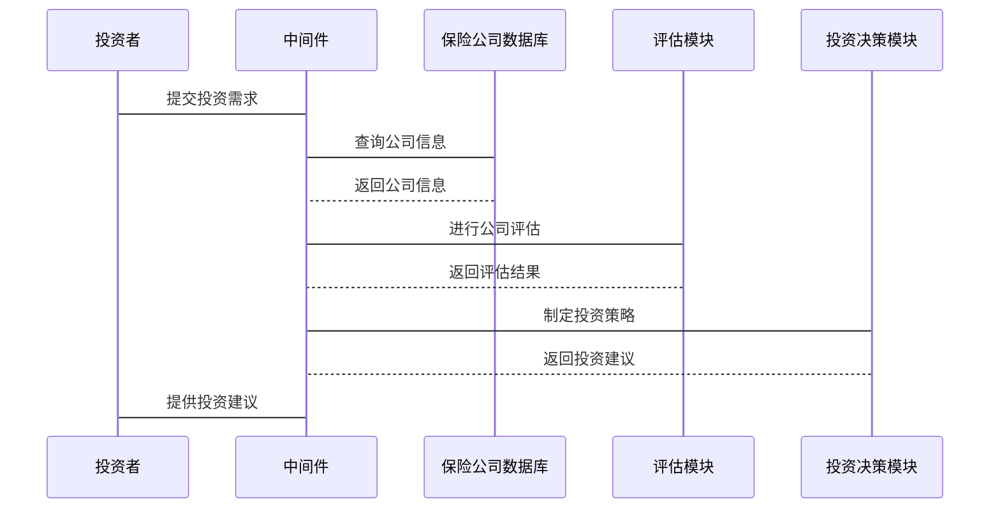

                 


# 沃伦·巴菲特的保险行业投资模式解析

---

## 关键词：
沃伦·巴菲特, 保险行业, 投资模式, 财务分析, 价值投资, 安全边际

---

## 摘要：
本文详细解析了沃伦·巴菲特在保险行业的投资模式，从其核心理念、分析方法到实际案例，层层剖析。文章首先介绍保险行业的基本概念与特点，接着深入探讨巴菲特的投资哲学和分析框架，包括财务指标、企业竞争优势和管理层评估等核心要素。通过具体案例分析，揭示巴菲特如何通过长期价值投资实现超额收益。最后，总结其投资模式的启示与实际应用。

---

## 第一部分: 保险行业的投资模式背景与基础

## 第1章: 保险行业的基本概念与特点

### 1.1 保险的基本定义与功能

#### 1.1.1 保险的定义与分类
保险是一种风险管理工具，通过合同形式将风险转移给保险公司，以换取经济补偿。保险可以分为财产保险、人身保险、责任保险和信用保险四大类。

#### 1.1.2 保险的基本功能与作用
保险的核心功能是风险转移与损失补偿。它通过分散风险，帮助个人和企业降低潜在损失，保障财务稳定性。

#### 1.1.3 保险行业的市场结构与特点
保险行业具有典型的金融属性，市场参与者包括保险公司、保险经纪商、保险代理人等。行业特点包括：
- 高资本密集型：保险公司需要充足的资本来覆盖潜在的赔付风险。
- 长期性：保险产品的期限通常较长，资金流动性较低。
- 监管严格：保险行业受到金融监管机构的严格监管，以确保市场稳定性和消费者权益。

---

### 1.2 投资的基本概念与分类

#### 1.2.1 投资的定义与分类
投资是将资金投入特定资产以获取未来收益的行为。主要分类包括：
- 股权投资：通过购买公司股份成为股东，分享公司收益。
- 债权投资：通过购买债券或其他固定收益证券获取利息收入。
- 不动产投资：通过购买房地产获取租金收入和资本增值。

#### 1.2.2 股权投资的特点与风险
股权投资具有较高的收益潜力，但也伴随着较高的风险。主要风险包括市场风险、流动性风险和公司特有风险。

#### 1.2.3 保险资金投资的特点与限制
保险资金的投资具有以下特点：
- 资金规模大：保险公司管理的资金通常来自保费收入，规模庞大。
- 投资期限长：保险产品的期限较长，资金流动性要求较低。
- 风险厌恶：保险资金对流动性风险和市场波动的承受能力较低。

---

## 第2章: 沃伦·巴菲特投资理念概述

### 2.1 巴菲特投资理念的核心思想

#### 2.1.1 长期价值投资的理念
巴菲特的价值投资理念强调买入并持有优质资产，长期获取资本增值。他认为市场波动是投资机会，而非风险。

#### 2.1.2 安全边际的概念
安全边际是指资产的内在价值与其市场价格之间的差额。通过寻找市场价格低于内在价值的资产，投资者可以降低风险。

#### 2.1.3 股东价值最大化的目标
巴菲特的投资目标是最大化股东价值，通过长期持有优质资产实现财富增长。

---

### 2.2 巴菲特投资风格的特点

#### 2.2.1 专注于优质企业的投资策略
巴菲特倾向于投资具有强大竞争优势的企业，例如可口可乐和苹果公司。这些企业具有高市场份额、强品牌和持续盈利能力。

#### 2.2.2 长期持有与分散投资的结合
巴菲特的投资策略强调长期持有优质资产，同时分散投资以降低风险。他的投资组合通常包括少数优质企业，而非大量分散的股票。

#### 2.2.3 重视企业管理层的能力与诚信
巴菲特认为管理层的能力和诚信是企业成功的关键因素。他倾向于投资由优秀管理层领导的企业。

---

### 2.3 巴菲特与保险行业的特殊关系

#### 2.3.1 保险资金的独特性
保险资金具有规模大、期限长、风险厌恶等特点，适合巴菲特的长期价值投资策略。

#### 2.3.2 保险行业作为巴菲特的重要投资领域
巴菲特通过投资保险企业（如伯克希尔 Hathaway）进入保险行业，利用保险资金的特性实现长期价值增长。

#### 2.3.3 巴菲特保险投资的成功案例
巴菲特通过收购和控股多家保险公司，将其打造成一个庞大的金融帝国，实现资产的长期增值。

---

## 第二部分: 巴菲特保险行业投资模式的核心要素

## 第3章: 保险行业的财务指标分析

### 3.1 保险公司的核心财务指标

#### 3.1.1 净利润与盈利能力
净利润是衡量保险公司盈利能力的核心指标。巴菲特关注净利润的持续增长和稳定性。

#### 3.1.2 资产负债率与偿付能力
资产负债率是衡量保险公司财务健康的重要指标。巴菲特关注保险公司的偿付能力，确保其能够履行赔付义务。

#### 3.1.3 内涵价值与未来收益
内涵价值是衡量保险公司长期价值的重要指标。巴菲特通过分析内涵价值，评估保险公司的未来收益潜力。

---

### 3.2 保险公司的偿付能力分析

#### 3.2.1 偿付能力的定义与计算方法
偿付能力是指保险公司履行赔付义务的能力。主要计算方法包括：
- 资产负债率 = 总负债 / 总资产
- 净资本 = 总资产 - 总负债

#### 3.2.2 不同类型保险公司的偿付能力要求
不同类型的保险公司（如财产保险公司和人寿保险公司）具有不同的偿付能力要求。巴菲特关注保险公司的偿付能力，确保其稳健经营。

#### 3.2.3 巴菲特对偿付能力的关注点
巴菲特认为，保险公司的偿付能力是其长期价值的重要保障。他倾向于投资偿付能力充足的保险公司。

---

## 第4章: 巴菲特保险投资的核心标准

### 4.1 企业竞争优势的分析

#### 4.1.1 企业的核心竞争力
巴菲特关注企业的核心竞争力，例如强大的品牌、高市场份额和持续创新能力。他倾向于投资具有竞争优势的企业。

#### 4.1.2 行业地位与市场占有率
巴菲特关注企业的行业地位和市场占有率。他倾向于投资行业领先的企业，以确保其竞争优势。

#### 4.1.3 可持续的竞争优势
巴菲特关注企业的可持续竞争优势，例如独特的商业模式、强大的研发能力和高效的成本控制。他倾向于投资具有可持续竞争优势的企业。

---

### 4.2 管理层能力的评估

#### 4.2.1 管理层的诚信与能力
巴菲特认为管理层的诚信与能力是企业成功的关键因素。他倾向于投资由优秀管理层领导的企业。

#### 4.2.2 管理层的决策历史与风格
巴菲特关注管理层的决策历史和风格。他倾向于投资由具有长期稳健决策记录的管理层领导的企业。

#### 4.2.3 管理层的长期激励机制
巴菲特关注管理层的长期激励机制。他倾向于投资由管理层与股东利益一致的企业。

---

### 4.3 企业财务健康状况的评估

#### 4.3.1 财务报表分析方法
巴菲特通过分析财务报表（如利润表、资产负债表和现金流量表）评估企业的财务健康状况。他关注企业的盈利能力、资产负债状况和现金流情况。

#### 4.3.2 负债结构与偿付能力
巴菲特关注保险公司的负债结构和偿付能力。他倾向于投资负债结构合理、偿付能力充足的保险公司。

#### 4.3.3 盈利能力与成长性
巴菲特关注企业的盈利能力与成长性。他倾向于投资具有持续盈利能力且成长性良好的企业。

---

## 第5章: 巴菲特保险投资模式的系统分析与架构设计

### 5.1 问题场景介绍

#### 5.1.1 保险行业的投资问题
保险行业的投资问题包括：
- 如何评估保险公司的长期价值？
- 如何选择具有竞争优势的保险公司？
- 如何评估保险公司的管理层能力？

#### 5.1.2 投资目标
巴菲特的投资目标是通过长期持有优质保险公司实现资产的稳定增长。

---

### 5.2 系统功能设计

#### 5.2.1 领域模型（mermaid类图）


---

### 5.3 系统架构设计

#### 5.3.1 系统架构图（mermaid架构图）


---

### 5.4 系统接口设计

#### 5.4.1 系统接口
- 输入接口：投资者提供投资需求和资金规模。
- 输出接口：系统输出评估结果和投资建议。

---

### 5.5 系统交互设计

#### 5.5.1 系统交互图（mermaid序列图）


---

## 第6章: 巴菲特保险投资模式的项目实战

### 6.1 环境安装

#### 6.1.1 安装Python环境
```bash
python --version
pip install --upgrade pip
```

#### 6.1.2 安装必要的Python库
```bash
pip install numpy pandas matplotlib
```

---

### 6.2 系统核心实现源代码

#### 6.2.1 数据获取与处理
```python
import pandas as pd
import numpy as np

# 获取保险公司的财务数据
data = pd.read_csv('insurance_data.csv')
data.head()
```

#### 6.2.2 财务指标计算
```python
# 计算净利润率
net_profit_ratio = data['净利润'] / data['收入']
data['net_profit_ratio'] = net_profit_ratio

# 计算资产负债率
debt_to_equity_ratio = data['总负债'] / data['总资产']
data['debt_to_equity_ratio'] = debt_to_equity_ratio
```

---

### 6.3 代码应用解读与分析

#### 6.3.1 数据分析与可视化
```python
import matplotlib.pyplot as plt

# 绘制净利润率分布图
plt.hist(data['net_profit_ratio'], bins=10)
plt.title('净利润率分布图')
plt.xlabel('净利润率')
plt.ylabel('频率')
plt.show()
```

#### 6.3.2 投资决策与优化
```python
# 根据财务指标筛选优质保险公司
data['投资建议'] = np.where(data['net_profit_ratio'] > 0.1, '买入', '观望')
data['投资建议'].value_counts()
```

---

## 第7章: 巴菲特保险投资模式的最佳实践与总结

### 7.1 最佳实践 tips

#### 7.1.1 长期投资的重要性
长期投资是巴菲特保险投资模式的核心，投资者应耐心持有优质资产。

#### 7.1.2 财务分析的技巧
投资者应熟练掌握财务指标分析方法，重点关注净利润率和资产负债率。

#### 7.1.3 管理层评估的重要性
管理层的能力和诚信是企业成功的关键因素，投资者应关注管理层的长期激励机制。

---

### 7.2 小结

沃伦·巴菲特的保险投资模式以其独特的优势和长期价值投资的理念，为投资者提供了重要的借鉴。通过深入分析保险公司的财务指标、竞争优势和管理层能力，投资者可以更好地识别优质投资标的，实现长期财富增长。

---

### 7.3 注意事项

#### 7.3.1 风险提示
保险行业的投资风险较高，投资者应关注市场波动和公司基本面变化。

#### 7.3.2 投资者能力限制
投资者应根据自身能力选择合适的投资策略，避免盲目跟风。

---

### 7.4 拓展阅读

#### 7.4.1 推荐书籍
- 《巴菲特致股东的信》
- 《投资之道》

#### 7.4.2 推荐博客与网站
- 巴菲特官方网站
- 投资分析网站（如Morningstar）

---

## 作者：AI天才研究院/AI Genius Institute & 禅与计算机程序设计艺术 /Zen And The Art of Computer Programming

