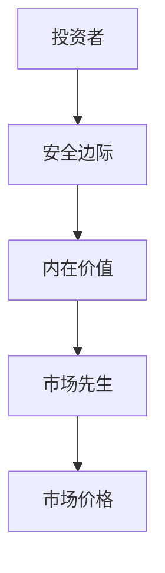
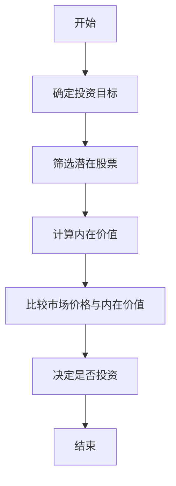
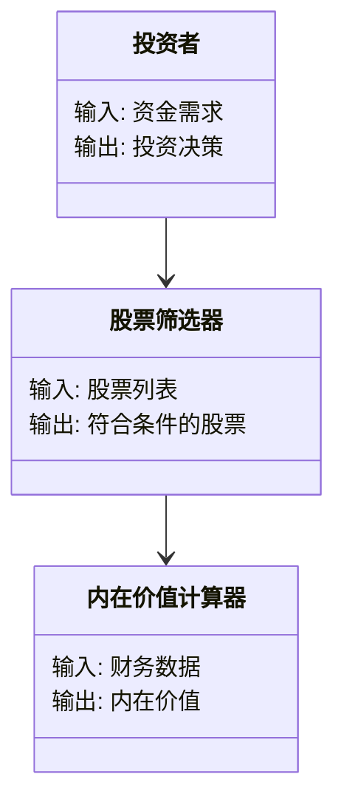

                 

# 沃尔特·施洛斯的价值投资实践指南

> 关键词：价值投资，沃尔特·施洛斯，安全边际，内在价值，投资策略，投资心理学

> 摘要：本文详细探讨了沃尔特·施洛斯的价值投资理念，从核心概念到实际操作策略，结合具体案例分析，帮助读者系统地理解和实践价值投资。文章内容涵盖了价值投资的基本概念、算法原理、系统架构设计以及实际操作中的心理学因素，旨在为投资者提供一套完整的投资指南。

---

## 第一部分：价值投资的背景与核心理念

### 第1章：价值投资的基本概念

#### 1.1 价值投资的定义与起源

- **1.1.1 价值投资的定义**  
  价值投资是一种以低于内在价值的价格买入优质资产的投资策略，其核心在于寻找市场低估的股票，并长期持有。

- **1.1.2 价值投资的起源与发展**  
  价值投资的理念起源于20世纪初，由本杰明·格雷厄姆和戴维·多德提出，后经彼得·林奇、沃伦·巴菲特等投资者的发展，成为现代投资理论的重要组成部分。

- **1.1.3 价值投资的核心理念**  
  价值投资的核心理念是：市场价格围绕内在价值波动，投资者应以低于内在价值的价格买入股票，并长期持有，等待市场重新认识其价值。

---

### 第2章：沃尔特·施洛斯的生平与投资理念

#### 2.1 沃尔特·施洛斯的生平简介

- 沃尔特·施洛斯（Walter Schloss）是20世纪著名的价值投资者，曾师从本杰明·格雷厄姆，以专注于小盘股投资闻名。
- 施洛斯的投资生涯跨越了60多年，他通过长期持有低估的股票，取得了稳定的超额收益。

#### 2.2 施洛斯的价值投资理念

- **安全边际**：施洛斯强调以低于内在价值的价格买入股票，安全边际 = 内在价值 - 市场价格。
- **长期持有**：他认为市场短期波动不可预测，但长期趋势是可衡量的，因此坚持长期持有优质资产。
- **深度研究**：施洛斯注重对公司基本面的深入研究，尤其是ROE（净资产收益率）和ROA（资产回报率）等财务指标。

---

## 第二部分：价值投资的核心概念与联系

### 第3章：价值投资的核心概念与联系

#### 3.1 核心概念原理

- **内在价值**：股票的内在价值是其未来现金流的现值，计算公式为：
  $$ \text{内在价值} = \sum_{t=1}^{n} \frac{\text{CF}_t}{(1 + r)^t} $$
  其中，$\text{CF}_t$ 是第 $t$ 年的现金流，$r$ 是折现率。

- **安全边际**：安全边际是内在价值与市场价格的差额，公式为：
  $$ \text{安全边际} = \text{内在价值} - \text{市场价格} $$

- **市场先生**：市场先生是格雷厄姆提出的一个比喻，指市场情绪的波动，投资者应避免被市场先生的情绪左右。

#### 3.2 核心概念属性特征对比表

| 概念       | 安全边际 | 内在价值 | 市场先生 |
|------------|----------|----------|----------|
| 定义       | 购买价格低于内在价值的部分 | 股票的公允价值 | 市场情绪的波动 |
| 作用       | 减少投资风险 | 作为投资决策的基础 | 反映市场情绪 |
| 计算方式   | 购买价格与内在价值的差额 | 现金流折现法 | 市场价格波动 |

#### 3.3 实体关系图（Mermaid流程图）

---

## 第三部分：价值投资的算法原理

### 第4章：价值投资的算法原理

#### 4.1 算法原理流程图

#### 4.2 内在价值计算公式

$$ \text{内在价值} = \sum_{t=1}^{n} \frac{\text{CF}_t}{(1 + r)^t} $$

---

## 第四部分：价值投资的系统分析与架构设计

### 第5章：系统功能设计

#### 5.1 问题场景介绍

- 投资者如何在市场波动中找到具有安全边际的股票？

#### 5.2 系统功能设计

---

## 第五部分：价值投资的项目实战

### 第6章：项目实战

#### 6.1 实际案例分析

- **案例背景**：假设某股票的内在价值为10元，市场价格为8元，安全边际为2元。
- **决策**：买入该股票，因为市场价格低于内在价值，存在安全边际。

---

## 第六部分：总结与展望

### 第7章：总结与展望

#### 7.1 总结

- 价值投资的核心在于寻找具有安全边际的股票，长期持有，避免短期市场波动的干扰。
- 施洛斯的投资理念强调深入研究和长期持有，为投资者提供了实用的指导。

#### 7.2 展望

- 价值投资在未来将继续作为重要的投资策略，尤其是在市场波动加剧的情况下，其长期稳定的回报将更加受到重视。

---

## 作者：AI天才研究院/AI Genius Institute & 禅与计算机程序设计艺术 /Zen And The Art of Computer Programming

