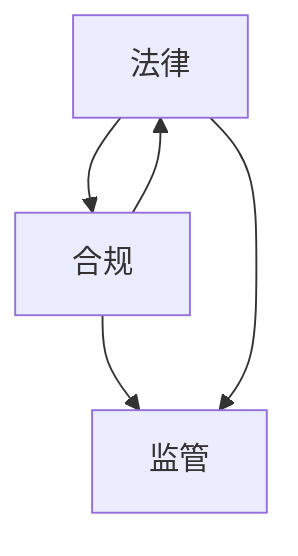
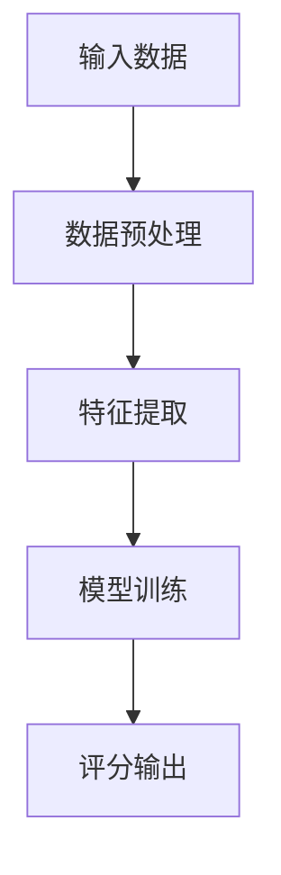
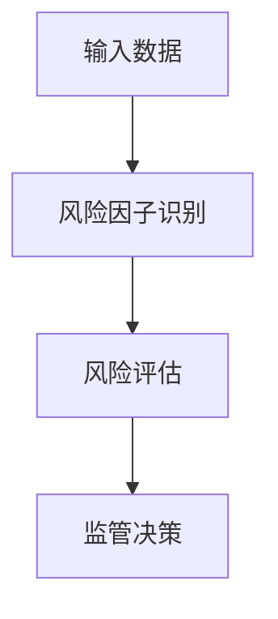
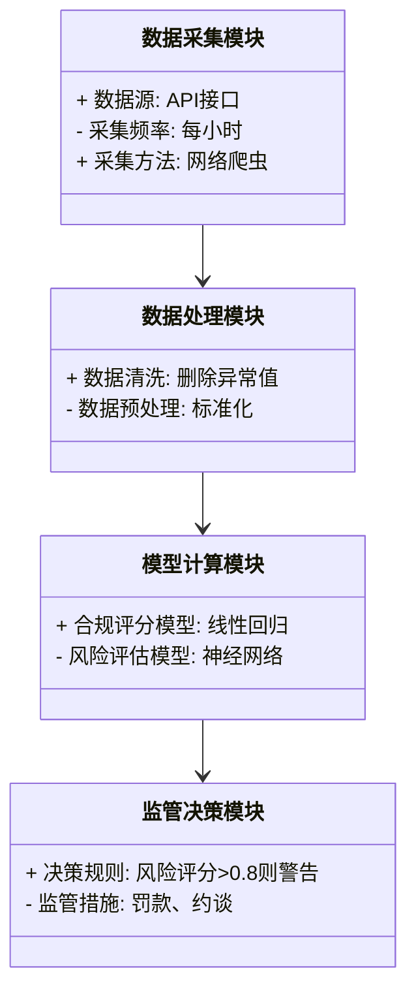
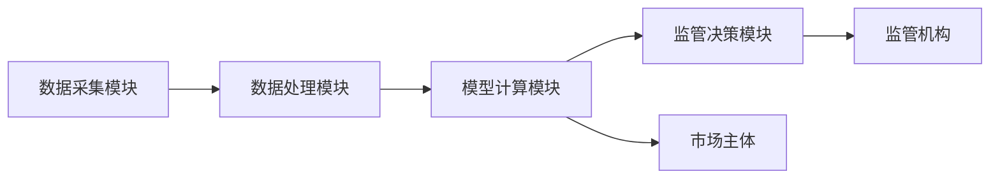
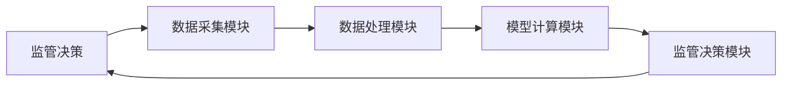

                 


# 法律合规与监管：技术视角下的深度剖析

> 关键词：法律合规、监管体系、数字化监管、合规评分模型、风险评估算法、系统架构设计

> 摘要：本文从技术视角深度剖析法律合规与监管的核心概念、算法原理、系统架构及项目实战。通过背景介绍、核心概念分析、算法实现、系统设计和案例解读，全面探讨法律合规与监管的技术实现与应用。

---

## 第一部分: 法律合规与监管的背景与概念

### 第1章: 法律合规与监管的背景介绍

#### 1.1 法律体系的演变
- **传统法律的局限性**  
  传统法律体系主要依赖于事后监管和惩罚，这种方式在数字化时代显得效率低下且成本高昂。  
- **数字化监管的兴起**  
  随着信息技术的发展，监管机构开始利用数字化手段进行实时监控和预测性监管。  
- **全球化背景下的法律挑战**  
  全球化使得法律合规需要考虑跨国法律体系的协调与统一。

#### 1.2 数字化监管的趋势
- **数据驱动的监管**  
  监管机构通过收集和分析大量数据，实现对市场主体的实时监控和风险评估。  
- **自动化合规检查**  
  利用人工智能技术，实现自动化合规检查，降低人为错误和成本。  
- **监管科技（RegTech）**  
  RegTech利用技术手段优化合规流程，提高监管效率。

### 第2章: 合规与监管的数字化转型

#### 2.1 数字化监管的实现路径
- **数据收集与处理**  
  通过API接口或爬虫技术，收集市场主体的运营数据。  
- **风险评估与预警**  
  利用机器学习算法对市场主体进行风险评估，提前预警潜在问题。  
- **自动化监管决策**  
  基于算法模型的结果，自动化生成监管决策。

---

## 第二部分: 法律合规与监管的核心概念

### 第3章: 法律、合规与监管的关系

#### 3.1 核心概念的定义
- **法律**：由国家立法机构制定的规则，具有强制性。  
- **合规**：市场主体在经营活动中遵守相关法律、法规和行业标准的行为。  
- **监管**：监管机构对市场主体的合规性进行监督和管理的过程。

#### 3.2 法律、合规与监管的关系图


#### 3.3 核心概念的属性对比
| 属性       | 法律               | 合规               | 监管               |
|------------|--------------------|--------------------|--------------------|
| 主体       | 国家立法机构       | 市场主体           | 监管机构           |
| 目标       | 维护社会秩序       | 遵守法律和标准     | 监督市场主体行为   |
| 实施方式   | 制定规则           | 自主执行           | 外部监督           |

---

## 第三部分: 法律合规与监管的算法原理

### 第4章: 合规评分模型

#### 4.1 模型原理
- **输入数据**：市场主体的历史行为数据、财务数据等。  
- **特征提取**：提取关键特征，如合规性、风险因子等。  
- **模型训练**：利用机器学习算法（如线性回归、随机森林）训练模型。  
- **评分输出**：根据模型预测结果，输出合规评分（0-1分）。

#### 4.2 模型流程图


#### 4.3 模型数学公式
合规评分计算公式：
$$
\text{合规评分} = \sum_{i=1}^{n} w_i x_i + b
$$
其中，$w_i$ 是特征 $x_i$ 的权重，$b$ 是偏置项。

### 第5章: 风险评估与监管算法

#### 5.1 算法原理
- **输入数据**：市场主体的实时行为数据。  
- **风险因子识别**：识别潜在风险因子（如异常交易、欺诈行为）。  
- **风险评估**：利用聚类算法或神经网络模型评估风险等级。  
- **监管决策**：根据风险等级生成监管措施（如警告、罚款）。

#### 5.2 算法流程图


#### 5.3 风险评估数学公式
风险评分计算公式：
$$
\text{风险评分} = \sum_{i=1}^{m} w_i y_i + b
$$
其中，$y_i$ 是风险因子，$w_i$ 是权重，$b$ 是偏置项。

---

## 第四部分: 法律合规与监管的系统架构

### 第6章: 系统功能设计

#### 6.1 系统功能模块
- 数据采集模块：收集市场主体数据。  
- 数据处理模块：对数据进行清洗和预处理。  
- 模型计算模块：运行合规评分模型和风险评估算法。  
- 监管决策模块：根据模型结果生成监管决策。

#### 6.2 系统功能设计类图


### 第7章: 系统架构设计

#### 7.1 系统架构图


#### 7.2 系统接口设计
- 数据采集接口：`GET /api/data`  
- 数据处理接口：`POST /api/process`  
- 模型计算接口：`POST /api/model`  
- 监管决策接口：`POST /api/decision`

#### 7.3 系统交互流程图


---

## 第五部分: 法律合规与监管的项目实战

### 第8章: 项目环境安装

#### 8.1 环境要求
- Python 3.8+  
- numpy、pandas、scikit-learn、keras

#### 8.2 安装依赖
```bash
pip install numpy pandas scikit-learn keras
```

### 第9章: 核心代码实现

#### 9.1 合规评分模型实现
```python
import numpy as np
from sklearn.linear_model import LinearRegression

# 示例数据
X = np.array([[1, 2], [3, 4], [5, 6]])
y = np.array([2, 3, 5])

# 训练模型
model = LinearRegression()
model.fit(X, y)

# 预测评分
new_data = np.array([[2, 3]])
print("合规评分:", model.predict(new_data)[0])
```

#### 9.2 风险评估模型实现
```python
import numpy as np
import keras
from keras.layers import Dense
from keras.models import Sequential

# 示例数据
X = np.random.randn(100, 64)
y = np.random.randint(2, size=100)

# 模型构建
model = Sequential()
model.add(Dense(64, activation='relu', input_dim=64))
model.add(Dense(1, activation='sigmoid'))
model.compile(optimizer='adam', loss='binary_crossentropy', metrics=['accuracy'])

# 训练模型
model.fit(X, y, epochs=10, batch_size=32)
```

### 第10章: 案例分析

#### 10.1 实际案例
- 某金融公司利用合规评分模型，实现了对客户交易行为的实时监控，显著降低了欺诈风险。  
- 某政府部门利用风险评估算法，提前预警了多家企业的经营风险，避免了重大经济损失。

### 第11章: 项目小结
- 通过实际项目，验证了法律合规与监管技术的有效性。  
- 提供了从环境安装到代码实现的完整流程，为读者提供了实践参考。

---

## 第六部分: 法律合规与监管的最佳实践

### 第12章: 小结与注意事项

#### 12.1 小结
- 法律合规与监管是数字化时代的重要技术领域。  
- 通过算法和系统架构的设计，可以显著提高监管效率和准确性。

#### 12.2 注意事项
- 数据隐私保护是合规监管的核心问题之一。  
- 监管算法需要定期更新，以适应法律法规的变化。

### 第13章: 拓展阅读

#### 13.1 推荐书籍
- 《监管科技：人工智能与金融监管的融合》  
- 《法律合规的数字化转型》

#### 13.2 推荐博客与资源
- [AI Genius Institute](https://www.ai-genius-institute.com)  
- [RegTech Weekly](https://www.regtechweekly.com)

---

## 作者：AI天才研究院 / AI Genius Institute  
联系邮箱：contact@ai-genius-institute.com

