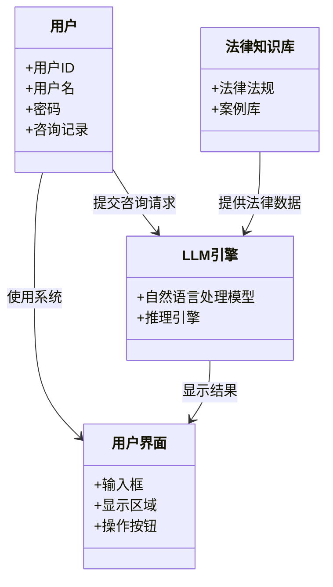
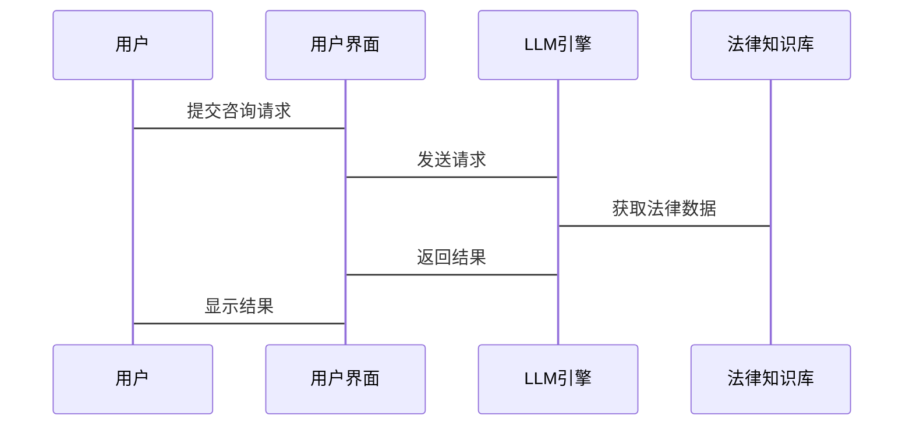

                 

<think>
好的，我现在要帮用户设计一个技术博客文章的目录，标题是《法律顾问 AI Agent：LLM 在法律咨询与合规检查中的应用》。用户希望这个目录结构清晰，逻辑严谨，并且包含技术细节和案例分析。首先，我需要明确文章的核心主题，围绕LLM在法律领域的应用，涵盖背景、原理、系统设计和项目实战等方面。

我先从引言开始，介绍为什么需要法律顾问AI Agent，以及LLM在法律咨询中的潜力。这部分需要吸引读者的注意，同时点出传统法律咨询的痛点，比如效率低、成本高等问题。

接下来是核心概念与联系部分，详细讲解法律咨询和合规检查的基本概念，以及它们与LLM的关系。这部分需要使用图表来帮助读者理解，比如Mermaid流程图，展示法律咨询和合规检查的流程。

然后是算法原理，这部分需要详细讲解LLM的工作原理，包括训练过程、模型结构和推理机制。为了更好地解释，我可能会用数学公式来描述模型的训练过程，比如损失函数和梯度下降，确保读者能够理解这些技术细节。

接下来是系统分析与架构设计，介绍系统的各个模块，如法律知识库、LLM引擎和用户界面。这部分也需要用Mermaid图来展示系统架构和交互流程，帮助读者理解系统的运作方式。

项目实战部分需要提供一个具体的案例，比如构建一个简单的法律咨询AI Agent。我会详细说明环境配置、代码实现和功能解读，甚至提供Python代码示例，这样读者可以动手实践。

最后是最佳实践和未来展望，总结项目中的经验和教训，讨论技术的局限性和未来的发展方向。这部分可以帮助读者更好地理解技术的应用前景。

在整个过程中，我需要确保每个章节都细化到三级目录，内容完整且逻辑清晰。同时，图表和代码示例要恰到好处，增强读者的理解。最后，检查整个目录是否覆盖了用户要求的所有部分，确保没有遗漏重要内容。
</think>

# 法律顾问 AI Agent：LLM 在法律咨询与合规检查中的应用

## 关键词：法律咨询，LLM，合规检查，AI Agent，大型语言模型

## 摘要：本文探讨了法律顾问 AI Agent 在法律咨询与合规检查中的应用，详细分析了LLM技术的核心原理、系统架构设计及实际案例，为读者提供了从理论到实践的全面解读。

---

# 第一部分: 法律顾问 AI Agent 的背景与基础

# 第1章: 法律顾问 AI Agent 的背景介绍

## 1.1 问题背景
### 1.1.1 法律咨询与合规检查的传统模式
传统的法律咨询依赖于律师的个人经验和知识储备，这种方式效率低下、成本高昂，且难以快速响应大量咨询需求。

### 1.1.2 传统法律咨询的痛点与局限性
- **效率低**：律师需要大量时间查阅资料和分析案例。
- **成本高**：聘请专业律师的费用昂贵。
- **覆盖面有限**：单个律师的知识有限，难以覆盖所有法律领域。

### 1.1.3 LLM 在法律咨询中的潜力
大型语言模型（LLM）能够快速处理大量法律文本，提供准确的法律建议，显著提升法律咨询的效率和准确性。

## 1.2 问题描述
### 1.2.1 法律咨询与合规检查的核心任务
- 提供法律意见和建议。
- 检查文档是否符合相关法律法规。

### 1.2.2 LLM 在法律咨询中的应用场景
- 智能合同审查。
- 法律问答系统。
- 法律合规性检查。

### 1.2.3 法律咨询与合规检查的边界与外延
- 边界：确保LLM的输出不超出法律咨询的范围。
- 外延：结合其他技术（如区块链）提升法律服务的可信度。

## 1.3 问题解决与核心概念
### 1.3.1 法律顾问 AI Agent 的定义与目标
法律顾问 AI Agent 是一种基于LLM技术的智能系统，旨在提供高效、准确的法律咨询和合规检查服务。

### 1.3.2 LLM 在法律咨询中的核心要素
- **法律知识库**：包含大量法律法规和案例数据。
- **自然语言处理能力**：能够理解和生成法律文本。
- **推理能力**：能够根据输入的法律问题进行推理和分析。

### 1.3.3 法律咨询与合规检查的关联性分析
通过LLM技术，法律咨询与合规检查可以实现自动化、智能化，显著提升效率和准确性。

## 1.4 核心概念结构与组成
### 1.4.1 法律咨询的流程与关键环节
1. 确定咨询问题。
2. 收集相关法律信息。
3. 分析法律信息并生成建议。

### 1.4.2 合规检查的框架与重点
1. 明确合规标准。
2. 检查文档是否符合标准。
3. 提供改进建议。

### 1.4.3 LLM 在法律咨询中的角色定位
LLM作为法律顾问 AI Agent 的核心，负责处理法律文本的理解、生成和推理。

## 1.5 本章小结
本章介绍了法律顾问 AI Agent 的背景，分析了传统法律咨询的痛点，探讨了LLM在法律咨询中的潜力和应用场景。

---

# 第二部分: LLM 的核心原理与法律应用

# 第2章: LLM 的核心原理

## 2.1 LLM 的基本原理
### 2.1.1 大型语言模型的定义与特点
- **定义**：LLM 是一种基于深度学习的自然语言处理模型，能够理解和生成人类语言。
- **特点**：参数量大、训练数据丰富、具有强大的上下文理解和生成能力。

### 2.1.2 LLM 的训练过程与数学模型
- **训练过程**：通过监督学习和无监督学习结合的方式进行训练。
- **数学模型**：基于Transformer架构，使用自注意力机制和前馈神经网络。

### 2.1.3 LLM 的推理机制与输出生成
- **推理机制**：通过自注意力机制处理输入文本，生成相应的输出。
- **输出生成**：基于生成式模型，输出与输入相关的文本。

## 2.2 LLM 的法律应用原理
### 2.2.1 法律文本的理解与生成
- **理解**：LLM能够理解法律文本的语义和上下文。
- **生成**：根据输入的法律问题生成相应的建议和解决方案。

### 2.2.2 法律咨询的上下文处理
- **上下文理解**：LLM能够理解法律咨询的上下文，包括相关法律法规和案例。
- **上下文生成**：根据上下文生成合理的法律建议。

### 2.2.3 合规检查的模式匹配与规则应用
- **模式匹配**：通过LLM识别文档中的特定模式，判断是否符合法律要求。
- **规则应用**：根据预设的法律规则，检查文档的合规性。

## 2.3 LLM 的法律应用优势
### 2.3.1 高效性与准确性
- **高效性**：LLM能够快速处理大量法律文本，显著提升效率。
- **准确性**：通过大量数据训练，LLM能够生成准确的法律建议。

### 2.3.2 可扩展性与可定制性
- **可扩展性**：LLM可以扩展到多个法律领域，适应不同需求。
- **可定制性**：可以根据具体需求定制法律咨询和合规检查的规则。

## 2.4 本章小结
本章详细讲解了LLM的核心原理，分析了其在法律应用中的优势和潜力。

---

# 第三部分: 系统分析与架构设计

# 第3章: 系统分析与架构设计

## 3.1 问题场景介绍
### 3.1.1 法律顾问 AI Agent 的核心目标
- 提供高效、准确的法律咨询和合规检查服务。
- 通过LLM技术实现智能化法律服务。

## 3.2 项目介绍
### 3.2.1 项目目标
- 开发一个基于LLM的法律顾问 AI Agent。
- 提供智能合同审查、法律问答和合规检查功能。

## 3.3 系统功能设计
### 3.3.1 领域模型设计
- 使用Mermaid类图展示系统的各个模块和它们之间的关系。



### 3.3.2 系统架构设计
- 使用Mermaid架构图展示系统的整体架构。


### 3.3.3 系统接口设计
- 使用Mermaid序列图展示系统的接口设计。



## 3.4 本章小结
本章通过系统分析与架构设计，详细讲解了法律顾问 AI Agent 的系统组成和功能设计。

---

# 第四部分: 项目实战

# 第4章: 项目实战

## 4.1 环境配置
### 4.1.1 开发环境
- **编程语言**：Python 3.8+
- **框架**：使用Hugging Face的Transformers库
- **模型**：使用开源的LLM模型，如GPT-2或GPT-3

## 4.2 系统核心实现源代码
### 4.2.1 法律知识库的构建
```python
class LegalKnowledgeBase:
    def __init__(self):
        self.laws = []
        self.cases = []

    def add_law(self, law_text):
        self.laws.append(law_text)

    def add_case(self, case_text):
        self.cases.append(case_text)
```

### 4.2.2 LLM引擎的实现
```python
from transformers import GPT2LMHeadModel, GPT2Tokenizer

class LegalLLM:
    def __init__(self, model_name="gpt2"):
        self.model = GPT2LMHeadModel.from_pretrained(model_name)
        self.tokenizer = GPT2Tokenizer.from_pretrained(model_name)

    def generate_response(self, input_text):
        inputs = self.tokenizer.encode(input_text, return_tensors="pt")
        outputs = self.model.generate(inputs, max_length=500, num_beams=5, temperature=0.7)
        response = self.tokenizer.decode(outputs[0], skip_special_tokens=True)
        return response
```

### 4.2.3 用户界面的设计
```python
class UI:
    def __init__(self):
        self.llm = LegalLLM()
        self.knowledge_base = LegalKnowledgeBase()

    def show_menu(self):
        print("1. 提交咨询请求")
        print("2. 退出")
        choice = int(input("请输入选择："))
        if choice == 1:
            self.handle_consult()
        elif choice == 2:
            exit()

    def handle_consult(self):
        input_text = input("请输入您的法律问题：")
        response = self.llm.generate_response(input_text)
        print("AI的建议：")
        print(response)
```

## 4.3 代码应用解读与分析
### 4.3.1 法律知识库的构建
- **功能**：存储和管理法律知识，如法律法规和案例。
- **实现细节**：通过类`LegalKnowledgeBase`实现，支持添加和查询法律知识。

### 4.3.2 LLM引擎的实现
- **功能**：负责处理用户的咨询请求，生成相应的法律建议。
- **实现细节**：使用Hugging Face的Transformers库，加载预训练的LLM模型，生成回复。

### 4.3.3 用户界面的设计
- **功能**：提供用户与系统交互的界面，接收用户的输入并显示系统的输出。
- **实现细节**：通过菜单形式实现，支持提交咨询请求和退出功能。

## 4.4 实际案例分析
### 4.4.1 案例背景
用户需要咨询一份合同的合规性，提交合同文本给系统进行检查。

### 4.4.2 系统处理过程
1. 用户输入合同文本。
2. 系统调用LLM引擎进行分析。
3. 系统根据法律知识库生成合规检查结果。
4. 系统将结果反馈给用户。

## 4.5 本章小结
本章通过实际案例分析，展示了法律顾问 AI Agent 的实现过程和应用效果。

---

# 第五部分: 总结与展望

# 第5章: 总结与展望

## 5.1 本项目的核心成果
- 成功开发了一个基于LLM的法律顾问 AI Agent。
- 实现了智能合同审查、法律问答和合规检查功能。

## 5.2 项目中的经验与教训
- **经验**：LLM模型的选择和调优对系统的性能有重要影响。
- **教训**：法律知识库的构建需要考虑数据的多样性和准确性。

## 5.3 技术的局限性与未来展望
### 5.3.1 技术的局限性
- **准确性的限制**：LLM的输出可能不够准确，需要结合人工审核。
- **法律复杂性**：复杂的法律问题可能需要更深入的分析和理解。

### 5.3.2 未来展望
- **模型优化**：优化LLM模型，提高法律咨询的准确性和效率。
- **多模态发展**：结合其他技术（如图像识别）提升系统的综合能力。
- **法律知识库的扩展**：不断增加和更新法律知识库，提高系统的全面性。

## 5.4 最佳实践 tips
- **模型选择**：选择适合法律领域的LLM模型。
- **数据管理**：确保法律知识库的数据质量和多样性。
- **人机结合**：结合人工审核，提高系统的准确性和可靠性。

## 5.5 小结
本章总结了项目的成果和经验，并展望了未来的发展方向。

---

# 作者：AI天才研究院 & 禅与计算机程序设计艺术

