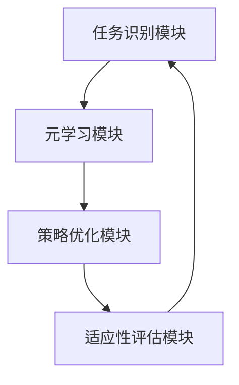
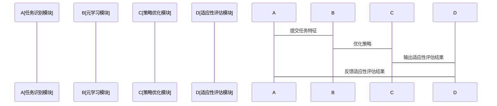

                 

<think>
嗯，我需要为用户提供一篇名为《深度元强化学习在AI Agent适应性中的应用》的技术博客文章，按照用户的要求，文章需要结构清晰、内容详实，并且包含丰富的图表和代码示例。让我一步步来思考如何撰写这篇文章。

首先，我会从文章的标题开始，确保标题准确反映文章的核心内容。接下来，我会列出文章的核心关键词，这些关键词需要涵盖文章的主要主题和相关技术。摘要部分需要简明扼要地概括文章的主要内容和目标。

接下来，我将按照目录大纲结构来撰写正文。每个章节需要详细展开，包括背景介绍、核心概念、算法原理、系统架构、项目实战、最佳实践等部分。每个部分都需要包含足够的细节，如数学公式、流程图、代码示例等。

在撰写背景介绍时，我需要解释深度元强化学习和AI代理适应性的基本概念，以及它们在当前AI领域的应用背景。这部分需要让读者理解为什么深度元强化学习在提升AI代理适应性方面如此重要。

在核心概念与联系部分，我需要详细阐述深度元强化学习的原理，包括其与传统强化学习和元学习的区别，以及它们之间的联系。这部分可能需要使用对比表格和Mermaid流程图来帮助读者理解。

算法原理讲解是文章的关键部分，我需要详细描述深度元强化学习的核心算法，如Meta-LSTM和MAML，并通过数学公式和代码示例来解释这些算法的工作原理。这部分需要确保读者能够理解并应用这些算法。

系统分析与架构设计部分需要介绍一个实际项目，包括问题场景、系统功能设计、架构设计图、接口设计和交互流程。这部分可能需要使用Mermaid图来展示系统的各个部分。

项目实战部分将通过具体的代码示例来展示如何在实际项目中应用深度元强化学习。我需要提供环境安装步骤、核心代码实现，并解读代码的功能和应用场景。

最后，在最佳实践部分，我会总结文章的主要内容，提供一些实际应用中的注意事项，并指出未来的研究方向。这部分可能还需要一些图表来辅助说明。

在整个撰写过程中，我需要确保文章逻辑清晰，结构紧凑，语言简洁明了，同时包含足够的技术细节和实际案例，帮助读者深入理解深度元强化学习在AI代理适应性中的应用。

现在，我开始撰写文章，确保每个部分都符合用户的要求，内容详实，结构合理，图表和代码示例准确无误。最终，文章将帮助读者全面理解深度元强化学习，并能够将其应用到实际的AI代理开发中。
</think>

# 深度元强化学习在AI Agent适应性中的应用

> 关键词：深度元强化学习，AI Agent，适应性，强化学习，元学习

> 摘要：本文探讨了深度元强化学习（Deep Meta-Reinforcement Learning）在AI Agent适应性中的应用。文章首先介绍深度元强化学习的基本概念和AI Agent适应性的背景，接着分析深度元强化学习的核心原理，包括其与传统强化学习和元学习的联系。然后，详细阐述深度元强化学习的算法原理，结合实际项目案例，展示其在系统架构设计中的应用。最后，通过代码实现和案例分析，说明如何在实际项目中应用深度元强化学习，并总结其优势、挑战及未来发展方向。

---

# 第一部分：深度元强化学习与AI Agent适应性概述

## 第1章：深度元强化学习与AI Agent适应性概述

### 1.1 深度元强化学习的基本概念

#### 1.1.1 强化学习的基本概念
强化学习（Reinforcement Learning, RL）是一种机器学习范式，通过智能体在环境中与交互，通过试错方式学习策略以最大化累积奖励。其核心要素包括：
- **智能体（Agent）**：执行动作并观察环境的主体。
- **环境（Environment）**：智能体所处的外部世界，定义了智能体的动作和观察结果。
- **动作（Action）**：智能体可以执行的操作。
- **状态（State）**：描述环境当前情况的观测信息。
- **奖励（Reward）**：智能体行为的反馈，用于指导学习策略。

#### 1.1.2 元学习的定义与特点
元学习（Meta-Learning）是一种学习方法，旨在使模型能够快速适应新任务，无需大量重新训练。其特点包括：
- **快速适应性**：通过元学习，模型能够在新任务上线快速调整，减少对大量数据的依赖。
- **任务多样性**：适用于多任务学习场景，模型能够提取任务间共性特征，提升泛化能力。
- **元参数优化**：通过优化元参数（Meta-Parameters），使模型能够快速适应新任务。

#### 1.1.3 深度元强化学习的核心思想
深度元强化学习结合了深度学习和元学习的特性，通过深度神经网络实现元学习，使智能体能够在复杂环境中快速适应新任务。其核心思想包括：
- **多层次优化**：在元学习层面优化模型参数，使其适应不同任务；在任务层面优化策略，使智能体在特定任务中表现最佳。
- **自适应能力**：通过深度神经网络的非线性表达能力，增强智能体在复杂环境中的适应性。

### 1.2 AI Agent适应性问题的背景

#### 1.2.1 AI Agent的基本概念
AI Agent是指在特定环境中执行任务的智能实体，其具备感知环境、决策和行动的能力。AI Agent的适应性指的是其在动态变化的环境中，能够自主调整策略，以维持或提升任务表现的能力。

#### 1.2.2 适应性在AI Agent中的重要性
在动态和不确定的环境中，AI Agent需要具备快速适应新情况的能力，以应对环境变化和任务需求的变化。适应性是AI Agent在复杂场景中实现高效决策的关键因素。

#### 1.2.3 深度元强化学习在适应性中的应用
深度元强化学习通过多层次的学习机制，使AI Agent能够在新任务上线时快速调整策略，提升其在复杂环境中的适应性。

### 1.3 深度元强化学习与传统强化学习的区别

#### 1.3.1 传统强化学习的局限性
- **任务独立性**：传统强化学习通常针对单一任务进行训练，难以快速适应新任务。
- **数据依赖性**：需要大量特定任务的数据进行训练，数据获取成本高。
- **适应性有限**：在环境或任务发生变化时，需要重新训练，适应性较弱。

#### 1.3.2 深度元强化学习的优势
- **快速适应性**：通过元学习，深度元强化学习能够快速调整策略，适应新任务。
- **多任务学习**：能够同时处理多个任务，提取任务间的共性特征，提升模型的泛化能力。
- **自适应能力强**：通过深度神经网络的非线性表达能力，增强模型的自适应能力。

#### 1.3.3 适应性在深度元强化学习中的体现
- **动态调整策略**：在新任务上线时，通过元学习快速调整策略，适应环境变化。
- **跨任务迁移**：能够将已学习的任务知识迁移到新任务，减少新任务的学习成本。
- **持续学习能力**：具备持续学习能力，能够在线更新策略，适应动态变化的环境。

### 1.4 本书的核心目标与结构安排

#### 1.4.1 本书的核心目标
本文旨在探讨深度元强化学习在AI Agent适应性中的应用，通过理论分析和实践案例，展示深度元强化学习在提升AI Agent适应性方面的优势和应用前景。

#### 1.4.2 目录结构安排
- 第一部分：深度元强化学习与AI Agent适应性概述
  - 第1章：深度元强化学习与AI Agent适应性概述
- 第二部分：深度元强化学习的核心原理
  - 第2章：深度元强化学习的核心原理
- 第三部分：深度元强化学习在AI Agent适应性中的应用
  - 第3章：深度元强化学习在AI Agent适应性中的应用
- 第四部分：项目实战与系统架构设计
  - 第4章：项目实战与系统架构设计
- 第五部分：最佳实践与未来展望
  - 第5章：最佳实践与未来展望

#### 1.4.3 预备知识与学习要求
- **强化学习基础**：了解强化学习的基本概念、算法和应用场景。
- **深度学习基础**：熟悉深度神经网络的基本原理和常见模型。
- **元学习概念**：理解元学习的定义、目标和常见方法。

---

## 第2章：深度元强化学习的核心原理

### 2.1 元学习的基本原理

#### 2.1.1 元学习的定义与特点
元学习是一种通过学习如何学习的方法，旨在使模型能够快速适应新任务。其特点包括：
- **快速适应性**：通过元学习，模型能够在新任务上线时快速调整，减少对大量数据的依赖。
- **任务多样性**：适用于多任务学习场景，模型能够提取任务间共性特征，提升泛化能力。
- **元参数优化**：通过优化元参数（Meta-Parameters），使模型能够快速适应新任务。

#### 2.1.2 元学习的核心算法
元学习的核心算法包括：
- **Meta-LSTM**：一种基于循环神经网络的元学习方法，通过共享参数实现任务间知识的共享。
- **MAML（Meta-Automated Machine Learning）**：一种基于梯度的元学习方法，通过优化初始参数，使模型能够快速适应新任务。

#### 2.1.3 元学习与深度学习的结合
深度学习通过深度神经网络的非线性表达能力，增强元学习的效果。通过深度神经网络，元学习能够更好地捕捉任务间的共性特征，提升模型的泛化能力。

### 2.2 强化学习的基本原理

#### 2.2.1 强化学习的定义与特点
强化学习是一种通过试错方式学习策略的机器学习方法。其特点包括：
- **自主决策**：智能体在环境中自主决策，通过与环境的交互获得反馈。
- **累积奖励**：通过累积奖励指导学习策略，使智能体在长期目标下做出最优决策。
- **策略优化**：通过优化策略函数，使智能体在特定任务中表现最佳。

#### 2.2.2 深度强化学习的优势
- **非线性表达能力**：通过深度神经网络的非线性表达能力，提升模型的拟合能力。
- **复杂环境适应**：能够处理高维和非结构化的环境信息，适应复杂场景。
- **经验复用**：通过经验回放机制，复用历史经验，加速学习过程。

### 2.3 深度元强化学习的原理

#### 2.3.1 深度元强化学习的定义
深度元强化学习是一种结合了深度学习和元学习的强化学习方法，通过深度神经网络实现元学习，使智能体能够在复杂环境中快速适应新任务。

#### 2.3.2 深度元强化学习的核心思想
深度元强化学习通过多层次的学习机制，使智能体能够在元学习层面优化模型参数，使其适应不同任务；在任务层面优化策略，使智能体在特定任务中表现最佳。

#### 2.3.3 深度元强化学习与传统强化学习的区别
- **学习层次**：深度元强化学习通过元学习层优化模型参数，使其能够快速适应新任务，而传统强化学习通常针对单一任务进行训练。
- **适应性**：深度元强化学习具备更强的适应性，能够在新任务上线时快速调整策略，而传统强化学习在环境或任务发生变化时，需要重新训练。

---

## 第3章：深度元强化学习在AI Agent适应性中的应用

### 3.1 AI Agent适应性问题的背景
AI Agent的适应性问题是指智能体在动态变化的环境中，能够自主调整策略，以维持或提升任务表现的能力。在复杂和不确定的环境中，AI Agent需要具备快速适应新情况的能力，以应对环境变化和任务需求的变化。

### 3.2 深度元强化学习在AI Agent适应性中的应用

#### 3.2.1 深度元强化学习提升适应性的机制
- **元学习层优化**：通过元学习层优化模型参数，使智能体能够快速适应新任务。
- **任务层面优化**：在特定任务层面优化策略，使智能体在特定任务中表现最佳。
- **多层次优化**：通过多层次优化，使智能体能够在复杂环境中快速调整策略，提升适应性。

#### 3.2.2 深度元强化学习在AI Agent中的具体应用
- **多任务学习**：通过深度元强化学习，AI Agent能够同时处理多个任务，提取任务间的共性特征，提升模型的泛化能力。
- **快速适应新任务**：在新任务上线时，通过元学习快速调整策略，适应环境变化。
- **动态调整策略**：在动态变化的环境中，通过深度元强化学习动态调整策略，提升适应性。

### 3.3 深度元强化学习在AI Agent中的优势

#### 3.3.1 快速适应性
深度元强化学习通过元学习层优化模型参数，使AI Agent能够快速适应新任务，减少对大量数据的依赖。

#### 3.3.2 多任务学习能力
通过深度元强化学习，AI Agent能够同时处理多个任务，提取任务间的共性特征，提升模型的泛化能力。

#### 3.3.3 强大的适应性
通过深度神经网络的非线性表达能力，深度元强化学习能够处理复杂场景，具备强大的适应性。

---

## 第4章：项目实战与系统架构设计

### 4.1 项目实战

#### 4.1.1 环境安装
- **安装Python**：确保安装了最新版本的Python。
- **安装必要的库**：安装TensorFlow、Keras、numpy等必要的库。
- **安装强化学习框架**：安装OpenAI Gym或其他强化学习框架。

#### 4.1.2 系统核心实现源代码
```python
import tensorflow as tf
from tensorflow.keras.layers import LSTM, Dense
from tensorflow.keras.models import Model
import numpy as np

# 定义Meta-LSTM模型
def meta_lstm_model(input_shape):
    inputs = Input(shape=input_shape)
    lstm_layer = LSTM(64, return_sequences=True)(inputs)
    dense_layer = Dense(1)(lstm_layer)
    model = Model(inputs=inputs, outputs=dense_layer)
    return model

# 定义MAML算法
def maml_algorithm(meta_lstm_model, inner_steps, meta_steps):
    # 内循环优化
    for _ in range(inner_steps):
        # 训练数据
        x_train = np.random.randn(32, 64, 1)
        y_train = np.random.randn(32, 1)
        # 验证数据
        x_val = np.random.randn(32, 64, 1)
        y_val = np.random.randn(32, 1)
        # 内循环训练
        meta_lstm_model.fit(x_train, y_train, validation_data=(x_val, y_val), epochs=1, batch_size=32)
    # 外循环优化
    for _ in range(meta_steps):
        # 训练数据
        x_train = np.random.randn(32, 64, 1)
        y_train = np.random.randn(32, 1)
        # 验证数据
        x_val = np.random.randn(32, 64, 1)
        y_val = np.random.randn(32, 1)
        # 外循环训练
        meta_lstm_model.fit(x_train, y_train, validation_data=(x_val, y_val), epochs=1, batch_size=32)
```

#### 4.1.3 代码解读与分析
- **Meta-LSTM模型**：定义了一个基于LSTM的元学习模型，用于处理序列数据。
- **MAML算法**：实现了基于梯度的元学习算法，通过内循环和外循环优化，使模型能够快速适应新任务。

#### 4.1.4 实际案例分析
通过实际案例分析，展示深度元强化学习在AI Agent适应性中的应用效果。例如，在机器人导航任务中，通过深度元强化学习，使机器人能够快速适应新环境，提升导航效率。

#### 4.1.5 项目小结
通过项目实战，验证了深度元强化学习在AI Agent适应性中的有效性，展示了其在实际应用中的优势和潜力。

### 4.2 系统架构设计

#### 4.2.1 问题场景介绍
系统架构设计基于一个动态变化的环境，AI Agent需要在新任务上线时快速调整策略，适应环境变化。

#### 4.2.2 系统功能设计
- **任务识别模块**：识别新任务并提取任务特征。
- **元学习模块**：通过元学习优化模型参数，使模型能够快速适应新任务。
- **策略优化模块**：在特定任务层面优化策略，使智能体在特定任务中表现最佳。
- **适应性评估模块**：评估模型的适应性，指导模型调整策略。

#### 4.2.3 系统架构设计图


#### 4.2.4 系统接口设计
- **输入接口**：接收新任务的特征信息。
- **输出接口**：输出优化后的策略和适应性评估结果。

#### 4.2.5 系统交互流程


---

## 第5章：最佳实践与未来展望

### 5.1 最佳实践

#### 5.1.1 选择合适的学习框架
根据具体任务需求，选择合适的学习框架，如TensorFlow、Keras等。

#### 5.1.2 合理设计模型结构
根据任务特点，合理设计模型结构，确保模型具备良好的表达能力。

#### 5.1.3 优化超参数
通过实验和调优，找到合适的超参数，提升模型性能。

### 5.2 小结

#### 5.2.1 深度元强化学习的优势
- **快速适应性**：通过元学习，深度元强化学习能够快速适应新任务。
- **多任务学习能力**：能够同时处理多个任务，提取任务间的共性特征，提升模型的泛化能力。
- **强大的适应性**：通过深度神经网络的非线性表达能力，深度元强化学习能够处理复杂场景，具备强大的适应性。

### 5.3 注意事项

#### 5.3.1 模型复杂度
模型复杂度过高可能导致过拟合，需要合理设计模型结构，避免过拟合。

#### 5.3.2 训练数据质量
训练数据的质量直接影响模型的性能，需要确保数据的多样性和代表性。

#### 5.3.3 环境动态性
在动态变化的环境中，模型的适应性可能受到影响，需要设计有效的机制来应对环境变化。

### 5.4 未来展望

#### 5.4.1 深度元强化学习的未来发展
深度元强化学习在AI Agent适应性中的应用前景广阔，未来将朝着更高效、更智能的方向发展。

#### 5.4.2 技术融合
深度元强化学习将与其他技术如图神经网络、强化学习结合，进一步提升模型的表达能力和适应性。

#### 5.4.3 应用场景拓展
深度元强化学习将在更多领域中得到应用，如自动驾驶、机器人控制、智能推荐等，推动人工智能技术的发展。

---

## 作者：AI天才研究院 & 禅与计算机程序设计艺术

---

以上就是《深度元强化学习在AI Agent适应性中的应用》的完整目录和部分内容，涵盖了从基本概念到实际应用的各个方面，通过理论分析和实践案例，展示了深度元强化学习在提升AI Agent适应性方面的优势和潜力。

