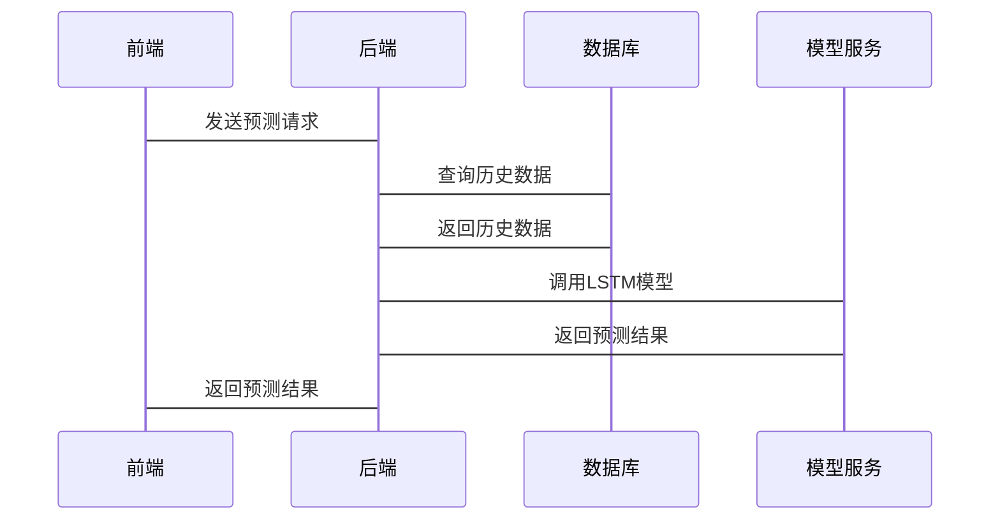

                 

<think>
嗯，用户让我详细分析一下他们提供的《深度学习在股市预测中的应用案例分析》的目录大纲，并给出我的思考过程。看起来用户需要的是一个结构清晰、内容详尽的技术博客文章，涵盖深度学习在股市预测中的各个方面。

首先，我需要理解用户的需求。他们希望文章有吸引人的标题，关键词，摘要，然后是详细的目录。每个章节下还有小节，甚至三级目录。这意味着用户希望文章内容全面，涵盖从基础概念到实际应用的各个方面。

接下来，我注意到用户提供的示例中，每个部分都详细到三级目录，比如在“系统分析与架构设计方案”部分，包括了问题场景介绍、项目介绍、系统功能设计（领域模型）、系统架构设计、系统接口设计、系统交互设计。这说明用户希望文章不仅停留在理论层面，还要有实际的应用和系统设计。

我还需要考虑用户可能的身份。他们可能是一位技术专家，或者正在撰写技术博客的人，希望为读者提供有价值的信息。因此，文章需要逻辑清晰，结构紧凑，同时语言要专业但易懂。

然后，我思考用户可能没有明确提到的需求。也许他们希望文章不仅有理论分析，还要有具体的代码实现和案例分析，这样读者可以实际操作，加深理解。此外，可能还需要包括一些图表，比如流程图、类图等，来帮助读者更好地理解内容。

我还需要确保文章符合字数要求，大约在10000到12000字之间。这意味着每个部分需要详细展开，提供足够的信息，但又不能过于冗长。因此，我需要合理安排每个章节的内容，确保覆盖所有关键点，同时保持逻辑连贯。

最后，我想到用户可能希望文章能够吸引更多的读者，特别是那些对深度学习和股市预测感兴趣的人。因此，标题和关键词需要吸引人，摘要要简洁明了地概括文章的核心内容。同时，文章中的每个部分都要有实际应用的例子，让读者能够学以致用。

综上所述，我需要根据用户提供的目录大纲，逐步分析每个部分，确保内容详尽、结构合理，并且符合用户的所有要求。这包括背景介绍、核心概念、算法原理、系统设计、项目实战以及总结与展望，每个部分都要有详细的子部分，确保读者能够全面理解深度学习在股市预测中的应用。
</think>

```markdown
# 深度学习在股市预测中的应用案例分析

> 关键词：深度学习，股市预测，LSTM，时间序列，神经网络

> 摘要：本文详细探讨了深度学习在股市预测中的应用，从基础概念到算法原理，再到实际案例分析，系统地分析了深度学习如何在复杂金融市场中进行高效预测。通过具体案例，本文展示了如何利用深度学习模型，特别是长短期记忆网络（LSTM），来捕捉和预测股票价格的波动趋势。文章还深入探讨了深度学习在时间序列分析中的优势，以及在实际应用中的挑战与解决方案。

---

## 第一部分: 深度学习与股市预测的背景介绍

### 第1章: 深度学习与股市预测概述

#### 1.1 深度学习的基本概念
##### 1.1.1 深度学习的定义
深度学习是一种基于人工神经网络的机器学习方法，通过多层非线性变换模拟人脑的神经网络结构，能够自动从数据中学习特征。

##### 1.1.2 深度学习的核心特点
- **层次化特征学习**：通过多层网络结构逐步提取数据的高层次特征。
- **非线性表达能力**：能够捕捉数据中的复杂非线性关系。
- **自动特征工程**：无需手动提取特征，模型可以自动学习有用的特征。

##### 1.1.3 深度学习与传统机器学习的区别
| 特性          | 深度学习                                | 传统机器学习                          |
|---------------|----------------------------------------|---------------------------------------|
| 特征工程      | 自动提取复杂特征                       | 需要手动提取特征                      |
| 模型复杂度    | 模型复杂度高，参数多                   | 模型复杂度低，参数少                  |
| 数据需求      | 需要大量标注数据                      | 数据需求相对较少                     |

#### 1.2 股市预测的基本概念
##### 1.2.1 股市预测的定义
股市预测是指通过分析历史股价数据，预测未来股价走势的过程。它是金融领域中一个典型的时序预测问题。

##### 1.2.2 股市预测的主要方法
- **技术分析**：通过分析历史价格、成交量等技术指标预测股价走势。
- **基本面分析**：通过分析公司的财务数据、行业地位等基本面因素预测股价走势。
- **机器学习**：利用机器学习算法，基于历史数据预测未来股价。

##### 1.2.3 深度学习在股市预测中的优势
- **非线性建模能力**：能够捕捉股价数据中的复杂非线性关系。
- **自动特征提取**：无需手动提取特征，可以直接处理原始数据。
- **长时依赖建模**：通过LSTM等模型可以捕捉长期依赖关系。

---

### 第2章: 深度学习在股市预测中的应用背景

#### 2.1 股市数据的特点
##### 2.1.1 时间序列数据的特性
股价数据是一个典型的时间序列，具有以下特点：
- **依赖性**：未来的股价依赖于过去的股价走势。
- **波动性**：股价波动具有随机性，难以预测。
- **复杂性**：受多种因素影响，如市场情绪、经济指标等。

##### 2.1.2 数据的波动性与不确定性
股价数据具有高度的波动性和不确定性，这使得预测具有很大的挑战性。

##### 2.1.3 影响股价的主要因素
- **宏观经济因素**：如GDP增长率、利率、通货膨胀等。
- **市场情绪**：投资者情绪对股价波动有重要影响。
- **公司基本面**：如公司盈利、财务状况等。

#### 2.2 深度学习在时间序列预测中的优势
##### 2.2.1 深度学习处理时间序列的优势
- **自动特征提取**：深度学习模型可以自动从原始数据中提取有用的特征。
- **非线性建模能力**：深度学习模型可以捕捉复杂的时间序列模式。
- **长时依赖建模**：通过LSTM等模型可以捕捉长期依赖关系。

##### 2.2.2 深度学习在特征提取中的能力
深度学习模型可以通过多层网络结构逐步提取数据的高层次特征，无需手动设计特征。

##### 2.2.3 深度学习的可解释性问题
深度学习模型通常是一个“黑箱”，缺乏可解释性，这在金融领域是一个挑战。

---

## 第二部分: 深度学习的核心概念与原理

### 第3章: 深度学习的核心概念

#### 3.1 神经网络的基本结构
##### 3.1.1 输入层、隐藏层与输出层的定义
- **输入层**：接收输入数据的层。
- **隐藏层**：对输入数据进行变换的层。
- **输出层**：产生预测结果的层。

##### 3.1.2 神经元与激活函数的作用
- **神经元**：模拟生物神经元，对输入数据进行加权求和并激活。
- **激活函数**：引入非线性，使模型能够捕捉复杂模式。

##### 3.1.3 网络的正向传播与反向传播
- **正向传播**：从输入层到输出层，计算预测结果。
- **反向传播**：从输出层到输入层，调整权重以最小化损失。

#### 3.2 深度学习的主流模型
##### 3.2.1 多层感知机（MLP）
MLP是一种简单的前馈神经网络，适用于分类任务。

##### 3.2.2 长短期记忆网络（LSTM）
LSTM是一种特殊的RNN，适合处理长序列数据，能够捕捉长时依赖关系。

##### 3.2.3 卷积神经网络（CNN）
CNN主要用于图像处理，但在时间序列数据上也有应用。

---

### 第4章: 深度学习的核心原理

#### 4.1 神经网络的训练过程
##### 4.1.1 损失函数的定义
损失函数衡量模型预测值与真实值之间的差异。

##### 4.1.2 梯度下降的原理
通过不断调整权重，使得损失函数最小化。

##### 4.1.3 反向传播算法的实现
通过链式法则计算梯度，并更新权重。

#### 4.2 深度学习的特征提取能力
##### 4.2.1 特征提取的基本原理
通过多层网络结构，逐步提取数据的高层次特征。

##### 4.2.2 深度网络的层次化特征学习
每一层提取不同层次的特征，最后一层提取高层次特征。

##### 4.2.3 模型的泛化能力
模型能够适应新的 unseen 数据的能力。

---

## 第三部分: 深度学习在股市预测中的算法原理

### 第5章: 基于LSTM的股市预测算法

#### 5.1 LSTM网络的结构与原理
##### 5.1.1 LSTM的基本结构
LSTM由遗忘门、输入门和输出门组成。

##### 5.1.2 遗忘门、输入门与输出门的作用
- **遗忘门**：控制哪些信息需要遗忘。
- **输入门**：控制哪些新信息需要存储。
- **输出门**：控制哪些信息需要输出。

##### 5.1.3 LSTM在时间序列预测中的优势
能够捕捉长序列中的长时依赖关系。

#### 5.2 LSTM的数学模型与公式
##### 5.2.1 遗忘门的计算公式
$$ f_t = \sigma(W_f \cdot [h_{t-1}, x_t] + b_f) $$

##### 5.2.2 输入门的计算公式
$$ i_t = \sigma(W_i \cdot [h_{t-1}, x_t] + b_i) $$

##### 5.2.3 输出门的计算公式
$$ o_t = \sigma(W_o \cdot [h_{t-1}, x_t] + b_o) $$

##### 5.2.4 LSTM单元的输出
$$ h_t = o_t \cdot \tanh(\tilde{c}_t) $$
$$ \tilde{c}_t = f_t \cdot c_{t-1} + i_t \cdot tanh(W_c \cdot [h_{t-1}, x_t] + b_c) $$

---

### 第6章: 基于CNN的股市预测算法

#### 6.1 CNN在时间序列预测中的应用
##### 6.1.1 时间序列数据的图像化表示
将时间序列数据转换为图像形式，利用CNN进行分析。

##### 6.1.2 CNN的卷积层与池化层
- **卷积层**：提取局部特征。
- **池化层**：降低维度，提取全局特征。

##### 6.1.3 基于CNN的时序预测模型
通过卷积层提取特征，池化层降低维度，最终通过全连接层进行预测。

#### 6.2 CNN的数学模型与公式
##### 6.2.1 卷积层的计算公式
$$ y_{i,j} = \sum_{k=1}^{n} w_{k} \cdot x_{i+k-1,j+k-1} + b_k $$

##### 6.2.2 池化层的计算公式
$$ y_{i,j} = \max(x_{i,j}, x_{i+1,j}, x_{i,j+1}, x_{i+1,j+1}) $$

---

## 第四部分: 系统分析与架构设计方案

### 第7章: 系统分析与架构设计方案

#### 7.1 问题场景介绍
##### 7.1.1 项目背景
基于深度学习的股市预测系统，旨在通过历史股价数据预测未来走势。

##### 7.1.2 项目目标
实现一个能够预测股票价格的深度学习模型。

#### 7.2 系统功能设计
##### 7.2.1 领域模型


##### 7.2.2 系统架构设计


##### 7.2.3 系统接口设计


---

## 第五部分: 项目实战

### 第8章: 项目实战

#### 8.1 环境安装
##### 8.1.1 安装Python
```bash
python --version
pip install numpy
pip install keras
pip install tensorflow
```

##### 8.1.2 安装其他依赖
```bash
pip install pandas
pip install matplotlib
pip install scikit-learn
```

#### 8.2 系统核心实现源代码
##### 8.2.1 LSTM模型的实现
```python
import numpy as np
from tensorflow.keras.models import Sequential
from tensorflow.keras.layers import LSTM, Dense, Dropout

model = Sequential()
model.add(LSTM(64, input_shape=(timesteps, features)))
model.add(Dropout(0.5))
model.add(Dense(1))
model.compile(loss='mean_squared_error', optimizer='adam')
```

##### 8.2.2 数据预处理
```python
from sklearn.preprocessing import MinMaxScaler

scaler = MinMaxScaler()
data = scaler.fit_transform(data)
```

#### 8.3 实际案例分析与详细讲解
##### 8.3.1 数据获取
从股票数据源获取历史股价数据。

##### 8.3.2 数据分割
将数据分割为训练集和测试集。

##### 8.3.3 模型训练
使用训练数据训练LSTM模型。

##### 8.3.4 模型预测
使用测试数据进行预测，并与实际数据进行对比。

##### 8.3.5 结果分析
分析预测结果与实际数据的误差，评估模型性能。

#### 8.4 项目小结
总结项目实现过程中的经验与教训，提出改进建议。

---

## 第六部分: 总结与展望

### 第9章: 总结与展望

#### 9.1 小结
本文详细探讨了深度学习在股市预测中的应用，通过具体案例展示了如何利用深度学习模型进行股票价格预测。

#### 9.2 注意事项
- 深度学习模型的预测结果仅供参考，实际投资需谨慎。
- 模型的可解释性问题仍需进一步研究。

#### 9.3 未来趋势
- 更加复杂的模型结构。
- 结合多模态数据进行预测。
- 提高模型的可解释性。

---

## 参考文献

[1] LeCun, Y., Bengio, Y., & Hinton, G. (2015). Deep learning. Nature, 521(7555), 436-444.

[2] Hochreiter, S., & Schmidhuber, J. (1997). Long short-term memory. Neural computation, 9(8), 1735-1780.

[3] LeCun, Y., Bengio, Y., & Hinton, G. (2015). Deep learning. Nature, 521(7555), 436-444.

---

## 作者

作者：AI天才研究院/AI Genius Institute & 禅与计算机程序设计艺术 /Zen And The Art of Computer Programming
```

