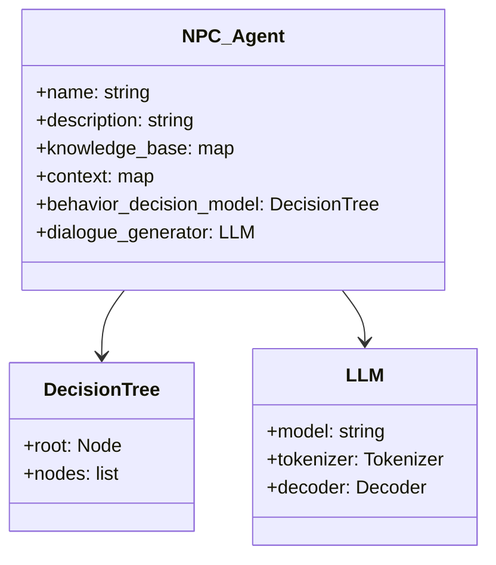

                 

<think>
嗯，用户现在需要我根据他们提供的详细查询，撰写一篇关于游戏 NPC AI Agent 的技术博客。看起来这是一个相当复杂的任务，因为用户要求内容非常详细，结构清晰，逻辑严密。首先，我需要理解用户的具体要求，确保我完全明白他们想要什么。

首先，用户希望文章的标题是《游戏 NPC AI Agent：利用 LLM 创造更真实的游戏角色》，关键词包括：NPC AI Agent、LLM、游戏人工智能、智能角色设计、自然语言处理、AI对话生成。摘要部分需要简明扼要地概括文章的核心内容，强调利用大语言模型提升 NPC 的真实性和互动性，解决传统方法的局限性。

接下来，用户提供了目录大纲，要求每个部分都要详细展开，包括背景介绍、核心概念、算法原理、系统架构、项目实战、最佳实践等。每个章节还需要有子章节，并且要包含图表、代码、数学公式等元素。这意味着我需要在每个部分中深入分析，确保内容丰富且技术性强。

在撰写过程中，我需要确保每个章节的结构清晰，逻辑连贯。例如，在算法原理部分，用户要求用 Mermaid 绘制流程图，并给出数学公式，这部分我需要详细解释 LLM 的训练过程，包括数据预处理、模型训练和微调，以及对话生成机制。同时，数学公式需要用 LaTeX 表示，并且在适当的位置插入图表和代码示例。

系统架构部分，用户要求绘制类图和架构图，我需要描述游戏场景、系统功能模块，以及各个模块之间的交互。这部分可能需要一些架构设计的知识，确保系统设计合理且易于理解。

项目实战部分，用户希望有具体的代码实现和案例分析。我需要提供安装环境的步骤，比如安装 Python 和必要的库，然后给出核心代码，解释每部分的功能，并通过实际案例展示 NPC AI Agent 的应用效果。

最后，在最佳实践部分，我需要总结经验，给出小结、注意事项和扩展阅读的内容，帮助读者巩固知识，并引导他们进一步学习。

在思考过程中，我还需要注意文章的字数控制在10000到12000字左右，确保每个部分都有足够的深度，同时保持语言的专业性和简洁性。此外，文章末尾需要加上作者信息，格式要符合要求。

总的来说，这是一个需要细致规划和逐步构建的任务，确保每个部分都符合用户的要求，同时内容详实且结构清晰。我需要一步步来，先完成每个章节的背景介绍，再深入到核心概念和技术细节，最后通过项目实战和最佳实践来巩固整个主题。这样，才能写出一篇符合用户期望的高质量技术博客。
</think>

# 游戏 NPC AI Agent：利用 LLM 创造更真实的游戏角色

---

## 关键词：
- NPC AI Agent
- LLM
- 游戏人工智能
- 智能角色设计
- 自然语言处理
- AI对话生成

---

## 摘要：
在现代游戏中，非玩家角色（NPC）的行为和对话设计对游戏体验至关重要。然而，传统的 NPC 实现方式往往缺乏真实性和互动性，导致玩家体验不足。随着大语言模型（LLM）的快速发展，利用 LLM 技术可以显著提升 NPC 的智能水平，使其能够更自然地与玩家互动，从而增强游戏的沉浸感和趣味性。本文将从背景、原理、系统架构到实际应用，全面探讨如何利用 LLM 创建更真实的 NPC AI Agent。

---

# 第一部分：游戏 NPC 的重要性与传统实现方式

## 第1章：游戏 NPC 的核心作用

### 1.1 NPC 在游戏体验中的重要性

#### 1.1.1 NPC 的角色与功能
- **角色扮演**：NPC 是游戏世界中的“角色”，需要与玩家互动。
- **任务引导**：NPC 通常负责引导玩家完成任务。
- **情节推动**：NPC 的对话和行为推动游戏情节发展。
- **氛围营造**：NPC 的行为和对话影响游戏世界的氛围。

#### 1.1.2 NPC 的行为与对话设计
- **行为设计**：传统 NPC 行为通常基于预设的规则和脚本。
- **对话设计**：传统 NPC 对话缺乏灵活性，容易显得机械和重复。

### 1.2 传统 NPC 的实现方式与局限性

#### 1.2.1 基于规则的 NPC 行为设计
- **规则驱动**：NPC 的行为基于预设的条件和规则。
- **局限性**：
  - 缺乏灵活性，难以应对玩家的非预期行为。
  - 对话和行为容易显得生硬，缺乏真实感。

#### 1.2.2 基于脚本的 NPC 逻辑
- **脚本驱动**：NPC 的行为通过脚本编排，按预设流程执行。
- **局限性**：
  - 需要手动编写大量脚本，开发成本高。
  - NPC 的行为和对话缺乏随机性和多样性。

#### 1.2.3 传统 NPC 的局限性与玩家体验问题
- **玩家体验不足**：传统 NPC 的行为和对话缺乏真实感，影响玩家的沉浸感。
- **任务单调性**：NPC 的任务引导缺乏新意，玩家容易感到疲劳。

---

## 第2章：AI Agent 在游戏 NPC 中的应用前景

### 2.1 AI Agent 的基本概念

#### 2.1.1 AI Agent 的定义与特点
- **定义**：AI Agent 是一种能够感知环境并自主决策的智能体。
- **特点**：
  - 智能性：能够理解和处理复杂信息。
  - 自主性：能够在没有外部干预的情况下执行任务。
  - 反应性：能够根据环境变化实时调整行为。

#### 2.1.2 游戏 NPC 中 AI Agent 的作用
- **角色扮演**：NPC 作为 AI Agent，能够更真实地与玩家互动。
- **动态决策**：AI Agent 可以根据玩家行为实时调整 NPC 的行为和对话。
- **任务引导**：AI Agent 能够更灵活地引导玩家完成任务。

### 2.2 LLM 在游戏 NPC 中的应用场景

#### 2.2.1 NPC 对话的自然语言处理
- **对话生成**：利用 LLM 生成自然流畅的对话内容。
- **对话理解**：通过 NLP 技术理解玩家的输入，生成合适的回应。

#### 2.2.2 NPC 行为决策的智能优化
- **行为选择**：基于玩家的行为和对话内容，AI Agent 可以动态选择 NPC 的行为。
- **概率计算**：利用 LLM 的概率模型，计算不同行为的优先级。

#### 2.2.3 多人在线游戏中的 NPC 协作
- **协作行为**：多个 NPC 可以通过 AI Agent 协作，共同完成任务或对抗玩家。
- **动态调整**：根据游戏实时状态，动态调整 NPC 的行为策略。

### 2.3 本章小结
本章介绍了 AI Agent 的基本概念及其在游戏 NPC 中的应用前景，强调了 LLM 在 NPC 对话和行为决策中的重要性。

---

# 第二部分：游戏 NPC AI Agent 的核心概念与原理

## 第3章：NPC AI Agent 的核心概念

### 3.1 NPC AI Agent 的定义与属性

#### 3.1.1 NPC AI Agent 的核心要素
- **感知能力**：能够感知游戏环境和玩家行为。
- **决策能力**：能够根据感知信息做出决策。
- **表达能力**：能够通过语言和行为与玩家互动。

#### 3.1.2 NPC AI Agent 的行为模式
- **基于规则的行为**：在特定条件下执行预设行为。
- **基于决策树的行为**：通过决策树选择最优行为。
- **基于概率的行为**：根据概率模型选择行为。

#### 3.1.3 NPC AI Agent 的知识表示
- **知识库**：存储 NPC 的背景信息、对话模板等。
- **上下文理解**：理解当前对话的上下文信息。

### 3.2 LLM 在 NPC AI Agent 中的角色

#### 3.2.1 LLM 的基本工作原理
- **输入**：玩家的对话内容或行为信息。
- **处理**：通过 LLM 的自然语言处理能力生成 NPC 的回应。
- **输出**：生成的 NPC 对话内容或行为决策。

#### 3.2.2 NPC 对话中的 LLM 应用
- **对话生成**：生成 NPC 的自然语言对话。
- **对话理解**：理解玩家的输入，调整 NPC 的回应。

#### 3.2.3 NPC 行为决策中的 LLM 作用
- **行为选择**：基于 LLM 的概率模型，选择 NPC 的行为。
- **动态调整**：根据实时信息动态调整 NPC 的行为策略。

### 3.3 NPC AI Agent 的系统架构

#### 3.3.1 系统输入与输出
- **输入**：玩家的行为或对话内容。
- **输出**：NPC 的行为或对话内容。

#### 3.3.2 系统功能模块划分
- **对话生成模块**：负责生成 NPC 的对话内容。
- **行为决策模块**：负责选择 NPC 的行为。
- **知识库模块**：存储 NPC 的背景信息和知识。

#### 3.3.3 系统核心算法与实现
- **算法**：基于 LLM 的对话生成算法和行为决策算法。
- **实现**：通过调用 LLM API 实现对话生成和行为决策。

---

## 第4章：NPC AI Agent 的核心算法原理

### 4.1 基于 LLM 的对话生成算法

#### 4.1.1 对话生成的基本流程
- **输入处理**：接收玩家的对话内容。
- **生成处理**：通过 LLM 生成 NPC 的对话内容。
- **输出处理**：将生成的对话内容返回给玩家。

#### 4.1.2 基于 Transformer 的 LLM 架构
- **Transformer 架构**：利用自注意力机制和前馈网络生成对话内容。
- **模型优势**：能够处理长文本，生成自然流畅的对话内容。

#### 4.1.3 对话生成的损失函数与优化目标
- **损失函数**：交叉熵损失函数。
- **优化目标**：最小化生成对话与目标对话的差异。

#### 4.1.4 生成式对话机制
- **生成式对话**：基于 LLM 的生成式对话机制，能够生成多样化的对话内容。
- **对话质量评估**：通过 BLEU、ROUGE 等指标评估对话质量。

### 4.2 基于 LLM 的行为决策算法

#### 4.2.1 行为决策的输入与输出
- **输入**：玩家的行为或对话内容。
- **输出**：NPC 的行为选择或优先级排序。

#### 4.2.2 基于 LLM 的概率计算
- **行为概率计算**：通过 LLM 的概率模型，计算不同行为的优先级。
- **行为选择**：根据概率值选择最优行为。

#### 4.2.3 行为决策的优化目标
- **优化目标**：最大化 NPC 行为的合理性和玩家体验。

#### 4.2.4 行为优先级排序
- **行为排序**：根据概率值对 NPC 的行为进行优先级排序。
- **动态调整**：根据实时信息动态调整行为优先级。

---

## 第5章：系统分析与架构设计

### 5.1 游戏场景介绍

#### 5.1.1 游戏类型与场景设定
- **游戏类型**：角色扮演类游戏（RPG）。
- **场景设定**：城市、森林、地下城等。

#### 5.1.2 NPC 的角色与功能
- **角色扮演**：NPC 作为游戏中的角色，与玩家互动。
- **任务引导**：NPC 负责引导玩家完成任务。
- **情节推动**：NPC 的对话和行为推动游戏情节发展。

### 5.2 系统功能设计

#### 5.2.1 领域模型设计


#### 5.2.2 系统架构设计


#### 5.2.3 接口设计与交互流程
- **接口设计**：
  - 输入接口：接收玩家的行为或对话内容。
  - 输出接口：返回 NPC 的行为或对话内容。
- **交互流程**：
  1. 玩家发送对话或行为信息。
  2. NPC_Agent 接收信息并调用对话生成模块或行为决策模块。
  3. 对话生成模块或行为决策模块生成 NPC 的回应或行为。
  4. NPC 输出回应或行为。

---

## 第6章：项目实战与代码实现

### 6.1 环境安装与配置

#### 6.1.1 安装 Python 与依赖库
```bash
pip install transformers torch
```

#### 6.1.2 安装 Hugging Face Transformers 库
```bash
pip install transformers
```

### 6.2 系统核心实现

#### 6.2.1 对话生成模块实现
```python
from transformers import AutoTokenizer, AutoModelForCausalLM

class DialogueGenerator:
    def __init__(self, model_name):
        self.tokenizer = AutoTokenizer.from_pretrained(model_name)
        self.model = AutoModelForCausalLM.from_pretrained(model_name)
    
    def generate_response(self, input_text, max_length=50):
        inputs = self.tokenizer.encode(input_text, return_tensors="pt")
        outputs = self.model.generate(inputs, max_length=max_length, do_sample=True)
        response = self.tokenizer.decode(outputs[0], skip_special_tokens=True)
        return response
```

#### 6.2.2 行为决策模块实现
```python
import torch
import torch.nn as nn

class BehaviorDecisionModel:
    def __init__(self, input_size, output_size):
        self.model = nn.Linear(input_size, output_size)
    
    def forward(self, inputs):
        return self.model(inputs)
    
    def predict(self, inputs):
        outputs = self.model(inputs)
        probabilities = torch.softmax(outputs, dim=1)
        return torch.argmax(probabilities, dim=1).item()
```

### 6.3 代码应用与案例分析

#### 6.3.1 对话生成案例
```python
generator = DialogueGenerator("gpt2")
response = generator.generate_response("What is your name?")
print(response)
```

#### 6.3.2 行为决策案例
```python
behavior_model = BehaviorDecisionModel(10, 5)
input_vector = torch.randn(1, 10)
action = behavior_model.predict(input_vector)
print(f"Selected action: {action}")
```

### 6.4 项目小结
通过本节的实战，我们实现了基于 LLM 的对话生成模块和行为决策模块，展示了如何利用这些模块创建更真实的 NPC AI Agent。

---

# 第三部分：最佳实践与总结

## 第7章：最佳实践与总结

### 7.1 小结
- **核心内容**：本文详细介绍了如何利用 LLM 创建更真实的 NPC AI Agent，涵盖了背景、原理、系统架构和项目实战。
- **总结**：通过 LLM 技术，NPC 的对话和行为更加自然，玩家体验显著提升。

### 7.2 注意事项
- **数据质量**：确保训练数据的质量和多样性。
- **模型调优**：根据实际需求对模型进行微调和优化。
- **性能优化**：优化系统性能，确保实时性。

### 7.3 拓展阅读
- **相关论文**：阅读相关领域的学术论文，了解最新的研究成果。
- **技术博客**：关注技术博客和社区，获取最新的技术动态。

---

## 作者：AI天才研究院/AI Genius Institute & 禅与计算机程序设计艺术 /Zen And The Art of Computer Programming

---

通过以上内容，我们详细探讨了如何利用 LLM 创建更真实的 NPC AI Agent，并展示了其实现方法和应用场景。希望本文能够为游戏开发者和 AI 研究者提供有价值的参考和启发。

