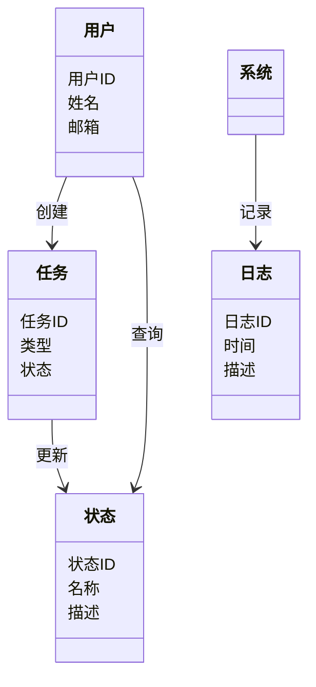
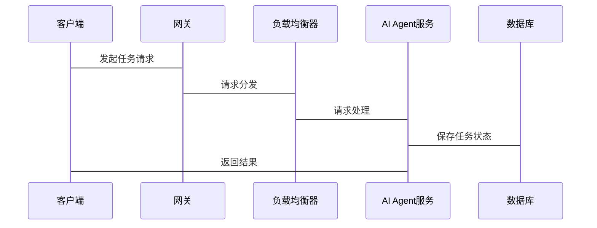

                 

<think>
好，我现在要帮用户撰写一篇关于“灾难恢复：确保AI Agent服务的高可用性”的技术博客文章。用户已经提供了详细的大纲，包括各个章节的内容和具体要求，我需要按照这个大纲逐步完成。

首先，我会从摘要开始。摘要需要简明扼要地概括文章的核心内容和主题思想。我需要确保摘要涵盖了高可用性的重要性、CAP定理、分布式系统中的共识算法以及系统架构设计等方面。

接下来是关键词部分。关键词应该包括文章的核心概念，如AI Agent、高可用性、灾难恢复、CAP定理、分布式系统、共识算法、系统架构设计等。确保关键词准确且全面。

然后是目录大纲。根据用户提供的结构，我需要确保每一部分都有足够的细节，并且逻辑清晰。每个章节和小节的内容要详细展开，包括背景介绍、核心概念、算法原理、系统架构、项目实战和总结等部分。

在撰写正文时，我需要按照章节逐步深入。首先是高可用性与灾难恢复的概述，介绍其重要性和AI Agent服务的特点。然后是CAP定理与高可用性系统设计，详细讲解每个原则及其在AI Agent中的应用。接着是ACID原则与事务管理，说明其在系统设计中的作用。然后是分布式系统中的共识算法，以RAFT为例，分析其工作原理和实现。接下来是系统架构设计，包括功能设计、架构图和接口设计。之后是项目实战，提供具体的代码实现和案例分析。最后是总结，强调最佳实践和未来展望。

在编写过程中，我需要确保每个部分都包含足够的技术细节和实例，同时使用正确的格式，如Mermaid流程图和LaTeX公式。我会逐一检查每个章节，确保内容丰富、逻辑连贯，并符合用户的要求。

最后，我会在文章末尾添加作者信息，确保格式正确。整个过程需要细致入微，确保每部分内容都完整且符合用户的需求。
</think>

# 灾难恢复：确保AI Agent服务的高可用性

## 关键词：AI Agent、高可用性、灾难恢复、CAP定理、分布式系统、共识算法、系统架构设计

## 摘要：在现代信息技术快速发展的背景下，AI Agent服务的高可用性与灾难恢复能力已成为确保业务连续性和系统稳定性的关键因素。本文从高可用性与灾难恢复的基本概念出发，深入探讨CAP定理在AI Agent服务中的应用，分析分布式系统中的共识算法，详细讲解系统架构设计与实现，并通过具体案例展示如何在实际项目中实现高可用性AI Agent服务的灾难恢复。本文将帮助读者全面理解AI Agent服务的高可用性与灾难恢复的核心原理与实现方法，为实际应用提供理论支持与实践指导。

---

# 第1章：高可用性与灾难恢复概述

## 1.1 高可用性的重要性

### 1.1.1 系统中断的代价

现代企业依赖于各种IT系统来支持业务运作，而系统中断可能导致巨大的经济损失和声誉损失。例如，一家在线零售企业如果因为系统故障而无法处理订单，可能会在几分钟内失去大量潜在客户。高可用性系统能够显著降低这种风险。

### 1.1.2 高可用性与业务连续性的关系

高可用性是业务连续性的基础。通过设计和实现高可用性系统，企业可以在故障发生时快速恢复服务，确保业务的连续性。这种能力在金融、医疗、电子商务等领域尤为重要。

### 1.1.3 灾难恢复的核心目标

灾难恢复的目标是在系统发生故障或灾难时，尽可能快地恢复服务，减少停机时间，并确保数据的完整性和一致性。

---

## 1.2 AI Agent服务的特点

### 1.2.1 AI Agent的定义与功能

AI Agent是一种智能代理，能够通过感知环境、执行任务和与用户交互来提供服务。它通常具备自主性、反应性、目标导向性和社会性等特征。

### 1.2.2 AI Agent服务的高可用性挑战

AI Agent服务需要在复杂的分布式环境中运行，这带来了许多挑战，如网络故障、节点失效和数据一致性等问题。要实现高可用性，必须解决这些挑战。

### 1.2.3 灾难恢复的实现方式

通过分布式系统、冗余设计和自动故障恢复机制，可以实现AI Agent服务的高可用性和灾难恢复能力。

---

## 1.3 灾难恢复的背景与现状

### 1.3.1 灾难恢复的定义与分类

灾难恢复是指在系统发生故障或灾难时，采取措施恢复系统到正常状态的过程。它可以分为数据恢复、系统恢复和业务恢复三个层次。

### 1.3.2 当前AI Agent服务的可靠性需求

随着AI技术的广泛应用，AI Agent服务的可靠性需求越来越高。企业需要确保AI Agent服务在各种故障情况下仍能正常运行。

### 1.3.3 灾难恢复技术的发展趋势

随着云计算和边缘计算的普及，灾难恢复技术也在不断发展。分布式系统、容器化技术和自动化运维工具的应用，为AI Agent服务的高可用性提供了新的解决方案。

---

# 第2章：CAP定理与高可用性系统设计

## 2.1 CAP定理的核心原理

### 2.1.1 一致性（Consistency）

一致性是指系统中的所有副本在任何时刻都保持相同的值。在分布式系统中，一致性是保证数据正确性的关键。

### 2.1.2 可用性（Availability）

可用性是指系统在任何时刻都能响应请求的能力。高可用性系统需要尽可能减少停机时间。

### 2.1.3 分区容忍性（Partition Tolerance）

分区容忍性是指系统在网络分区的情况下仍能继续提供服务的能力。在分布式系统中，网络分区是不可避免的，因此分区容忍性至关重要。

---

## 2.2 CAP定理在AI Agent服务中的应用

### 2.2.1 一致性与可用性的权衡

在CAP定理中，一致性与可用性是相互权衡的。在分布式系统中，为了提高可用性，可能需要牺牲一致性。

### 2.2.2 分区容忍性对高可用性的影响

分区容忍性是分布式系统设计中必须考虑的因素。通过合理设计，可以在网络分区的情况下保持系统的可用性。

### 2.2.3 CAP定理在AI Agent服务中的具体实现

在AI Agent服务中，可以通过使用分布式数据库和一致性算法来实现CAP定理的核心要求。

---

# 第3章：ACID原则与事务管理

## 3.1 ACID原则的核心要素

### 3.1.1 原子性（Atomicity）

原子性是指事务是一个不可分割的操作单位。事务的原子性保证了操作的完整性和一致性。

### 3.1.2 一致性（Consistency）

一致性是指事务执行后，系统状态保持一致。通过原子性和一致性，可以保证数据的正确性。

### 3.1.3 隔离性（Isolation）

隔离性是指多个事务同时执行时，彼此的操作互不影响。通过隔离性，可以避免数据竞争和不一致。

### 3.1.4 持续性（Durability）

持续性是指事务提交后，数据会被永久保存。通过持久化技术，可以确保数据的可靠性。

---

## 3.2 ACID原则在高可用性系统中的应用

### 3.2.1 事务管理在AI Agent服务中的作用

事务管理是确保AI Agent服务数据一致性的关键。通过事务管理，可以保证操作的原子性和一致性。

### 3.2.2 高可用性系统中ACID原则的实现方式

在高可用性系统中，可以通过分布式事务管理器和持久化存储来实现ACID原则。

### 3.2.3 ACID原则与CAP定理的关系

ACID原则是CAP定理在分布式系统中实现一致性的重要基础。

---

# 第4章：分布式系统中的共识算法

## 4.1 共识算法的定义与作用

### 4.1.1 共识算法的定义

共识算法是分布式系统中用于达成共识的算法。通过共识算法，可以确保系统中的所有节点达成一致。

### 4.1.2 共识算法在分布式系统中的作用

共识算法是分布式系统的核心，用于确保系统的一致性和可用性。

### 4.1.3 共识算法的分类与对比

共识算法主要分为基于投票的算法和基于协商的算法。RAFT算法是一种常用的基于投票的共识算法。

---

## 4.2 RAFT一致性算法

### 4.2.1 RAFT算法的基本原理

RAFT算法通过选举一个领导者来管理分布式系统。领导者负责处理所有客户端的请求，并通过日志复制机制确保所有节点的一致性。

### 4.2.2 RAFT算法的实现步骤

1. 初始化：所有节点都是候选者。
2. 选举：候选者通过投票成为领导者。
3. 提交：领导者接收客户端的请求，并将操作记录到日志中。
4. 复制：领导者将日志发送给所有节点，确保所有节点的日志一致。
5. 提交：所有节点确认日志后，提交操作。

### 4.2.3 RAFT算法在AI Agent服务中的应用

通过RAFT算法，可以实现AI Agent服务的高可用性和一致性。

---

# 第5章：AI Agent服务的系统架构设计

## 5.1 系统功能设计

### 5.1.1 领域模型设计

AI Agent服务的领域模型包括用户、任务、状态和日志等核心实体。



### 5.1.2 系统功能模块

AI Agent服务的功能模块包括用户管理、任务管理、状态管理和日志管理。

---

## 5.2 系统架构设计

### 5.2.1 系统架构图


### 5.2.2 系统接口设计

系统接口包括API接口和内部通信接口。

---

## 5.3 系统交互流程

### 5.3.1 任务执行流程



---

## 5.4 灾难恢复策略

### 5.4.1 数据备份与恢复

通过定期备份数据，可以在灾难发生时快速恢复数据。

### 5.4.2 系统冗余与负载均衡

通过系统冗余和负载均衡，可以在单点故障时自动切换到备用节点，确保系统的可用性。

### 5.4.3 自动故障恢复机制

通过自动化监控和故障检测，可以在故障发生时自动启动恢复流程。

---

# 第6章：项目实战——AI Agent服务的高可用性实现

## 6.1 环境搭建

### 6.1.1 开发环境

- 操作系统：Linux
- 语言：Python
- 开发工具：PyCharm
- 第三方库：Django、Django-Rest-Framework、Docker、Kubernetes

### 6.1.2 运行环境

- 云服务：阿里云
- 数据库：MySQL
- 服务器：Nginx
- 编排工具：Docker、Kubernetes

---

## 6.2 核心代码实现

### 6.2.1 AI Agent服务的高可用性实现

```python
import requests
import json
import logging
import time

class AIAgent:
    def __init__(self, api_key):
        self.api_key = api_key
        self.url = "http://localhost:8000/api"
        self.headers = {"Content-Type": "application/json"}

    def process_request(self, request):
        try:
            response = requests.post(self.url, json=request, headers=self.headers)
            return response.json()
        except Exception as e:
            logging.error(f"Error processing request: {e}")
            return {"error": str(e)}

    def handle_fault(self):
        # 自动故障恢复逻辑
        pass
```

### 6.2.2 灾难恢复机制的实现

```python
import requests
import json
import logging
import time

class DisasterRecovery:
    def __init__(self, api_key):
        self.api_key = api_key
        self.url = "http://localhost:8000/api"
        self.headers = {"Content-Type": "application/json"}

    def backup_data(self):
        # 数据备份逻辑
        pass

    def restore_data(self):
        # 数据恢复逻辑
        pass

    def auto_recovery(self):
        # 自动恢复逻辑
        pass
```

---

## 6.3 项目小结

通过本项目的实践，我们了解了AI Agent服务的高可用性实现和灾难恢复机制。通过代码实现和系统设计，我们可以看到，高可用性系统设计需要综合考虑一致性、可用性和分区容忍性，并通过合理的架构设计和算法实现来确保系统的稳定性和可靠性。

---

# 第7章：总结与展望

## 7.1 最佳实践

- 使用分布式系统和冗余设计来提高系统的可用性。
- 定期备份数据，确保数据的完整性和一致性。
- 采用自动监控和故障恢复机制，减少人工干预。

## 7.2 小结

通过本文的探讨，我们深入了解了AI Agent服务的高可用性与灾难恢复的核心原理和实现方法。通过系统设计和项目实践，我们掌握了如何在实际应用中确保系统的高可用性和灾难恢复能力。

## 7.3 注意事项

- 在设计高可用性系统时，需要综合考虑系统的性能、一致性和可用性。
- 在实现灾难恢复机制时，需要确保数据的完整性和系统的安全性。

## 7.4 拓展阅读

- 《分布式系统：原理与设计》
- 《CAP定理与高可用性系统设计》
- 《RA

