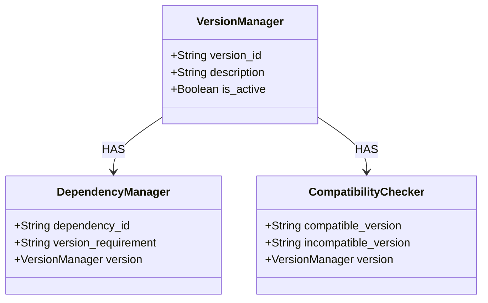
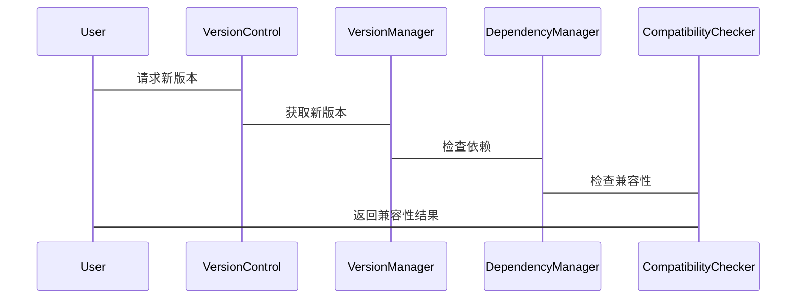

                 


# 版本兼容性：管理AI Agent的历史版本

---

## 关键词：
版本兼容性, AI Agent, 历史版本管理, 系统架构, 项目实战

---

## 摘要：
随着AI Agent技术的快速发展，版本兼容性问题变得日益重要。本文将从AI Agent的历史版本管理出发，深入分析版本兼容性的核心概念、算法原理、系统架构设计以及项目实战，帮助读者全面理解如何有效管理AI Agent的版本兼容性问题。通过本文的学习，读者将能够掌握版本兼容性的关键理论与实践方法，并能够将其应用于实际项目中。

---

## 第一部分: 版本兼容性概述

---

## 第1章: 版本兼容性与AI Agent概述

### 1.1 版本兼容性的概念与重要性
版本兼容性是指不同版本的软件或系统之间能够协同工作并保持预期功能的能力。在AI Agent领域，版本兼容性尤为重要，因为AI Agent的更新迭代通常伴随着算法优化、功能扩展或接口变更。若不妥善处理版本兼容性问题，可能导致系统崩溃、功能异常或数据丢失。

#### 1.1.1 版本兼容性的定义
版本兼容性是指不同版本的AI Agent或其组件在特定条件下能够协同工作的能力。其核心在于确保新版本的引入不会破坏现有系统的功能或性能。

#### 1.1.2 版本兼容性的重要性
- **系统稳定性**：确保AI Agent在不同版本之间的切换不会导致系统崩溃或功能异常。
- **功能扩展性**：支持AI Agent的功能扩展，同时保证旧版本的功能不受影响。
- **数据一致性**：确保不同版本之间的数据格式和接口兼容，避免数据丢失或错误。

#### 1.1.3 AI Agent与版本兼容性的关系
AI Agent的复杂性要求其版本兼容性管理必须高度精确。每次版本更新都可能引入新的功能或更改旧的功能，这需要通过严格的版本控制和兼容性测试来确保系统的稳定性。

### 1.2 AI Agent的历史版本管理
AI Agent的历史版本管理是版本兼容性管理的核心内容。通过管理不同版本的AI Agent，可以确保在需要时能够快速回滚到稳定版本，同时支持新版本的开发和发布。

#### 1.2.1 AI Agent的定义与特点
AI Agent是一种智能代理，能够感知环境、执行任务并与其他系统或用户进行交互。其特点包括自主性、反应性、目标导向性和学习能力。

#### 1.2.2 历史版本管理的必要性
随着AI Agent的功能不断扩展和优化，历史版本管理变得至关重要。旧版本的保留有助于调试、回滚和功能追溯。

#### 1.2.3 常见的版本管理工具
- **Git**：广泛用于代码版本管理，支持分支、合并和标签操作。
- **Docker**：通过容器化技术实现AI Agent的版本隔离和快速部署。
- **Semantic Versioning (SemVer)**：语义版本控制，用于明确版本号的含义和兼容性。

### 1.3 本章小结
本章主要介绍了版本兼容性的概念、重要性以及AI Agent历史版本管理的必要性。通过理解这些内容，读者可以初步认识到版本兼容性在AI Agent开发和维护中的核心地位。

---

## 第二部分: 版本兼容性核心概念与联系

---

## 第2章: 版本兼容性核心概念

### 2.1 兼容性模型
兼容性模型是描述不同版本AI Agent之间关系的数学模型。它通过定义版本之间的关系和约束条件，帮助我们理解和管理版本兼容性。

#### 2.1.1 兼容性模型的定义
兼容性模型是一种数学模型，用于描述不同版本之间的兼容性关系。它通常包括版本号、依赖关系和兼容性规则。

#### 2.1.2 兼容性模型的分类
- **基于版本号的模型**：如语义版本控制（SemVer）。
- **基于接口的模型**：通过接口定义兼容性。
- **基于功能的模型**：通过功能模块定义兼容性。

#### 2.1.3 兼容性模型的实现方式
兼容性模型的实现方式通常包括定义版本号规则、接口规范和功能模块的依赖关系。

### 2.2 版本控制机制
版本控制机制是通过记录和管理不同版本的AI Agent，确保版本之间的兼容性和可追溯性。

#### 2.2.1 版本控制的基本原理
版本控制通过记录每次修改的历史，支持分支、合并和标签操作，确保版本的可追溯性和可管理性。

#### 2.2.2 常见版本控制方法对比
以下是一个对比表格，列举了几种常见的版本控制方法及其特点：

| 版本控制方法 | 描述 | 优点 | 缺点 |
|--------------|------|------|------|
| Git          | 分分布局式版本控制 | 高度灵活，支持分支和合并 | 学习曲线较高 |
| SVN          | 服务器端版本控制 | 简单易用，适合小团队 | 功能相对简单 |
| Mercurial    | 分分布局式版本控制 | 易用性高，适合大型项目 | 性能稍逊于Git |

#### 2.2.3 版本控制与兼容性的关系
版本控制是兼容性管理的基础，通过版本控制可以确保不同版本之间的变更记录和依赖关系。

### 2.3 依赖管理
依赖管理是通过明确AI Agent的依赖关系，确保不同版本之间的兼容性。

#### 2.3.1 依赖管理的定义
依赖管理是指明确AI Agent的依赖项及其版本要求，确保在不同版本之间能够正确解析和使用依赖项。

#### 2.3.2 依赖管理的核心要素
- **依赖项**：AI Agent所需的外部库或模块。
- **版本号**：依赖项的版本要求。
- **兼容性规则**：定义依赖项的兼容性条件。

#### 2.3.3 依赖管理与版本兼容性的联系
依赖管理是版本兼容性管理的重要组成部分，通过明确依赖项的版本要求和兼容性规则，可以确保AI Agent在不同版本之间的兼容性。

### 2.4 ER实体关系图
以下是一个使用Mermaid绘制的ER实体关系图，展示了AI Agent版本管理中的实体关系：

```mermaid
erDiagram
    actor User {
        +String username
        +String password
    }
    class Version {
        +String version_id
        +String description
        +Boolean is_active
    }
    class Dependency {
        +String dependency_id
        +String version_requirement
        +Version version
    }
    class AI-Agent {
        +String agent_id
        +Version current_version
        +Dependency dependencies
    }
    User -> Version : MANAGES
    Version -> Dependency : HAS
    AI-Agent -> Version : USES
    AI-Agent -> Dependency : DEPENDS_ON
```

---

## 第3章: 核心概念与联系

### 3.1 兼容性模型与版本控制的对比
以下是一个对比表格，列举了兼容性模型与版本控制的主要区别和联系：

| 对比维度 | 兼容性模型 | 版本控制 |
|----------|------------|----------|
| 定义     | 描述版本之间的兼容性关系 | 记录和管理版本历史 |
| 目标     | 确保不同版本之间的兼容性 | 确保版本的可追溯性和可管理性 |
| 实现方式 | 定义版本号规则、接口规范 | 记录每次修改的历史 |

### 3.2 ER实体关系图
以下是一个使用Mermaid绘制的ER实体关系图，展示了兼容性模型与版本控制之间的关系：

```mermaid
erDiagram
    class Version {
        +String version_id
        +String description
        +Boolean is_compatible
    }
    class Compatibility {
        +String compatible_version
        +String incompatible_version
        +Version version
    }
    Version -> Compatibility : HAS
    Version -> Version : INCOMPATIBLE_WITH
```

---

## 第三部分: 算法原理讲解

---

## 第4章: 版本兼容性算法原理

### 4.1 主流版本兼容性算法
以下是一些主流的版本兼容性算法及其简要说明：

#### 4.1.1 语义版本控制（Semantic Versioning）
语义版本控制是一种常用的版本控制方法，通过定义主版本号、次版本号和修订号的规则来确保版本之间的兼容性。

- 主版本号：表示不向下兼容的重大修改。
- 次版本号：表示向下兼容的功能增加或 bug 修复。
- 修订号：表示向下兼容的 bug 修复。

#### 4.1.2 兼容性矩阵法
兼容性矩阵法通过定义一个矩阵来表示不同版本之间的兼容性关系。

```mermaid
matrixDiagram
    matrix Version_Compatibility_Matrix {
        Version1, Version2, Version3;
        Version1, Version2, Version3;
    }
    Version_Compatibility_Matrix.compatible Version1-1 = true
    Version_Compatibility_Matrix.compatible Version2-2 = true
    Version_Compatibility_Matrix.compatible Version3-3 = true
```

#### 4.1.3 其他常用算法
- **兼容性哈希法**：通过计算版本的哈希值来判断兼容性。
- **依赖树法**：通过构建依赖树来判断版本之间的兼容性。

### 4.2 算法原理的数学模型
语义版本控制的数学模型如下：

$$
\text{兼容性} = 
\begin{cases}
\text{兼容} & \text{如果主版本号相同且次版本号小于或等于} \\
\text{不兼容} & \text{否则}
\end{cases}
$$

### 4.3 算法实现
以下是一个使用Python实现的语义版本控制示例代码：

```python
def is_compatible(current_version, new_version):
    # 解析版本号
    current_major, current_minor, current_patch = map(int, current_version.split('.'))
    new_major, new_minor, new_patch = map(int, new_version.split('.'))
    
    # 判断主版本号
    if current_major != new_major:
        return False
    # 判断次版本号
    if current_minor > new_minor:
        return False
    return True

# 示例
current_version = "2.3.1"
new_version = "2.3.2"
print(is_compatible(current_version, new_version))  # 输出: True
```

---

## 第四部分: 系统分析与架构设计方案

---

## 第5章: 系统分析与架构设计

### 5.1 问题场景介绍
假设我们正在开发一个AI聊天机器人，需要支持不同版本的AI Agent。每次更新AI Agent时，都需要确保新版本与旧版本兼容，并能够回滚到旧版本。

### 5.2 系统功能设计
以下是系统功能模块的类图：



### 5.3 系统架构设计
以下是系统的架构图：


### 5.4 系统接口设计
以下是系统接口设计的序列图：



---

## 第五部分: 项目实战

---

## 第6章: 项目实战

### 6.1 环境安装
需要安装以下工具：
- Git
- Python 3.x
- Semantic Versioning库（如`semver`）

### 6.2 核心代码实现
以下是核心代码实现：

```python
from semver import parse_version, compare
import subprocess

def get_current_version():
    # 使用Git命令获取当前版本
    result = subprocess.run(['git', 'describe', '--tags'], capture_output=True, text=True)
    version = result.stdout.strip()
    return parse_version(version)

def check_compatibility(current_version, new_version):
    if compare(current_version, new_version) < 0:
        return False
    return True

# 示例
current_version = get_current_version()
new_version = parse_version("2.3.2")
print(check_compatibility(current_version, new_version))
```

### 6.3 代码应用解读与分析
上述代码通过Git命令获取当前版本，并使用`semver`库进行版本比较，判断新版本是否兼容。

### 6.4 实际案例分析
假设我们正在开发一个AI聊天机器人，需要从版本2.3.1升级到版本2.3.2。通过上述代码，我们可以判断新版本是否兼容旧版本。

### 6.5 项目小结
本章通过实际案例展示了如何在AI Agent项目中实现版本兼容性管理，包括环境安装、核心代码实现和案例分析。

---

## 第六部分: 最佳实践

---

## 第7章: 最佳实践

### 7.1 小结
版本兼容性管理是AI Agent开发和维护中的重要环节。通过合理的版本控制、依赖管理和兼容性测试，可以确保不同版本之间的兼容性和系统的稳定性。

### 7.2 注意事项
- **定期测试**：每次版本更新后，必须进行兼容性测试。
- **文档记录**：记录每个版本的功能、依赖和兼容性规则。
- **版本回滚**：确保在出现问题时能够快速回滚到稳定版本。

### 7.3 拓展阅读
- 《Semantic Versioning (SemVer) 2.0.0 Specification》
- 《Effective Software Architecture: Designing and Coding for Maintainability》
- 《Dependency Injection: The Complete Guide》

---

## 作者：AI天才研究院/AI Genius Institute & 禅与计算机程序设计艺术 /Zen And The Art of Computer Programming

