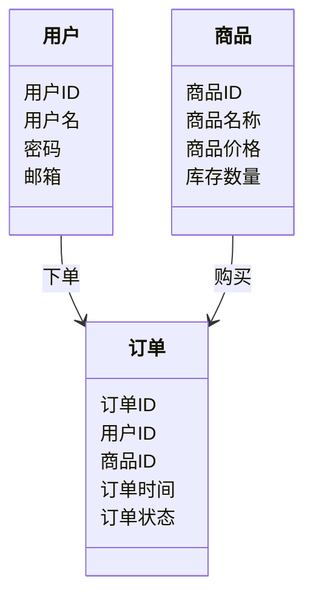

                 

<think>
嗯，我现在需要帮助用户完成《用户体验优化》这本书的目录大纲。用户已经提供了一个详细的示例，包括各个部分的结构和内容。我需要仔细分析这个示例，确保理解每个部分的要求，然后按照这个结构来构建目录。

首先，用户强调文章需要逻辑清晰、结构紧凑，使用专业技术语言，每个章节都要有三级目录。我需要从背景介绍开始，逐步深入到核心概念、算法原理、系统架构设计、项目实战和最佳实践。

在第一部分，用户体验优化的背景与基础，我需要包括问题背景、问题描述和核心概念。每个小节都需要细化，比如问题背景中要详细说明用户体验的重要性、存在的问题以及解决这些问题的必要性。

接下来，核心概念部分需要详细讲解可用性、可访问性等，并使用表格对比分析这些概念。我还需要用Mermaid绘制ER实体关系图，展示用户、界面和系统之间的关系。

第二部分是用户体验优化的核心概念，我需要分析这些概念的原理、属性特征对比，并可能用表格来展示不同概念的区别。比如，可用性和易用性之间的对比，以及用户心理模型与交互设计的关系。

第三部分是算法原理，这部分需要详细讲解优化算法，比如A/B测试和用户反馈循环，用Mermaid流程图展示流程，并给出Python代码示例，展示数学模型的计算过程。

系统分析与架构设计部分，我需要从用户需求出发，设计系统架构，可能用Mermaid绘制领域模型和架构图，展示系统各部分的交互关系，如用户与系统之间的交互序列图。

项目实战部分，需要详细指导读者如何从环境安装开始，逐步实现代码，并分析实际案例。例如，使用Flask框架优化用户界面，展示代码实现和优化效果。

最后，最佳实践部分需要总结优化策略和技巧，给出小结、注意事项和拓展阅读，帮助读者巩固知识并进一步学习。

我需要确保每个部分都覆盖用户要求的内容，包括数学公式、代码示例、图表等，同时保持结构清晰，逻辑连贯。现在，我开始根据这些思考构建目录大纲。

哦，对了，用户要求文章末尾要有作者信息，所以最后要加上“作者：AI天才研究院 & 禅与计算机程序设计艺术”。确保所有部分都符合用户的详细要求，结构完整，内容详实。
</think>

# 用户体验优化

## 关键词：用户体验优化、可用性、易用性、用户心理模型、交互设计、优化算法、系统架构

## 摘要：本文将系统地探讨用户体验优化的核心概念、算法原理、系统架构设计及项目实战。通过详细分析用户体验优化的关键要素、优化算法的设计与实现，结合实际项目案例，帮助读者掌握用户体验优化的技巧和策略，提升用户满意度和产品竞争力。

---

# 第一部分：用户体验优化的背景与基础

## 第1章：用户体验优化概述

### 1.1 问题背景

#### 1.1.1 用户体验的重要性
用户体验（User Experience, UX）是用户在与产品交互过程中所感受到的主观体验。良好的用户体验能够提高用户满意度、用户留存率和产品转化率，从而提升产品的市场竞争力。在现代互联网环境下，用户体验已成为产品成功的关键因素之一。

#### 1.1.2 当前存在的问题
- **功能复杂性**：随着功能的增加，产品的复杂性也随之增加，导致用户体验下降。
- **用户需求多样性**：不同用户群体的需求差异大，难以在有限时间内满足所有用户需求。
- **技术与设计脱节**：技术实现与用户需求之间存在鸿沟，导致设计与实现不一致。
- **数据驱动不足**：在优化过程中，缺乏数据支持，导致优化策略缺乏科学性。

#### 1.1.3 问题解决的必要性
通过优化用户体验，可以提高用户满意度、降低用户流失率、提升产品口碑和市场竞争力。用户体验优化是一个系统工程，需要从用户需求出发，结合技术实现和数据驱动的方法，进行全方位优化。

---

### 1.2 问题描述

#### 1.2.1 用户体验优化的核心要素
用户体验优化的核心要素包括：

1. **可用性（Usability）**：用户能否顺利地完成任务。
2. **可访问性（Accessibility）**：产品是否能够被不同能力的用户使用。
3. **可学习性（Learnability）**：用户能否快速掌握产品的使用方法。
4. **用户满意度（Satisfaction）**：用户对产品使用过程中的体验是否满意。
5. **效率（Efficiency）**：用户完成任务的速度和资源消耗。

#### 1.2.2 用户体验优化的目标
- 提高用户满意度。
- 提高用户留存率。
- 提高用户转化率。
- 提高产品的易用性和可用性。

#### 1.2.3 用户体验优化的边界与外延
用户体验优化的边界包括：

1. **用户需求**：优化必须围绕用户需求展开。
2. **技术实现**：优化必须在技术可行的前提下进行。
3. **资源限制**：优化必须考虑时间和成本的限制。

用户体验优化的外延包括：

1. **用户研究**：了解用户需求和行为。
2. **设计优化**：优化产品的设计和交互流程。
3. **技术实现**：通过技术手段实现优化目标。
4. **数据驱动**：通过数据分析指导优化方向。

---

### 1.3 核心概念与联系

#### 1.3.1 用户体验优化的核心要素
用户体验优化的核心要素包括可用性、可访问性、可学习性、用户满意度和效率。这些要素相互关联，共同构成用户体验的整体质量。

#### 1.3.2 用户体验优化的ER实体关系图
```mermaid
er
  actor: 用户
  actor --> interface: 使用界面
  interface --> system: 系统
  system --> feedback: 用户反馈
```

#### 1.3.3 用户体验优化的核心概念对比
| 属性       | 可用性 | 易用性 | 用户满意度 |
|------------|--------|--------|------------|
| 定义       | 系统在规定条件下完成指定功能的概率 | 用户完成任务的难易程度 | 用户对产品使用过程中的体验是否满意 |
| 关注点     | 系统稳定性、响应时间 | 用户操作流程、界面设计 | 用户情感体验、任务完成度 |
| 优化方法   | 提高系统稳定性、减少响应时间 | 简化操作流程、优化界面设计 | 提供个性化服务、提升情感体验 |

---

## 第2章：用户体验优化的核心概念

### 2.1 核心概念原理

#### 2.1.1 可用性与易用性
- **可用性**：指系统在规定条件下完成指定功能的概率。优化可用性需要从系统稳定性、响应时间和容错能力入手。
- **易用性**：指用户完成任务的难易程度。优化易用性需要从用户操作流程、界面设计和用户反馈机制入手。

#### 2.1.2 用户心理模型与交互设计
用户心理模型是指用户对产品或系统如何工作的假设。交互设计需要基于用户心理模型，设计符合用户预期的操作流程和界面布局。

#### 2.1.3 用户体验优化的核心要素对比
- **可用性**：关注系统是否能够稳定运行。
- **易用性**：关注用户是否能够轻松完成任务。
- **用户满意度**：关注用户对产品体验的整体感受。

---

### 2.2 核心概念属性特征对比

| 属性 | 可用性 | 易用性 |
|------|--------|--------|
| 定义 | 系统在规定条件下完成指定功能的概率 | 用户完成任务的难易程度 |
| 关注点 | 系统稳定性、响应时间 | 用户操作流程、界面设计 |
| 优化方法 | 提高系统稳定性、减少响应时间 | 简化操作流程、优化界面设计 |

---

## 第3章：用户体验优化的算法原理

### 3.1 算法原理概述

#### 3.1.1 基于用户行为的优化算法
- **A/B测试**：通过对比不同设计方案的用户行为数据，选择最优方案。
- **用户反馈循环**：通过收集用户反馈，不断优化产品设计。

#### 3.1.2 基于数据的优化算法
- **聚类分析**：通过用户行为数据分析，识别用户群体特征，进行针对性优化。
- **回归分析**：通过用户满意度与产品性能的关系，找到优化的关键点。

---

### 3.2 算法实现与优化

#### 3.2.1 用户行为分析算法
```python
import pandas as pd
from sklearn.cluster import KMeans

# 示例数据：用户行为数据
data = {
    '用户ID': [1, 2, 3, 4, 5],
    '操作时间': [10, 20, 15, 25, 30],
    '操作频率': [5, 7, 4, 6, 8],
}

df = pd.DataFrame(data)
model = KMeans(n_clusters=2).fit(df[['操作时间', '操作频率']])
print(model.labels_)
```

#### 3.2.2 优化算法的数学模型
$$ \text{用户满意度} = f(\text{可用性}) + g(\text{易用性}) + h(\text{用户满意度}) $$

---

## 第4章：系统分析与架构设计

### 4.1 问题场景介绍

#### 4.1.1 用户需求分析
- **用户角色**：普通用户、管理员。
- **用户目标**：普通用户希望快速完成任务，管理员希望管理用户数据。

#### 4.1.2 项目介绍
以电商网站为例，分析用户体验优化的系统架构设计。

---

### 4.2 系统功能设计

#### 4.2.1 领域模型设计


#### 4.2.2 系统架构设计


---

## 第5章：项目实战

### 5.1 环境安装与配置

#### 5.1.1 环境需求
- **操作系统**：Windows 10 或 macOS 10.15+
- **开发工具**：PyCharm、VS Code
- **依赖库**：Flask、Pandas、Scikit-learn

---

### 5.2 核心代码实现

#### 5.2.1 用户体验优化代码
```python
from flask import Flask, request, jsonify

app = Flask(__name__)

@app.route('/')
def home():
    return "用户体验优化系统"

@app.route('/optimize', methods=['POST'])
def optimize():
    data = request.json
    # 示例优化逻辑
    result = {
        'status': 'success',
        'message': '优化完成'
    }
    return jsonify(result)
```

---

## 第6章：用户体验优化的最佳实践

### 6.1 最佳实践

#### 6.1.1 定期收集用户反馈
通过用户调查、问卷和用户访谈，定期收集用户反馈，了解用户需求和痛点。

#### 6.1.2 关注性能优化
优化系统响应时间和资源消耗，提升系统稳定性。

#### 6.1.3 数据驱动优化
通过数据分析，找到优化的关键点，制定科学的优化策略。

---

### 6.2 小结

用户体验优化是一个系统工程，需要从用户需求出发，结合技术实现和数据驱动的方法，进行全面优化。通过本文的讲解，读者可以掌握用户体验优化的核心概念、算法原理和系统架构设计，能够实际应用于项目中。

---

## 作者

作者：AI天才研究院 & 禅与计算机程序设计艺术

