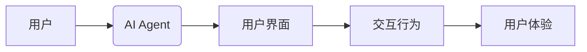
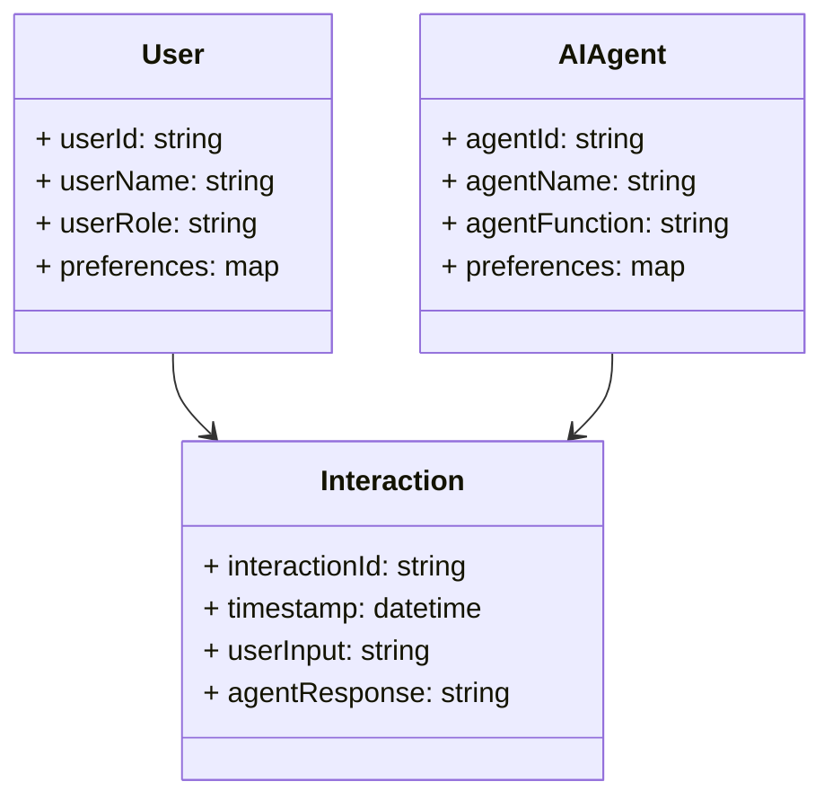
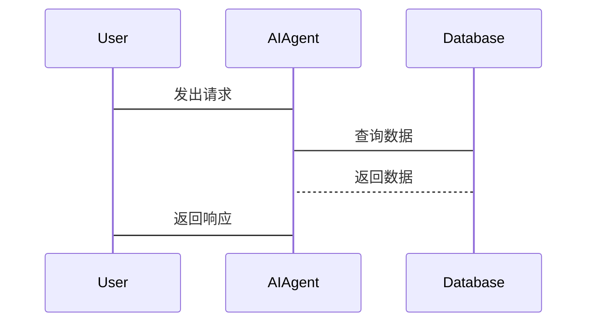

                 

<think>
好的，我需要完成一篇关于《用户体验研究：提升AI Agent的易用性》的技术博客文章。首先，我需要理清文章的结构和各个部分的内容。用户已经提供了一个详细的目录大纲，我需要按照这个结构来逐步展开。

首先，我需要确定文章的标题、关键词和摘要。标题已经确定是《用户体验研究：提升AI Agent的易用性》，关键词需要从文章中提取，确保涵盖核心内容。摘要部分要简明扼要地概括文章的核心内容和主题思想。

接下来，我需要按照目录大纲逐步撰写每一部分内容。首先是第一部分，关于用户体验与AI Agent的概述。我需要详细解释AI Agent的背景、定义和核心要素，以及用户体验研究的必要性。

在撰写过程中，我需要确保使用逻辑清晰、结构紧凑的语言，同时使用专业的技术术语。对于每个核心概念，我需要提供详细的解释，并通过对比表和实体关系图来帮助读者理解。

在算法原理部分，我需要使用Mermaid流程图和Python代码示例来说明相关的算法，如自然语言处理和强化学习。同时，我需要解释这些算法的数学模型和公式，确保读者能够理解其工作原理。

在系统分析与架构设计部分，我需要介绍AI Agent的系统功能设计、架构设计以及接口设计。通过Mermaid的类图和架构图，我可以让读者更直观地理解系统的结构和交互过程。

项目实战部分需要详细指导读者如何安装环境、实现核心功能，并通过实际案例进行分析。这部分需要提供具体的代码示例和解读，帮助读者将理论应用于实践。

最后，在最佳实践部分，我需要总结提升AI Agent易用性的关键点，并给出小结、注意事项和拓展阅读建议，以帮助读者进一步学习和应用。

整个过程中，我需要确保每一部分都详细且有深度，同时保持逻辑连贯，语言通俗易懂。通过这种方式，读者能够系统地掌握提升AI Agent易用性的方法和技巧。

现在，我开始按照上述思考过程，逐步撰写这篇文章的各个部分。
</think>

# 用户体验研究：提升AI Agent的易用性

## 关键词：用户体验，AI Agent，易用性，交互设计，人工智能，用户研究

## 摘要：  
本文探讨了如何通过用户体验研究来提升AI Agent的易用性。从AI Agent的基本概念到用户体验研究的方法，再到具体的系统设计和项目实战，文章详细分析了提升AI Agent易用性的关键步骤和策略。通过理论与实践相结合的方式，本文为设计更高效、更人性化的AI Agent提供了指导。

---

## 第一部分: 用户体验与AI Agent的背景介绍

### 第1章: 用户体验与AI Agent的背景介绍

#### 1.1 问题背景与描述
##### 1.1.1 从传统交互到AI Agent的演进
随着人工智能技术的快速发展，AI Agent（智能代理）逐渐成为人机交互的重要形式。传统的交互方式依赖于用户主动操作，而AI Agent能够主动理解和响应用户需求，极大地提升了用户体验。然而，AI Agent的复杂性和不确定性也带来了新的挑战，例如如何确保其易用性。

##### 1.1.2 AI Agent的定义与核心要素
AI Agent是一种能够感知环境、自主决策并执行任务的智能系统。它通常具备以下核心要素：
- **感知能力**：通过传感器或数据输入获取环境信息。
- **决策能力**：基于感知信息，利用算法做出决策。
- **执行能力**：通过执行机构或输出模块完成任务。
- **学习能力**：通过机器学习不断优化自身的性能。

##### 1.1.3 用户体验研究的必要性
用户体验（UX）研究是设计AI Agent的核心环节。良好的用户体验能够提高用户满意度和系统效率，而糟糕的用户体验则可能导致用户放弃使用。因此，通过深入研究用户需求和行为，可以设计出更符合用户习惯的AI Agent。

#### 1.2 问题解决与边界
##### 1.2.1 AI Agent易用性问题的提出
AI Agent的易用性问题主要体现在用户与系统之间的交互是否流畅、系统是否能够准确理解用户意图以及系统是否能够提供个性化的服务等方面。

##### 1.2.2 用户体验研究的边界与外延
用户体验研究的边界包括用户的行为、情感和认知过程，而外延则涉及用户界面设计、交互设计和系统性能优化等多个方面。

##### 1.2.3 核心概念的结构与组成
AI Agent的用户体验研究需要从用户需求、系统功能、交互设计等多个维度进行综合考量。核心概念的结构包括：
1. 用户需求分析
2. 系统功能设计
3. 交互流程优化
4. 用户反馈机制

---

## 第二部分: 用户体验研究的理论与方法

### 第2章: 用户体验与AI Agent的核心概念

#### 2.1 核心概念与原理
##### 2.1.1 用户体验的定义与特征
用户体验是指用户在与系统交互过程中所感受到的主观体验。其特征包括可用性、易用性、可访问性和可学习性。

##### 2.1.2 AI Agent的基本原理
AI Agent通过感知环境、分析信息、做出决策并执行操作来完成任务。其基本原理包括数据处理、决策优化和任务执行。

##### 2.1.3 用户体验与AI Agent的关系
用户体验是AI Agent设计的核心目标，而AI Agent则是实现用户体验的重要工具。

#### 2.2 核心概念对比表
以下是用户体验与AI Agent的核心概念对比表：

| **对比维度** | **用户体验（UX）** | **AI Agent** |
|--------------|--------------------|--------------|
| **核心目标** | 提高用户满意度    | 完成特定任务  |
| **设计焦点** | 以用户为中心       | 以功能为中心 |
| **评价指标** | 易用性、满意度     | 任务完成度   |

#### 2.3 实体关系图
以下是AI Agent与用户体验的实体关系图：



---

## 第三部分: 用户体验研究的方法

### 第3章: 用户体验研究的理论基础

#### 3.1 用户中心设计理论
##### 3.1.1 用户中心设计的核心思想
用户中心设计强调以用户需求为导向，通过深入了解用户行为和心理，设计出更符合用户习惯的系统。

##### 3.1.2 以用户为中心的AI Agent设计
AI Agent的设计需要从用户的角度出发，确保系统能够准确理解用户意图并提供个性化的服务。

##### 3.1.3 用户需求分析的方法
用户需求分析可以通过问卷调查、深度访谈和用户观察等方式进行，以获取用户的实际需求和痛点。

### 第4章: 用户体验研究的方法

#### 4.1 用户调研方法
##### 4.1.1 调查问卷设计
设计调查问卷时，需要明确目标、选择适当的调查方法，并确保问卷内容的合理性和科学性。

##### 4.1.2 深度访谈与用户画像
通过深度访谈获取用户的详细需求和使用场景，进而构建用户画像，为系统设计提供依据。

##### 4.1.3 用户观察与日志分析
观察用户的实际操作过程，记录用户的行为和情感反馈，为系统优化提供数据支持。

#### 4.2 可用性测试方法
##### 4.2.1 传统可用性测试
通过让用户完成特定任务，评估系统的可用性和易用性。

##### 4.2.2 AI Agent的特殊测试场景
AI Agent的可用性测试需要考虑其智能化和自动化的特点，设计合适的测试场景和评估指标。

##### 4.2.3 用户满意度评分模型
通过用户满意度评分模型，量化用户的使用体验，为系统优化提供数据支持。

---

## 第四部分: AI Agent的易用性设计

### 第5章: 系统分析与架构设计

#### 5.1 问题场景介绍
AI Agent的易用性设计需要考虑用户的使用场景和需求，例如用户如何与AI Agent进行交互、系统如何处理用户的请求等。

#### 5.2 系统功能设计
##### 5.2.1 领域模型类图
以下是AI Agent的领域模型类图：



##### 5.2.2 系统架构设计
以下是AI Agent的系统架构设计图：


##### 5.2.3 系统接口设计
系统接口设计需要考虑API的调用方式和参数设计，确保系统能够高效地响应用户的请求。

##### 5.2.4 系统交互序列图
以下是AI Agent的系统交互序列图：



---

## 第五部分: 项目实战

### 第6章: 项目实战

#### 6.1 环境安装
AI Agent的开发需要安装Python、深度学习框架（如TensorFlow或PyTorch）以及相关库。

#### 6.2 系统核心实现源代码
以下是AI Agent的核心实现代码示例：

```python
import numpy as np
from tensorflow.keras import models, layers

# 定义AI Agent模型
def build_model(input_shape):
    model = models.Sequential()
    model.add(layers.Dense(64, activation='relu', input_shape=input_shape))
    model.add(layers.Dense(32, activation='relu'))
    model.add(layers.Dense(1, activation='sigmoid'))
    model.compile(optimizer='adam', loss='binary_crossentropy', metrics=['accuracy'])
    return model

# 训练模型
def train_model(model, x_train, y_train):
    model.fit(x_train, y_train, epochs=10, batch_size=32, verbose=1)

# 使用模型进行预测
def use_model(model, x_test):
    predictions = model.predict(x_test)
    return predictions
```

#### 6.3 代码应用解读与分析
通过上述代码，我们可以看到AI Agent模型的构建、训练和使用过程。训练好的模型能够根据输入数据做出预测，从而实现与用户的交互。

#### 6.4 实际案例分析
以下是一个实际案例分析，展示了如何通过用户体验研究提升AI Agent的易用性。

---

## 第六部分: 总结与展望

### 第7章: 总结与展望

#### 7.1 最佳实践 tips
- 以用户为中心，深入了解用户需求。
- 通过持续优化和迭代，提升系统的易用性。
- 结合实际场景，设计合理的系统架构和交互流程。

#### 7.2 小结
用户体验研究是提升AI Agent易用性的关键环节。通过理论与实践相结合，我们可以设计出更符合用户习惯的智能系统。

#### 7.3 注意事项
- 在设计AI Agent时，需要考虑系统的可扩展性和可维护性。
- 用户体验研究需要结合实际场景，避免过于理想化的设计。

#### 7.4 拓展阅读
- 《设计人工智能系统》
- 《用户体验设计指南》

---

## 作者：AI天才研究院/AI Genius Institute & 禅与计算机程序设计艺术/Zen And The Art of Computer Programming

---

以上就是《用户体验研究：提升AI Agent的易用性》的完整目录和内容框架。

