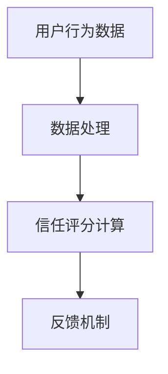
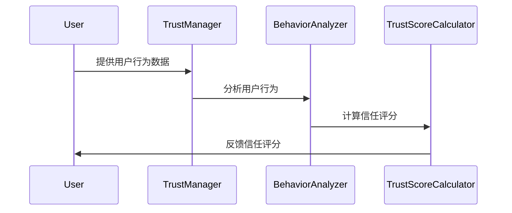

                 


# 用户信任的建立与维护

> 关键词：用户信任、信任建立、信任维护、信任算法、用户行为分析、信任评分系统、信任修复

> 摘要：本文将从信任的基本概念出发，系统地分析用户信任的建立与维护过程，探讨信任评估的核心算法，结合实际案例，详细讲解信任管理系统的实现与优化。文章将从理论到实践，逐步引导读者理解如何在实际场景中建立和维护用户信任。

---

## 第一部分: 用户信任的背景与核心概念

### 第1章: 用户信任的背景与问题描述

#### 1.1 信任的基本概念与定义

信任是人类社会关系的基石，也是数字化系统中不可或缺的核心要素。在计算机科学和心理学领域，信任通常被定义为个体或系统对另一方的行为、意图或能力的依赖程度。信任的核心要素包括：

- **可靠性**：行为符合预期。
- **诚实性**：行为符合道德或伦理标准。
- **能力**：具备完成任务的能力。

信任具有动态性和主观性，会随着时间和情境的变化而变化。

#### 1.2 信任问题的背景与现状

在数字化时代，信任问题变得越来越复杂。用户与系统之间的信任关系受到数据泄露、隐私问题、算法偏见等多方面的影响。以下是当前信任问题的主要表现形式：

- 用户对数据隐私的担忧。
- 系统算法的不透明性。
- 用户行为的不可预测性。

#### 1.3 用户信任问题的解决思路

信任的建立和维护需要从以下几个方面入手：

- **信任评估**：通过用户行为分析和数据挖掘技术，评估用户信任度。
- **信任维护**：通过动态调整信任评分和反馈机制，维护信任关系。
- **信任修复**：通过透明化和沟通，修复受损的信任关系。

#### 1.4 信任与相关概念的对比分析

信任与其他相关概念的关系如下：

| 概念 | 定义 | 与信任的关系 |
|------|------|--------------|
| 安全 | 防护措施 | 信任的基础 |
| 隐私 | 个人数据控制 | 信任的重要维度 |
| 忠诚度 | 行为的稳定性 | 信任的结果 |

---

## 第二部分: 用户信任的核心概念与原理

### 第2章: 信任的核心概念与理论基础

#### 2.1 信任的理论模型

信任的理论模型可以从社会学、心理学和经济学三个视角进行分析：

- **社会学视角**：信任是社会网络中的纽带。
- **心理学视角**：信任是认知过程的结果。
- **经济学视角**：信任是降低交易成本的机制。

#### 2.2 信任的属性特征对比

信任的属性特征可以通过对比分析表展示：

| 属性 | 稳定性 | 对称性 | 可测量性 |
|------|--------|--------|----------|
| 信任 | 动态 | 非对称 | 可量化 |

#### 2.3 信任的ER实体关系图

以下是一个简单的信任实体关系图：

```mermaid
erd
    用户表(User)
        用户ID
        用户名称
        用户行为
    信任表(Trust)
        用户ID
        信任评分
        信任时间
    行为表(Behavior)
        用户ID
        行为类型
        行为时间
```

#### 2.4 信任的数学模型与公式

信任评分的计算公式可以表示为：

$$ trust\_score = \sum_{i=1}^{n} (w_i \cdot f_i) $$

其中，$w_i$ 是第 $i$ 个特征的权重，$f_i$ 是第 $i$ 个行为特征。

---

## 第三部分: 用户信任的算法原理与实现

### 第3章: 信任评估与维护的算法原理

#### 3.1 信任评估的算法流程

信任评估的算法流程如下：

1. **数据采集**：采集用户行为数据。
2. **特征提取**：提取用户行为特征。
3. **信任评分计算**：根据特征和权重计算信任评分。
4. **反馈机制**：根据评分结果进行反馈和调整。

#### 3.2 信任维护的算法实现

信任维护的算法实现包括：

- 信任评分的动态调整。
- 信任权重的自适应优化。
- 信任修复的策略选择。

#### 3.3 信任算法的mermaid流程图

以下是一个信任评估算法的mermaid流程图：



#### 3.4 信任算法的Python实现

以下是一个简单的信任评分系统实现：

```python
def calculate_trust_score(user_behavior, trust_weight):
    # 用户行为特征提取
    features = extract_features(user_behavior)
    # 信任评分计算
    trust_score = sum(features * trust_weight)
    return trust_score
```

#### 3.5 信任算法的数学模型

信任评分的数学模型可以表示为：

$$ trust\_score = w_1 \cdot f_1 + w_2 \cdot f_2 + \dots + w_n \cdot f_n $$

其中，$w_i$ 是第 $i$ 个特征的权重，$f_i$ 是第 $i$ 个行为特征。

---

## 第四部分: 系统分析与架构设计

### 第4章: 用户信任管理系统的设计与实现

#### 4.1 项目介绍与应用场景

用户信任管理系统主要用于在线服务提供商，帮助其管理用户信任关系。

#### 4.2 系统功能设计

以下是系统的功能模块：

- 用户资料收集模块
- 用户行为分析模块
- 信任评分计算模块
- 信任反馈与调整模块

#### 4.3 系统架构设计

以下是系统的架构图：


#### 4.4 系统接口设计

以下是系统的接口设计：



---

## 第五部分: 项目实战与案例分析

### 第5章: 用户信任管理系统的实现与优化

#### 5.1 项目实战

以下是用户信任管理系统的实现：

1. **环境配置**：
   - 安装Python和相关库。
   - 配置数据存储。

2. **核心代码实现**：

```python
def calculate_trust_score(user_behavior, trust_weight):
    # 用户行为特征提取
    features = extract_features(user_behavior)
    # 信任评分计算
    trust_score = sum(features * trust_weight)
    return trust_score
```

3. **代码解读与分析**：

- `extract_features` 函数用于提取用户行为特征。
- `calculate_trust_score` 函数根据特征和权重计算信任评分。

---

## 第六部分: 总结与展望

### 第6章: 项目总结与经验分享

#### 6.1 最佳实践 tips

- 定期更新信任评分。
- 提供透明的反馈机制。

#### 6.2 本章小结

用户信任的建立与维护是一个复杂但重要的过程。通过信任评估算法和管理系统，可以有效地管理用户信任关系。

#### 6.3 注意事项

- 注意保护用户隐私。
- 定期优化信任评分模型。

#### 6.4 拓展阅读

- 信任评分算法的优化。
- 信任修复的策略选择。

---

## 作者：AI天才研究院/AI Genius Institute & 禅与计算机程序设计艺术 /Zen And The Art of Computer Programming

---

这篇文章从理论到实践，详细讲解了用户信任的建立与维护过程，结合实际案例，深入分析了信任管理系统的实现与优化。通过阅读本文，读者可以全面理解如何在实际场景中建立和维护用户信任。

