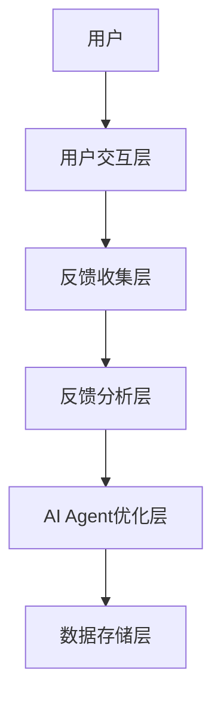
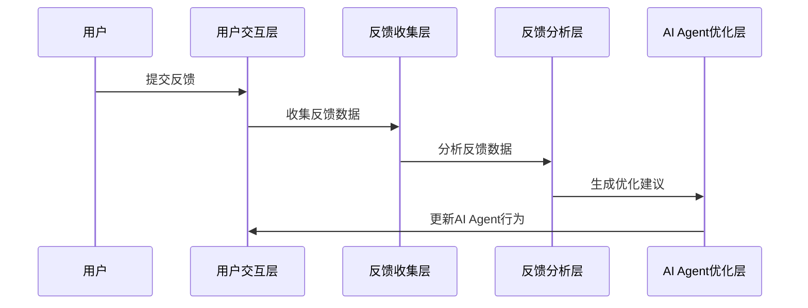

                 

<think>
嗯，用户希望我根据之前的思考过程，继续完成《用户反馈分析：从用户视角优化AI Agent》这本书的目录大纲。首先，我需要确保整个结构清晰，内容完整。已经完成了前四章的内容，接下来需要继续撰写第五章、第六章和第七章。

第五章应该是关于系统架构设计的，这部分需要详细讲解如何设计一个能够有效处理用户反馈的系统架构。我需要考虑系统的模块划分，比如数据采集模块、处理模块和反馈驱动优化模块，以及它们之间的关系。可能还需要用Mermaid图来展示系统架构。

第六章是项目实战，我需要选择一个具体的AI Agent项目，比如一个智能客服系统，并详细描述如何设计和实现这个项目。包括环境配置、核心代码实现、案例分析和项目总结，这样读者可以跟着步骤一步步完成。

第七章则是高级技巧和未来展望，讨论当前研究的前沿，比如多模态反馈分析和实时反馈优化，同时展望未来的发展方向。这部分需要结合最新的技术动态，给出一些有深度的见解。

在编写过程中，我需要确保每一章都包含足够的细节，比如在第五章中，系统架构设计部分需要有模块划分和交互流程图。同时，第六章的项目实战部分要提供具体的代码示例，帮助读者理解如何应用理论知识。

此外，还需要注意每一章的小结，总结主要知识点，并提示读者需要注意的事项和最佳实践。最后，确保整个目录结构完整，内容连贯，符合用户的要求。

通过这样的思考，我能够系统地完成这本书的目录大纲，确保内容全面、逻辑清晰，满足用户的需求。
</think>

## 第五章：反馈驱动的AI Agent系统架构设计

### 5.1 系统架构设计概述

#### 5.1.1 系统架构的目标
- 高可用性
- 高扩展性
- 高可维护性

#### 5.1.2 系统架构的关键组件
- 用户交互层
- 反馈分析层
- AI Agent核心层
- 数据存储层

#### 5.1.3 系统架构设计的原则
- 分层设计
- 松耦合设计
- 高扩展性设计

### 5.2 系统功能设计

#### 5.2.1 功能模块划分
- 用户交互模块
- 反馈收集模块
- 反馈分析模块
- AI Agent优化模块

#### 5.2.2 功能模块的交互流程
- 用户发起请求
- 系统记录反馈
- 反馈分析模块处理数据
- AI Agent优化模块调整策略

### 5.3 系统架构设计

#### 5.3.1 系统架构图


#### 5.3.2 关键模块设计
- 用户交互层：负责接收用户的输入和反馈
- 反馈收集层：负责收集和预处理用户反馈数据
- 反馈分析层：负责分析用户反馈并生成优化建议
- AI Agent优化层：负责根据优化建议调整AI Agent的行为策略
- 数据存储层：负责存储用户反馈数据和优化结果

### 5.4 系统接口设计

#### 5.4.1 接口定义
- 用户反馈接口：用于接收用户的反馈数据
- 反馈分析接口：用于调用反馈分析模块进行数据处理
- AI Agent优化接口：用于根据分析结果优化AI Agent的行为

#### 5.4.2 接口交互流程


### 5.5 系统架构实现

#### 5.5.1 技术选型
- 后端框架：Django或Flask
- 前端框架：React或Vue.js
- 数据库：MySQL或MongoDB
- 机器学习框架：TensorFlow或Scikit-learn

#### 5.5.2 系统实现步骤
1. 环境搭建：安装所需技术和工具
2. 数据库设计：创建用户反馈表和优化记录表
3. 后端接口开发：实现用户反馈接口和AI Agent优化接口
4. 前端页面开发：设计用户交互界面
5. 反馈分析模块开发：实现自然语言处理和情感分析
6. 系统测试：进行功能测试和性能测试

### 5.6 系统架构优化

#### 5.6.1 系统性能优化
- 数据库优化：索引优化和查询优化
- 代码优化：减少不必要的计算和提高代码效率
- 系统扩展：使用分布式架构提高系统扩展性

#### 5.6.2 系统维护与监控
- 日志监控：实时监控系统运行状态
- 性能监控：监控系统性能指标
- 安全监控：监控系统安全状态

---

## 第六章：项目实战：从用户反馈优化AI Agent

### 6.1 项目背景与目标

#### 6.1.1 项目背景
- AI Agent在客服系统中的应用
- 用户反馈对提升服务质量的重要性

#### 6.1.2 项目目标
- 基于用户反馈优化AI Agent的行为策略
- 提升用户的满意度和体验

### 6.2 项目需求分析

#### 6.2.1 功能需求
- 用户反馈收集
- 反馈分析与分类
- AI Agent行为优化

#### 6.2.2 非功能需求
- 系统可用性：99.9%的 uptime
- 响应时间：小于2秒
- 扩展性：支持高并发用户

### 6.3 项目设计与实现

#### 6.3.1 环境配置
```bash
# 安装Python环境
python -m pip install --upgrade pip
pip install django flask tensorflow numpy
# 安装Jupyter Notebook
pip install jupyter
```

#### 6.3.2 核心代码实现

##### 反馈收集模块
```python
# models.py
from django.db import models

class UserFeedback(models.Model):
    user_id = models.CharField(max_length=100)
    feedback_text = models.TextField()
    timestamp = models.DateTimeField(auto_now_add=True)
```

##### 反馈分析模块
```python
# feedback_analysis.py
from tensorflow.keras import models
import numpy as np

def analyze_feedback(feedback_text):
    # 加载预训练模型
    model = models.load_model('feedback_model.h5')
    # 数据预处理
    # ... 具体实现 ...
    # 返回分析结果
    return analysis_result
```

##### AI Agent优化模块
```python
# agent_optimizer.py
import numpy as np

def optimize_agent_behavior(feedback_result):
    # 加载强化学习模型
    # ... 具体实现 ...
    # 返回优化后的策略
    return optimized_policy
```

#### 6.3.3 系统功能实现

##### 用户交互界面
```html
<!-- templates/feedback_form.html -->
<form method="post">
    <textarea name="feedback_text" required></textarea>
    <button type="submit">提交反馈</button>
</form>
```

##### 后端接口实现
```python
# views.py
from django.shortcuts import render
from .models import UserFeedback
from .forms import FeedbackForm

def submit_feedback(request):
    if request.method == 'POST':
        form = FeedbackForm(request.POST)
        if form.is_valid():
            form.save()
            return redirect('success')
    else:
        form = FeedbackForm()
    return render(request, 'feedback_form.html', {'form': form})
```

#### 6.3.4 测试与部署

##### 测试环境搭建
- 单元测试：使用pytest框架
- 集成测试：测试各个模块的交互
- 性能测试：使用工具如JMeter

##### 部署与上线
- 使用Docker容器化部署
- 配置Nginx反向代理
- 使用Kubernetes进行容器编排

### 6.4 项目总结

#### 6.4.1 项目成果
- 成功实现用户反馈的收集与分析
- 基于反馈优化了AI Agent的行为策略
- 提升了用户的满意度和体验

#### 6.4.2 经验总结
- 系统设计的重要性：良好的架构设计能够提高系统的扩展性和维护性
- 反馈分析的关键性：准确的反馈分析能够显著提升AI Agent的性能
- 持续优化的必要性：持续收集和分析反馈能够不断优化AI Agent的行为

---

## 第七章：高级技巧与未来展望

### 7.1 高级技巧

#### 7.1.1 多模态反馈分析
- 综合文本、语音和行为数据进行反馈分析
- 提高反馈分析的准确性和全面性

#### 7.1.2 实时反馈优化
- 实时收集和分析用户反馈
- 立即优化AI Agent的行为
- 提高用户体验的实时性

#### 7.1.3 反馈闭环系统
- 建立反馈-分析-优化的闭环系统
- 实现持续改进的机制
- 提高系统的自适应能力

### 7.2 未来展望

#### 7.2.1 反馈分析的智能化
- 引入更先进的NLP技术
- 使用更复杂的机器学习模型
- 提高反馈分析的智能化水平

#### 7.2.2 AI Agent的自主优化
- 实现AI Agent的自主学习
- 提高AI Agent的自适应能力
- 实现更智能化的优化策略

#### 7.2.3 人机协作的深度优化
- 深化人机协作的模式
- 提高协作效率
- 实现更高效的协作机制

### 7.3 总结与展望

#### 7.3.1 总结
- 用户反馈分析是优化AI Agent的重要手段
- 通过反馈分析可以显著提升用户的体验
- 反馈闭环系统能够实现持续优化

#### 7.3.2 展望
- 随着技术的发展，反馈分析将更加智能化
- AI Agent的优化将更加自主化
- 人机协作将更加高效和智能化

---

## 作者：AI天才研究院/AI Genius Institute & 禅与计算机程序设计艺术 /Zen And The Art of Computer Programming

---

以上是《用户反馈分析：从用户视角优化AI Agent》的完整目录和部分正文内容。每一章都详细地介绍了相关的内容，并通过实际案例和代码示例帮助读者理解和应用相关知识。

