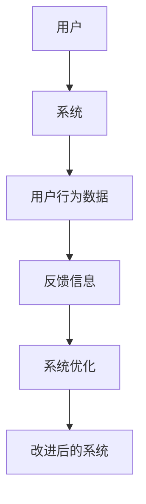
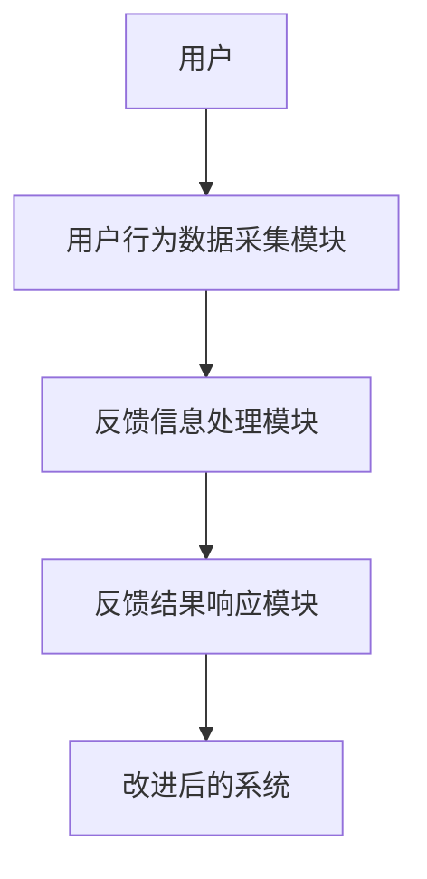

                 


# 用户反馈机制

---

## 关键词  
用户反馈、系统优化、数据分析、用户体验、反馈机制、闭环系统

---

## 摘要  
用户反馈机制是现代信息系统和软件开发中的核心组成部分，它通过收集用户在使用系统或产品时的反馈信息，帮助开发者和设计师理解用户需求和痛点，从而不断优化系统性能和用户体验。本文从用户反馈机制的基本概念、核心原理、系统架构、算法实现、项目实战等多个维度进行详细阐述，结合实际案例分析，深入探讨如何设计和实现高效的用户反馈机制，以满足复杂场景下的系统优化需求。

---

## 第一部分: 用户反馈机制基础

### 第1章: 用户反馈机制概述

#### 1.1 用户反馈机制的定义与核心概念  
用户反馈机制是指用户在与系统交互过程中，系统通过收集用户的操作行为、评价、建议等信息，并基于这些信息进行分析和优化的过程。其核心目标是通过用户的反馈信息，改进系统的功能、性能和用户体验。  

##### 核心概念  
- **用户行为数据**：用户在系统中的操作记录，如点击、输入、停留时间等。  
- **用户评价**：用户对系统功能或服务的主观评价，如满意度评分、意见建议等。  
- **反馈响应**：系统根据用户反馈信息做出的响应，如优化功能、修复bug等。  

#### 1.2 用户反馈机制的背景与应用  
随着信息技术的快速发展，用户与系统的交互日益频繁，用户反馈机制的重要性也日益凸显。在教育、医疗、金融、电子商务等领域，用户反馈机制被广泛应用于系统优化、用户体验提升和个性化服务设计中。  

##### 应用场景  
- **教育领域**：通过学生对课程的反馈优化教学内容。  
- **医疗领域**：通过患者对医疗服务的反馈优化诊疗流程。  
- **金融领域**：通过用户对金融服务的反馈优化产品设计。  

---

### 第2章: 用户反馈机制的核心原理  

#### 2.1 反馈机制的基本原理  
用户反馈机制的核心在于通过信息的闭环流动，实现系统的自我优化。以下是其实现的基本原理：  

1. **信息收集**：通过用户行为数据采集模块收集用户的操作行为和评价信息。  
2. **信息处理**：对收集到的反馈信息进行清洗、分类和分析。  
3. **信息响应**：根据分析结果，系统做出相应的优化调整。  

##### 信息流的闭环模型  
用户反馈机制的信息流可以表示为一个闭环，如下图所示：  



---

### 第3章: 用户反馈机制的设计原则  

#### 3.1 设计目标  
用户反馈机制的设计目标包括以下三个维度：  

1. **提高用户体验**：通过收集用户反馈信息，优化系统功能和界面设计。  
2. **支持系统优化**：通过反馈信息指导系统功能改进和性能优化。  
3. **实现数据驱动**：通过反馈信息的分析，为系统决策提供数据支持。  

#### 3.2 设计要素  
用户反馈机制的设计需要考虑以下要素：  

1. **用户行为数据的采集**：如何高效地收集用户行为数据，确保数据的完整性和准确性。  
2. **反馈信息的处理与分析**：如何对反馈信息进行分类、分析，并提取有价值的信息。  
3. **反馈结果的响应与优化**：如何根据分析结果进行系统优化，并将优化结果反馈给用户。  

---

## 第二部分: 用户反馈机制的技术实现

### 第4章: 用户反馈机制的系统架构  

#### 4.1 系统架构概述  
用户反馈机制的系统架构通常包括以下几个模块：  

1. **用户行为数据采集模块**：负责收集用户的操作行为数据。  
2. **反馈信息处理模块**：负责对反馈信息进行清洗、分类和分析。  
3. **反馈结果响应模块**：负责根据分析结果进行系统优化并反馈给用户。  

##### 系统架构图  
下图展示了用户反馈机制的系统架构：  



---

### 第5章: 用户反馈机制的数学模型与算法原理  

#### 5.1 反馈机制的数学模型  
用户反馈机制的优化可以通过数学模型来建模。以下是一个简单的优化模型：  

$$ \text{优化目标} = \arg \max_{x} \text{用户体验提升} $$  

其中，用户体验提升可以通过用户满意度评分、用户留存率等指标来衡量。  

#### 5.2 反馈机制的算法实现  
以下是一个基于用户反馈的优化算法实现示例：  

```python
def feedback_optimization(user_behavior, feedback_score):
    # 数据预处理
    processed_data = preprocess(user_behavior)
    # 反馈分析
    analysis_result = analyze(processed_data, feedback_score)
    # 系统优化
    optimization = optimize(analysis_result)
    return optimization

# 示例调用
user_behavior = [1, 2, 3, 4, 5]
feedback_score = [5, 4, 3, 2, 1]
result = feedback_optimization(user_behavior, feedback_score)
print(result)
```

---

## 第三部分: 用户反馈机制的项目实战  

### 第6章: 用户反馈机制的项目实战  

#### 6.1 项目背景与目标  
本项目旨在通过用户反馈机制优化一个在线教育平台的功能设计，提升用户体验和学习效果。  

#### 6.2 项目实施步骤  
1. **环境搭建**：安装必要的开发工具和依赖库。  
2. **核心代码实现**：实现用户行为数据采集、反馈信息处理和系统优化模块。  
3. **案例分析**：通过具体案例分析用户反馈信息，并优化系统功能。  
4. **项目总结**：总结项目实施过程中的经验和教训。  

---

## 第四部分: 用户反馈机制的优化与展望  

### 第7章: 用户反馈机制的优化与展望  

#### 7.1 反馈机制的优化策略  
1. **优化数据采集方式**：通过引入更先进的数据采集技术，提高数据的准确性和完整性。  
2. **提升反馈分析能力**：通过引入机器学习和人工智能技术，提高反馈信息的分析效率和准确性。  
3. **增强反馈响应能力**：通过自动化技术实现快速的反馈响应，提升用户体验。  

#### 7.2 未来发展方向  
随着人工智能和大数据技术的不断发展，用户反馈机制将更加智能化和自动化。未来的发展方向包括：  
- **智能化反馈分析**：利用AI技术实现自动化的反馈分析和优化。  
- **个性化反馈响应**：根据用户的个性化需求，提供定制化的反馈响应。  
- **实时反馈机制**：实现用户反馈的实时响应，提升系统的动态优化能力。  

---

## 总结  

用户反馈机制是现代信息系统优化的重要组成部分，通过用户的反馈信息，系统能够不断改进自身的功能和性能，提升用户体验。本文从基础概念、系统架构、算法实现、项目实战等多个维度对用户反馈机制进行了详细阐述，并结合实际案例分析了其在不同领域的应用。未来，随着技术的不断发展，用户反馈机制将更加智能化和个性化，为系统优化和用户体验提升提供更强大的支持。

---

## 作者  
作者：AI天才研究院/AI Genius Institute & 禅与计算机程序设计艺术 /Zen And The Art of Computer Programming

