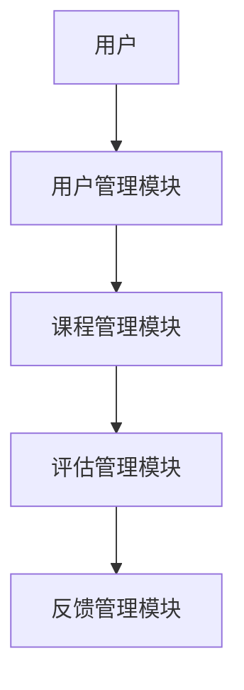
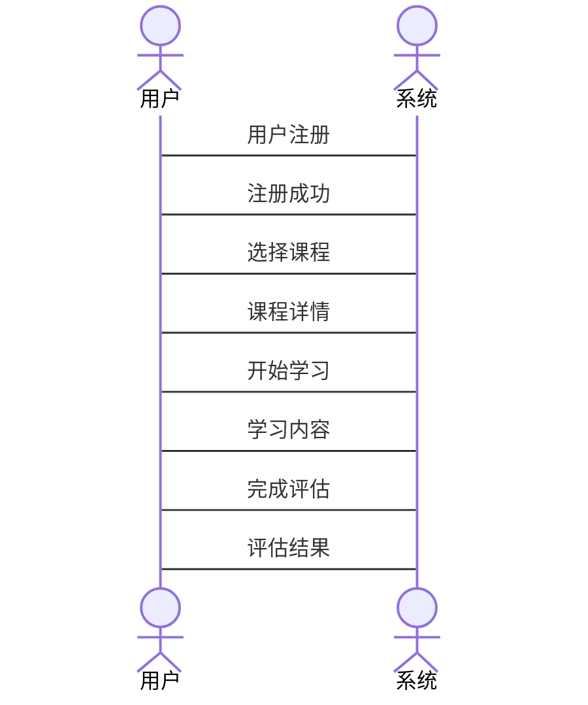

                 


# 用户教育与培训

## 关键词：
用户教育，培训，系统设计，算法，项目实战，教育技术

## 摘要：
用户教育与培训是现代信息技术领域的重要组成部分，旨在通过系统化的方法和工具，提升用户的知识、技能和能力。本文从用户教育与培训的背景、核心概念、系统设计、算法原理、项目实战等多个方面进行深入探讨，结合实际案例和数学模型，全面解析用户教育与培训的理论与实践。

---

## 第一部分: 用户教育与培训的背景与概念

### 第1章: 用户教育与培训的概述

#### 1.1 用户教育与培训的定义与目标
用户教育与培训是指通过系统化的教学方法和工具，帮助用户掌握特定知识、技能或能力的过程。其目标包括知识传递、技能培养和行为改变。用户教育与培训的核心目标是提升用户的自主学习能力和问题解决能力。

#### 1.2 用户教育与培训的背景与现状
随着信息技术的快速发展，用户教育与培训的重要性日益凸显。当前，用户教育与培训主要应用于企业培训、在线教育和职业教育等领域。未来，用户教育与培训将更加注重个性化学习和智能化教学。

#### 1.3 用户教育与培训的边界与外延
用户教育与培训的边界主要集中在教育内容的设计、教学方法的选择和评估体系的建立。其外延则包括用户学习动机、学习习惯和学习效果等。用户教育与培训与其他教育形式（如传统教育、游戏化教育）的区别在于其注重用户主动性和个性化需求。

#### 1.4 用户教育与培训的核心要素
用户教育与培训的核心要素包括教学目标、教学内容、教学方法、教学工具和评估体系。这些要素相互关联，共同构成了用户教育与培训的结构化模型。

---

## 第二部分: 用户教育与培训的核心概念与联系

### 第2章: 用户教育与培训的核心概念

#### 2.1 用户教育与培训的基本原理
用户教育与培训的基本原理包括知识传递、技能培养和态度塑造。知识传递是通过系统化的内容设计实现的，技能培养则通过实践任务和案例分析完成，态度塑造则通过激励机制和反馈机制实现。

#### 2.2 用户教育与培训的核心概念对比
以下是用户教育与培训与其他教育形式的对比：

| 对比维度 | 传统教育 | 在线教育 | 游戏化教育 |
|----------|----------|----------|------------|
| 教学方式 | 线下授课 | 线上课程 | 互动游戏 |
| 互动性   | 低       | 中       | 高          |
| 个性化   | 低       | 中       | 高          |

以下是用户教育与培训的ER实体关系图：

```mermaid
er
  actor 用户
  actor 教师
  actor 管理员
  entity 课程
  entity 用户信息
  entity 评估结果
  relationship 用户注册
  relationship 课程报名
  relationship 成绩评估
```

---

## 第三部分: 用户教育与培训的系统分析与架构设计

### 第3章: 用户教育与培训的系统分析

#### 3.1 用户教育与培训的系统分析
用户教育与培训系统的分析包括需求分析、功能分析和流程分析。需求分析主要关注用户的学习需求和教学目标，功能分析则包括课程管理、用户管理、评估管理和反馈管理，流程分析则涉及用户注册、课程选择、学习过程和评估反馈。

#### 3.2 用户教育与培训的系统架构设计
以下是用户教育与培训系统的架构设计图：



系统架构包括用户管理模块、课程管理模块、评估管理模块和反馈管理模块。用户管理模块负责用户注册和信息管理，课程管理模块负责课程设计和内容发布，评估管理模块负责学习评估和成绩管理，反馈管理模块负责用户反馈和系统优化。

#### 3.3 用户教育与培训的系统接口设计
以下是用户教育与培训系统的接口设计：



---

## 第四部分: 用户教育与培训的项目实战

### 第4章: 用户教育与培训的项目实战

#### 4.1 项目背景与目标
本项目旨在设计一个在线教育平台，帮助用户通过系统化的学习和评估，掌握特定技能。项目目标包括课程设计、学习评估和个性化推荐。

#### 4.2 项目核心实现
以下是用户注册和课程推荐的代码示例：

```python
# 用户注册
def user_registration(username, password):
    # 用户信息存入数据库
    db.execute("INSERT INTO users (username, password) VALUES (?, ?)", username, password)
    return "注册成功"

# 课程推荐算法
def recommendation_algorithm(users, courses):
    # 基于协同过滤的推荐算法
    user_similarity = calculate_similarity(users)
    recommended_courses = get_top_n(user_similarity, courses)
    return recommended_courses
```

#### 4.3 项目小结
通过本项目，我们实现了用户注册、课程推荐和学习评估等功能。用户教育与培训的核心在于系统设计和算法优化，同时需要关注用户体验和反馈机制。

---

## 第五部分: 用户教育与培训的算法原理

### 第5章: 用户教育与培训的算法原理

#### 5.1 算法原理概述
用户教育与培训中的推荐算法是基于协同过滤的。协同过滤算法通过计算用户相似度和课程相似度，推荐用户可能感兴趣的内容。

#### 5.2 算法实现步骤
以下是协同过滤算法的流程图：

```mermaid
graph LR
    A[开始]
    B[计算用户相似度]
    C[计算课程相似度]
    D[生成推荐列表]
    E[结束]
    A -> B
    B -> C
    C -> D
    D -> E
```

#### 5.3 算法数学模型与公式
协同过滤算法的核心公式包括相似度计算和预测评分。以下是具体公式：

相似度计算公式：
$$ sim(u, v) = \frac{\sum_{i=1}^{n} (r_ui - \bar{r_u})(r_vi - \bar{r_v})}{\sqrt{\sum_{i=1}^{n} (r_ui - \bar{r_u})^2} \cdot \sqrt{\sum_{i=1}^{n} (r_vi - \bar{r_v})^2}}} $$

预测评分公式：
$$ \hat{r}_{u,i} = \bar{r_u} + \sum_{v \in N(u)} w(u, v)(r_{v,i} - \bar{r_v}) $$

---

## 第六部分: 用户教育与培训的总结与展望

### 第6章: 用户教育与培训的总结与展望

#### 6.1 最佳实践 tips
- 系统设计要注重模块化和可扩展性
- 算法优化要结合用户反馈和数据分析
- 项目实施要关注用户体验和效果评估

#### 6.2 小结
用户教育与培训是一个复杂的系统工程，需要结合教育理论、系统设计和算法优化。通过本文的分析，我们可以更好地理解用户教育与培训的理论与实践。

#### 6.3 注意事项
- 确保系统安全性和用户隐私
- 定期更新课程内容和评估体系
- 关注用户反馈和系统优化

#### 6.4 拓展阅读
- 《教育技术研究》
- 《系统设计的艺术》
- 《算法导论》

---

## 附录

### 附录1: 术语表
- 用户教育与培训：通过系统化的方法和工具，提升用户的知识、技能和能力。
- 协同过滤：基于用户相似度和内容相似度的推荐算法。

### 附录2: 工具推荐
- 系统设计工具：Lucidchart、Draw.io
- 代码编辑工具：VS Code、PyCharm
- 数据分析工具：Python、Pandas

### 附录3: 参考文献
- [1] 系统设计的艺术
- [2] 教育技术研究
- [3] 算法导论

---

## 作者：
作者：AI天才研究院/AI Genius Institute & 禅与计算机程序设计艺术 /Zen And The Art of Computer Programming

