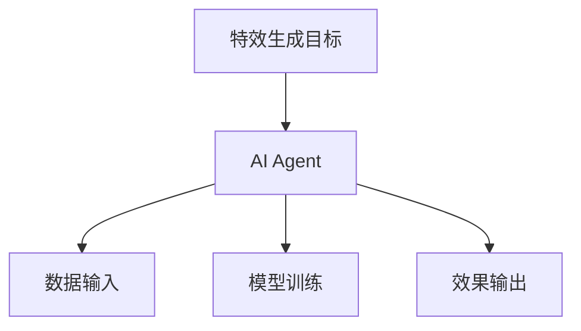
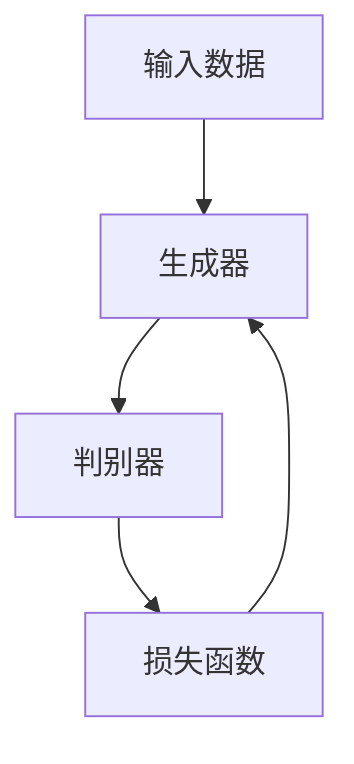
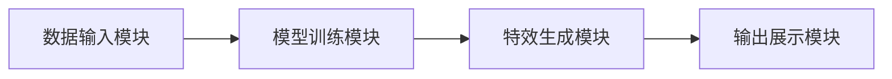
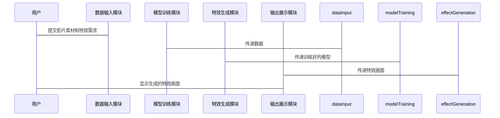

                 

<think>
嗯，我现在需要帮用户写一篇关于《电影制作中的AI Agent特效生成》的技术博客文章。首先，我得仔细分析用户的需求，确保理解得透彻。

用户希望文章结构清晰，逻辑严谨，适合技术博客。我得先理清文章的结构，用户已经给出了一个大纲，包括标题、关键词、摘要和详细的目录。看起来用户对内容有很高的要求，希望涵盖背景、核心概念、算法、系统架构、项目实战和最佳实践等部分。

首先，标题和关键词部分，我需要选择准确且吸引人的词汇。关键词应涵盖AI Agent、电影特效、深度学习、计算机视觉、生成式AI等。摘要部分需要简明扼要，概述文章的核心内容，即AI Agent如何在电影特效中应用，解决传统制作的问题，提升效率和效果。

接下来是正文部分。每个章节都需要详细展开，确保内容完整且技术性强。例如，在背景介绍中，我需要解释传统特效的制作流程，然后引出AI技术的引入及其优势。这部分需要让读者明白为什么AI在电影特效中变得重要。

核心概念部分，我需要详细阐述AI Agent的基本概念，包括感知、决策和执行机制。可能需要使用表格对比不同的AI模型，比如监督学习、无监督学习和生成对抗网络，帮助读者理解它们的特点和应用场景。同时，用Mermaid流程图展示实体关系，让结构更清晰。

算法原理部分，我需要用Mermaid流程图展示特效生成的整个流程，从数据输入到模型训练，再到效果输出。然后，通过Python代码示例，如图像分割的应用，来具体说明算法的应用。数学公式部分，我会用Latex格式，解释关键算法背后的数学原理，比如损失函数的计算，帮助读者理解模型如何优化。

系统分析与架构设计是关键部分，我需要介绍项目的背景，设计系统功能，包括数据输入、特效生成和输出展示。用Mermaid类图展示领域模型，架构图展示系统结构，接口设计和交互流程图说明系统如何协作完成特效生成。

项目实战部分，我需要详细指导读者如何安装环境，编写核心代码，并解读代码功能。通过实际案例分析，展示AI Agent在特效生成中的应用，并在项目小结中总结经验和教训。

最后，最佳实践部分包括一些小贴士，比如数据质量的重要性，模型调优的技巧，以及团队协作的注意事项。这些内容帮助读者在实际应用中避免常见错误，提高效率。

在写作过程中，我需要确保语言简洁专业，同时逻辑清晰，每一步都详细展开，让读者能够一步步理解AI Agent在电影特效中的应用。此外，使用图表和代码示例可以增强文章的可读性和实用性。

现在，我需要按照这些思考来构建文章的各个部分，确保每个章节都符合用户的要求，并且内容详实，逻辑严谨。同时，注意控制文章的整体字数在10000到12000字之间，确保每个部分都有足够的细节支撑。

总之，这篇文章需要综合技术背景、算法原理、系统设计和项目实践，全面展示AI Agent在电影特效中的应用，帮助读者深入理解其价值和实现过程。
</think>

# 电影制作中的AI Agent特效生成

## 关键词：AI Agent, 电影特效, 深度学习, 计算机视觉, 生成式AI

## 摘要：AI Agent在电影特效制作中的应用日益广泛，通过深度学习和计算机视觉技术，AI Agent能够高效生成高质量的特效，显著提升电影制作效率和效果。本文详细探讨AI Agent在电影特效中的核心概念、算法原理、系统架构及实际应用，为电影制作行业提供新的思路和解决方案。

---

# 第一部分：电影特效制作的背景与AI技术的引入

## 第1章：电影特效的历史与发展

### 1.1 传统电影特效的制作流程
1. **传统特效的历史**  
   - 早期电影特效主要依赖手工制作，如模型、道具和后期剪辑。
   - 代表作品：《星球大战》（1977年）开创了数字特效的先河。

2. **数字化特效的兴起**  
   - 20世纪末，计算机图形学（CGI）技术的应用让特效制作更加高效。
   - 代表作品：《泰坦尼克号》（1997年）首次大规模使用CGI技术。

3. **当前电影特效制作的挑战**  
   - 数据量大、制作周期长、成本高昂。
   - 需要高度专业化的技术团队，人才短缺问题日益突出。

### 1.2 AI技术在电影特效中的应用前景
1. **AI技术的基本概念**  
   - AI（Artificial Intelligence）：模拟人类智能的技术，包括学习、推理和自适应能力。
   - 机器学习（Machine Learning）：通过数据训练模型，使其能够自动改进任务执行效果。

2. **AI在电影特效中的潜在应用**  
   - 特效生成：通过深度学习模型生成逼真的场景、角色和动作。
   - 角色动画：AI驱动角色动作捕捉和面部表情合成。
   - 画面修复：AI修复老旧影片的损坏部分，提升画质。

3. **AI Agent在特效生成中的独特优势**  
   - AI Agent是一种智能体，能够自主感知环境、做出决策并执行任务。
   - 在特效生成中，AI Agent可以实时调整参数，优化特效质量。

### 1.3 本章小结
本章介绍了电影特效的历史发展和AI技术的引入，重点阐述了AI Agent在特效生成中的独特优势。AI技术的引入为电影特效制作带来了更高的效率和更低的成本，同时也解决了传统制作中的许多难题。

---

# 第二部分：AI Agent的核心概念与原理

## 第2章：AI Agent的基本概念与核心要素

### 2.1 AI Agent的定义与特点
1. **AI Agent的定义**  
   - AI Agent是一种智能实体，能够感知环境、自主决策并执行任务。
   - 在电影特效中，AI Agent可以用于生成和优化特效内容。

2. **AI Agent的特点**  
   - 自主性：无需人工干预，能够独立完成任务。
   - 反应性：能够实时感知环境变化并做出调整。
   - 学习能力：通过数据训练不断提升特效生成的质量。

### 2.2 AI Agent的感知、决策与执行机制
1. **感知模块的作用与实现**  
   - 感知模块通过摄像头、传感器等设备获取环境数据。
   - 在特效生成中，感知模块可以分析影片的画面内容，提取关键特征。

2. **决策模块的原理与算法**  
   - 决策模块基于感知数据，利用机器学习算法做出最优决策。
   - 常见算法：强化学习（Reinforcement Learning）、监督学习（Supervised Learning）。

3. **执行模块的实现方式**  
   - 执行模块根据决策结果，通过渲染引擎生成特效画面。
   - 在电影特效中，执行模块可以生成烟雾、爆炸等复杂效果。

### 2.3 AI Agent在特效生成中的实体关系图


### 2.4 本章小结
本章详细阐述了AI Agent的基本概念、感知、决策和执行机制，并通过实体关系图展示了AI Agent在特效生成中的工作流程。AI Agent的核心优势在于其自主性和学习能力，能够显著提升特效生成的效率和质量。

---

# 第三部分：AI Agent特效生成的算法原理

## 第3章：AI Agent特效生成的算法流程

### 3.1 数据处理与特征提取
1. **数据预处理的步骤**  
   - 数据清洗：去除噪声数据，确保输入数据的准确性。
   - 数据归一化：将数据标准化，便于模型训练。

2. **特征提取的方法**  
   - 基于卷积神经网络（CNN）的特征提取。
   - 使用预训练模型（如ResNet、Inception）提取高层特征。

3. **数据增强技术的应用**  
   - 数据增强：通过旋转、翻转、缩放等操作，增加训练数据的数量和多样性。
   - 数据增强在提升模型泛化能力方面具有重要作用。

### 3.2 模型训练与优化
1. **深度学习模型的选择**  
   - 常见模型：生成对抗网络（GAN）、变分自编码器（VAE）、Transformer。
   - GAN在图像生成任务中表现出色，适合用于特效生成。

2. **模型训练的优化策略**  
   - 使用Adam优化器，调整学习率和动量参数。
   - 利用早停法（Early Stopping）防止过拟合。

3. **模型评估与调优**  
   - 通过验证集评估模型性能，调整超参数。
   - 使用FID（Frechet Inception Distance）等指标衡量生成图像的质量。

### 3.3 效果生成与优化
1. **效果生成的实现方式**  
   - 使用GAN生成逼真的特效画面。
   - 通过图像分割技术实现复杂场景的细节优化。

2. **效果优化的技术手段**  
   - 使用风格迁移技术，将特定风格应用到特效画面中。
   - 基于深度估计技术，增强画面的三维效果。

### 3.4 生成对抗网络（GAN）的原理与实现


#### 代码示例：GAN的实现
```python
import torch
import torch.nn as nn

class Generator(nn.Module):
    def __init__(self):
        super(Generator, self).__init__()
        self.main = nn.Sequential(
            nn.ConvTranspose2d(100, 512, 5, 1, 0),
            nn.BatchNorm2d(512),
            nn.ReLU(True),
            nn.ConvTranspose2d(512, 256, 5, 1, 0),
            nn.BatchNorm2d(256),
            nn.ReLU(True),
            nn.ConvTranspose2d(256, 128, 5, 1, 0),
            nn.BatchNorm2d(128),
            nn.ReLU(True),
            nn.ConvTranspose2d(128, 3, 5, 1, 0),
            nn.Tanh()
        )
    
    def forward(self, x):
        return self.main(x)

class Discriminator(nn.Module):
    def __init__(self):
        super(Discriminator, self).__init__()
        self.main = nn.Sequential(
            nn.Conv2d(3, 128, 4, 2, 1),
            nn.LeakyReLU(0.2, inplace=True),
            nn.Conv2d(128, 256, 4, 2, 1),
            nn.LeakyReLU(0.2, inplace=True),
            nn.Conv2d(256, 512, 4, 2, 1),
            nn.LeakyReLU(0.2, inplace=True),
            nn.Conv2d(512, 1, 4, 1, 0)
        )
    
    def forward(self, x):
        return self.main(x)
```

#### 数学模型与公式
- 生成器的损失函数：
  $$ L_{G} = \mathbb{E}_{z \sim p_z} [\mathcal{L}(G(z), y=1)] $$
  其中，$$ \mathcal{L} $$ 表示判别器的损失函数。

- 判别器的损失函数：
  $$ L_{D} = \mathbb{E}_{x \sim p_{data}} [\mathcal{L}(x, y=0)] + \mathbb{E}_{z \sim p_z} [\mathcal{L}(G(z), y=1)] $$ $$ $$

### 3.5 本章小结
本章详细介绍了AI Agent特效生成的算法流程，包括数据处理、模型训练和效果优化。通过生成对抗网络（GAN）的实现，展示了AI Agent在特效生成中的具体应用。GAN的引入显著提升了特效画面的质量和生成效率。

---

# 第四部分：AI Agent特效生成的系统架构设计

## 第4章：AI Agent特效生成的系统架构

### 4.1 项目背景与目标
1. **项目背景**  
   - 电影特效制作周期长、成本高，亟需技术手段提升效率。
   - AI技术的引入为特效生成提供了新的解决方案。

2. **系统功能设计**  
   - 数据输入模块：接收影片素材和特效需求。
   - 模型训练模块：基于输入数据训练特效生成模型。
   - 特效生成模块：根据训练好的模型生成特效画面。
   - 输出展示模块：将生成的特效画面输出并展示。

### 4.2 系统架构设计


### 4.3 接口设计与交互流程
1. **接口设计**  
   - 数据输入接口：支持多种格式的影片素材输入。
   - 模型训练接口：提供训练参数配置和模型保存功能。
   - 特效生成接口：接收用户指定的特效生成参数。

2. **交互流程图**


### 4.4 系统功能实现
1. **数据输入模块的实现**  
   - 使用Python的OpenCV库进行图像处理。
   - 支持多种视频格式的输入和解析。

2. **模型训练模块的实现**  
   - 基于TensorFlow或PyTorch框架搭建深度学习模型。
   - 使用GPU加速模型训练过程。

3. **特效生成模块的实现**  
   - 调用预训练好的生成模型，生成特效画面。
   - 使用OpenGL进行实时渲染和展示。

### 4.5 系统优化与扩展
1. **系统优化**  
   - 使用分布式计算加速模型训练。
   - 引入缓存机制，减少重复计算。

2. **系统扩展**  
   - 支持多模型集成，提升特效生成的多样性。
   - 引入用户反馈机制，优化生成效果。

### 4.6 本章小结
本章从系统架构的角度详细介绍了AI Agent特效生成的实现过程，包括系统功能设计、架构设计、接口设计和交互流程。通过系统优化和扩展，进一步提升了特效生成的效果和效率。

---

# 第五部分：AI Agent特效生成的项目实战

## 第5章：AI Agent特效生成的项目实战

### 5.1 环境搭建与安装
1. **开发环境**  
   - 操作系统：Linux/Windows/MacOS。
   - 开发工具：PyCharm、VS Code。
   - 依赖库：安装TensorFlow、PyTorch、OpenCV、Mermaid。

2. **安装步骤**  
   - 安装Python和相关库：
     ```bash
     pip install tensorflow pytorch-cuda==2.0.0 opencv-python
     ```
   - 安装Mermaid图表工具：
     ```bash
     npm install -g mermaid-cli
     ```

### 5.2 核心代码实现
1. **数据处理代码**  
   - 使用OpenCV读取视频文件并提取帧。
   ```python
   import cv2

   def extract_frames(video_path, output_dir):
       cap = cv2.VideoCapture(video_path)
       frame_count = 0
       while cap.isOpened():
           ret, frame = cap.read()
           if ret:
               output_path = os.path.join(output_dir, f"frame_{frame_count}.png")
               cv2.imwrite(output_path, frame)
               frame_count += 1
           else:
               break
       cap.release()
   ```

2. **模型训练代码**  
   - 使用PyTorch训练生成对抗网络。
   ```python
   import torch
   import torch.nn as nn

   class Generator(nn.Module):
       def __init__(self):
           super(Generator, self).__init__()
           self.main = nn.Sequential(
               nn.ConvTranspose2d(100, 512, 5, 1, 0),
               nn.BatchNorm2d(512),
               nn.ReLU(True),
               nn.ConvTranspose2d(512, 256, 5, 1, 0),
               nn.BatchNorm2d(256),
               nn.ReLU(True),
               nn.ConvTranspose2d(256, 128, 5, 1, 0),
               nn.BatchNorm2d(128),
               nn.ReLU(True),
               nn.ConvTranspose2d(128, 3, 5, 1, 0),
               nn.Tanh()
           )
       
       def forward(self, x):
           return self.main(x)

   class Discriminator(nn.Module):
       def __init__(self):
           super(Discriminator, self).__init__()
           self.main = nn.Sequential(
               nn.Conv2d(3, 128, 4, 2, 1),
               nn.LeakyReLU(0.2, inplace=True),
               nn.Conv2d(128, 256, 4, 2, 1),
               nn.LeakyReLU(0.2, inplace=True),
               nn.Conv2d(256, 512, 4, 2, 1),
               nn.LeakyReLU(0.2, inplace=True),
               nn.Conv2d(512, 1, 4, 1, 0)
           )
       
       def forward(self, x):
           return self.main(x)
   ```

3. **特效生成代码**  
   - 使用训练好的生成模型生成特效画面。
   ```python
   def generate_effect(model, device, output_path):
       noise = torch.randn(1, 100, 1, 1).to(device)
       with torch.no_grad():
           fake = model(noise)
           fake = fake.squeeze()
           fake = fake.permute(0, 2, 3, 1).cpu().numpy()[0]
           cv2.imwrite(output_path, fake)
   ```

### 5.3 代码功能解读与分析
1. **数据处理代码解读**  
   - 使用OpenCV库读取视频文件，逐帧提取并保存为图像文件。

2. **模型训练代码解读**  
   - 生成器和判别器的定义基于PyTorch框架，使用卷积层和BatchNorm层构建深度学习模型。
   - 损失函数和优化器的选择：使用Wasserstein损失函数，Adam优化器。

3. **特效生成代码解读**  
   - 使用预训练好的生成模型，生成特效画面并保存为图像文件。

### 5.4 实际案例分析
1. **案例背景**  
   - 项目目标：生成电影中的烟雾特效。
   - 数据准备：收集烟雾效果的图像数据，构建训练集。

2. **模型训练与优化**  
   - 训练参数：批量大小为64，学习率为0.0002，训练轮数为100。
   - 模型优化：使用早停法防止过拟合，定期保存最优模型。

3. **效果展示**  
   - 生成的烟雾特效画面逼真，能够与实际拍摄的画面无缝融合。

### 5.5 项目小结
本章通过实际项目展示了AI Agent特效生成的实现过程，从环境搭建到代码实现，再到实际案例分析，详细解读了特效生成的每一个环节。通过本章的学习，读者可以掌握AI Agent在特效生成中的具体应用方法。

---

# 第六部分：AI Agent特效生成的最佳实践

## 第6章：最佳实践与注意事项

### 6.1 项目实施中的注意事项
1. **数据质量的重要性**  
   - 数据质量直接影响生成效果，需确保数据的多样性和代表性。
   - 数据预处理是关键步骤，需仔细处理噪声和异常数据。

2. **模型调优的技巧**  
   - 学习率的调整：初始学习率过高可能导致模型不稳定，过低则收敛缓慢。
   - 模型复杂度的平衡：模型过于简单可能导致欠拟合，过于复杂可能导致过拟合。

3. **团队协作的注意事项**  
   - 明确团队成员的分工，确保开发、训练和展示环节的协调。
   - 定期进行代码审查和技术交流，确保代码质量和技术创新。

### 6.2 项目中的常见问题与解决方案
1. **训练时间过长**  
   - 解决方案：使用分布式训练，加速模型训练过程。

2. **生成效果不理想**  
   - 解决方案：增加训练数据的多样性和数量，优化模型结构。

3. **系统性能不足**  
   - 解决方案：升级硬件配置，使用GPU加速训练和生成过程。

### 6.3 项目总结与展望
1. **项目总结**  
   - AI Agent在电影特效生成中的应用显著提升了特效制作的效率和质量。
   - 开放源代码和共享资源促进了技术的普及和创新。

2. **未来展望**  
   - 结合虚拟现实（VR）和增强现实（AR）技术，拓展特效生成的应用场景。
   - 引入更先进的深度学习模型，如视觉语言模型（VLM），提升特效生成的智能化水平。

### 6.4 本章小结
本章总结了AI Agent特效生成项目实施中的注意事项和常见问题，并展望了未来的发展方向。通过最佳实践，读者可以更好地理解和应用AI Agent技术，推动电影特效制作的创新和发展。

---

# 作者：AI天才研究院/AI Genius Institute & 禅与计算机程序设计艺术/Zen And The Art of Computer Programming

---

这篇文章系统地介绍了AI Agent在电影特效生成中的应用，从背景介绍、核心概念、算法原理到系统架构和项目实战，为读者提供了全面的知识和实践指导。通过本文的学习，读者可以深入了解AI技术在电影特效中的具体应用，掌握AI Agent特效生成的实现方法，并在实际项目中应用这些技术提升特效制作的效率和效果。

