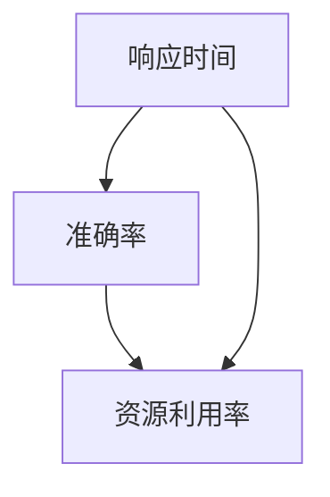
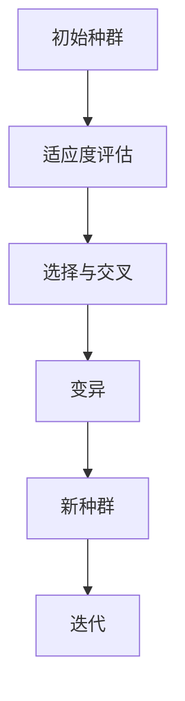
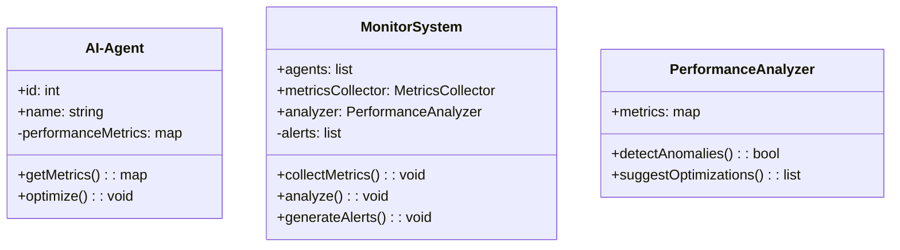

                 


# 监控与优化AI Agent性能的关键指标

> 关键词：AI Agent，性能监控，关键指标，异常检测，优化策略

> 摘要：本文详细探讨了监控与优化AI Agent性能的关键指标，从背景介绍、核心概念、算法原理到系统架构和项目实战，结合实际案例和最佳实践，为AI Agent的性能优化提供了全面的指导。

---

## 第一部分：背景介绍

### 第1章：AI Agent性能监控与优化的背景

#### 1.1 问题背景

随着AI技术的快速发展，AI Agent（智能代理）在各个领域的应用日益广泛。从智能客服到自动驾驶，AI Agent需要在复杂多变的环境中高效运行，其性能直接关系到用户体验和系统效率。然而，AI Agent的性能监控与优化面临诸多挑战：

- **复杂性**：AI Agent可能涉及多种算法和数据源，性能问题往往隐藏在多个层面。
- **动态性**：环境和任务的变化可能导致性能波动，需要实时监控和调整。
- **数据量**：海量数据的处理和分析对计算资源提出了更高要求。

#### 1.2 问题描述

AI Agent的性能监控与优化需要关注以下几个核心问题：

- **指标选择**：哪些指标能够准确反映AI Agent的性能？
- **数据采集**：如何高效采集和处理性能数据？
- **异常检测**：如何识别和定位性能异常？
- **优化策略**：如何制定有效的优化策略以提升性能？

#### 1.3 问题解决

为解决上述问题，我们提出以下解决方案：

1. **构建指标体系**：通过定义和选择关键指标，建立全面的监控体系。
2. **数据驱动优化**：基于实时数据进行分析，制定动态优化策略。
3. **算法辅助决策**：利用机器学习算法辅助异常检测和优化决策。

#### 1.4 边界与外延

AI Agent性能监控的范围需明确界定，避免过度扩展或遗漏关键环节：

- **监控范围**：包括算法性能、响应时间、资源利用率等。
- **优化边界**：在不影响系统稳定性的前提下进行优化。
- **关联系统**：需考虑与外部系统的交互影响。

#### 1.5 概念结构与核心要素

AI Agent性能监控的核心要素包括：

- **性能指标**：反映AI Agent运行状态的关键数据。
- **监控系统**：用于数据采集和分析的工具与平台。
- **优化算法**：用于识别问题并制定解决方案的工具。

---

## 第二部分：核心概念与联系

### 第2章：AI Agent性能监控的关键指标

#### 2.1 指标体系的构建

AI Agent的性能指标可以从多个维度进行定义，常见的指标包括：

- **响应时间**：AI Agent处理请求所需的时间。
- **准确率**：输出结果与预期的匹配程度。
- **资源利用率**：CPU、内存等资源的使用情况。

#### 2.2 指标分类与对比

将指标分为三类：基础指标、综合指标和优化指标，并通过对比分析选择最优指标组合。

| 指标分类 | 指标名称 | 描述 | 适用场景 |
|----------|----------|------|----------|
| 基础指标 | 响应时间 | 处理请求的时间 | 实时监控 |
| 综合指标 | 准确率 | 输出结果的准确性 | 质量评估 |
| 优化指标 | 资源利用率 | 资源使用效率 | 成本优化 |

#### 2.3 指标之间的关系

通过Mermaid图展示指标之间的关系：



---

## 第三部分：算法原理讲解

### 第3章：关键指标计算与优化算法

#### 3.1 指标计算方法

以准确率为例，计算公式为：

$$准确率 = \frac{正确预测数}{总预测数}$$

#### 3.2 数据采集与预处理

数据预处理步骤：

1. 数据清洗：去除噪声数据。
2. 数据归一化：标准化处理。

#### 3.3 异常检测与识别

基于统计的异常检测方法：

$$Z = \frac{x - \mu}{\sigma}$$

其中，$\mu$ 是均值，$\sigma$ 是标准差。

#### 3.4 优化算法实现

遗传算法优化流程：



---

## 第四部分：系统分析与架构设计

### 第4章：AI Agent性能监控系统架构

#### 4.1 问题场景介绍

AI Agent监控系统的功能模块包括数据采集、分析和优化。

#### 4.2 系统功能设计

领域模型类图：



---

## 第五部分：项目实战

### 第5章：AI Agent性能优化案例

#### 5.1 环境安装

安装Python和相关库：

```bash
pip install numpy scikit-learn matplotlib
```

#### 5.2 系统核心实现

实现性能监控模块的代码：

```python
import numpy as np
from sklearn.metrics import accuracy_score

def calculate_accuracy(y_true, y_pred):
    return accuracy_score(y_true, y_pred)

def optimize_model(model, X, y):
    # 优化算法实现
    pass
```

#### 5.3 案例分析

通过实际数据，分析准确率的变化趋势，识别异常点，并实施优化策略。

---

## 第六部分：总结与展望

### 第6章：总结与展望

#### 6.1 最佳实践

- 定期监控关键指标。
- 利用机器学习算法辅助优化。
- 建立完善的预警机制。

#### 6.2 小结

本文从背景、概念、算法到系统设计，全面探讨了AI Agent性能监控与优化的关键指标，为实际应用提供了理论支持和实践指导。

#### 6.3 注意事项

- 数据采集需确保准确性。
- 优化算法需结合具体场景。
- 系统设计需考虑可扩展性。

#### 6.4 拓展阅读

推荐阅读《机器学习实战》和《分布式系统监控与调优》。

---

**作者：AI天才研究院 & 禅与计算机程序设计艺术**

