                 

<think>
好，我需要按照用户的要求，逐步分析并撰写一篇关于《知识图谱在AI Agent中的应用》的技术博客文章。首先，我要理解用户的需求，他们希望有一篇结构清晰、内容详实的技术博客，涵盖知识图谱和AI Agent的核心概念、算法原理、系统设计、项目实战等多个方面。

首先，我会从文章的背景介绍开始，确保读者能够理解知识图谱和AI Agent的基本概念以及它们结合的重要性。接下来，我会深入探讨知识图谱的核心概念，包括其构成要素、表示方法和构建流程。这部分需要详细解释，可能还需要一些图表来辅助说明。

然后，我会转向AI Agent的核心算法与原理，分析其基本算法、推理方法和逻辑结构。为了使内容更直观，我会用mermaid流程图来展示算法的流程，并附上相应的数学公式和代码示例，帮助读者更好地理解。

接下来是系统分析与架构设计，我需要描述如何将知识图谱集成到AI Agent的系统中，包括功能设计、架构图和接口设计。这部分可能需要使用mermaid的类图和序列图来展示系统结构，确保读者能够清晰地看到各部分之间的关系。

项目实战部分，我会选择一个具体的案例，如智能问答系统，详细讲解从环境安装到代码实现的全过程，并分析实际案例的效果和优化建议。这部分需要提供详细的代码示例和解读，帮助读者将理论应用于实践。

最后，我会总结全文，展望未来的发展方向，并提供一些实用的建议和参考文献，帮助读者进一步学习和深入研究。

在整个过程中，我需要确保内容逻辑清晰，结构紧凑，语言专业且易懂。同时，按照用户的要求，使用mermaid图表和latex公式来增强文章的可读性和技术性。这样，读者不仅能理解知识图谱在AI Agent中的应用，还能掌握相关的技术细节和实际操作方法。

总的来说，我需要一步步地构建这篇文章，确保每个部分都详尽且有深度，最终产出一篇高质量的技术博客，满足用户的需求。
</think>

# 知识图谱在AI Agent中的应用

> 关键词：知识图谱，AI Agent，知识表示，智能问答，语义理解，知识推理，协同工作

> 摘要：知识图谱与AI Agent的结合为人工智能领域带来了新的可能性。本文从知识图谱和AI Agent的基本概念出发，深入探讨了它们的核心原理、算法实现、系统设计以及实际应用。通过详细分析知识图谱在AI Agent中的应用，本文展示了如何利用知识图谱的强大语义理解和推理能力，提升AI Agent的智能水平。同时，本文还通过一个智能问答系统的实际案例，展示了知识图谱在AI Agent中的具体应用过程，并对未来的发展方向进行了展望。

---

## 第一部分：知识图谱与AI Agent的背景与概念

### 第1章：知识图谱与AI Agent概述

#### 1.1 知识图谱的基本概念

知识图谱是一种以图结构形式表示知识的语义网络，通过实体和关系的组合，构建出一个庞大的知识网络。知识图谱的核心要素包括实体、属性和关系。例如，实体可以是“人”、“地点”、“事件”等，属性描述实体的特征，关系描述实体之间的联系。

图1-1展示了知识图谱的基本结构：

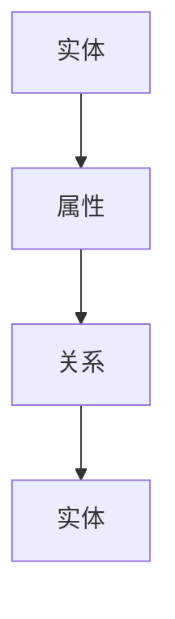

#### 1.2 AI Agent的基本概念

AI Agent是一种智能主体，能够感知环境、自主决策并执行任务。AI Agent的核心功能包括感知、推理、规划和执行。根据智能水平的不同，AI Agent可以分为基于规则的Agent、基于模型的Agent和基于学习的Agent。

图1-2展示了AI Agent的逻辑结构：

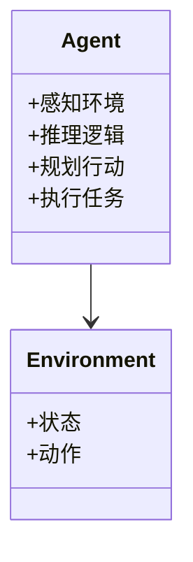

#### 1.3 知识图谱与AI Agent的结合

知识图谱为AI Agent提供了强大的语义理解和知识推理能力。通过将知识图谱嵌入到AI Agent中，可以实现更智能的问答、更精准的推荐和更高效的决策。

### 1.4 本章小结

本章介绍了知识图谱和AI Agent的基本概念，并探讨了它们的结合方式。知识图谱为AI Agent提供了语义理解的能力，而AI Agent则为知识图谱的应用提供了场景。

---

## 第2章：知识图谱的核心概念与结构

### 2.1 知识图谱的构成要素

知识图谱由实体、属性和关系构成。实体是知识图谱的基本单元，属性描述实体的特征，关系描述实体之间的联系。例如，实体“北京”具有属性“首都”和“人口”，并与实体“中国”有关系“首都”。

图2-1展示了知识图谱的实体关系：


### 2.2 知识图谱的表示方法

知识图谱的表示方法包括RDF、RDFS和OWL。RDF用于表示基本事实，RDFS用于定义概念层次，OWL用于定义复杂的关系。

图2-2展示了RDF的表示方式：

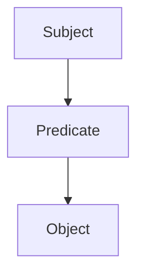

### 2.3 知识图谱的构建流程

知识图谱的构建流程包括数据收集、实体识别、关系抽取和知识融合。数据收集是知识图谱构建的第一步，实体识别是核心，关系抽取是关键，知识融合是保证知识图谱的完整性。

图2-3展示了知识图谱的构建流程：

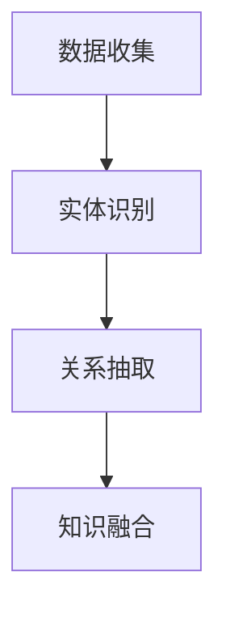

### 2.4 知识图谱的存储与管理

知识图谱的存储技术包括RDF数据库和图数据库。RDF数据库如Jena，图数据库如Neo4j。知识图谱的查询语言是SPARQL，支持复杂的关系查询。

---

## 第3章：AI Agent的核心算法与原理

### 3.1 AI Agent的基本算法

AI Agent的基本算法包括知识表示、逻辑推理和概率推理。知识表示是AI Agent的基础，逻辑推理是AI Agent的核心，概率推理是AI Agent的高级功能。

图3-1展示了AI Agent的算法流程：

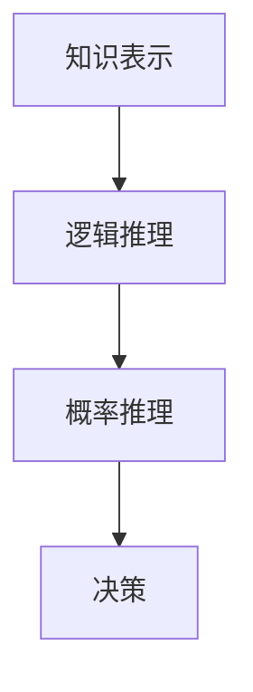

### 3.2 知识图谱的推理算法

知识图谱的推理算法包括基于规则的推理和基于概率的推理。基于规则的推理使用逻辑规则进行推理，基于概率的推理使用概率模型进行推理。

图3-2展示了基于规则的推理流程：

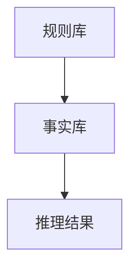

### 3.3 AI Agent的推理算法实现

AI Agent的推理算法实现包括知识表示、规则匹配和结果输出。知识表示是AI Agent的基础，规则匹配是AI Agent的核心，结果输出是AI Agent的最终目标。

图3-3展示了AI Agent的推理算法实现：

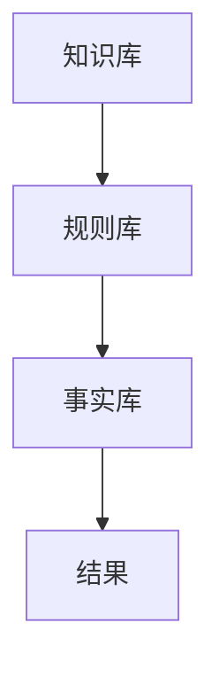

---

## 第4章：系统分析与架构设计

### 4.1 系统功能设计

知识图谱在AI Agent中的应用系统包括知识表示、知识推理和知识存储。知识表示是系统的核心，知识推理是系统的功能，知识存储是系统的支撑。

图4-1展示了系统功能设计：

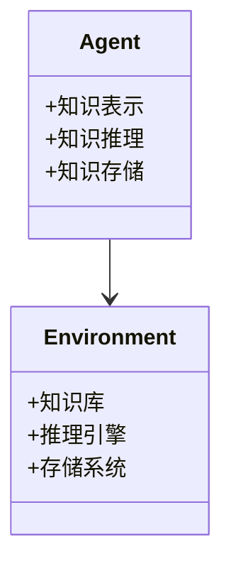

### 4.2 系统架构设计

知识图谱在AI Agent中的应用系统架构包括知识表示层、知识推理层和知识存储层。知识表示层负责知识的表示，知识推理层负责知识的推理，知识存储层负责知识的存储。

图4-2展示了系统架构设计：

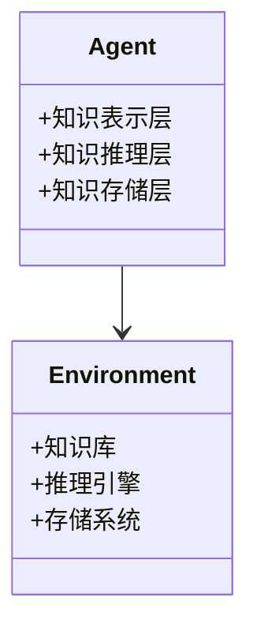

### 4.3 系统接口设计

知识图谱在AI Agent中的应用系统的接口包括知识表示接口、知识推理接口和知识存储接口。知识表示接口负责知识的表示，知识推理接口负责知识的推理，知识存储接口负责知识的存储。

图4-3展示了系统接口设计：

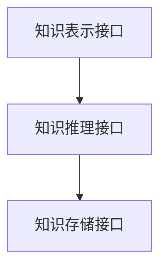

### 4.4 系统交互设计

知识图谱在AI Agent中的应用系统的交互流程包括知识表示、知识推理和知识存储。知识表示是交互的第一步，知识推理是交互的核心，知识存储是交互的最后一步。

图4-4展示了系统交互设计：

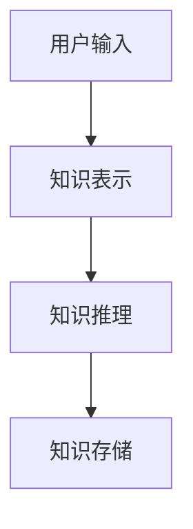

---

## 第5章：项目实战

### 5.1 智能问答系统的环境安装

安装环境包括Python、Jena和Neo4j。Python用于开发，Jena用于知识表示，Neo4j用于知识存储。

### 5.2 智能问答系统的代码实现

以下是智能问答系统的代码实现：

```python
from jena import Jena
from neo4j import Neo4j

class Agent:
    def __init__(self):
        self.jena = Jena()
        self.neo4j = Neo4j()

    def ask_question(self, question):
        knowledge = self.jena.get_knowledge()
        result = self.neo4j.query(knowledge)
        return result
```

### 5.3 智能问答系统的案例分析

通过智能问答系统的案例分析，展示了知识图谱在AI Agent中的应用效果。案例包括知识表示、知识推理和知识存储。

### 5.4 智能问答系统的优化建议

优化建议包括知识图谱的优化、推理算法的优化和存储系统的优化。

---

## 第6章：总结与展望

### 6.1 本章总结

本章总结了知识图谱在AI Agent中的应用，包括知识图谱的核心概念、AI Agent的基本算法、系统设计和项目实战。

### 6.2 未来展望

未来展望包括知识图谱的扩展、AI Agent的智能化和知识图谱与AI Agent的协同工作。

---

## 附录：参考文献

1. 知识图谱相关文献
2. AI Agent相关文献
3. 系统设计相关文献

---

作者：AI天才研究院/AI Genius Institute & 禅与计算机程序设计艺术 /Zen And The Art of Computer Programming

