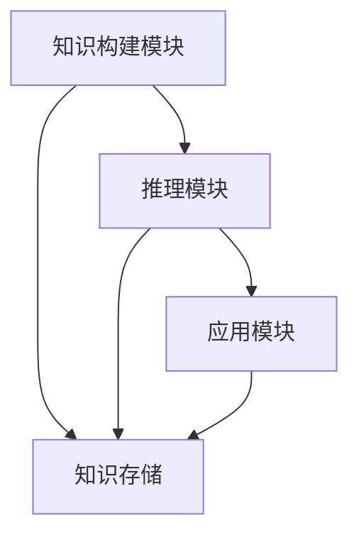

                 


# 知识图谱推理：提升AI Agent的逻辑分析

> 关键词：知识图谱、推理、AI Agent、逻辑分析、符号逻辑、概率推理、深度学习

> 摘要：本文深入探讨了知识图谱推理在提升AI Agent逻辑分析能力中的关键作用。通过分析知识图谱的构建与表示、推理算法的核心原理、系统架构设计以及项目实战，展示了如何利用知识图谱推理技术赋予AI Agent更强大的逻辑分析能力。从符号逻辑到概率推理，再到深度学习推理，本文全面解析了各种推理方法，并通过实际案例演示了如何实现这些技术。

---

## 第1章: 知识图谱与推理概述

### 1.1 知识图谱的基本概念

#### 1.1.1 知识图谱的定义
知识图谱是一种以图结构形式表示知识的语义网络，包含实体和它们之间的关系。它通过节点表示实体，边表示实体之间的关系，形成一个巨大的网络，能够表示丰富的语义信息。

#### 1.1.2 知识图谱的构建方法
知识图谱的构建过程包括数据收集、实体识别、关系抽取、知识融合等多个步骤。常见的构建方法有基于规则的构建、基于统计的构建和基于深度学习的构建。

#### 1.1.3 知识图谱的表示形式
知识图谱常用的表示形式有三元组表示（subject-predicate-object）、属性-值表示和图数据库表示。三元组是最常用的表示形式，例如（中国，capital，北京）。

### 1.2 推理的基本概念

#### 1.2.1 推理的定义
推理是根据已有的知识和规则，推导出新的结论的过程。它是AI系统实现智能决策的核心技术之一。

#### 1.2.2 推理的类型
推理主要分为两类：演绎推理和归纳推理。演绎推理是从一般到特殊的推理，而归纳推理则是从特殊到一般的推理。

#### 1.2.3 推理在AI Agent中的作用
推理能力是AI Agent的核心能力之一，它使得AI Agent能够根据已有的知识库进行逻辑推理，从而做出更智能的决策和回答。

### 1.3 知识图谱推理的定义与特点

#### 1.3.1 知识图谱推理的定义
知识图谱推理是指在知识图谱的基础上，结合推理技术，从已有的知识中推导出新的知识或结论的过程。

#### 1.3.2 知识图谱推理的核心特点
知识图谱推理具有语义丰富、可扩展性强、动态更新能力强等特点。它能够处理复杂的关系和语义信息，适用于各种复杂的推理场景。

#### 1.3.3 知识图谱推理与传统推理的区别
知识图谱推理结合了图结构和语义信息，能够处理非结构化和半结构化的数据，而传统推理主要处理结构化的数据。

### 1.4 知识图谱推理的应用场景

#### 1.4.1 知识图谱推理在自然语言处理中的应用
知识图谱推理可以用于问答系统、语义理解等任务，帮助模型更好地理解上下文和语义信息。

#### 1.4.2 知识图谱推理在智能问答中的应用
通过知识图谱推理，智能问答系统能够回答复杂的问题，并提供更准确的答案。

#### 1.4.3 知识图谱推理在推荐系统中的应用
知识图谱推理可以用于推荐系统的知识增强，帮助推荐系统更好地理解用户的需求和偏好。

---

## 第2章: 知识图谱的构建与表示

### 2.1 知识图谱的构建过程

#### 2.1.1 数据收集与预处理
数据收集是知识图谱构建的第一步，需要从各种数据源（如网页、数据库、文本等）收集数据，并进行清洗和预处理。

#### 2.1.2 实体识别与关系抽取
通过自然语言处理技术，从文本中识别出实体及其之间的关系。这一步是知识图谱构建的关键步骤。

#### 2.1.3 知识融合与冲突处理
将多个数据源中的知识进行融合，并处理可能存在的冲突，确保知识图谱的准确性和一致性。

### 2.2 知识图谱的表示方法

#### 2.2.1 基于图的表示方法
基于图的表示方法是最常用的表示形式，通过节点和边表示实体和关系，例如（中国，capital，北京）。

#### 2.2.2 基于向量的表示方法
基于向量的表示方法将实体和关系映射到向量空间中，例如使用Word2Vec对实体进行向量化表示。

#### 2.2.3 基于符号逻辑的表示方法
基于符号逻辑的表示方法使用符号和规则来表示知识，例如使用谓词逻辑表示实体和关系。

### 2.3 知识图谱的存储与管理

#### 2.3.1 图数据库的选择与使用
常见的图数据库有Neo4j、RDF4J等，选择合适的图数据库能够提高知识图谱的存储和查询效率。

#### 2.3.2 知识图谱的索引与查询优化
通过建立索引和优化查询策略，可以提高知识图谱的查询效率，例如使用RDF三元组索引。

#### 2.3.3 知识图谱的版本控制与更新
知识图谱需要定期更新和维护，版本控制可以帮助追踪修改历史，确保知识图谱的准确性和一致性。

---

## 第3章: 推理算法与模型

### 3.1 基于符号逻辑的推理算法

#### 3.1.1 命题逻辑推理
命题逻辑推理是基于命题逻辑的推理方法，通过真值表和推理规则进行推理，例如“如果A则B，B则C，因此如果A则C”。

#### 3.1.2 一阶谓词逻辑推理
一阶谓词逻辑推理是基于谓词逻辑的推理方法，能够处理更复杂的逻辑关系，例如“所有的人都是 mortal，Socrates是人，因此Socrates是mortal”。

#### 3.1.3 逻辑推理的实现方法
一阶谓词逻辑推理的实现方法包括基于规则的推理和基于模型的推理，常用工具如Prolog和Datalog。

### 3.2 基于概率的推理算法

#### 3.2.1 贝叶斯网络推理
贝叶斯网络是一种有向无环图，通过概率分布进行推理，例如计算某个事件发生的概率。

#### 3.2.2 马尔可夫逻辑网络推理
马尔可夫逻辑网络将概率推理与逻辑推理相结合，通过加权逻辑规则进行推理。

#### 3.2.3 概率推理的优缺点分析
概率推理具有处理不确定性能力强的优点，但计算复杂度较高，且需要大量的数据支持。

### 3.3 基于深度学习的推理算法

#### 3.3.1 基于图神经网络的推理
图神经网络通过处理图结构数据，进行推理和学习，例如在知识图谱中进行节点分类和链接预测。

#### 3.3.2 基于Transformer的推理
Transformer模型通过自注意力机制，进行序列建模和推理，例如在自然语言处理中进行语义理解。

#### 3.3.3 深度学习推理的挑战与解决方案
深度学习推理的挑战包括计算资源消耗大、模型解释性差等，解决方案包括模型压缩、知识蒸馏等技术。

---

## 第4章: 知识图谱推理的算法实现

### 4.1 基于符号逻辑的推理实现

#### 4.1.1 知识图谱的符号表示
将知识图谱中的实体和关系表示为符号，例如将“中国”表示为符号C，“capital”表示为符号P。

#### 4.1.2 命题逻辑推理的代码实现
使用逻辑编程语言如Prolog实现命题逻辑推理，例如编写规则“capital(C, P) ∧ country(C) ⇒ capital_of(C, P)”进行推理。

#### 4.1.3 一阶谓词逻辑推理的代码实现
使用逻辑推理库如Pylog或Deduction等，实现一阶谓词逻辑推理，例如通过规则库进行推理。

### 4.2 基于概率的推理实现

#### 4.2.1 贝叶斯网络的构建与推理
使用贝叶斯网络库如NetworkX或PyMC，构建贝叶斯网络并进行概率推理，例如计算某个节点的后验概率。

#### 4.2.2 马尔可夫逻辑网络的推理实现
使用马尔可夫逻辑网络库如Tuffy或ProbLog，进行加权逻辑规则的推理，例如通过规则权重进行推理。

#### 4.2.3 概率推理的代码实现与优化
通过优化算法和数据结构，提高概率推理的效率，例如使用近似推理方法减少计算量。

### 4.3 基于深度学习的推理实现

#### 4.3.1 图神经网络的构建与推理
使用图神经网络框架如GraphSAGE或GAT，构建图神经网络并进行推理，例如通过节点嵌入进行分类。

#### 4.3.2 Transformer模型的推理实现
使用Transformer模型进行序列推理，例如在自然语言处理中进行句法分析和语义理解。

#### 4.3.3 深度学习推理的性能优化
通过模型压缩、并行计算等技术，提高深度学习推理的性能，例如减少模型参数和计算复杂度。

---

## 第5章: 知识图谱推理的系统架构与设计

### 5.1 系统架构设计

#### 5.1.1 系统模块划分
知识图谱推理系统通常包括知识构建模块、推理模块和应用模块。知识构建模块负责知识图谱的构建和管理，推理模块负责推理和知识生成，应用模块负责与用户的交互和结果展示。

#### 5.1.2 系统功能设计
系统的功能包括知识图谱的构建、推理、查询和结果展示。推理模块是核心，负责根据输入的查询进行推理并返回结果。

#### 5.1.3 系统架构图展示（Mermaid）
以下是知识图谱推理系统的架构图：



### 5.2 系统接口设计

#### 5.2.1 接口定义与规范
系统的接口包括知识构建接口、推理接口和应用接口。知识构建接口用于添加和更新知识图谱，推理接口用于接收查询并返回结果，应用接口用于展示结果。

#### 5.2.2 接口交互流程
知识构建模块接收数据后，进行处理和存储，推理模块根据查询进行推理，应用模块展示结果。

#### 5.2.3 接口实现注意事项
接口设计需要考虑性能、安全性和可扩展性，确保系统的高效运行和数据的安全。

### 5.3 系统交互设计

#### 5.3.1 用户与系统的交互流程
用户通过应用模块提交查询，系统进行推理并返回结果。

#### 5.3.2 系统内部模块的交互流程
知识构建模块与推理模块交互，推理模块与应用模块交互。

#### 5.3.3

---

## 第6章: 项目实战

### 6.1 项目背景与目标

#### 6.1.1 项目背景
本项目旨在通过知识图谱推理技术，构建一个智能问答系统，能够根据知识图谱回答复杂问题。

#### 6.1.2 项目目标
项目目标是实现一个基于知识图谱推理的智能问答系统，包括知识图谱的构建、推理算法的实现和系统的集成。

### 6.2 环境安装与配置

#### 6.2.1 环境安装
需要安装的知识图谱构建工具包括Neo4j、RDF4j，推理算法实现工具包括Python、TensorFlow、PyTorch。

#### 6.2.2 配置说明
配置环境变量，确保工具能够正常运行，例如设置Neo4j的IP地址和端口。

### 6.3 核心代码实现

#### 6.3.1 知识图谱的构建与存储
使用Neo4j构建知识图谱，存储实体和关系。代码示例如下：

```python
from neo4j import GraphDatabase
from neo4j.exceptions import ServiceUnavailable

def create知识图谱():
    driver = GraphDatabase.driver("bolt://localhost:7687", auth=("neo4j", "password"))
    try:
        with driver.session() as session:
            session.run("CREATE (n:Entity {name: '中国'})")
            session.run("CREATE (p:Entity {name: '北京'})")
            session.run("CREATE (r:Relation {name: 'capital'})")
            session.run("MATCH (a:Entity {name: '中国'}), (b:Entity {name: '北京'}) CREATE (a)-[r:capital]->(b)")
    finally:
        driver.close()
```

#### 6.3.2 推理算法的实现
实现一阶谓词逻辑推理，代码示例如下：

```python
from pylog import prolog

# 定义规则
prolog.add_rule("capital(C, P) ∧ country(C) ⇒ capital_of(C, P)", name="capital_of_rule")

# 查询
prolog.query("capital_of(中国, P)", max_depth=2)
```

#### 6.3.3 系统集成与测试
将知识图谱构建、推理算法和应用模块集成在一起，进行功能测试和性能测试。

### 6.4 项目小结

#### 6.4.1 核心实现总结
项目的核心实现包括知识图谱的构建与存储、推理算法的实现以及系统的集成与测试。

#### 6.4.2 项目成果展示
通过项目实现了一个智能问答系统，能够根据知识图谱回答复杂问题，展示了知识图谱推理技术的强大能力。

#### 6.4.3 项目经验与反思
项目中遇到的主要挑战是知识图谱的构建和推理算法的优化，通过不断优化算法和改进系统架构，最终实现了项目目标。

---

## 第7章: 总结与展望

### 7.1 知识图谱推理的重要性
知识图谱推理是提升AI Agent逻辑分析能力的关键技术，通过结合知识图谱和推理算法，能够实现更智能的决策和回答。

### 7.2 未来的发展方向
未来的发展方向包括更高效的推理算法、更智能的知识图谱构建方法以及更广泛的应用场景。

### 7.3 最佳实践 Tips

#### 7.3.1 知识图谱的构建
构建知识图谱时，需要注重数据的质量和多样性，确保知识图谱的准确性和全面性。

#### 7.3.2 推理算法的选择
根据具体的应用场景和需求，选择合适的推理算法，例如对于需要处理不确定性的场景，可以选择概率推理。

#### 7.3.3 系统的优化与维护
系统需要定期进行优化和维护，确保系统的高效运行和数据的安全性。

### 7.4 结束语
知识图谱推理是一项具有广泛应用前景的技术，通过不断的创新和实践，相信这项技术会在未来的AI发展中发挥越来越重要的作用。

---

## 作者：AI天才研究院/AI Genius Institute & 禅与计算机程序设计艺术 /Zen And The Art of Computer Programming

---

这篇文章通过详细的理论分析和实际案例，全面探讨了知识图谱推理在提升AI Agent逻辑分析能力中的重要作用。从知识图谱的构建与表示、推理算法的核心原理、系统架构设计到项目实战，文章详细解析了每一步的实现过程，并通过图表和代码示例，帮助读者更好地理解和应用这些技术。希望这篇文章能够为AI Agent的开发者和研究人员提供有价值的参考和指导。

