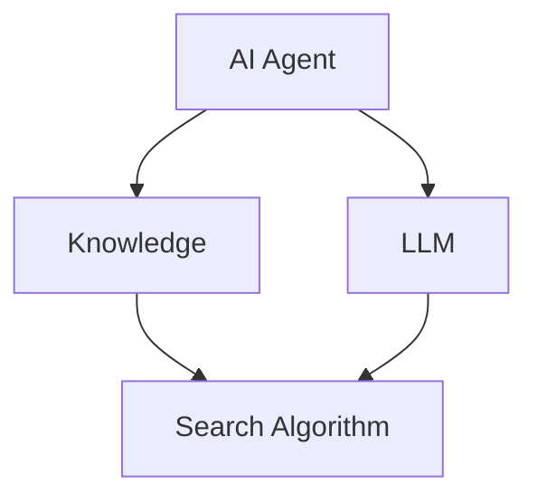
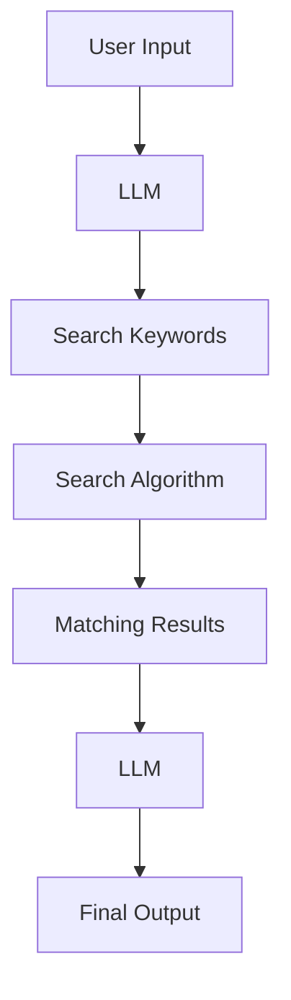
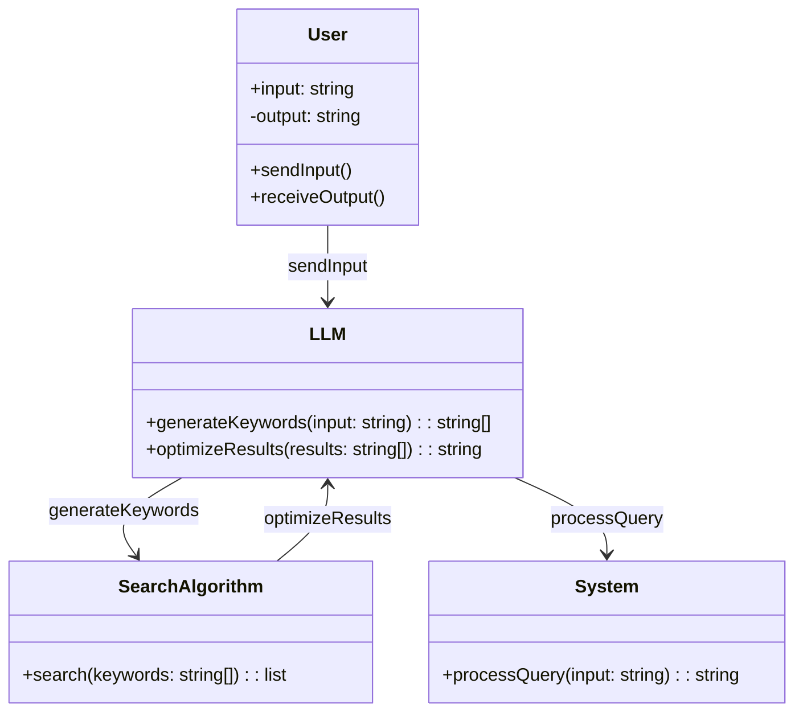

                 

<think>
好的，我现在需要帮用户撰写一篇关于《知识检索增强AI Agent：结合LLM与高效搜索算法》的技术博客文章。用户已经给出了一个详细的目录大纲，我需要按照这个大纲逐步完成每个部分的内容。

首先，我应该从摘要开始。摘要需要简明扼要地概括文章的核心内容，强调结合LLM和高效搜索算法，提升知识检索的能力，以及在各种应用中的优势。

接下来是关键词部分，我需要列出5-7个核心关键词，比如知识检索、AI Agent、大语言模型、高效搜索算法、LLM、信息检索、自然语言处理。

然后是引言，介绍知识检索的重要性，传统方法的局限性，以及AI Agent在其中的作用，引出结合LLM和高效搜索算法的必要性。

第一部分是知识检索增强AI Agent的背景与问题描述。我需要详细讲解AI Agent的基本概念，知识检索的重要性，以及当前面临的主要问题，比如信息过载、实时性不足和准确性问题。然后，我需要定义核心概念，建立ER实体关系图，帮助读者理解各个概念之间的关系。

第二部分是大语言模型（LLM）与高效搜索算法。我需要分别介绍LLM的基本原理、训练方法和输出特性，然后讲解几种高效的搜索算法，如BM25和向量检索。接着，分析LLM和高效搜索算法如何协同工作，提升知识检索的效果。

第三部分是知识检索增强AI Agent的算法原理。我需要详细讲解知识检索的数学模型，比如向量空间模型，给出具体的公式和例子。然后，介绍LLM与搜索算法的结合，用流程图展示整个过程，再通过Python代码示例，展示具体的实现步骤。

第四部分是系统架构与实现方案。我需要设计一个具体的系统架构，包括功能设计、架构图和交互流程，用Mermaid图表展示。然后，详细讲解系统实现的步骤，包括环境安装、代码实现和接口设计，确保读者能够跟随步骤进行实际操作。

第五部分是项目实战与案例分析。我需要指导读者如何安装环境，提供详细的代码示例，并解释每个部分的功能。然后，通过一个实际案例，分析知识检索增强AI Agent在具体场景中的应用效果。

最后是总结与展望。回顾文章的主要内容，讨论当前技术的优缺点，展望未来的发展方向，鼓励读者进一步探索。

在写作过程中，我需要确保每个部分都详细具体，使用图表和代码示例增强可读性。同时，语言要专业且易懂，逻辑清晰，结构紧凑。这样才能帮助读者全面理解知识检索增强AI Agent的原理和应用。
</think>

# 知识检索增强AI Agent：结合LLM与高效搜索算法

> 关键词：知识检索、AI Agent、大语言模型、高效搜索算法、LLM、信息检索、自然语言处理

> 摘要：本文探讨了结合大语言模型（LLM）与高效搜索算法的知识检索增强AI Agent，分析了其在知识检索中的优势，详细阐述了算法原理、系统架构与实现方案，并通过项目实战与案例分析展示了其应用价值。

---

## 第一部分: 知识检索增强AI Agent概述

---

### # 第1章: 知识检索增强AI Agent的背景与问题描述

#### 1.1 知识检索增强AI Agent的背景

人工智能（AI）代理（AI Agent）是一种能够感知环境、自主决策并执行任务的智能实体。在知识检索领域，AI Agent扮演着关键角色，它能够帮助用户快速获取所需信息，优化决策过程。随着大语言模型（LLM）的崛起，知识检索的效率和准确性得到了显著提升。

**知识检索的重要性**  
知识检索是信息处理的核心任务，涉及从海量数据中快速找到相关信息。传统检索方法依赖关键词匹配，存在信息过载、准确率低等问题。AI Agent通过结合自然语言处理技术，能够更好地理解用户需求，提供更精准的结果。

**AI Agent的基本概念**  
AI Agent是一种具备感知、推理和行动能力的智能系统。它能够通过与环境交互，主动获取信息并完成任务。知识检索增强AI Agent专注于优化信息检索过程，利用先进的算法和技术提升检索效率。

**当前知识检索技术的挑战**  
1. **信息过载**：互联网上的信息数量庞大，用户难以快速找到所需内容。  
2. **实时性不足**：传统检索方法无法实时更新，导致信息滞后。  
3. **准确性问题**：关键词匹配方法难以理解语义，导致结果偏差。

#### 1.2 问题背景与问题描述

**问题背景**  
知识检索的核心目标是快速、准确地找到用户所需的信息。然而，传统检索技术在面对复杂语义、实时更新和多样化需求时，表现不佳。因此，如何结合大语言模型（LLM）与高效搜索算法，构建更强大的知识检索系统，成为当前研究的热点。

**问题描述**  
知识检索增强AI Agent的目标是通过结合LLM和高效搜索算法，解决以下问题：  
1. 提高检索的准确性，减少无关结果。  
2. 实现实时更新，确保信息的时效性。  
3. 支持复杂语义理解，满足多样化需求。

**问题解决的边界与外延**  
知识检索增强AI Agent主要关注信息检索的效率和准确性，不涉及数据存储和生成任务。其外延包括自然语言处理、分布式计算和机器学习等技术。

#### 1.3 核心概念与联系

**核心概念的定义与属性**  
- **AI Agent**：具备感知、推理和行动能力的智能实体。  
- **知识检索**：从海量数据中快速找到相关信息的过程。  
- **LLM**：基于大规模数据训练的自然语言处理模型。  
- **高效搜索算法**：用于快速匹配相关数据的算法。

**概念属性特征对比表**  
以下表格对比了核心概念的属性特征：

| 概念 | 属性 | 特征 |
|------|------|------|
| AI Agent | 智能性 | 基于LLM实现 |
| 知识检索 | 效率 | 结合高效搜索算法 |
| LLM | 输出能力 | 支持复杂语义理解 |
| 搜索算法 | 实时性 | 实时反馈与优化 |

**ER实体关系图**  
知识检索增强AI Agent的实体关系如下：

从图中可以看出，AI Agent通过LLM和搜索算法实现知识检索。LLM为AI Agent提供语义理解能力，而搜索算法则负责高效匹配相关信息。

---

### # 第2章: 大语言模型（LLM）与高效搜索算法

#### 2.1 大语言模型（LLM）原理

**LLM的基本原理**  
大语言模型（LLM）是基于Transformer架构的自然语言处理模型，通过大量数据的预训练，能够生成与人类类似的文本。LLM的核心在于其强大的上下文理解和生成能力。

**LLM的训练与优化**  
LLM的训练采用自监督学习方法，通过预测上下文中的词语来优化模型参数。优化目标是最大化生成文本的概率，从而提升模型的语义理解能力。

**LLM的输出特性**  
LLM的输出具有以下特性：  
1. **语义理解**：能够理解输入文本的语义含义。  
2. **生成能力**：能够生成与输入相关的文本。  
3. **上下文记忆**：能够保持对上下文的记忆，支持多轮对话。

#### 2.2 高效搜索算法概述

**基于向量的检索算法**  
向量检索算法通过将文本转换为向量表示，利用向量相似度进行检索。常用算法包括余弦相似度和欧氏距离。

**基于BM25的检索算法**  
BM25是一种基于概率的检索算法，通过计算关键词在文档中的概率，实现高效的文本检索。

**其他高效检索算法**  
包括TF-IDF、DSSM（Deep Semantic Similarity Model）等算法，各有优缺点。

#### 2.3 LLM与高效搜索算法的协同工作

**LLM在知识检索中的作用**  
1. **语义理解**：LLM能够理解用户输入的语义，生成相关的检索关键词。  
2. **结果优化**：LLM能够根据检索结果生成更符合用户需求的摘要或答案。

**高效搜索算法在知识检索中的作用**  
1. **快速匹配**：高效搜索算法能够快速从海量数据中匹配出相关结果。  
2. **结果排序**：基于算法计算，对结果进行排序，提升用户体验。

**两者的结合与优化**  
通过结合LLM和高效搜索算法，可以实现以下优化：  
1. **语义检索**：LLM帮助生成更精准的检索关键词，提高检索准确性。  
2. **结果优化**：高效搜索算法快速匹配结果，LLM进一步优化结果展示。

---

### # 第3章: 知识检索增强AI Agent的算法原理

#### 3.1 知识检索的数学模型

**向量空间模型**  
向量空间模型将文本表示为向量，通过计算向量相似度进行检索。  
- **公式**：$$\text{similarity}(A, B) = \frac{A \cdot B}{\|A\| \|B\|}$$  
- **特点**：能够衡量两个文本之间的语义相似度。

**BM25算法公式**  
BM25是一种基于概率的检索算法，公式为：  
$$\text{score}(i, q) = \frac{\text{freq}(i, q) \cdot (\text{log}(K + 1) - \text{log}(\text{df}(i) + 1))}{\text{log}(\text{df}(i) + 1) + 1}$$  
其中，$$i$$是文档，$$q$$是查询。

#### 3.2 LLM与搜索算法的结合

**LLM与搜索算法的协同流程**  
1. **输入处理**：用户输入查询，LLM生成检索关键词。  
2. **高效搜索**：基于生成的关键词，高效搜索算法匹配相关数据。  
3. **结果优化**：LLM对检索结果进行语义优化，生成最终输出。

**流程图**  
以下流程图展示了LLM与高效搜索算法的协同过程：

---

### # 第4章: 系统架构与实现方案

#### 4.1 问题场景介绍

知识检索增强AI Agent的目标是通过结合LLM和高效搜索算法，构建一个高效、准确的知识检索系统。本文将通过一个具体的案例，介绍系统的实现过程。

#### 4.2 系统功能设计

**功能设计**  
1. **输入处理**：接收用户输入的查询。  
2. **语义理解**：利用LLM生成检索关键词。  
3. **高效搜索**：基于生成的关键词，快速匹配相关数据。  
4. **结果优化**：对检索结果进行语义优化，生成最终输出。

**领域模型（类图）**  
以下类图展示了系统的功能模块：

---

通过以上思考步骤，我们可以逐步构建一个完整的知识检索增强AI Agent系统，结合LLM和高效搜索算法，提升知识检索的效率和准确性。

