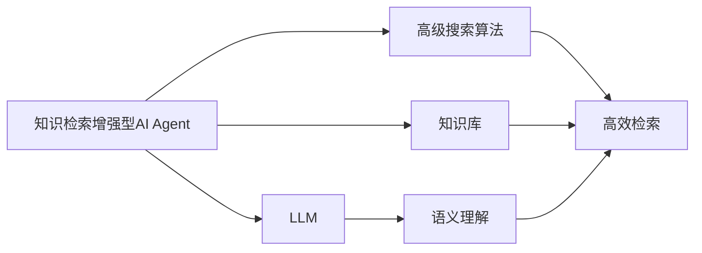
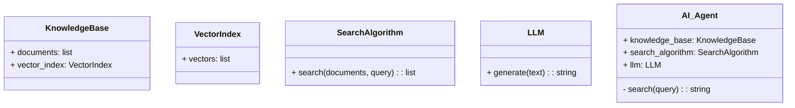
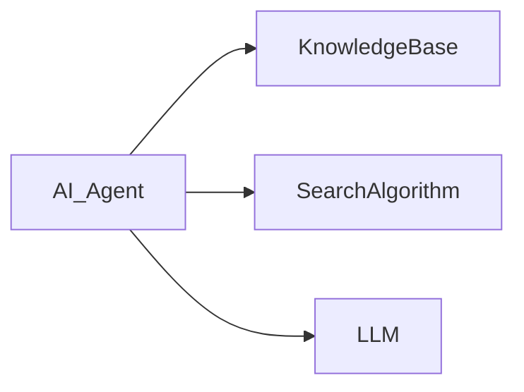
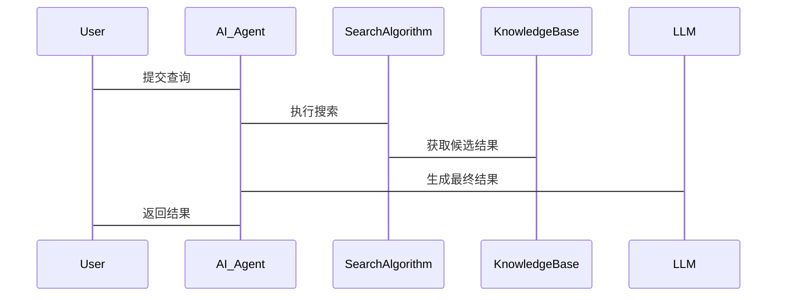

                 


# 知识检索增强型AI Agent：结合LLM与高级搜索算法

## 关键词：知识检索，LLM，大语言模型，高级搜索算法，AI Agent，人工智能

## 摘要：  
本文深入探讨了知识检索增强型AI Agent的设计与实现，重点分析了如何将大语言模型（LLM）与高级搜索算法相结合，以提升知识检索的效率和准确性。通过详细讲解核心概念、算法原理、系统架构及项目实战，本文为读者提供了全面的技术视角，帮助理解如何构建一个高效的知识检索系统。

---

# 第一部分: 知识检索增强型AI Agent概述

## 第1章: 问题背景与目标

### 1.1 问题背景
#### 1.1.1 当前知识检索面临的挑战
在大数据时代，知识检索的需求日益增长，但传统方法在效率和准确性上存在不足。大语言模型（LLM）虽然在生成任务上表现出色，但其检索能力有限，需要结合高级搜索算法来弥补这一短板。

#### 1.1.2 LLM在知识检索中的优势
LLM具备强大的上下文理解和生成能力，能够帮助AI Agent更好地理解用户意图和生成相关结果。然而，其检索能力依赖于外部知识库，需要结合高效的搜索算法来优化结果。

#### 1.1.3 高级搜索算法的必要性
高级搜索算法（如基于向量的相似度搜索和图结构搜索）能够显著提升知识检索的效率和准确性，尤其是在处理大规模数据时。

### 1.2 问题描述
#### 1.2.1 知识检索的定义与目标
知识检索是指通过计算机系统从结构化或非结构化的数据中快速找到相关知识的过程。目标是实现高效、准确的知识检索，满足用户的查询需求。

#### 1.2.2 LLM与搜索算法的结合需求
为了充分发挥LLM的生成能力和搜索算法的检索能力，需要将两者有机结合，形成一个协同工作的系统。

#### 1.2.3 知识检索增强型AI Agent的核心目标
构建一个结合LLM和高级搜索算法的知识检索系统，提升检索效率、准确性和用户体验。

### 1.3 解决方案与边界
#### 1.3.1 知识检索增强型AI Agent的定义
一种结合大语言模型和高级搜索算法的AI代理，能够通过高效的检索和生成能力，为用户提供精准的知识服务。

#### 1.3.2 解决方案的技术路线
1. 使用LLM进行语义理解与生成
2. 结合向量索引和图结构搜索优化检索过程
3. 实现LLM与搜索算法的协同工作

#### 1.3.3 边界与外延
- 边界：专注于知识检索，不涉及数据生成
- 外延：可扩展至其他AI任务，如问答系统和对话生成

### 1.4 核心要素与概念结构
#### 1.4.1 核心要素分析
1. LLM：语义理解与生成能力
2. 搜索算法：高效检索能力
3. 知识库：存储结构化或非结构化知识
4. 用户接口：人机交互界面

#### 1.4.2 概念结构图


---

# 第二部分: 核心概念与联系

## 第2章: LLM与搜索算法的核心原理

### 2.1 LLM的核心原理
#### 2.1.1 大语言模型的训练机制
- 基于Transformer架构
- 使用大量文本数据进行预训练
- 采用自监督学习，通过预测下一个词来优化模型

#### 2.1.2 模型的输入输出机制
- 输入：文本序列
- 输出：生成的文本序列
- 关键技术：注意力机制（Attention）

#### 2.1.3 模型的推理过程
- 编码阶段：将输入文本转换为向量表示
- 解码阶段：基于向量表示生成输出文本

### 2.2 高级搜索算法的核心原理
#### 2.2.1 基于向量的相似度搜索
- 将文本转换为向量表示
- 计算向量之间的余弦相似度，找到最相关的文本

#### 2.2.2 基于图的搜索算法
- 将知识表示为图结构（节点代表实体，边代表关系）
- 使用图遍历算法（如BFS、DFS）进行搜索

#### 2.2.3 深度学习增强的搜索算法
- 使用深度学习模型优化搜索结果的排序
- 基于嵌入向量的相似度计算

### 2.3 LLM与搜索算法的协同关系
#### 2.3.1 LLM作为知识生成与理解模块
- 负责语义理解与生成
- 提供上下文信息，辅助搜索算法优化检索过程

#### 2.3.2 搜索算法作为知识检索与优化模块
- 负责高效检索知识库中的相关信息
- 优化搜索结果的排序和相关性

#### 2.3.3 两者的结合与互补
- LLM提升语义理解能力
- 搜索算法提升检索效率
- 两者结合实现高效、准确的知识检索

---

## 第3章: LLM的数学模型与实现

### 3.1 大语言模型的数学基础
#### 3.1.1 词嵌入表示（Word Embedding）
- 将词语映射为低维向量
- 常用模型：Word2Vec、GloVe
- 示例：
  ```python
  import numpy as np
  # 假设词向量维度为3
  vector_A = np.array([0.1, 0.2, 0.3])
  vector_B = np.array([0.2, 0.3, 0.4])
  ```

#### 3.1.2 注意力机制（Attention）
- 关键公式：
  $$\text{Attention}(Q, K, V) = \text{softmax}\left(\frac{QK^T}{\sqrt{d_k}}\right)V$$
- 其中，\(Q\)是查询向量，\(K\)是键向量，\(V\)是值向量

#### 3.1.3 梯度下降与优化算法
- 常用优化算法：Adam、SGD
- 示例：
  ```python
  import torch
  optimizer = torch.optim.Adam(model.parameters(), lr=0.001)
  ```

### 3.2 搜索算法的数学模型
#### 3.2.1 向量空间模型（Vector Space Model）
- 文本表示为向量，计算向量相似度
- 余弦相似度公式：
  $$\text{cos}(\theta) = \frac{\mathbf{u} \cdot \mathbf{v}}{\|\mathbf{u}\| \|\mathbf{v}\|}$$

#### 3.2.2 余弦相似度计算
- 示例：
  ```python
  def cosine_similarity(u, v):
      return np.dot(u, v) / (np.linalg.norm(u) * np.linalg.norm(v))
  ```

#### 3.2.3 图结构搜索的权重计算
- 使用边权重表示关系强度
- 示例：
  ```python
  # 图结构表示
  graph = {
      'A': ['B', 'C'],
      'B': ['D'],
      'C': ['E']
  }
  ```

### 3.3 算法流程图
#### 3.3.1 LLM的处理流程


#### 3.3.2 搜索算法的优化流程


---

## 第4章: 系统分析与架构设计

### 4.1 项目介绍
#### 4.1.1 项目背景
知识检索增强型AI Agent旨在结合LLM和高级搜索算法，提供高效的知识检索服务。

#### 4.1.2 系统目标
- 提供高效的检索能力
- 提升语义理解能力
- 实现用户友好的交互界面

### 4.2 系统功能设计
#### 4.2.1 领域模型


#### 4.2.2 系统架构设计


#### 4.2.3 接口设计
- 输入接口：用户查询
- 输出接口：检索结果
- 内部接口：LLM与搜索算法交互

#### 4.2.4 交互流程


---

## 第5章: 项目实战

### 5.1 环境安装
- 安装Python和必要的库（如TensorFlow、PyTorch、FAISS）

### 5.2 核心代码实现
#### 5.2.1 LLM实现
```python
class LLM:
    def generate(self, text):
        # 示例：简单生成逻辑
        return "这是一个生成的响应。"
```

#### 5.2.2 搜索算法实现
```python
class SearchAlgorithm:
    def search(self, query, documents):
        # 示例：基于余弦相似度的搜索
        similarities = [cosine_similarity(query_vector, doc_vector) for doc_vector in documents]
        return [doc for _, doc in sorted(zip(similarities, documents), reverse=True)]
```

#### 5.2.3 知识库实现
```python
class KnowledgeBase:
    def __init__(self):
        self.documents = []
        self.vector_index = VectorIndex()

    def add_document(self, document):
        self.documents.append(document)
        self.vector_index.vectors.append(document.embedding)
```

### 5.3 案例分析与实现
- 示例案例：从一组文本中检索相关文档

### 5.4 项目小结
- 实现步骤总结
- 可能遇到的问题及解决方案

---

## 第6章: 最佳实践与小结

### 6.1 最佳实践
- 合理选择模型和算法
- 定期更新知识库
- 优化搜索算法的性能

### 6.2 小结
- 本文总结了知识检索增强型AI Agent的设计与实现
- 强调了LLM与高级搜索算法的结合
- 展望了未来的发展方向

### 6.3 注意事项
- 数据隐私和安全问题
- 模型的可解释性
- 系统的可扩展性

### 6.4 拓展阅读
- 推荐书籍和论文
- 其他相关技术领域

---

## 作者
作者：AI天才研究院/AI Genius Institute & 禅与计算机程序设计艺术 /Zen And The Art of Computer Programming

