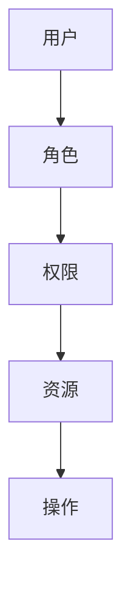
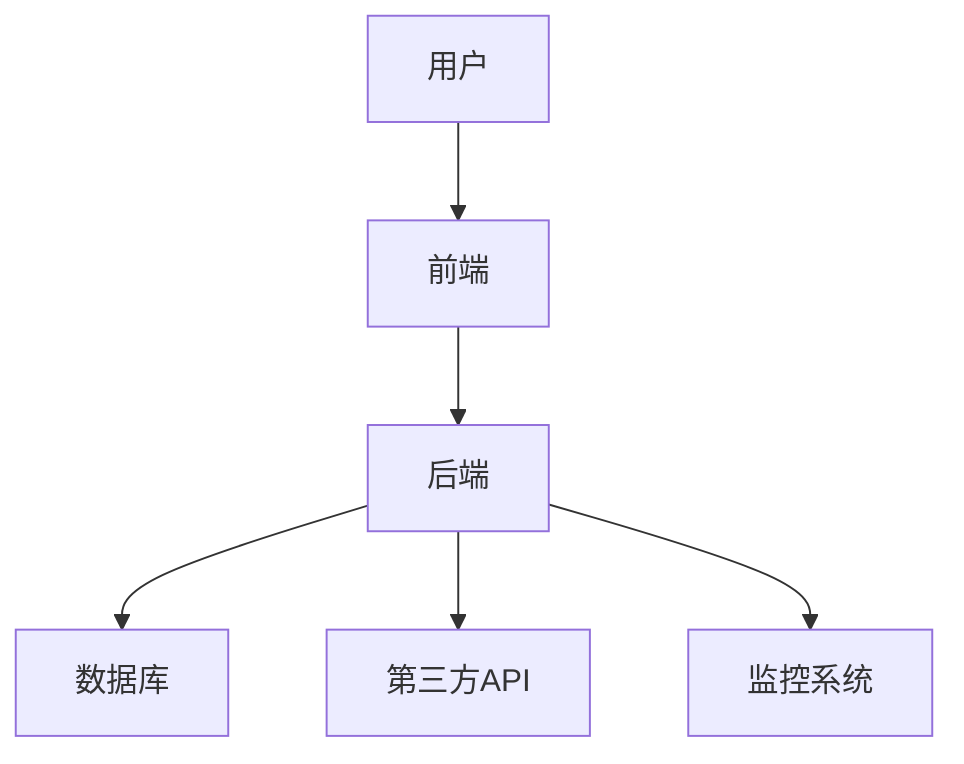
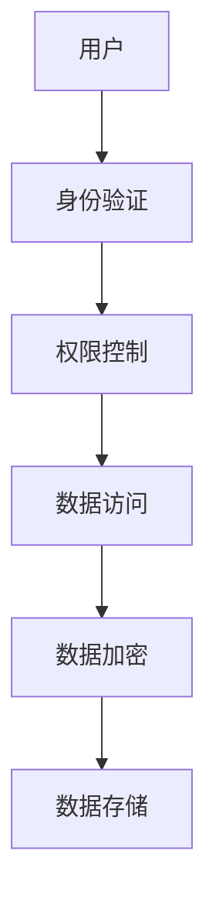

                 


# 确保投资理财智能助手的数据安全与隐私保护

## 关键词：投资理财，智能助手，数据安全，隐私保护，技术实现，法律合规，系统架构

## 摘要：  
在数字化浪潮的推动下，投资理财智能助手已成为人们生活中不可或缺的工具。然而，随着数据的日益敏感和用户隐私的备受关注，确保这些工具的数据安全与隐私保护显得尤为重要。本文从技术角度深入分析投资理财智能助手的数据安全与隐私保护的关键点，探讨如何通过技术手段确保用户数据的机密性、完整性和可用性，同时符合相关法律法规的要求。文章详细介绍了数据加密、访问控制、隐私保护技术等核心内容，并通过实际案例和系统设计展示了如何将这些技术应用于投资理财智能助手的开发中。

---

## 第1章: 数据安全与隐私保护的重要性

### 1.1 投资理财智能助手的背景与需求

#### 1.1.1 投资理财智能助手的定义与功能  
投资理财智能助手是一种基于人工智能和大数据技术的工具，旨在为用户提供个性化的投资建议、资产配置、风险评估等服务。其核心功能包括：  
- **数据收集**：获取用户的财务状况、投资偏好、交易记录等信息。  
- **数据分析**：通过算法对用户数据进行处理，生成投资建议。  
- **交互式服务**：通过自然语言处理（NLP）与用户进行交互，提供实时反馈。  

#### 1.1.2 数据安全与隐私保护的必要性  
投资理财数据通常涉及用户的敏感信息，如银行账户、资产金额、交易记录等。一旦这些数据被泄露或篡改，可能导致用户的经济损失甚至信任危机。因此，数据安全与隐私保护不仅是技术要求，更是法律和道德的义务。  

#### 1.1.3 用户信任与合规性要求  
用户信任是投资理财智能助手的核心竞争力。如果用户认为他们的数据不安全，他们将不再使用该服务。此外，各国的法律法规（如欧盟的GDPR、美国的CCPA）对数据隐私保护提出了严格要求，企业必须确保合规性以避免法律风险。  

### 1.2 数据安全与隐私保护的核心概念

#### 1.2.1 数据安全的基本原则  
- **机密性**：确保数据仅限授权人员访问。  
- **完整性**：防止数据被篡改或损坏。  
- **可用性**：确保数据在需要时可被访问。  

#### 1.2.2 隐私保护的法律与伦理要求  
- **法律要求**：遵守相关数据保护法规，如GDPR、CCPA等。  
- **伦理要求**：尊重用户隐私，避免数据滥用。  

#### 1.2.3 投资理财数据的敏感性分析  
投资理财数据通常涉及以下敏感信息：  
- 账户信息（如银行账户、信用卡信息）。  
- 资产配置（如股票、基金、房地产等）。  
- 交易记录（如买入、卖出时间及金额）。  
- 风险评估（如信用评分、财务状况）。  

### 1.3 数据泄露与隐私侵犯的案例分析

#### 1.3.1 历史案例回顾  
- **案例1**：2017年，某知名投资平台因数据库漏洞被黑客攻击，导致数百万用户的个人信息泄露。  
- **案例2**：某智能理财应用因员工疏忽，将用户数据上传至公开服务器，导致数据被公开。  

#### 1.3.2 案例对投资理财智能助手的启示  
- 数据安全必须贯穿整个生命周期，从数据收集、存储到传输，每个环节都需严格控制。  
- 需要建立完善的日志记录和监控系统，及时发现并应对安全事件。  

### 1.4 本章小结  
本章介绍了投资理财智能助手的背景与需求，分析了数据安全与隐私保护的重要性，并通过案例展示了数据泄露的严重后果。下一章将深入探讨数据安全与隐私保护的技术实现。

---

## 第2章: 数据加密与访问控制

### 2.1 数据加密技术

#### 2.1.1 加密算法的选择与实现  
- **对称加密**：适用于大数据量的加密，如AES（高级加密标准）。  
- **非对称加密**：适用于安全通信，如RSA（ Rivest-Shamir-Adleman）。  
- **选择加密算法的考虑因素**：加密强度、计算性能、密钥管理等。  

#### 2.1.2 对称加密与非对称加密的对比  
| 对比维度 | 对称加密（AES） | 非对称加密（RSA） |  
|----------|------------------|--------------------|  
| 密钥管理 | 单一密钥，便于管理 | 公私钥对，管理复杂 |  
| 加密速度 | 高速 | 较低 |  
| 适用场景 | 大数据加密 | 安全通信、数字签名 |  

#### 2.1.3 加密强度与性能的平衡  
加密强度越高，计算性能越低。因此，在实际应用中需要根据具体需求选择合适的加密算法。  

### 2.2 访问控制机制

#### 2.2.1 基于角色的访问控制（RBAC）  
- **角色定义**：根据用户职责划分角色，如“普通用户”、“管理员”。  
- **权限分配**：为每个角色分配特定的权限。  
- **实现优势**：简化权限管理，适用于大型系统。  

#### 2.2.2 基于属性的访问控制（ABAC）  
- **属性定义**：基于用户属性（如部门、职位）动态分配权限。  
- **实现优势**：灵活性高，适用于复杂场景。  

#### 2.2.3 组合访问控制策略的设计  
通过结合RBAC和ABAC，可以实现更灵活的访问控制策略。例如：  
- 用户必须同时满足角色和属性条件，才能访问特定数据。  

### 2.3 数据加密与访问控制的实现案例

#### 2.3.1 加密算法的Python实现  
以下是使用AES加密的Python代码示例：  
```python
from cryptography.hazmat.primitives.ciphers import Cipher, algorithms, modes
from cryptography.hazmat.primitives.asymmetric import padding
from cryptography.hazmat.primitives import hashes

# 对称加密示例（AES）
def aes_encrypt(plaintext, key):
    cipher = Cipher(algorithms.AES(key), modes.ECB())
    encryptor = cipher.encryptor()
    ciphertext = encryptor.update(plaintext)
    return ciphertext

def aes_decrypt(ciphertext, key):
    cipher = Cipher(algorithms.AES(key), modes.ECB())
    decryptor = cipher.decryptor()
    plaintext = decryptor.update(ciphertext)
    return plaintext

# 非对称加密示例（RSA）
def rsa_encrypt(plaintext, public_key):
    cipher = Cipher(algorithms.RSA(algorithm=padding.PKCS1v1_5()))
    encryptor = cipher.encryptor()
    ciphertext = encryptor.update(plaintext, public_key)
    return ciphertext

def rsa_decrypt(ciphertext, private_key):
    cipher = Cipher(algorithms.RSA(algorithm=padding.PKCS1v1_5()))
    decryptor = cipher.decryptor()
    plaintext = decryptor.update(ciphertext, private_key)
    return plaintext
```

#### 2.3.2 访问控制策略的系统设计  
以下是基于RBAC的访问控制系统架构图：  


### 2.4 本章小结  
本章详细介绍了数据加密与访问控制的技术实现，包括加密算法的选择与实现、访问控制策略的设计，以及具体的Python代码实现案例。下一章将探讨隐私保护技术与数据脱敏。

---

## 第3章: 隐私保护技术与数据脱敏

### 3.1 数据脱敏技术

#### 3.1.1 数据脱敏的定义与实现方法  
- **定义**：通过技术手段将敏感数据转化为非敏感数据，同时保持数据的可用性。  
- **实现方法**：如替换、加密、泛化等。  

#### 3.1.2 常见脱敏算法对比  
| 算法名称 | 描述 | 优缺点 |  
|----------|------|--------|  
| 替换脱敏 | 将敏感数据替换为虚拟数据 | 简单易实现，但可能影响数据准确性 |  
| 加密脱敏 | 使用加密算法对数据进行加密 | 数据安全性高，但可能增加计算开销 |  
| 泛化脱敏 | 将数据模糊化处理（如将具体金额替换为“高”、“中”、“低”） | 保持数据分布，但可能降低数据粒度 |  

#### 3.1.3 脱敏数据的可恢复性分析  
- **可恢复性**：脱敏数据是否可以还原为原始数据。  
- **不可恢复性**：脱敏后数据无法还原，适用于某些场景（如公开报告）。  

### 3.2 隐私保护技术

#### 3.2.1 差分隐私的原理与实现  
- **差分隐私**：通过对数据添加噪声，确保单个数据的改变不会影响整体数据分析结果。  
- **实现示例**：  
  ```python
  def add_noise(value, epsilon):
      noise = np.random.laplace(0, 1/epsilon)
      return value + noise
  ```

#### 3.2.2 同态加密的应用场景  
- **同态加密**：允许在加密数据上进行计算，结果解密后与直接计算结果一致。  
- **应用场景**：适用于需要在云端进行数据处理的场景。  

#### 3.2.3 隐私保护技术的优缺点对比  
| 技术名称 | 优点 | 缺点 |  
|----------|------|------|  
| 差分隐私 | 高效性，保护数据隐私 | 可能影响数据分析的准确性 |  
| 同态加密 | 保护数据隐私，支持复杂计算 | 计算性能较低 |  

### 3.3 数据脱敏与隐私保护的系统实现

#### 3.3.1 数据脱敏的Python代码实现  
以下是使用替换脱敏方法的Python代码示例：  
```python
def replace_mask_credit_card(credit_card_number):
    # 将信用卡号的敏感部分替换为星号
    masked_number = credit_card_number[:4] + '****' + credit_card_number[8:]
    return masked_number

# 示例
credit_card = '4111-1111-1111-1111'
masked_card = replace_mask_credit_card(credit_card)
print(masked_card)  # 输出：4111-****-****-1111
```

#### 3.3.2 隐私保护技术的实际应用案例  
例如，在投资理财智能助手中，用户的真实资产信息可以通过差分隐私技术进行处理，确保数据在分析时无法被逆向还原。  

### 3.4 本章小结  
本章探讨了数据脱敏与隐私保护技术的实现方法，并通过具体的Python代码示例展示了如何在投资理财智能助手中应用这些技术。下一章将介绍系统架构与安全设计。

---

## 第4章: 系统架构与安全设计

### 4.1 系统架构设计

#### 4.1.1 分层架构的设计原则  
- **分层原则**：将系统划分为 presentation 层、business 层、data 层，每层职责明确。  
- **优点**：提高系统的可维护性与扩展性。  

#### 4.1.2 微服务架构的优缺点  
- **优点**：服务独立性强，便于扩展和维护。  
- **缺点**：增加系统复杂性，需要额外的通信机制。  

#### 4.1.3 系统架构的可扩展性分析  
通过模块化设计，确保系统在用户量增加时能够平滑扩展。  

### 4.2 数据安全架构设计

#### 4.2.1 数据存储的安全保护  
- **加密存储**：对敏感数据进行加密存储。  
- **访问控制**：基于角色的访问控制策略。  

#### 4.2.2 数据传输的安全加密  
- **HTTPS协议**：确保数据在传输过程中的安全性。  
- **SSL/TLS证书**：通过证书验证服务端身份。  

#### 4.2.3 系统边界的安全防护  
- **防火墙**：防止未经授权的访问。  
- **入侵检测系统（IDS）**：实时监控系统异常行为。  

### 4.3 系统架构的实现案例  
以下是投资理财智能助手的系统架构图：  


### 4.4 本章小结  
本章介绍了系统架构设计的原则与方法，并详细探讨了数据安全架构的设计。下一章将聚焦于数据存储与传输安全。

---

## 第5章: 数据存储与传输安全

### 5.1 数据存储安全

#### 5.1.1 数据库的安全设计  
- **数据库加密**：对敏感字段进行加密存储。  
- **访问控制**：确保只有授权人员可以访问数据库。  

#### 5.1.2 数据存储的加密策略  
- **字段级加密**：对敏感字段（如账户信息）进行加密。  
- **记录级加密**：对整条记录进行加密。  

#### 5.1.3 数据存储的安全性分析  
- **安全性**：加密存储可以防止数据被未授权访问。  
- **性能影响**：加密操作可能增加数据库查询的响应时间。  

### 5.2 数据传输安全

#### 5.2.1 数据传输的安全加密  
- **HTTPS协议**：通过SSL/TLS证书实现数据加密传输。  
- **加密算法选择**：推荐使用AES-256-GCM加密算法。  

#### 5.2.2 数据传输的完整性验证  
- **哈希验证**：通过计算数据的哈希值，确保数据在传输过程中未被篡改。  

#### 5.2.3 数据传输的实时监控  
- **流量监控**：通过日志分析和流量监控工具，实时发现异常行为。  

### 5.3 数据存储与传输安全的实现案例  
以下是投资理财智能助手的数据流图：  


### 5.4 本章小结  
本章详细探讨了数据存储与传输安全的设计与实现。通过合理的加密策略和访问控制，可以有效保护投资理财数据的安全性。

---

## 第6章: 投资理财智能助手的系统安全设计

### 6.1 系统安全设计概述

#### 6.1.1 系统安全设计的原则  
- **最小权限原则**：每个用户或服务仅拥有完成任务所需的最小权限。  
- **纵深防御**：通过多层安全措施，降低单一漏洞被利用的风险。  

#### 6.1.2 系统安全设计的步骤  
1. 确定系统需求与边界。  
2. 分析潜在威胁与漏洞。  
3. 设计多层次的安全防护措施。  
4. 实现并测试安全策略。  

### 6.2 系统安全设计的实现案例

#### 6.2.1 安全架构的Python代码实现  
以下是基于最小权限原则的Python代码示例：  
```python
def is_authorized(user_role, required_role):
    return user_role == required_role

# 示例
user_role = 'admin'
required_role = 'admin'
print(is_authorized(user_role, required_role))  # 输出：True
```

#### 6.2.2 安全设计的系统架构图  
以下是投资理财智能助手的安全架构图：  


### 6.3 本章小结  
本章通过系统安全设计的原则与实现案例，展示了如何在投资理财智能助手中构建多层次的安全防护体系。

---

## 结语

投资理财智能助手的数据安全与隐私保护是一项复杂而重要的任务。通过合理的技术手段，如数据加密、访问控制、隐私保护技术，可以有效保护用户数据的安全性。同时，系统的架构设计与安全策略的制定也是确保数据安全的关键。未来，随着技术的不断发展，投资理财智能助手的数据安全与隐私保护将更加智能化与精细化。

---

## 作者：AI天才研究院/AI Genius Institute & 禅与计算机程序设计艺术 /Zen And The Art of Computer Programming

---

**本文为原创文章，转载请注明出处。**

