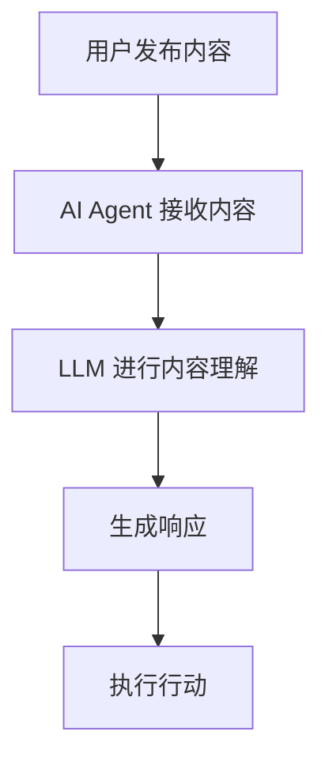
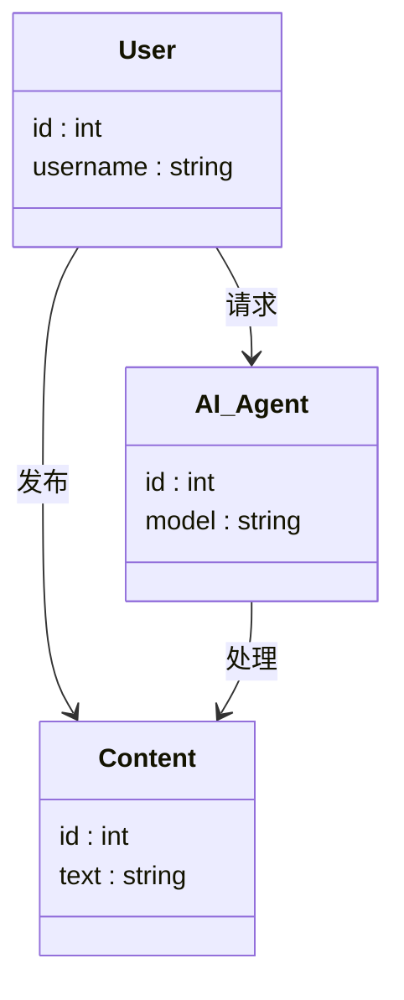
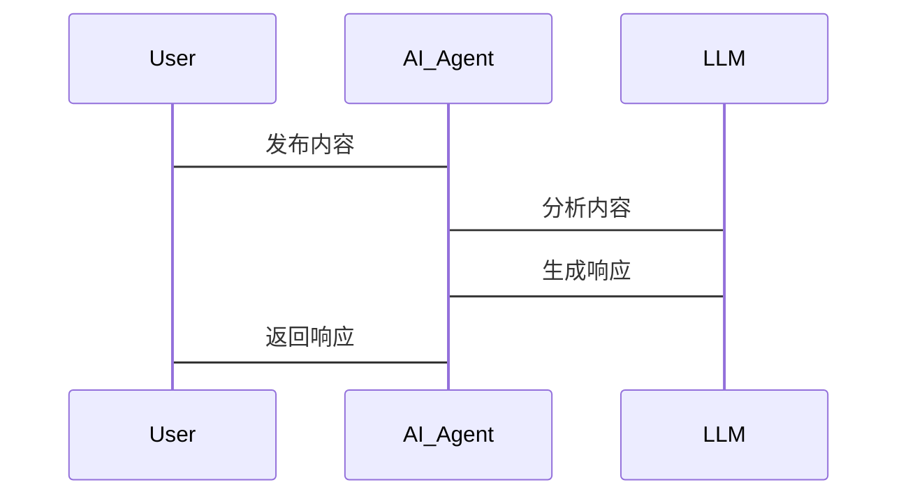

                 


# 社交媒体 AI Agent：LLM 辅助内容管理与互动

---

## 关键词：
社交媒体 AI Agent, LLM, 内容管理, 用户互动, 自然语言处理, 人工智能

---

## 摘要：
社交媒体 AI Agent 是一种基于大语言模型（LLM）的智能辅助工具，能够自动化处理社交媒体内容管理与用户互动。本文从社交媒体内容管理的现状与挑战出发，详细探讨了 AI Agent 的核心概念、LLM 的算法原理、系统架构设计、项目实战与最佳实践。通过理论与实践结合，帮助读者全面理解社交媒体 AI Agent 的工作原理与应用场景，为实际项目提供参考。

---

# 第一部分: 社交媒体 AI Agent 的背景与核心概念

## 第1章: 社交媒体 AI Agent 的背景与问题背景

### 1.1 社交媒体内容管理的现状与挑战

#### 1.1.1 社交媒体内容管理的传统方式
社交媒体内容管理的传统方式主要包括手动筛选、人工审核和基于规则的自动化工具。这些方法在一定程度上解决了内容管理的问题，但存在效率低、成本高、难以实时处理海量数据等局限性。

#### 1.1.2 传统方式的局限性与痛点
- **效率低**：人工审核需要大量时间，无法实时处理海量社交媒体内容。
- **成本高**：需要大量人工参与，增加了企业的运营成本。
- **规则有限**：基于规则的自动化工具难以应对复杂多变的社交媒体内容。

#### 1.1.3 社交媒体内容管理的未来趋势
随着人工智能技术的快速发展，社交媒体内容管理将更加智能化、自动化。通过引入大语言模型（LLM），可以实现更精准的内容理解和自动化的互动响应。

### 1.2 AI Agent 的概念与优势

#### 1.2.1 AI Agent 的定义与特征
AI Agent 是一种智能代理系统，能够通过感知环境、理解用户需求并采取行动来实现目标。其主要特征包括：
- **自主性**：能够在没有人工干预的情况下自主运行。
- **反应性**：能够实时感知环境并做出响应。
- **学习能力**：能够通过数据学习和优化自身的行为。

#### 1.2.2 AI Agent 在内容管理中的优势
- **高效性**：能够快速处理海量数据，提高内容管理效率。
- **准确性**：通过大语言模型的深度学习能力，实现更精准的内容理解和分类。
- **灵活性**：能够根据不同的场景和需求进行定制化配置。

#### 1.2.3 LLM 在 AI Agent 中的核心作用
大语言模型（LLM）通过其强大的自然语言处理能力，能够理解、生成和交互自然语言文本。在社交媒体 AI Agent 中，LLM 主要用于：
- **内容理解**：通过语义理解技术，识别社交媒体内容的主题、情感和意图。
- **内容生成**：根据用户需求生成回复、评论或其他形式的内容。
- **用户互动**：通过对话生成技术，实现与用户的实时互动。

### 1.3 问题背景与目标

#### 1.3.1 问题背景的描述
社交媒体内容管理的核心问题是如何高效、准确地处理海量、复杂且多样的内容。传统方法难以满足实时性和精准性的要求，亟需引入智能化的解决方案。

#### 1.3.2 问题目标的设定
- **目标1**：设计并实现一个基于 LLM 的社交媒体 AI Agent，能够自动化处理内容管理任务。
- **目标2**：优化 AI Agent 的性能，提升其在复杂场景下的适应能力。

#### 1.3.3 问题边界与外延
- **边界**：仅关注社交媒体内容管理相关的任务，不涉及其他领域。
- **外延**：AI Agent 的能力可以扩展到其他领域，如客户服务、教育辅助等。

#### 1.3.4 核心要素与组成结构
社交媒体 AI Agent 的核心要素包括：
- **用户**：AI Agent 的使用者或与之互动的对象。
- **内容**：社交媒体上的文本、图片、视频等数据。
- **AI Agent**：通过 LLM 实现内容理解与生成的智能系统。

---

## 第2章: 社交媒体 AI Agent 的核心概念与联系

### 2.1 核心概念的原理与特征

#### 2.1.1 LLM 的基本原理
大语言模型（LLM）通过监督学习和无监督学习相结合的方式，训练出能够理解和生成自然语言文本的模型。其核心原理包括：
- **监督学习**：通过大量标注数据进行模型训练，使模型能够理解特定任务的要求。
- **无监督学习**：通过自监督学习技术，利用未标注数据进一步优化模型性能。

#### 2.1.2 AI Agent 的工作原理
AI Agent 的工作流程包括：
1. **感知环境**：通过 API 或爬虫获取社交媒体上的内容数据。
2. **理解需求**：利用 LLM 对内容进行语义分析，识别用户需求或内容主题。
3. **生成响应**：根据理解的结果生成相应的回复或操作指令。
4. **执行行动**：通过 API 或自动化工具执行生成的响应，如发布评论、发送私信等。

#### 2.1.3 社交媒体内容管理的核心要素
- **数据源**：社交媒体平台上的文本、图片、视频等数据。
- **模型训练**：用于内容理解与生成的深度学习模型。
- **用户交互**：AI Agent 与用户之间的对话或操作流程。

### 2.2 核心概念的对比分析

#### 2.2.1 不同 AI 模型的对比分析
| 模型名称      | 参数量（亿） | 主要特点                | 适用场景               |
|---------------|-------------|-----------------------|----------------------|
| GPT-3         | 175         | 高度通用，支持多任务    | 社交媒体内容生成、对话生成 |
| BERT          | 110         | 基于双向上下文         | 文本分类、问答系统      |
| T5            | 22          | 专注于文本生成          | 翻译、摘要、对话生成    |

#### 2.2.2 不同 AI Agent 的对比分析
| AI Agent 类型 | 主要功能         | 适用场景               | 优势                   |
|----------------|------------------|----------------------|----------------------|
| 基于规则的     | 简单规则匹配     | 爱情类型的内容筛选     | 实现简单，成本低        |
| 基于 LLM 的     | 复杂语义理解     | 高度个性化的用户互动   | 精准度高，适应性强      |

#### 2.2.3 核心概念的属性特征对比表格
| 特性      | LLM                 | AI Agent              |
|-----------|---------------------|-----------------------|
| 输入       | 文本数据            | 社交媒体内容           |
| 输出       | 文本生成或理解结果   | 自动化操作或用户反馈   |
| 依赖       | 大型训练数据        | 社交媒体 API 和工具     |

### 2.3 实体关系图与 Mermaid 流程图

#### 2.3.1 实体关系图（ER 图）
```mermaid
erDiagram
    user {
        id : int
        username : string
        }
    content {
        id : int
        text : string
        }
    ai_agent {
        id : int
        model_type : string
        }
    user --> content : 发布
    user --> ai_agent : 请求
    ai_agent --> content : 处理
```

#### 2.3.2 核心流程图（Mermaid）


---

## 第3章: LLM 的算法原理

### 3.1 LLM 的训练过程

#### 3.1.1 监督微调（Supervised Fine-tuning）
监督微调是通过在特定任务的标注数据上进一步训练预训练模型，以优化其在特定领域的性能。例如，可以通过监督微调让 LLM 更擅长社交媒体内容分类。

#### 3.1.2 强化学习（Reinforcement Learning）
强化学习通过定义奖励函数，让模型在与环境的交互中逐步优化其行为。例如，可以通过强化学习让 LLM 的生成内容更符合用户期望。

#### 3.1.3 模型评估与优化
模型评估主要通过准确率、召回率、F1 值等指标进行衡量。优化方法包括调整超参数、使用早停（Early Stopping）等。

### 3.2 LLM 的数学模型与公式

#### 3.2.1 概率分布与损失函数
LLM 的核心是通过概率分布来预测下一个词的概率。损失函数通常使用交叉熵损失：
$$
\text{Loss} = -\sum_{i=1}^{n} \log P(y_i|x_{1:i-1})
$$

#### 3.2.2 注意力机制（Attention）
注意力机制通过计算输入序列中每个词的注意力权重，来决定每个词对当前词的重要性。其数学表达式为：
$$
\text{Attention}(Q, K, V) = \text{softmax}\left(\frac{QK^T}{\sqrt{d_k}}\right)V
$$
其中，$Q$ 是查询向量，$K$ 是键向量，$V$ 是值向量，$d_k$ 是维度。

#### 3.2.3 解码器（Decoder）
解码器负责根据编码器的输出生成目标序列。其结构通常包括自注意力机制和前馈网络。

### 3.3 代码实现与应用示例

#### 3.3.1 环境安装
```bash
pip install transformers torch
```

#### 3.3.2 核心代码实现
```python
from transformers import GPT2LMHeadModel, GPT2Tokenizer

model_name = "gpt2"
tokenizer = GPT2Tokenizer.from_pretrained(model_name)
model = GPT2LMHeadModel.from_pretrained(model_name)

def generate_response(input_text):
    inputs = tokenizer(input_text, return_tensors="np")
    outputs = model.generate(inputs.input_ids, max_length=100)
    return tokenizer.decode(outputs[0], skip_special_tokens=True)
```

#### 3.3.3 应用场景分析
上述代码实现了一个简单的对话生成系统，可以用于社交媒体上的自动回复功能。例如：
```plaintext
输入：你今天过得怎么样？
输出：我很好，谢谢！有什么我可以帮你的吗？
```

---

## 第4章: 系统分析与架构设计

### 4.1 系统分析

#### 4.1.1 问题场景介绍
在社交媒体平台上，用户发布的内容需要进行分类、审核和互动。传统的手动方式效率低下，亟需引入 AI Agent 辅助完成任务。

#### 4.1.2 项目介绍
本项目旨在开发一个基于 LLM 的社交媒体 AI Agent，能够实现内容分类、自动回复、用户互动等功能。

### 4.2 系统功能设计

#### 4.2.1 领域模型设计（Mermaid 类图）


#### 4.2.2 系统架构设计（Mermaid 架构图）


#### 4.2.3 接口设计
- **输入接口**：用户输入的内容或请求。
- **输出接口**：生成的回复或操作结果。

#### 4.2.4 交互流程图（Mermaid）


---

## 第5章: 项目实战

### 5.1 环境安装
```bash
pip install transformers requests
```

### 5.2 核心代码实现

#### 5.2.1 实现社交媒体 API 的接口调用
```python
import requests

def post_comment(api_url, comment_text):
    headers = {
        'Content-Type': 'application/json'
    }
    data = {
        'comment': comment_text
    }
    response = requests.post(api_url, headers=headers, json=data)
    return response.status_code
```

#### 5.2.2 基于 LLM 的内容分类
```python
from transformers import pipeline

classifier = pipeline("text-classification", model="facebook/roberta-base")
result = classifier("This is a positive comment.")
print(result)
```

### 5.3 实际案例分析

#### 5.3.1 案例1：自动回复用户评论
- **输入**：用户发布了一条评论：“这个产品很好用！”
- **输出**：AI Agent 自动回复：“感谢您的支持！有什么其他问题吗？”

#### 5.3.2 案例2：内容分类与审核
- **输入**：用户发布了一条带有敏感词的评论。
- **输出**：AI Agent 标识并标记该内容为敏感内容，触发人工审核流程。

### 5.4 项目小结
通过实际案例分析，展示了社交媒体 AI Agent 在内容管理和用户互动中的强大能力。代码实现部分详细说明了如何调用 API 和使用 LLM 进行内容分类。

---

## 第6章: 最佳实践与注意事项

### 6.1 最佳实践 tips
- **数据隐私**：确保数据处理符合相关法律法规，保护用户隐私。
- **模型调优**：根据具体场景优化模型参数，提升性能。
- **多模态支持**：未来可以扩展支持图片、视频等多种媒体形式。

### 6.2 小结
社交媒体 AI Agent 的发展离不开 LLM 技术的进步。通过理论与实践结合，我们可以更好地理解其工作原理和应用场景。

### 6.3 注意事项
- **数据质量**：确保训练数据的多样性和代表性。
- **模型性能**：定期监控模型性能，及时优化。
- **用户体验**：设计友好直观的用户界面，提升用户体验。

### 6.4 拓展阅读
- [《Transformers: State-of-the-Art Pretraining, Fine-tuning, and Datasets》](https://huggingface.co/transformers)
- [《Deep Learning for Natural Language Processing》](https://www.deeplearningbook.org/)

---

## 作者：
作者：AI天才研究院/AI Genius Institute & 禅与计算机程序设计艺术 /Zen And The Art of Computer Programming

---

# 结语
社交媒体 AI Agent 的发展离不开大语言模型（LLM）的支持。通过本文的详细讲解，我们不仅了解了其核心概念和算法原理，还通过实际案例展示了其在内容管理和用户互动中的应用。希望本文能够为读者提供有价值的参考，帮助他们在实际项目中更好地应用这些技术。

