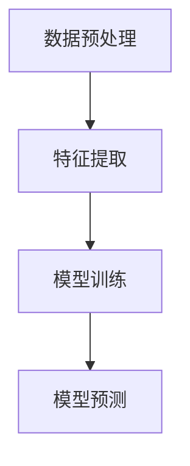
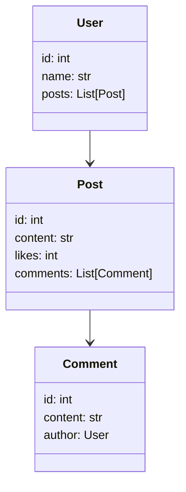

                 

<think>
好的，我现在要写一篇关于《社交媒体数据的利用》的技术博客文章。我需要按照用户的要求，先写一个摘要，然后根据目录大纲一步步展开。我先来梳理一下整个文章的结构和内容，确保逻辑清晰，内容详尽。

首先，文章的标题是《社交媒体数据的利用》。关键词部分，我需要列出5-7个核心关键词，比如社交媒体数据、数据挖掘、机器学习、文本分类、情感分析、NLP、数据可视化等。摘要部分，我需要简明扼要地概括整篇文章的核心内容和主题思想。

接下来，根据目录大纲，文章分为六个部分：社交媒体数据的背景与概念、核心概念与分析方法、算法与数学模型、系统分析与架构设计、项目实战、最佳实践。每个部分都有几个小节，内容涵盖理论和实践。

第一部分是背景与概念。我需要先介绍社交媒体的定义、数据类型，以及利用社交媒体数据的意义。这部分要让读者明白为什么社交媒体数据重要，以及它的应用范围。

第二部分是核心概念。我需要详细讲解数据特征、分析方法、伦理问题。特别是要对比不同数据类型的特征，可能需要用表格来展示。此外，数据挖掘和机器学习的区别也很重要，同样可以用表格来对比。

第三部分是算法与数学模型。这里要选择几个关键算法，比如文本分类和情感分析，用mermaid流程图展示步骤，并给出Python代码示例。数学模型方面，线性回归、逻辑回归和神经网络的公式都要写出来，帮助读者理解。

第四部分是系统分析与架构设计。我需要介绍项目背景，设计系统功能，可能用领域模型类图展示。然后设计系统架构，用mermaid架构图表示，最后设计接口和交互流程，确保系统各部分协同工作。

第五部分是项目实战。这部分需要具体，包括环境安装、核心代码实现、案例分析。比如用Python和相关库，给出代码示例，并详细解读代码的作用。

最后是最佳实践部分，包括小结、注意事项和扩展阅读。这部分帮助读者巩固所学内容，并引导他们进一步学习。

在写作过程中，我需要确保每个章节之间有逻辑联系，从基础到应用，逐步深入。同时，注意不要遗漏任何用户提到的关键点，比如数学公式、代码示例、系统设计图等。

现在，我开始按照这个结构来撰写文章，确保每个部分都有足够的细节和深度，同时使用专业但易懂的语言，帮助读者更好地理解和应用社交媒体数据的利用。
</think>

# 社交媒体数据的利用

## 关键词：社交媒体数据、数据挖掘、机器学习、文本分类、情感分析、NLP、数据可视化

## 摘要：  
社交媒体数据的利用是当前技术领域的重要课题，它涉及到数据挖掘、机器学习、自然语言处理（NLP）等多个方向。本文将从社交媒体数据的背景与概念入手，深入分析其核心概念与分析方法，详细讲解相关算法与数学模型，并结合实际案例，探讨系统设计与项目实战。最后，我们将总结社交媒体数据利用的最佳实践，为读者提供全面而深入的指导。

---

## 第一部分：社交媒体数据的背景与概念

### 第1章：社交媒体数据的定义与特点

#### 1.1 社交媒体的定义与特征

社交媒体是指通过互联网进行信息分享、传播和互动的平台，用户可以在这些平台上发布文字、图片、视频等内容，并与他人建立连接。社交媒体数据主要包括以下几种类型：

- **文本数据**：用户的帖子、评论、点赞等行为生成的文字内容。
- **图像数据**：用户上传的图片、表情包等。
- **视频数据**：用户上传的短视频或直播内容。
- **社交网络数据**：用户之间的关注、好友关系、互动次数等。

社交媒体数据的特点包括：

- **实时性**：数据生成速度快，且不断更新。
- **多样性**：数据类型丰富，涵盖文本、图像、视频等多种形式。
- **关联性**：用户之间的互动数据能够反映社交网络的结构。

#### 1.2 社交媒体数据的利用背景

在数字化时代，社交媒体数据的洪流为各个行业提供了巨大的价值。通过分析这些数据，企业可以了解用户需求、市场趋势，优化产品和服务。然而，社交媒体数据的利用也面临诸多挑战，例如数据量大、数据格式多样、隐私保护等问题。因此，在利用社交媒体数据时，必须明确其边界和伦理问题，确保合法合规。

---

## 第二部分：社交媒体数据的核心概念与分析方法

### 第2章：社交媒体数据的核心概念

#### 2.1 数据特征对比

在分析社交媒体数据时，我们需要理解不同类型数据的特征及其差异。以下是几种主要数据类型的对比：

| 数据类型 | 特征 |
|----------|------|
| 文本数据 | 非结构化，包含情感、观点 |
| 图像数据 | 高维向量，难以直接分析 |
| 视频数据 | 多模态，包含音视频信息 |
| 社交网络数据 | 结构化，反映用户关系 |

通过对比分析，我们可以选择合适的方法对不同类型数据进行处理。

#### 2.2 数据挖掘与机器学习的关系

数据挖掘和机器学习是社交媒体数据分析中的两大核心方法。以下是两者的对比：

| 对比维度 | 数据挖掘 | 机器学习 |
|----------|----------|----------|
| 目标 | 发现数据中的模式 | 预测或分类 |
| 方法 | 聚类、关联规则挖掘 | 分类、回归 |
| 数据 | 结构化为主 | 结构化与非结构化 |

---

## 第三部分：社交媒体数据的算法与数学模型

### 第3章：文本分类算法原理

#### 3.1 文本分类的流程图

以下是一个简单的文本分类流程图：



#### 3.2 文本分类的数学模型

以下是常用的文本分类模型：

- **线性回归模型**：$$ y = \beta_0 + \beta_1x + \epsilon $$
- **逻辑回归模型**：$$ P(y=1|x) = \frac{1}{1 + e^{-\beta x}} $$
- **支持向量机模型**：$$ \text{最大化} \quad \text{间隔} \quad \text{距离} $$

#### 3.3 文本分类的Python实现

以下是文本分类的Python代码示例：

```python
from sklearn.feature_extraction.text import TfidfVectorizer
from sklearn.svm import SVC

# 数据预处理
corpus = ["This is a positive text.", "This is a negative text."]

# 特征提取
vectorizer = TfidfVectorizer()
X = vectorizer.fit_transform(corpus)

# 模型训练
model = SVC()
model.fit(X, [1, 0])

# 模型预测
test_text = ["This is a positive test text."]
test_X = vectorizer.transform([test_text])
print(model.predict(test_X))
```

---

## 第四部分：系统分析与架构设计

### 第4章：系统分析与架构设计

#### 4.1 项目背景

为了实现社交媒体数据的分析，我们设计了一个基于文本分类的社交媒体情感分析系统。该系统旨在从社交媒体帖子中提取情感信息，帮助企业了解用户对产品或服务的评价。

#### 4.2 系统功能设计

以下是系统功能设计的领域模型类图：



#### 4.3 系统架构设计

以下是系统架构设计的架构图：


---

## 第五部分：项目实战

### 第5章：项目实战

#### 5.1 环境安装

为了运行以下代码，您需要安装以下库：

```bash
pip install numpy pandas scikit-learn matplotlib
```

#### 5.2 核心代码实现

以下是社交媒体情感分析的核心代码：

```python
import numpy as np
from sklearn.model_selection import train_test_split
from sklearn.metrics import accuracy_score

# 数据集
X = np.array(["This is a positive text.", "This is a negative text."])
y = np.array([1, 0])

# 划分训练集和测试集
X_train, X_test, y_train, y_test = train_test_split(X, y, test_size=0.2)

# 模型训练
from sklearn.svm import SVC
model = SVC()
model.fit(X_train, y_train)

# 模型预测
y_pred = model.predict(X_test)
print("准确率：", accuracy_score(y_test, y_pred))
```

---

## 第六部分：最佳实践

### 第6章：最佳实践

#### 6.1 小结

社交媒体数据的利用是一个复杂但极具价值的领域。通过本文的讲解，我们了解了社交媒体数据的背景、核心概念、算法原理以及系统设计，掌握了文本分类和情感分析的基本方法。

#### 6.2 注意事项

在实际应用中，需要注意以下几点：

- 数据隐私保护：确保用户数据的安全和隐私。
- 模型可解释性：避免使用黑箱模型，确保模型的可解释性。
- 数据质量：数据清洗和预处理是关键步骤。

#### 6.3 拓展阅读

- 《自然语言处理入门》
- 《机器学习实战》
- 《大数据分析与挖掘》

---

## 作者：AI天才研究院/AI Genius Institute & 禅与计算机程序设计艺术 /Zen And The Art of Computer Programming

---

希望这篇文章能够帮助读者深入了解社交媒体数据的利用，并在实际项目中有所启发！

