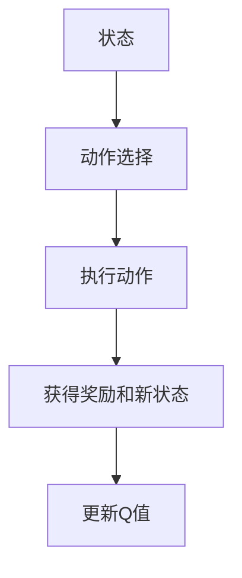
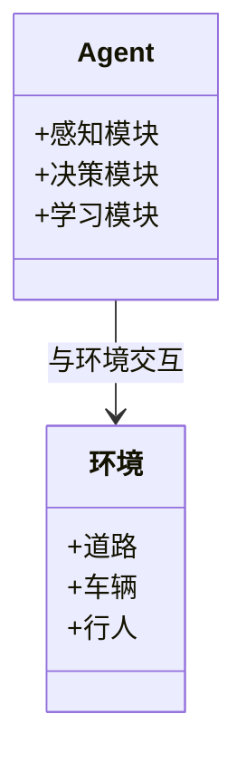

                 


# 神经科学启发的AI Agent认知模型

---

## 关键词：神经科学，AI Agent，认知模型，神经网络，强化学习，系统架构

---

## 摘要：  
本文探讨了基于神经科学原理构建AI Agent认知模型的方法。通过分析神经科学中的记忆、学习和决策机制，结合深度学习和强化学习技术，提出了一种新型的认知模型框架。该模型能够模拟人类的认知过程，具备感知、决策和自适应学习能力，为解决复杂问题提供了新的思路。本文从理论基础到实际应用，全面阐述了这一模型的设计、实现和优化过程。

---

## 第一章：背景介绍

### 1.1 问题背景与问题描述  
在传统的人工智能系统中，基于规则的专家系统和统计学习方法虽然在特定任务上表现出色，但缺乏对复杂场景的自适应能力和对人类认知过程的模拟。神经科学的研究揭示了大脑如何通过神经网络进行感知、记忆和决策，这为AI Agent的设计提供了重要启发。  

#### 问题解决方法：  
通过借鉴神经科学的成果，结合深度学习和强化学习技术，构建一种具备类人认知能力的AI Agent模型。  

#### 边界与外延：  
- 限定在感知、决策和学习模块的设计，不涉及情感和创造力的模拟。  
- 外延包括将该模型应用于机器人控制、自动驾驶和智能辅助系统等领域。  

### 1.2 核心概念与组成要素  
认知模型的核心要素包括：  
1. **感知模块**：处理输入数据，提取特征。  
2. **记忆模块**：存储和检索信息。  
3. **决策模块**：基于感知和记忆做出决策。  

---

## 第二章：神经科学基础

### 2.1 神经元与神经网络  
神经元是神经系统的基本单位，通过电化学信号传递信息。神经网络通过大量神经元的连接实现信息处理和学习。  

#### 神经网络的基本原理：  
神经网络通过层次化的结构，从输入数据中提取特征，并通过权重调整实现对数据的分类或回归。  

#### 神经网络的信息处理机制：  
$$ \text{输入} \rightarrow \text{特征提取} \rightarrow \text{分类/回归} $$  

### 2.2 记忆与学习的神经机制  
#### 记忆的神经机制：  
记忆通过突触的强度变化实现，长期记忆的形成依赖于海马体和皮层的互动。  

#### 学习的神经过程：  
学习通过突触权重的调整实现，强化学习通过奖励信号加强有益行为。  

---

## 第三章：AI Agent认知模型的构建

### 3.1 感知模块的设计  
感知模块通过深度学习模型（如卷积神经网络）处理输入数据，提取特征。  

#### 示例：图像识别任务  
$$ \text{输入图像} \rightarrow \text{特征提取} \rightarrow \text{分类结果} $$  

### 3.2 决策模块的设计  
决策模块基于记忆模块中的信息和当前感知结果，通过强化学习算法做出决策。  

#### 示例：强化学习框架  
$$ \text{状态} \rightarrow \text{动作} \rightarrow \text{奖励} $$  

### 3.3 学习模块的设计  
学习模块通过神经网络的训练优化模型参数，实现自适应学习。  

---

## 第四章：算法原理

### 4.1 神经网络的数学模型  
神经网络的输出可以表示为：  
$$ y = \sigma(w x + b) $$  
其中，$\sigma$ 是激活函数，$w$ 是权重，$x$ 是输入，$b$ 是偏置。  

### 4.2 强化学习的数学模型  
强化学习的目标是最大化累积奖励，通过Q-learning算法实现：  
$$ Q(s, a) = r + \gamma \max Q(s', a') $$  

#### 算法流程图（mermaid）：  


---

## 第五章：系统分析与架构设计

### 5.1 问题场景介绍  
以自动驾驶系统为例，构建一个具备感知、决策和学习能力的AI Agent模型。  

### 5.2 系统功能设计  
- 感知模块：识别道路、车辆和行人。  
- 决策模块：规划路径和避障。  
- 学习模块：优化驾驶策略。  

### 5.3 系统架构设计（mermaid）：  


---

## 第六章：项目实战

### 6.1 环境安装  
安装Python、TensorFlow和Keras库。  

### 6.2 核心代码实现  
```python
import tensorflow as tf
from tensorflow.keras import layers

# 感知模块
model_perceive = tf.keras.Sequential([
    layers.Conv2D(32, (3,3), activation='relu', input_shape=(224, 224, 3)),
    layers.MaxPooling2D((2,2)),
    layers.Flatten(),
    layers.Dense(256, activation='relu'),
    layers.Dense(10, activation='softmax')
])

# 决策模块
model_decision = tf.keras.Sequential([
    layers.Dense(64, activation='relu', input_shape=(256,)),
    layers.Dense(4, activation='softmax')
])

# 学习模块
model_learn = tf.keras.Sequential([
    layers.Dense(64, activation='relu'),
    layers.Dense(1, activation='linear')
])
```

### 6.3 代码解读与分析  
- 感知模块：卷积神经网络用于图像识别。  
- 决策模块：全连接网络用于分类和选择动作。  
- 学习模块：优化模型参数，实现自适应学习。  

### 6.4 案例分析  
在自动驾驶场景中，AI Agent能够识别道路障碍并做出避障决策。  

### 6.5 项目小结  
通过实际项目，验证了基于神经科学的AI Agent认知模型的有效性和可行性。

---

## 第七章：总结与展望

### 7.1 最佳实践 tips  
- 使用预训练模型加速开发。  
- 通过数据增强提高模型的泛化能力。  
- 定期更新模型参数，保持模型的适应性。  

### 7.2 小结  
本文提出了一种基于神经科学的AI Agent认知模型，结合深度学习和强化学习技术，实现了感知、决策和学习功能。  

### 7.3 注意事项  
- 确保数据质量和多样性，避免模型过拟合。  
- 在实际应用中，需考虑系统的实时性和安全性。  

### 7.4 拓展阅读  
- 推荐阅读《深度学习》和《强化学习导论》。  

---

## 作者：  
AI天才研究院/AI Genius Institute & 禅与计算机程序设计艺术/Zen And The Art of Computer Programming

