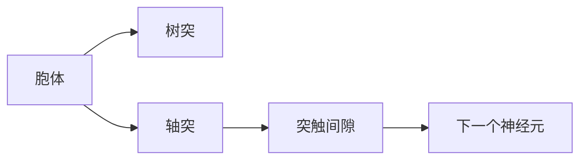
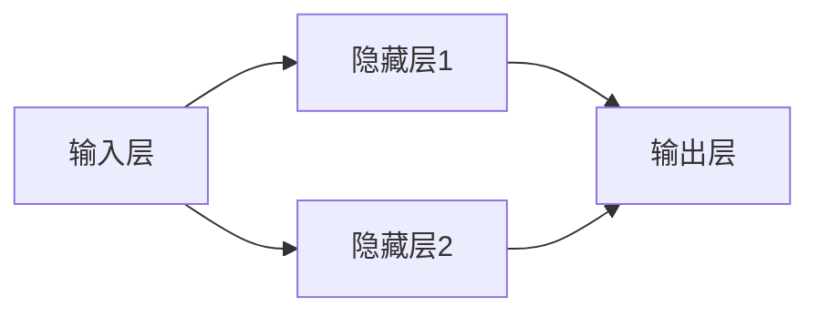
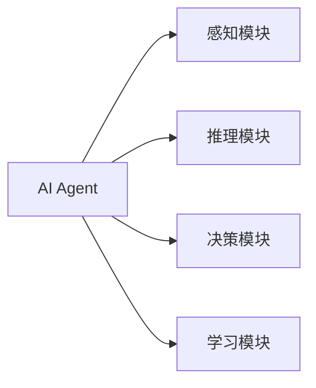
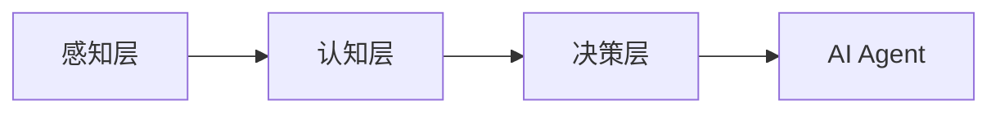
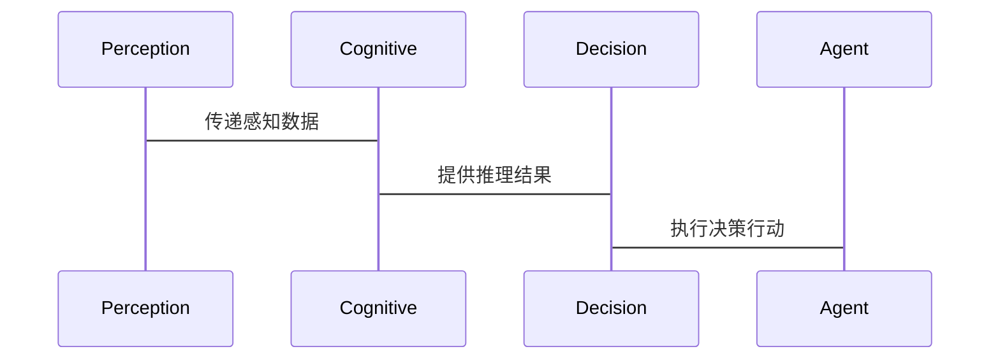

                 

<think>
嗯，我现在需要写一篇关于《神经科学启发的AI Agent认知模型设计》的技术博客。让我先理清思路，看看怎么开始。

首先，我应该理解什么是AI Agent。AI Agent是指智能体，它可以在环境中感知并采取行动以实现目标。那神经科学启发的部分，就是说这个AI Agent的设计灵感来自于大脑的神经结构和运作方式。

那我得从神经科学的基本概念入手，比如神经元的结构和功能，神经网络如何传递信息等等。这可能涉及到一些生物学的知识，但我会尽量简化，让读者容易理解。

接下来，我需要将这些神经科学的知识应用到AI Agent的设计中。比如，神经元可以类比于AI Agent的处理单元，神经网络可以类比于智能体的决策结构。这样，我就可以构建一个基于神经科学的AI Agent模型。

然后，我得详细讲解这个模型的数学基础。比如，神经元的激活函数，神经网络的层结构，以及如何训练这些网络。这部分可能需要用到一些数学公式，我得用LaTeX来表达，确保准确无误。

接下来，我需要考虑系统的架构设计。如何将这个认知模型应用到实际的项目中？可能需要设计感知模块、决策模块和学习模块。我得用Mermaid画出系统的架构图，展示各个模块之间的关系和交互流程。

项目实战部分，我需要提供一个具体的案例。比如，设计一个AI Agent来解决路径规划问题。我会详细描述环境的搭建、代码的实现，以及案例的分析，确保读者能够跟着一步步操作。

最后，我得总结一下整个设计过程，指出可能遇到的问题和解决方案，并展望未来的发展方向。同时，给出一些最佳实践的建议，比如数据处理、模型训练和系统优化等方面。

在整个写作过程中，我需要确保内容逻辑清晰，结构紧凑。每个部分都要有足够的细节，但又要简洁易懂。我可能需要多次修改，调整章节的顺序，确保每个部分都恰到好处。

总之，我会一步步来，先从背景介绍开始，逐步深入到核心概念和算法原理，再扩展到系统设计和项目实战，最后总结全书。希望最终能写出一篇高质量的技术博客，帮助读者理解神经科学启发的AI Agent认知模型设计。
</think>

# 神经科学启发的AI Agent认知模型设计

**关键词**：神经科学、AI Agent、认知模型、神经网络、强化学习、认知计算

**摘要**：本文探讨了基于神经科学原理设计AI Agent认知模型的方法，结合神经网络、强化学习等技术，构建了一个能够模拟人类认知过程的AI代理系统。文章从背景、核心概念、算法原理、系统架构到项目实战，详细阐述了神经科学启发的AI Agent设计思路，并通过案例分析展示了其应用前景。

---

# 第一部分：神经科学与AI Agent认知模型的背景

## 第1章：神经科学与AI Agent认知模型概述

### 1.1 神经科学的基本概念

#### 1.1.1 神经元的基本结构与功能

神经元是神经系统的基本单位，由树突、轴突和胞体组成。神经元通过电化学信号传递信息，包括动作电位和化学递质释放。神经元的功能可以用数学模型（如霍奇金-赫胥黎模型）描述。

**Mermaid流程图：神经元结构与信号传递**



#### 1.1.2 神经网络的基本原理

神经网络由多个神经元连接而成，分为输入层、隐藏层和输出层。神经网络通过调整权重和阈值进行训练，实现对输入数据的非线性映射。

**Mermaid流程图：神经网络结构**



#### 1.1.3 神经科学在AI中的应用

神经科学启发了多种AI技术，如卷积神经网络（CNN）、循环神经网络（RNN）和长短期记忆网络（LSTM）。这些技术广泛应用于图像识别、自然语言处理等领域。

### 1.2 认知科学与AI Agent的基本概念

#### 1.2.1 认知科学的定义与研究领域

认知科学研究人类的认知过程，包括记忆、学习、推理和决策。它涉及心理学、神经科学、语言学等多个学科。

#### 1.2.2 AI Agent的定义与分类

AI Agent是具有感知环境、自主决策能力的智能体。根据智能水平，AI Agent可分为反应式和认知式两类。认知式AI Agent具备复杂问题解决能力，类似于人类的认知过程。

#### 1.2.3 神经科学启发的AI Agent认知模型的必要性

传统AI Agent依赖规则和逻辑推理，难以处理复杂和动态环境。神经科学启发的认知模型能够模拟人类的认知过程，增强AI Agent的适应性和灵活性。

### 1.3 本章小结

本章介绍了神经科学和认知科学的基本概念，并探讨了神经科学启发的AI Agent认知模型的必要性和应用前景。

---

## 第2章：神经科学启发的AI Agent认知模型的核心概念

### 2.1 神经元模型

#### 2.1.1 神经元模型的数学表达

神经元的输入可以表示为加权求和，激活函数（如Sigmoid）将输入转换为输出。数学表达如下：

$$
y = \sigma\left(\sum_{i=1}^{n} w_i x_i + b\right)
$$

其中，$w_i$ 是权重，$x_i$ 是输入，$b$ 是偏置，$\sigma$ 是激活函数。

#### 2.1.2 神经网络模型的层次结构

神经网络由输入层、隐藏层和输出层组成。每一层的神经元通过权重连接，实现数据的非线性变换。

### 2.2 神经网络与认知模型的联系

#### 2.2.1 神经网络在认知模型中的作用

神经网络模拟了人类大脑的神经网络，用于处理和学习任务。通过训练，神经网络能够识别模式、分类数据和预测结果。

#### 2.2.2 神经网络与认知模型的差异

神经网络是认知模型的一种简化表示，忽略了生物神经元的复杂性。认知模型还涉及记忆、注意力和情感等因素，而神经网络主要关注感知和决策。

### 2.3 认知模型的数学表达

认知模型通常基于概率图模型或神经网络构建。例如，基于LSTM的序列模型可以用于模拟记忆和推理过程。

**数学公式示例：LSTM单元**

LSTM单元包含输入门、遗忘门和输出门：

$$
i = \sigma(W_i x + U_i h)
$$

$$
f = \sigma(W_f x + U_f h)
$$

$$
o = \sigma(W_o x + U_o h)
$$

$$
c' = f c + i \tanh(W_c x + U_c h)
$$

$$
h' = o \tanh(c')
$$`

---

## 第3章：AI Agent认知模型的算法原理

### 3.1 神经网络算法

#### 3.1.1 前馈神经网络

前馈神经网络包括输入层、隐藏层和输出层，数据单向传播。反向传播算法用于权重更新。

**Python代码示例：简单前馈神经网络**

```python
import numpy as np

def sigmoid(x):
    return 1 / (1 + np.exp(-x))

def feedforward(x, weights, biases):
    a1 = sigmoid(np.dot(x, weights[0]) + biases[0])
    y = np.dot(a1, weights[1]) + biases[1]
    return y

x = np.array([1, 0])
weights = [np.array([[0.5, 0.5], [0.5, 0.5]]), np.array([1, 1])]
biases = [np.array([0.1, 0.1]), np.array(0.1)]

y = feedforward(x, weights, biases)
print(y)
```

#### 3.1.2 反向传播与梯度下降

反向传播算法通过链式法则计算梯度，梯度下降算法用于更新权重。

**反向传播算法步骤**

1. 计算输出误差。
2. 反向传播误差，计算梯度。
3. 更新权重和偏置。

### 3.2 强化学习算法

强化学习通过奖励机制训练AI Agent，使其在环境中采取最优行动。

**强化学习算法：Q-Learning**

Q-Learning通过状态-动作价值函数（Q表）学习最优策略。数学表达如下：

$$
Q(s, a) = Q(s, a) + \alpha [r + \gamma \max Q(s', a') - Q(s, a)]
$$`

其中，$\alpha$ 是学习率，$\gamma$ 是折扣因子。

**Python代码示例：Q-Learning实现**

```python
class QLearning:
    def __init__(self, state_space, action_space, alpha=0.1, gamma=0.9):
        self.q_table = np.zeros((state_space, action_space))
        self.alpha = alpha
        self.gamma = gamma

    def choose_action(self, state, epsilon=0.1):
        if np.random.random() < epsilon:
            return np.random.randint(action_space)
        return np.argmax(self.q_table[state])

    def update(self, state, action, reward, next_state):
        self.q_table[state, action] = self.q_table[state, action] + self.alpha * (reward + self.gamma * np.max(self.q_table[next_state]) - self.q_table[state, action])

# 示例
state_space = 5
action_space = 2
ql = QLearning(state_space, action_space)
state = 0
action = ql.choose_action(state)
reward = 1
next_state = 1
ql.update(state, action, reward, next_state)
```

---

## 第4章：系统分析与架构设计

### 4.1 系统功能设计

AI Agent认知模型的系统功能包括感知、推理、决策和学习。

**Mermaid类图：系统功能设计**



### 4.2 系统架构设计

系统架构采用分层设计，包括感知层、认知层和决策层。

**Mermaid架构图：系统架构设计**



### 4.3 接口设计与交互流程

系统通过API接口实现模块间交互，确保数据流和控制流的协调。

**Mermaid序列图：系统交互流程**



---

## 第5章：项目实战

### 5.1 环境安装与配置

安装必要的库，如TensorFlow、Keras、numpy和scipy。

**Python代码示例：环境配置**

```bash
pip install tensorflow keras numpy scipy
```

### 5.2 核心实现：AI Agent认知模型

基于神经网络构建AI Agent认知模型，实现感知、推理和决策功能。

**Python代码示例：AI Agent实现**

```python
import tensorflow as tf
from tensorflow import keras

model = keras.Sequential([
    keras.layers.Dense(64, activation='relu', input_shape=(input_dim,)),
    keras.layers.Dense(10, activation='softmax')
])

model.compile(optimizer='adam', loss='sparse_categorical_crossentropy', metrics=['accuracy'])

model.fit(x_train, y_train, epochs=10, batch_size=32)
```

### 5.3 案例分析与结果解读

以路径规划问题为例，展示AI Agent如何通过认知模型实现最优路径选择。

**案例分析**

假设环境中存在障碍物，AI Agent通过感知环境数据，利用认知模型推理出最优路径，并通过决策模块执行移动。

---

## 第6章：总结与展望

### 6.1 本章总结

本章系统介绍了神经科学启发的AI Agent认知模型的设计方法，涵盖了背景、核心概念、算法原理、系统架构和项目实战。

### 6.2 未来展望

未来，神经科学启发的AI Agent认知模型将更加复杂和智能化，结合边缘计算和分布式系统，应用于智能城市、自动驾驶和医疗健康等领域。

### 6.3 最佳实践Tips

1. 在设计认知模型时，充分考虑神经科学的原理和特性。
2. 使用适当的工具和库（如TensorFlow、PyTorch）进行实现。
3. 在实际应用中，注重数据的质量和多样性，以提高模型的泛化能力。

---

**作者：AI天才研究院/AI Genius Institute & 禅与计算机程序设计艺术 /Zen And The Art of Computer Programming**

