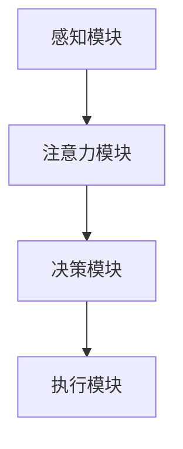

                 


# 神经科学启发的注意力机制在AI Agent中的应用

> 关键词：注意力机制，神经科学，AI Agent，自注意力网络，神经网络

> 摘要：本文探讨了神经科学中的注意力机制及其在AI Agent中的应用，分析了其在自然语言处理、计算机视觉和强化学习中的具体应用，详细讲解了注意力机制的算法实现、优化方法和系统设计，并通过项目实战展示了如何在实际中应用这些机制。

---

# 第1章 神经科学与注意力机制基础

## 1.1 神经科学基础

### 1.1.1 神经元的基本结构与功能
神经元是神经系统的基本单位，由胞体、树突和轴突组成。神经元通过动作电位传递信息，树突接收输入信号，胞体整合信息，轴突将信号传递到其他神经元或效应器。

### 1.1.2 神经网络的基本原理
神经网络由大量神经元通过突触连接构成，信息通过层层传递，形成强大的计算能力。神经网络的学习过程通过调整突触权重实现，常用模型包括卷积神经网络（CNN）和循环神经网络（RNN）。

### 1.1.3 神经可塑性与学习机制
神经可塑性是指神经网络结构和功能随经验改变的能力。长时程增强（LTP）和长时程抑制（ LTD）是主要的学习机制，影响突触权重的变化，从而实现记忆和学习。

## 1.2 注意力机制的生物基础

### 1.2.1 注意力的定义与功能
注意力是指大脑对外界信息选择性加工的能力，帮助聚焦于重要信息，忽略无关刺激。在神经科学中，注意力由前额叶皮层和顶叶皮层共同调节。

### 1.2.2 大脑皮层与注意力的关系
大脑皮层分为感觉皮层、运动皮层和关联皮层。注意力机制在关联皮层中起关键作用，帮助筛选和处理信息。神经成像技术显示，注意任务中顶叶和前额叶活动增强。

### 1.2.3 神经科学中的注意力研究进展
神经科学通过电生理学和神经成像技术研究注意力。发现神经元的同步放电模式与注意力分配相关，揭示了注意力的神经机制。

## 1.3 AI Agent基础

### 1.3.1 AI Agent的定义与分类
AI Agent是具有感知环境、自主决策和执行任务能力的智能体。根据智能水平分为反应式和认知式Agent。认知式Agent具备推理和规划能力，广泛应用于自动驾驶、智能助手等领域。

### 1.3.2 注意力机制在AI Agent中的作用
注意力机制帮助AI Agent聚焦于关键信息，提升感知和决策效率。在多目标跟踪和复杂环境中，注意力机制优化信息处理，提高任务成功率。

### 1.3.3 神经科学与AI Agent的交叉研究
神经科学为AI Agent的设计提供了生物启发性的原则，如神经元模型、学习机制和注意力机制。AI Agent的研究为神经科学提供了模拟和验证的平台。

---

# 第2章 注意力机制的核心概念与理论

## 2.1 注意力机制的生物基础

### 2.1.1 神经元的注意力模型
神经元的注意力模型模拟了大脑的信息处理方式，通过输入数据的加权和聚合，生成注意力权重。例如，基于LSTM的注意力机制用于机器翻译，模仿人类语言处理的模式。

### 2.1.2 大脑皮层的注意力网络
大脑皮层中的注意力网络由特定的脑区组成，如顶叶和前额叶。这些区域协同工作，动态调整信息处理的焦点，实现灵活的注意力分配。

### 2.1.3 神经科学中的注意力研究进展
研究发现，注意力的神经机制涉及多个脑区的协同工作，突触可塑性在注意力调节中起重要作用。这些发现为AI Agent的设计提供了重要启示。

## 2.2 注意力机制的计算模型

### 2.2.1 基于权重的注意力模型
基于权重的注意力模型通过计算输入数据的权重向量，确定每个元素的注意力分数。例如，在自然语言处理中，每个词的注意力权重反映了其重要性。

### 2.2.2 自注意力机制
自注意力机制（Self-Attention）计算输入序列中每个位置与其他位置的注意力权重，捕捉序列内部的长程依赖关系。其计算公式为：
$$
\text{Attention}(Q, K, V) = \text{softmax}\left(\frac{QK^T}{\sqrt{d_k}}\right)V
$$

### 2.2.3 对比分析表

| 模型类型 | 描述 | 优点 | 缺点 |
|---------|------|------|------|
| 基于权重的注意力 | 基于预定义权重计算注意力 | 简单高效 | 无法捕捉内部关系 |
| 自注意力机制 | 基于输入序列内部计算权重 | 捕捉长程依赖 | 计算复杂度高 |

---

# 第3章 基于神经科学的注意力模型

## 3.1 生物启发的注意力模型

### 3.1.1 模拟神经元的注意力机制
生物启发的注意力模型模拟神经元的电生理特性，如动作电位和突触传递。例如，基于LSTM的注意力模型用于模仿大脑的信息处理方式。

### 3.1.2 突触可塑性与注意力权重更新
突触可塑性机制用于动态调整注意力权重，根据输入数据的重要性实时更新权重值。这使得注意力机制能够适应不断变化的环境。

## 3.2 对比学习与注意力分配

### 3.2.1 对比学习的基本原理
对比学习通过最大化正样本对和最小化负样本对的相似性，学习有效的特征表示。在注意力机制中，对比学习用于优化注意力权重的分配。

### 3.2.2 对比注意力机制
对比注意力机制通过对比学习优化注意力权重，提升模型对重要信息的聚焦能力。例如，在图像识别任务中，对比注意力机制能够更准确地识别关键区域。

---

# 第4章 注意力机制在AI Agent中的应用

## 4.1 自然语言处理中的应用

### 4.1.1 基于注意力的对话系统
注意力机制用于对话系统的理解和生成，帮助AI Agent更好地理解用户意图。例如，基于Transformer的对话模型通过自注意力机制捕捉对话历史中的关键信息。

### 4.1.2 文档摘要生成
注意力机制用于文档摘要生成，通过计算每个词的重要性，生成高质量的摘要。例如，文本摘要模型通过自注意力机制捕捉文本的主要内容。

## 4.2 计算机视觉中的应用

### 4.2.1 目标检测中的注意力机制
注意力机制用于目标检测，帮助模型聚焦于目标区域，提高检测精度。例如，基于注意力机制的卷积神经网络能够更准确地定位目标。

### 4.2.2 图像分割中的注意力网络
注意力机制用于图像分割，通过分割不同区域的重要性，生成更准确的分割结果。例如，基于U-Net的图像分割模型结合注意力机制提升分割性能。

## 4.3 强化学习中的注意力机制

### 4.3.1 基于注意力的策略网络
注意力机制用于强化学习中的策略网络，帮助AI Agent在复杂环境中做出更优决策。例如，在游戏AI中，注意力机制用于聚焦于关键游戏状态。

### 4.3.2 注意力增强的Q-learning算法
注意力机制结合Q-learning算法，通过计算环境状态的重要性，优化Q值更新策略。例如，在迷宫导航任务中，注意力机制帮助AI Agent更快找到最优路径。

---

# 第5章 注意力机制的算法实现

## 5.1 自注意力网络的结构与计算流程

### 5.1.1 自注意力网络的结构
自注意力网络由查询（Q）、键（K）和值（V）三个部分组成，通过计算Q与K的点积，得到注意力权重，加权求和得到输出。

### 5.1.2 自注意力机制的计算流程
1. 输入序列X，计算Q、K、V：
   $$
   Q = W_q X, \quad K = W_k X, \quad V = W_v X
   $$
2. 计算注意力权重：
   $$
   \text{Attention} = \text{softmax}\left(\frac{QK^T}{\sqrt{d_k}}\right)
   $$
3. 加权求和：
   $$
   \text{Output} = \text{Attention} \cdot V
   $$

### 5.1.3 Python实现代码
```python
import torch

def self_attention(query, key, value, d_k):
    scores = torch.matmul(query, key.transpose(-2, -1)) / torch.sqrt(torch.tensor(d_k, dtype=torch.float))
    attention = torch.softmax(scores, dim=-1)
    output = torch.matmul(attention, value)
    return output

# 示例
batch_size = 1
seq_len = 5
d_k = 64
query = torch.randn(batch_size, seq_len, d_k)
key = torch.randn(batch_size, seq_len, d_k)
value = torch.randn(batch_size, seq_len, d_k)
output = self_attention(query, key, value, d_k)
print(output.shape)
```

## 5.2 注意力机制的实现细节

### 5.2.1 注意力权重的计算
注意力权重的计算基于输入数据的相似性度量，常用点积、余弦相似性或加权和。例如，余弦相似性计算公式为：
$$
\text{sim}(x_i, x_j) = \frac{x_i \cdot x_j}{\|x_i\| \|x_j\|}
$$

### 5.2.2 多头注意力机制
多头注意力机制通过并行计算多个注意力头，提升模型的表达能力。例如，模型可以并行计算8个注意力头，每个头的维度为d_k/8。

### 5.2.3 位置编码与相对位置
位置编码用于捕捉序列的位置信息，相对位置编码用于处理相对位置关系。例如，通过添加位置编码，模型能够更好地处理序列中的位置信息。

---

# 第6章 注意力机制的优化方法

## 6.1 模型压缩与注意力权重优化

### 6.1.1 模型剪枝
模型剪枝通过去除不重要的神经元或权重，减少模型复杂度。例如，在自注意力机制中，可以通过剪枝去除冗余的权重，降低计算成本。

### 6.1.2 模型量化
模型量化通过降低权重的精度（如从浮点数降到定点数）减少模型大小。例如，使用INT8量化可以显著减少模型的存储空间。

## 6.2 并行计算与计算效率优化

### 6.2.1 并行计算策略
通过并行计算策略优化注意力机制的计算效率，例如利用GPU加速矩阵运算。例如，使用PyTorch的并行计算库，可以显著提升模型的训练速度。

### 6.2.2 混合精度训练
混合精度训练通过使用16位和32位精度结合的方式，减少计算时间。例如，在Transformer模型中，使用混合精度训练可以降低内存占用，加快训练速度。

---

# 第7章 系统设计与实现

## 7.1 系统架构设计

### 7.1.1 系统组件
系统组件包括感知模块、注意力模块和决策模块。感知模块负责数据采集和预处理，注意力模块负责信息的注意力计算，决策模块根据注意力结果做出决策。

### 7.1.2 系统架构图


## 7.2 接口设计与交互流程

### 7.2.1 接口定义
接口定义包括输入数据格式、注意力权重计算接口和决策结果输出接口。例如，输入数据为序列数据，输出数据为注意力权重和决策结果。

### 7.2.2 交互流程图
```mermaid
sequenceDiagram
参与者 用户
参与者 AI Agent
用户->AI Agent: 发送查询请求
AI Agent->感知模块: 处理输入数据
感知模块->注意力模块: 计算注意力权重
注意力模块->决策模块: 生成决策结果
决策模块->用户: 返回结果
```

---

# 第8章 项目实战

## 8.1 环境搭建

### 8.1.1 安装依赖
安装Python、PyTorch和相关库，例如：
```
pip install torch numpy matplotlib
```

## 8.2 核心代码实现

### 8.2.1 自注意力机制实现
```python
import torch

class SelfAttention(nn.Module):
    def __init__(self, embed_size):
        super().__init__()
        self.embed_size = embed_size
        self.query = nn.Linear(embed_size, embed_size)
        self.key = nn.Linear(embed_size, embed_size)
        self.value = nn.Linear(embed_size, embed_size)
    
    def forward(self, x):
        batch_size, seq_len, _ = x.size()
        q = self.query(x)
        k = self.key(x)
        v = self.value(x)
        
        # 计算注意力权重
        scores = (q @ k.transpose(1, 2)) / (self.embed_size ** 0.5)
        attention = nn.Softmax(dim=1)(scores)
        
        # 加权求和
        output = attention @ v
        return output
```

### 8.2.2 应用案例分析
在自然语言处理任务中，使用自注意力机制的模型在文本理解任务中表现出色，如文本摘要和机器翻译。例如，使用自注意力机制的Transformer模型在机器翻译任务中取得了优异的性能。

## 8.3 项目小结

通过项目实战，读者可以掌握自注意力机制的实现方法，并将其应用到实际项目中。通过代码实现和案例分析，深入理解注意力机制在不同任务中的应用。

---

# 第9章 总结与展望

## 9.1 全文总结

本文详细探讨了神经科学启发的注意力机制在AI Agent中的应用，从生物基础到算法实现，再到实际应用，全面分析了注意力机制的各个方面。通过项目实战，读者可以掌握自注意力机制的实现方法，并将其应用到实际项目中。

## 9.2 未来展望

未来的研究方向包括更高效的注意力机制设计、模型优化和跨领域的应用探索。随着神经科学的发展，注意力机制将在AI Agent中发挥更大的作用，推动人工智能技术的进步。

---

# 作者：AI天才研究院 & 禅与计算机程序设计艺术

--- 

**本文完**

