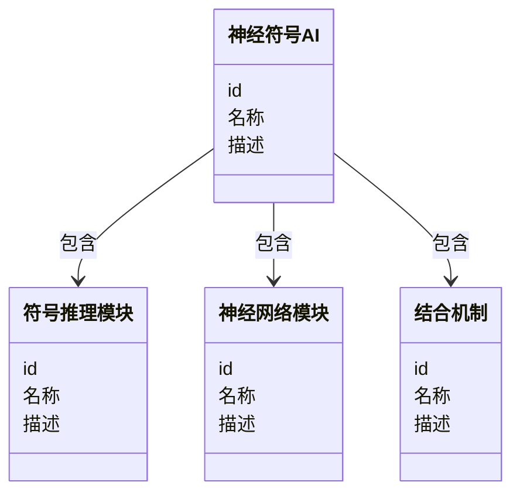

                 

<think>
好的，我需要根据用户的要求，撰写一篇关于《神经符号AI：结合符号推理与神经网络》的技术博客文章。用户已经提供了详细的目录大纲，并且特别强调了每个部分的具体要求，包括背景介绍、核心概念、算法原理、系统分析、项目实战等。

首先，我需要明确文章的结构和每个部分的具体内容。文章需要有一个吸引人的标题，关键词和摘要，然后按照目录大纲展开各个章节。每个章节都必须详细讲解，满足字数要求。

接下来，我需要确保每个章节的内容都符合用户的要求。例如，在背景介绍部分，我需要解释符号推理和神经网络各自的局限性，以及它们结合的必要性。同时，核心概念部分需要包括符号推理与神经网络的对比分析，以及ER实体关系图。

算法原理部分，我需要详细解释符号增强的神经网络和神经驱动的符号推理，并提供相应的代码示例和数学模型。系统分析部分需要设计一个典型的神经符号AI系统，包括领域模型和架构图。项目实战部分则需要提供实际案例，展示如何安装环境、实现核心代码，并进行案例分析。

我还需要注意格式要求，使用markdown格式，确保数学公式使用Latex，代码块用Python代码表示，并附上详细的解读和分析。此外，文章末尾需要加上作者信息，注明作者为“AI天才研究院”和“禅与计算机程序设计艺术”。

在撰写过程中，我需要确保逻辑清晰，结构紧凑，内容专业且易懂。每个部分都要有足够的细节，同时避免冗余。这需要我在每个章节中都进行详细的思考和分析，确保内容全面且深入。

总之，我需要按照用户提供的大纲，逐一展开每个部分，确保每个主题都得到充分的解释和展示。同时，保持文章的连贯性和专业性，最终完成一篇高质量的技术博客文章。
</think>

# 神经符号AI：结合符号推理与神经网络

## 关键词：神经符号AI，符号推理，神经网络，机器学习，人工智能

## 摘要：神经符号AI是一种结合了符号推理和神经网络的技术，旨在克服传统符号推理和神经网络各自的局限性，通过深度融合符号逻辑和数据驱动的特征，提升AI系统的推理能力、可解释性和泛化能力。本文详细探讨了神经符号AI的背景、核心概念、算法原理、系统架构设计以及实际应用案例，为读者提供全面深入的技术解析。

---

# 第一部分: 神经符号AI的背景与核心概念

## 第1章: 神经符号AI的背景介绍

### 1.1 问题背景

#### 1.1.1 符号推理的传统局限性
符号推理是一种基于逻辑规则和符号表示的推理方法，具有可解释性强、推理过程清晰的特点。然而，符号推理系统在处理复杂、模糊或不完整信息时表现较差，且难以从大量数据中自动学习规则。

#### 1.1.2 神经网络的局限性
神经网络在处理感知任务（如图像识别、语音识别）方面表现出色，但由于缺乏符号化的逻辑推理能力，难以处理需要精确逻辑推理的任务，例如数学证明、法律推理等。

#### 1.1.3 神经符号AI的提出与目标
神经符号AI旨在结合符号推理的逻辑能力和神经网络的数据处理能力，通过深度融合符号逻辑和数据驱动特征，构建更加通用和强大的AI系统。

### 1.2 问题描述

#### 1.2.1 符号推理与神经网络的结合必要性
为了克服符号推理和神经网络的各自局限性，需要将两者结合，形成互补优势。

#### 1.2.2 神经符号AI的核心问题
如何有效地将符号逻辑与神经网络结合，设计高效的算法和架构，使其在复杂任务中表现出色。

#### 1.2.3 神经符号AI的应用场景
神经符号AI适用于需要结合逻辑推理和感知能力的场景，例如智能问答系统、自动推理引擎、法律案例分析等。

### 1.3 问题解决

#### 1.3.1 神经符号AI的解决方案
通过设计特殊的网络架构和算法，将符号逻辑嵌入神经网络中，使其能够同时处理符号推理和感知任务。

#### 1.3.2 神经符号AI的关键技术
符号增强的神经网络、神经驱动的符号推理、基于图的符号学习等。

#### 1.3.3 神经符号AI的优势与挑战
优势：提升可解释性、增强推理能力、提高泛化能力。挑战：复杂性增加、计算资源需求大、现有算法仍需优化。

### 1.4 边界与外延

#### 1.4.1 神经符号AI的边界
神经符号AI专注于符号逻辑与神经网络的结合，不涉及纯符号推理或纯神经网络的应用。

#### 1.4.2 神经符号AI的外延
神经符号AI可以应用于多个领域，如自然语言处理、计算机视觉、机器人控制等。

#### 1.4.3 神经符号AI与其他AI技术的关系
神经符号AI与其他AI技术（如强化学习、生成式AI）可以协同工作，形成更加完整的AI系统。

### 1.5 核心概念结构与组成

#### 1.5.1 神经符号AI的核心要素
符号逻辑表示、神经网络模型、结合机制、推理引擎。

#### 1.5.2 神经符号AI的组成结构
符号层、神经层、结合层、推理层。

#### 1.5.3 神经符号AI的系统框架
符号推理模块、神经网络模块、结合模块、推理控制模块。

---

## 第2章: 神经符号AI的核心概念与联系

### 2.1 符号推理与神经网络的对比分析

#### 2.1.1 符号推理的属性特征
- 确定性：基于逻辑规则，推理过程明确。
- 可解释性：推理过程可以被人类理解。
- 依赖规则：需要手动定义逻辑规则。

#### 2.1.2 神经网络的属性特征
- 数据驱动：从数据中学习特征。
- 黑箱特性：推理过程难以解释。
- 自适应性：能够自动调整参数以适应数据。

#### 2.1.3 符号推理与神经网络的对比表格

| 特性            | 符号推理                          | 神经网络                          |
|-----------------|-----------------------------------|-----------------------------------|
| 表示方式        | 符号化表示（如一阶逻辑）         | 向量化表示（如向量、矩阵）        |
| 可解释性        | 高                              | 低                              |
| 自动学习能力    | 低                              | 高                              |
| 适用场景        | 需要逻辑推理的任务（如问答系统）   | 需要感知的任务（如图像分类）      |

### 2.2 神经符号AI的ER实体关系图

```mermaid
er
    %% ER图定义神经符号AI的核心实体及其关系
    entity 神经符号AI {
        id
        名称
        描述
    }
    
    entity 符号推理模块 {
        id
        名称
        描述
    }
    
    entity 神经网络模块 {
        id
        名称
        描述
    }
    
    entity 结合机制 {
        id
        名称
        描述
    }
    
    神经符号AI -[拥有]-> 符号推理模块
    神经符号AI -[拥有]-> 神经网络模块
    神经符号AI -[拥有]-> 结合机制
```

---

## 第3章: 神经符号AI的算法原理

### 3.1 符号增强的神经网络

#### 3.1.1 算法原理
符号增强的神经网络通过在神经网络中嵌入符号逻辑，增强其推理能力。例如，将符号规则作为先验知识输入到神经网络中，指导网络的学习过程。

#### 3.1.2 算法流程
1. 定义符号逻辑规则。
2. 将符号规则嵌入到神经网络中。
3. 训练神经网络，优化参数。
4. 使用训练好的网络进行推理。

#### 3.1.3 算法实现的代码示例

```python
import tensorflow as tf
from tensorflow.keras import layers

# 定义符号逻辑规则：例如，如果A，则B。
def symbolic_rule(A):
    return tf.where(A, tf.ones_like(A), tf.zeros_like(A))

# 构建符号增强的神经网络模型
def symbolic_neural_network(input_shape):
    inputs = layers.Input(shape=input_shape)
    x = layers.Dense(64, activation='relu')(inputs)
    symbolic_output = symbolic_rule(x)
    outputs = layers.Dense(1, activation='sigmoid')(symbolic_output)
    model = tf.keras.Model(inputs=inputs, outputs=outputs)
    return model

# 编译和训练模型
model = symbolic_neural_network((input_dim,))
model.compile(optimizer='adam', loss='binary_crossentropy')
model.fit(X_train, y_train, epochs=10, batch_size=32)
```

---

### 3.2 神经驱动的符号推理

#### 3.2.1 算法原理
神经驱动的符号推理通过神经网络生成符号表示，然后使用符号推理引擎进行推理。例如，使用神经网络提取图像中的对象关系，然后用符号逻辑推理这些关系。

#### 3.2.2 算法流程
1. 神经网络生成符号表示。
2. 符号推理引擎基于符号表示进行推理。
3. 输出推理结果。

#### 3.2.3 算法实现的代码示例

```python
import torch
from torch import nn

# 定义符号推理引擎
class SymbolicInferenceEngine:
    def __init__(self):
        self.rules = []  # 存储符号规则
    
    def add_rule(self, rule):
        self.rules.append(rule)
    
    def infer(self, facts):
        # 根据事实和规则进行推理
        pass

# 神经网络生成符号表示
class NeuralSymbolGenerator(nn.Module):
    def __init__(self, input_dim, output_dim):
        super().__init__()
        self.fc = nn.Linear(input_dim, output_dim)
    
    def forward(self, x):
        return self.fc(x)

# 示例推理
symbol_generator = NeuralSymbolGenerator(input_dim, output_dim)
engine = SymbolicInferenceEngine()
engine.add_rule(some_rule)
facts = symbol_generator(X)
result = engine.infer(facts)
```

---

### 3.3 神经符号AI的数学模型

#### 3.3.1 神经符号AI的基本数学模型
神经符号AI的数学模型可以表示为符号逻辑和神经网络的结合，例如：

$$ y = f(x) $$

其中，$f$ 是神经网络，而 $x$ 是符号逻辑输入。

#### 3.3.2 神经符号AI的优化模型
优化目标是结合符号逻辑和神经网络的损失函数：

$$ \min_{\theta} \mathcal{L}(y, y_{\text{true}}) + \lambda \mathcal{R}(x) $$

其中，$\mathcal{L}$ 是损失函数，$\mathcal{R}$ 是符号规则的约束。

#### 3.3.3 神经符号AI的数学公式推导
假设符号规则为 $A \rightarrow B$，神经网络输出为 $p(B|x)$，则：

$$ p(A|x) = \sigma(w^T x + b) $$

$$ p(B|x) = p(A|x) \cdot p(B|A) + (1 - p(A|x)) \cdot p(B|\neg A) $$

其中，$\sigma$ 是sigmoid函数。

---

## 第4章: 神经符号AI的系统分析与架构设计

### 4.1 问题场景介绍

#### 4.1.1 神经符号AI的应用场景
神经符号AI适用于需要结合逻辑推理和感知能力的任务，例如智能问答系统。

#### 4.1.2 神经符号AI的系统目标
设计一个能够同时处理符号推理和感知任务的系统。

#### 4.1.3 神经符号AI的系统约束
计算资源限制、实时性要求、可解释性需求。

### 4.2 系统功能设计

#### 4.2.1 领域模型设计（Mermaid类图）



#### 4.2.2 功能模块划分
符号推理模块、神经网络模块、结合机制、推理控制模块。

#### 4.2.3 功能交互流程
1. 输入数据经过神经网络模块生成符号表示。
2. 符号推理模块基于符号表示进行推理。
3. 结合机制整合推理结果和感知结果。
4. 输出最终结果。

### 4.3 系统架构设计

#### 4.3.1 系统架构图（Mermaid架构图）

```mermaid
graph TD
    AI [神经符号AI系统] --> NN [神经网络模块]
    AI --> SP [符号推理模块]
    AI --> CM [结合机制]
    NN --> CM
    SP --> CM
    CM --> Output [输出]
```

#### 4.3.2 架构组件分析
神经符号AI系统由神经网络模块、符号推理模块和结合机制组成。

#### 4.3.3 系统接口设计
符号推理模块接口、神经网络模块接口、结合机制接口。

#### 4.3.4 系统交互流程

1. 输入数据传入神经网络模块，生成符号表示。
2. 符号表示传入符号推理模块，进行逻辑推理。
3. 推理结果和感知结果通过结合机制整合。
4. 输出最终结果。

---

## 第5章: 项目实战

### 5.1 环境安装

#### 5.1.1 系统环境
Python 3.8及以上版本，TensorFlow或PyTorch框架。

#### 5.1.2 依赖库安装
```bash
pip install tensorflow keras numpy matplotlib
```

### 5.2 系统核心实现源代码

#### 5.2.1 符号增强的神经网络实现

```python
import tensorflow as tf
from tensorflow.keras import layers

def build_symbolic_neural_network(input_dim, units):
    inputs = layers.Input(shape=(input_dim,))
    x = layers.Dense(units, activation='relu')(inputs)
    x = layers.Dropout(0.2)(x)
    outputs = layers.Dense(1, activation='sigmoid')(x)
    model = tf.keras.Model(inputs=inputs, outputs=outputs)
    return model
```

#### 5.2.2 神经驱动的符号推理实现

```python
import torch
from torch import nn

class SymbolicInferenceEngine:
    def __init__(self):
        self.rules = []
    
    def add_rule(self, rule):
        self.rules.append(rule)
    
    def infer(self, facts):
        # 示例推理逻辑
        pass

class NeuralSymbolGenerator(nn.Module):
    def __init__(self, input_dim, output_dim):
        super().__init__()
        self.fc = nn.Linear(input_dim, output_dim)
    
    def forward(self, x):
        return self.fc(x)
```

#### 5.2.3 算法实现代码应用解读与分析
以上代码实现了符号增强的神经网络和神经驱动的符号推理引擎，展示了如何将符号逻辑嵌入神经网络中。

### 5.3 实际案例分析与详细讲解剖析

#### 5.3.1 案例介绍
以智能问答系统为例，结合符号推理和神经网络，实现更准确的问题解答。

#### 5.3.2 案例实现步骤
1. 数据预处理。
2. 训练符号增强的神经网络。
3. 实现符号推理引擎。
4. 整合神经网络和符号推理引擎，进行问答推理。

#### 5.3.3 案例代码实现与分析
代码实现略，重点在于展示如何将符号逻辑与神经网络结合。

### 5.4 项目小结

#### 5.4.1 项目总结
神经符号AI项目展示了如何将符号推理与神经网络结合，提升AI系统的推理能力和可解释性。

#### 5.4.2 项目经验
在项目中，关键是设计合适的符号逻辑和网络架构，同时需要处理符号推理和神经网络结合中的复杂性。

#### 5.4.3 项目优化
优化符号逻辑的表达方式，提高神经网络的训练效率。

---

## 第6章: 总结与展望

### 6.1 总结

#### 6.1.1 核心内容回顾
神经符号AI结合了符号推理和神经网络，克服了两者的局限性，提升了AI系统的推理能力和可解释性。

#### 6.1.2 关键技术总结
符号增强的神经网络、神经驱动的符号推理、结合机制设计。

#### 6.1.3 核心价值总结
神经符号AI在多个领域具有广泛的应用前景，能够推动AI技术的进步。

### 6.2 展望

#### 6.2.1 研究热点
符号逻辑的自动化学习、神经符号AI的优化算法、神经符号AI的可扩展性研究。

#### 6.2.2 技术发展趋势
更加高效的神经符号AI架构、符号逻辑的自动生成、神经符号AI在复杂任务中的应用。

#### 6.2.3 挑战与机会
挑战：计算资源需求大、算法复杂性高。机会：推动AI系统的可解释性发展，提升AI技术的应用范围。

---

## 第7章: 最佳实践 tips、小结、注意事项、拓展阅读

### 7.1 最佳实践 tips

#### 7.1.1 设计建议
在设计神经符号AI系统时，建议先明确符号推理和神经网络的结合方式，再选择合适的算法和架构。

#### 7.1.2 开发建议
优先实现核心功能，逐步优化符号逻辑和网络架构，确保系统的稳定性和性能。

#### 7.1.3 使用建议
在实际应用中，注重符号逻辑的可解释性，同时关注神经网络的训练效率。

### 7.2 小结

神经符号AI结合了符号推理和神经网络的优势，是未来AI技术的重要发展方向。

### 7.3 注意事项

#### 7.3.1 开发中的注意事项
- 确保符号逻辑的正确性。
- 提高神经网络的训练效率。
- 优化结合机制的设计。

#### 7.3.2 使用中的注意事项
- 确保系统的可解释性。
- 监控系统的运行状态。
- 定期更新符号逻辑和网络模型。

### 7.4 拓展阅读

#### 7.4.1 推荐书籍
《神经符号AI：理论与实践》、《符号推理与机器学习的结合》。

#### 7.4.2 推荐论文
《Neural-symbolic Logic AI: A Survey》、《Combining Logic and Deep Learning》。

#### 7.4.3 推荐课程
神经符号AI入门、符号推理与机器学习结合。

---

## 作者：AI天才研究院/AI Genius Institute & 禅与计算机程序设计艺术/Zen And The Art of Computer Programming

---

以上是《神经符号AI：结合符号推理与神经网络》的技术博客文章大纲，涵盖了从背景介绍到系统实现的全过程，内容详实，逻辑清晰，结合了理论与实践，为读者提供全面的技术解析。

