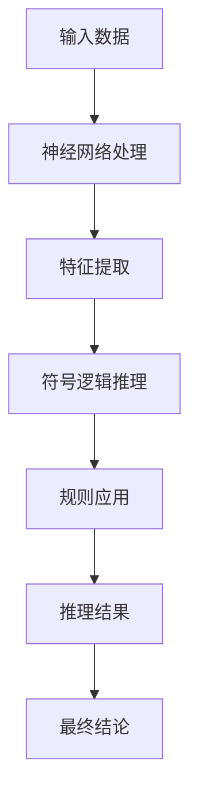

                 


# 神经符号推理在AI Agent常识推理中的应用

> 关键词：神经符号推理、AI Agent、常识推理、符号逻辑、神经网络、知识图谱

> 摘要：本文深入探讨神经符号推理在AI Agent常识推理中的应用，从背景、核心概念、算法原理到系统设计和项目实战，全面解析神经符号推理的技术细节和实际应用。通过结合符号逻辑与神经网络，神经符号推理为AI Agent提供了更强大的常识推理能力，能够处理复杂的现实世界问题。

---

# 第一部分: 背景介绍

## 第1章: 神经符号推理的背景与意义

### 1.1 神经符号推理的背景
在人工智能领域，常识推理是构建智能系统的重要挑战。传统符号逻辑方法依赖于手动编写规则，难以处理复杂和模糊的问题。而神经网络虽然在感知和模式识别方面表现出色，但缺乏对符号逻辑的处理能力，难以解释推理过程。神经符号推理的提出，旨在结合符号逻辑的可解释性和神经网络的泛化能力，解决传统方法的局限性。

### 1.2 问题描述
AI Agent需要在复杂环境中进行推理和决策，例如医疗诊断、法律推理和自然语言理解。然而，传统的符号逻辑方法难以处理大规模数据，而纯粹的神经网络方法则缺乏可解释性和逻辑推理能力。神经符号推理通过结合符号逻辑和神经网络，为AI Agent提供了更强大的推理能力。

### 1.3 神经符号推理的解决思路
神经符号推理的核心思想是将符号逻辑嵌入到神经网络中，利用神经网络的强大表征能力来处理复杂数据，同时借助符号逻辑的规则进行推理和解释。通过这种方式，AI Agent可以在处理复杂任务时，既具备强大的数据处理能力，又能够进行逻辑推理和解释。

### 1.4 边界与外延
神经符号推理的边界包括符号逻辑的复杂度和神经网络的训练难度。其外延涉及知识图谱构建、逻辑推理和强化学习的结合。

## 第2章: 神经符号推理的核心概念与联系

### 2.1 神经符号推理的核心原理
神经符号推理通过将符号逻辑规则嵌入到神经网络中，利用神经网络的特征提取能力来处理输入数据，并结合符号逻辑进行推理。例如，知识图谱中的关系可以表示为符号逻辑规则，神经网络则负责将输入数据映射到这些规则中。

### 2.2 神经符号推理的属性对比
| 属性 | 符号逻辑 | 神经网络 | 神经符号推理 |
|------|---------|----------|--------------|
| 表示方式 | 符号化 | 向量化 | 结合符号与向量 |
| 可解释性 | 高 | 低 | 中等 |
| 处理能力 | 强规则处理 | 强模式识别 | 两者兼备 |

### 2.3 神经符号推理的ER实体关系图
```mermaid
er
    actor: AI Agent
    knowledge_base: 知识库
    neural_network: 神经网络
    symbol_logic: 符号逻辑
    relation: 推理关系
    actor --> knowledge_base: 查询知识库
    actor --> neural_network: 输入数据
    actor --> symbol_logic: 应用符号规则
    neural_network --> relation: 输出推理关系
    symbol_logic --> relation: 输出推理关系
```

---

# 第二部分: 算法原理

## 第3章: 神经符号推理的算法原理

### 3.1 神经符号推理的数学模型
神经符号推理的数学模型结合了符号逻辑和神经网络的表示方式。符号逻辑通过规则嵌入到神经网络中，例如通过逻辑约束或规则网络进行推理。神经网络则通过参数优化来学习符号逻辑的表示。

### 3.2 神经符号推理的实现流程
神经符号推理的实现流程包括以下步骤：
1. 数据预处理：将输入数据转换为适合神经网络处理的形式。
2. 神经网络处理：神经网络对输入数据进行特征提取和初步推理。
3. 符号逻辑推理：结合符号逻辑规则进行进一步推理和验证。
4. 结果整合：将神经网络和符号逻辑推理的结果进行整合，输出最终结论。

### 3.3 神经符号推理的算法流程图


---

# 第三部分: 系统分析与架构设计

## 第4章: 系统分析与架构设计

### 4.1 项目场景介绍
以医疗诊断为例，AI Agent需要根据病人的症状、检查结果和医疗知识进行诊断推理。神经符号推理可以通过结合症状的向量表示和医疗知识图谱的符号逻辑进行推理。

### 4.2 系统功能设计
- 知识库构建：构建医疗知识图谱，包含疾病、症状、检查项目等信息。
- 神经网络处理：将输入的病人的症状和检查结果进行特征提取。
- 符号逻辑推理：结合知识图谱进行诊断推理。
- 结果整合：输出最终诊断结果。

### 4.3 系统架构设计


### 4.4 系统接口设计
- 输入接口：接收病人的症状和检查结果。
- 输出接口：输出诊断结果和推理过程。

### 4.5 系统交互流程图
```mermaid
sequence
    用户 --> AI Agent: 提交症状和检查结果
    AI Agent --> 神经网络: 进行特征提取
    神经网络 --> 符号逻辑: 应用诊断规则
    符号逻辑 --> 知识库: 查询疾病关系
    知识库 --> 神经网络: 返回相关疾病
    神经网络 --> 用户: 输出诊断结果
```

---

# 第四部分: 项目实战

## 第5章: 神经符号推理的项目实战

### 5.1 环境安装
安装必要的环境和库：
```bash
pip install numpy
pip install tensorflow
pip install pymermaid
```

### 5.2 系统核心实现
```python
import numpy as np
import tensorflow as tf
from keras.layers import Input, Dense, Dropout
from keras.models import Model

# 定义符号逻辑规则
def symbol_rule(x):
    return x > 0.5

# 构建神经网络模型
input_layer = Input(shape=(input_dim,))
dense_layer = Dense(64, activation='relu')(input_layer)
dropout_layer = Dropout(0.5)(dense_layer)
output_layer = Dense(1, activation='sigmoid')(dropout_layer)
model = Model(inputs=input_layer, outputs=output_layer)

# 编译模型
model.compile(optimizer='adam', loss='binary_crossentropy', metrics=['accuracy'])

# 训练模型
model.fit(x_train, y_train, epochs=10, batch_size=32)
```

### 5.3 代码应用解读
- 神经网络部分：使用Keras构建一个简单的神经网络模型，进行特征提取。
- 符号逻辑部分：定义符号逻辑规则，对神经网络的输出进行进一步推理。

### 5.4 案例分析
以医疗诊断为例，输入病人的症状和检查结果，神经网络进行特征提取，符号逻辑结合知识图谱进行推理，最终输出诊断结果。

### 5.5 项目小结
通过项目实战，展示了神经符号推理在实际应用中的可行性和有效性。神经网络和符号逻辑的结合，能够提高AI Agent的推理能力和可解释性。

---

# 第五部分: 总结与展望

## 第6章: 总结与展望

### 6.1 总结
神经符号推理结合了符号逻辑和神经网络的优点，为AI Agent提供了强大的常识推理能力。本文从背景、原理、架构设计到项目实战，全面解析了神经符号推理的技术细节和应用。

### 6.2 展望
未来，神经符号推理将在更多领域得到应用，例如法律推理、自动驾驶和自然语言理解。同时，如何进一步优化神经符号推理的效率和可解释性，是未来研究的重要方向。

### 6.3 最佳实践 Tips
- 数据质量是神经符号推理的关键，确保知识库的准确性和完整性。
- 在实际应用中，需要结合具体场景选择合适的神经符号推理模型。
- 神经符号推理的可解释性是其优势之一，应充分利用这一点进行推理过程的优化。

---

作者：AI天才研究院/AI Genius Institute & 禅与计算机程序设计艺术 /Zen And The Art of Computer Programming

