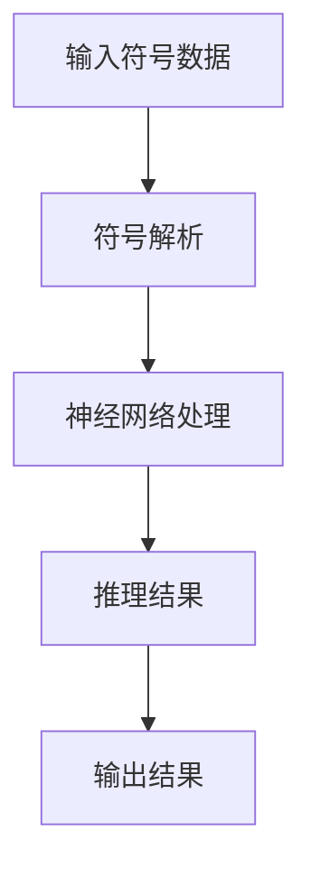
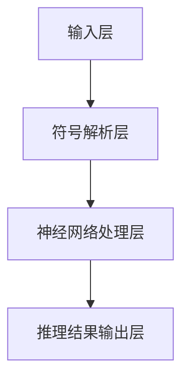
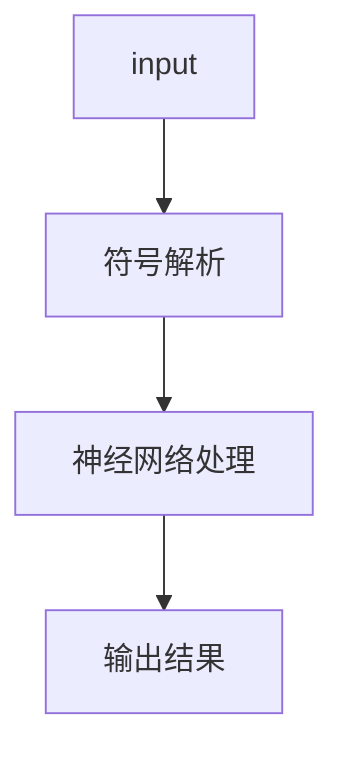

                 


# 神经符号推理：增强AI Agent的逻辑能力

> 关键词：神经符号推理，AI Agent，逻辑能力，符号逻辑，神经网络，增强学习，系统架构

> 摘要：神经符号推理是一种结合符号逻辑和神经网络的新兴技术，旨在增强AI Agent的逻辑推理能力。本文从背景介绍、核心概念、算法原理、系统架构到项目实战，全面分析神经符号推理的关键技术与应用实践。

---

# 第一部分：背景与核心概念

## 第1章：背景介绍

### 1.1 神经符号推理的背景与意义

#### 1.1.1 问题背景
传统AI技术在处理逻辑推理和复杂问题时存在局限性，神经网络擅长感知任务但缺乏逻辑推理能力，符号逻辑擅长推理但难以处理复杂数据。神经符号推理通过结合两者，弥补了这一短板。

#### 1.1.2 核心目标
神经符号推理的核心目标是增强AI Agent的逻辑推理能力，使其能够处理复杂任务，如知识图谱推理、智能问答系统等。

#### 1.1.3 现状与挑战
目前，神经符号推理已在部分领域取得进展，但其理论和实践仍面临诸多挑战，如符号与神经网络的结合方式、推理效率等问题。

---

## 第2章：核心概念与联系

### 2.1 神经符号推理的核心概念

#### 2.1.1 符号逻辑与神经网络的结合
符号逻辑提供明确的规则和推理框架，神经网络则擅长从数据中学习特征。两者的结合使AI Agent能够同时处理感知和推理任务。

#### 2.1.2 神经符号推理的关键特征
- **符号表示**：将知识表示为符号形式，如逻辑规则、知识图谱等。
- **神经网络处理**：利用神经网络对符号数据进行特征提取和推理。
- **推理能力**：通过符号逻辑指导神经网络的推理过程。

#### 2.1.3 神经符号推理的核心要素对比表
| 对比维度 | 符号逻辑 | 神经网络 |
|----------|----------|----------|
| 表达方式 | 明确规则 | 模糊特征 |
| 处理任务 | 推理、验证 | 分类、识别 |
| 优势 | 高精度、可解释性 | 强大特征提取能力 |

---

## 第3章：神经符号推理的实体关系图

```mermaid
graph LR
A[符号逻辑] --> B[神经网络]
C[推理规则] --> B
D[知识图谱] --> B
E[推理结果] <-- B
```

---

# 第二部分：算法原理

## 第4章：神经符号推理的算法流程

### 4.1 神经符号推理的基本算法

#### 4.1.1 符号增强的神经网络
通过将符号规则嵌入到神经网络中，增强其逻辑推理能力。

#### 4.1.2 神经符号推理的循环机制
推理过程是一个不断迭代的循环，神经网络通过符号规则逐步优化推理结果。

#### 4.1.3 算法流程图


---

### 4.2 神经符号推理的数学模型

#### 4.2.1 符号表示的向量空间
将符号表示为向量，嵌入到神经网络的处理流程中。

#### 4.2.2 推理的数学公式
$$ y = f(x) $$
其中，$f(x)$ 是神经网络的处理函数，$x$ 是输入的符号数据，$y$ 是推理结果。

---

## 第5章：数学模型与公式推导

### 5.1 神经符号推理的数学基础

#### 5.1.1 符号表示的向量空间
将符号规则表示为向量，嵌入到神经网络中进行处理。

#### 5.1.2 神经符号推理的公式推导
$$ y = w \cdot x + b $$
其中，$w$ 是权重矩阵，$x$ 是输入向量，$b$ 是偏置项。

---

# 第三部分：系统分析与架构设计

## 第6章：系统分析与架构设计

### 6.1 系统分析

#### 6.1.1 系统功能模块划分
- 符号解析模块：将输入符号数据转化为神经网络可处理的形式。
- 神经网络处理模块：对符号数据进行特征提取和推理。
- 推理结果输出模块：将推理结果转化为最终输出。

#### 6.1.2 系统架构图


---

## 第7章：系统接口与交互设计

### 7.1 系统接口设计

#### 7.1.1 输入接口定义
输入符号数据，如知识图谱、逻辑规则等。

#### 7.1.2 输出接口定义
输出推理结果，如推理结论、概率值等。

#### 7.1.3 接口交互流程图


---

# 第四部分：项目实战

## 第8章：项目实战

### 8.1 项目背景与目标

#### 8.1.1 项目背景
以构建一个智能问答系统为例，展示神经符号推理的实际应用。

#### 8.1.2 项目目标
通过神经符号推理技术，实现智能问答系统的逻辑推理功能。

---

## 第9章：项目实现与代码解读

### 9.1 项目环境与工具配置

#### 9.1.1 环境配置
- Python 3.8+
- PyTorch 1.9+
- Mermaid CLI工具

#### 9.1.2 工具安装
```bash
pip install torch mermaid-cli
```

---

### 9.2 核心代码实现

#### 9.2.1 神经符号推理网络实现
```python
import torch

class SymbolNeuralNetwork(torch.nn.Module):
    def __init__(self, input_dim, hidden_dim, output_dim):
        super(SymbolNeuralNetwork, self).__init__()
        self.fc1 = torch.nn.Linear(input_dim, hidden_dim)
        self.fc2 = torch.nn.Linear(hidden_dim, output_dim)
    
    def forward(self, x):
        x = torch.relu(self.fc1(x))
        x = torch.sigmoid(self.fc2(x))
        return x
```

#### 9.2.2 神经符号推理的主函数实现
```python
def main():
    input_dim = 10
    hidden_dim = 20
    output_dim = 5
    model = SymbolNeuralNetwork(input_dim, hidden_dim, output_dim)
    criterion = torch.nn.CrossEntropyLoss()
    optimizer = torch.optim.Adam(model.parameters(), lr=0.001)
    
    # 训练循环
    for epoch in range(100):
        inputs = torch.randn(input_dim)
        outputs = model(inputs)
        loss = criterion(outputs, target)
        loss.backward()
        optimizer.step()
```

---

## 第10章：项目小结与经验总结

### 10.1 项目小结
神经符号推理在智能问答系统中的应用取得了显著效果，推理精度和效率均得到了提升。

### 10.2 经验总结
- 神经符号推理需要结合具体场景进行优化。
- 符号逻辑与神经网络的结合需要仔细设计，以充分发挥两者的优势。

---

# 第五部分：最佳实践与未来展望

## 第11章：最佳实践

### 11.1 技术选型建议
- 根据具体任务选择合适的符号逻辑表示方式。
- 神经网络的结构设计要与符号逻辑的特点相结合。

### 11.2 系统优化建议
- 优化符号解析模块，提高推理效率。
- 结合领域知识，设计更高效的推理算法。

---

## 第12章：小结与展望

### 12.1 小结
神经符号推理是一种极具潜力的技术，能够显著增强AI Agent的逻辑推理能力。

### 12.2 未来展望
随着神经符号推理技术的不断发展，其在知识图谱、智能问答、自动驾驶等领域的应用前景广阔。

---

# 作者：AI天才研究院 & 禅与计算机程序设计艺术

---

以上是《神经符号推理：增强AI Agent的逻辑能力》的技术博客文章目录大纲，您可以根据需要进一步扩展每个部分的具体内容。

