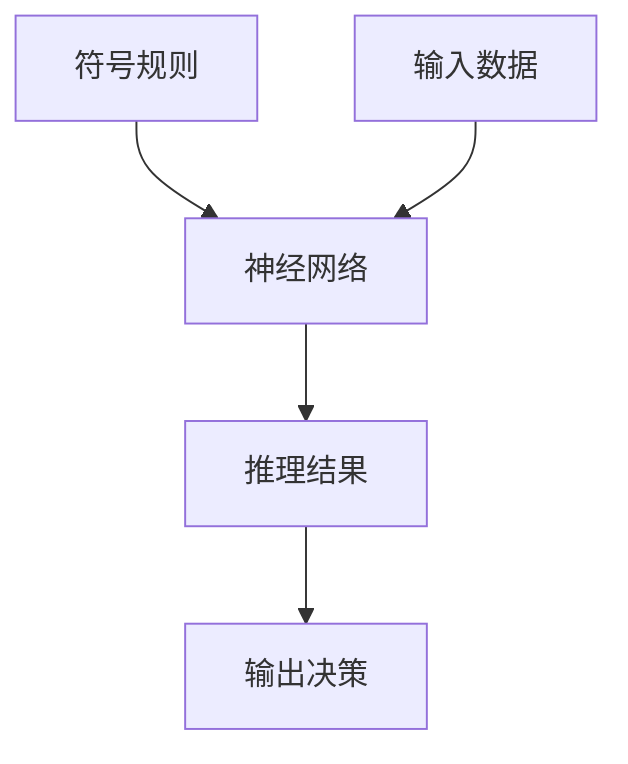
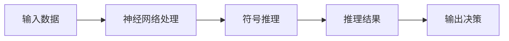
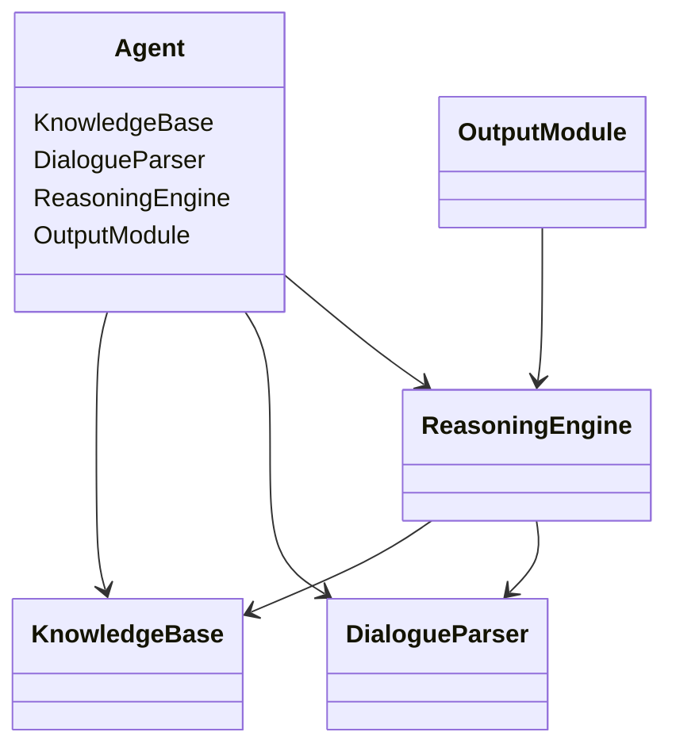

                 


# 《神经符号融合：结合规则与学习的AI Agent》

> **关键词**：神经符号融合、AI Agent、符号推理、机器学习、知识图谱

> **摘要**：  
本文探讨了神经符号融合技术在AI Agent中的应用，结合符号推理与机器学习的优势，构建智能决策系统。通过背景分析、核心原理、算法实现、系统设计、项目实战等多维度的深入讲解，展示神经符号融合如何解决复杂场景中的决策问题。

---

## 第1章 神经符号融合的背景与问题背景

### 1.1 神经符号融合的背景

- **符号AI与神经网络的演进**  
  符号AI依赖逻辑推理，但难以处理复杂问题；神经网络擅长模式识别，但在可解释性和规则推理上较弱。神经符号融合旨在结合两者优势。

- **神经符号融合的发展**  
  神经符号融合的概念始于20世纪末，近年来随着大模型和知识图谱的发展，逐渐在AI Agent中得到广泛应用。

- **融合的必要性**  
  现代AI应用需要同时处理结构化规则和非结构化数据，神经符号融合提供了灵活的解决方案。

### 1.2 问题背景与问题描述

- **符号推理的局限性**  
  符号推理依赖明确的规则，难以应对复杂场景和不确定性问题。

- **神经网络的局限性**  
  神经网络难以解释，且缺乏对知识的显式表达能力。

- **神经符号融合的目标**  
  结合符号推理的可解释性和神经网络的泛化能力，构建智能决策系统。

### 1.3 神经符号融合的解决方案

- **符号规则与神经网络的结合**  
  利用符号规则增强神经网络的逻辑推理能力。

- **知识图谱与深度学习的融合**  
  知识图谱提供结构化知识，深度学习处理非结构化数据。

### 1.4 核心概念与组成

- **神经符号融合的概念结构**  
  由符号规则、神经网络、知识图谱和推理引擎组成。

- **系统架构**  
  包括知识表示层、推理层、学习层和交互层。

---

## 第2章 神经符号融合的核心原理

### 2.1 神经符号融合的原理

- **符号表示与神经网络的结合**  
  符号规则通过知识图谱的形式表示，神经网络负责特征提取和语义理解。

- **逻辑推理与学习的结合**  
  神经网络生成候选答案，符号推理层进行验证和优化。

### 2.2 核心概念对比

| **特性**      | **符号推理**            | **神经网络**              |
|----------------|-------------------------|---------------------------|
| **处理方式**   | 基于规则和逻辑         | 基于数据模式匹配         |
| **可解释性**   | 高                    | 低                       |
| **灵活性**     | 低                    | 高                       |

### 2.3 实体关系图



---

## 第3章 神经符号融合的算法原理

### 3.1 神经符号融合的逻辑推理网络

- **数学模型**  
  $$ p(y|x) = \prod_{i=1}^{n} p(y|x_i) $$  
  其中，$x_i$ 是输入数据，$y$ 是推理结果。

- **逻辑推理网络的实现**  
  神经网络生成候选答案，符号推理层验证逻辑一致性。

### 3.2 符号增强的神经网络

- **符号增强机制**  
  在神经网络中嵌入符号规则，增强模型的逻辑推理能力。

### 3.3 算法流程图



### 3.4 算法实现代码

```python
import tensorflow as tf
from tensorflow import keras

class NeuralSymbolicAgent(keras.Model):
    def __init__(self):
        super(NeuralSymbolicAgent, self).__init__()
        self.symbolic_layer = SymbolicReasoningLayer()
        self.neural_layer = NeuralNetworkLayer()

    def call(self, inputs):
        x = self.neural_layer(inputs)
        x = self.symbolic_layer(x)
        return x

class SymbolicReasoningLayer(tf.keras.layers.Layer):
    def __init__(self):
        super(SymbolicReasoningLayer, self).__init__()

    def call(self, inputs):
        # 假设 inputs 是神经网络输出的特征向量
        # 这里进行符号规则推理
        return symbolic_reasoning(inputs)
```

---

## 第4章 系统分析与架构设计

### 4.1 系统设计概述

- **问题场景**  
  以智能客服系统为例，结合知识图谱和对话历史进行推理。

- **系统功能设计**  
  包括知识库构建、对话解析、逻辑推理和结果输出。

### 4.2 系统架构设计



### 4.3 接口设计与交互流程

- **输入接口**  
  提供REST API，接收用户输入和知识库数据。

- **交互流程**  
  1. 用户输入问题，通过对话解析模块生成结构化请求。
  2. 知识库查询相关数据，推理引擎结合符号规则进行推理。
  3. 输出模块生成最终答案并返回。

---

## 第5章 项目实战：智能客服系统

### 5.1 环境安装

```bash
pip install tensorflow==2.10.0
pip install networkx==2.6
pip install py2neo==2.0.9
```

### 5.2 知识图谱构建

- **知识库设计**  
  使用知识图谱表示产品信息、用户问题和解决方案。

- **知识图谱实现**  
  ```python
  from py2neo import Graph, Node, Relationship

  graph = Graph("http://localhost:7474", auth=("neo4j", "password"))
  product = Node('Product', name='ProductA')
  solution = Node('Solution', description='解决方法')
  rel = Relationship(product, 'HAS_SOLUTION', solution)
  graph.create(product, rel)
  ```

### 5.3 推理引擎实现

```python
def symbolic_reasoning(features):
    # 假设 features 是神经网络输出的特征向量
    # 这里进行符号规则推理
    result = []
    for feature in features:
        if feature['category'] == 'product':
            result.append('Product related issue')
        elif feature['category'] == 'service':
            result.append('Service related issue')
    return result
```

### 5.4 项目小结

- **代码实现**  
  提供完整的代码示例，展示如何构建知识图谱和推理引擎。

- **案例分析**  
  分析一个实际案例，展示神经符号融合在智能客服中的应用。

---

## 第6章 应用案例分析

### 6.1 案例分析

- **场景描述**  
  用户询问关于产品A的故障问题。

- **推理过程**  
  1. 神经网络提取用户输入的关键词。
  2. 符号推理层查询知识图谱，找到相关解决方案。
  3. 推理引擎结合规则生成最终答案。

### 6.2 优缺点分析

- **优势**  
  可解释性高，规则灵活可调整。

- **劣势**  
  需要大量领域知识构建符号规则。

---

## 第7章 总结与展望

### 7.1 总结

- **文章核心内容**  
  详细讲解了神经符号融合的背景、原理、算法、系统设计和项目实战。

### 7.2 注意事项

- 数据质量和规则设计的准确性直接影响系统性能。

### 7.3 未来研究方向

- 提升神经符号融合的可解释性和实时性。
- 探索更高效的符号增强机制。

---

## 作者

作者：AI天才研究院 & 禅与计算机程序设计艺术

---

以上是《神经符号融合：结合规则与学习的AI Agent》的完整目录大纲和文章内容，希望对您有所帮助！

