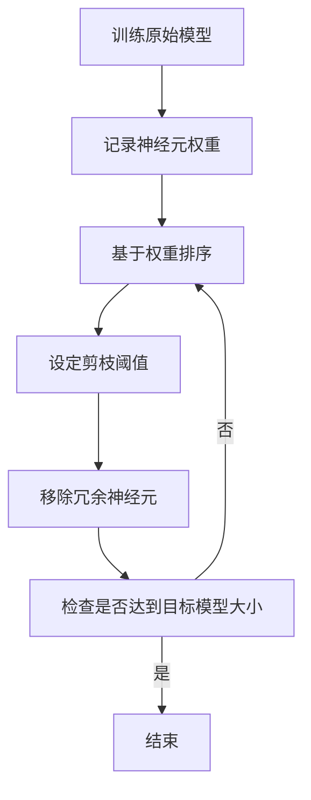
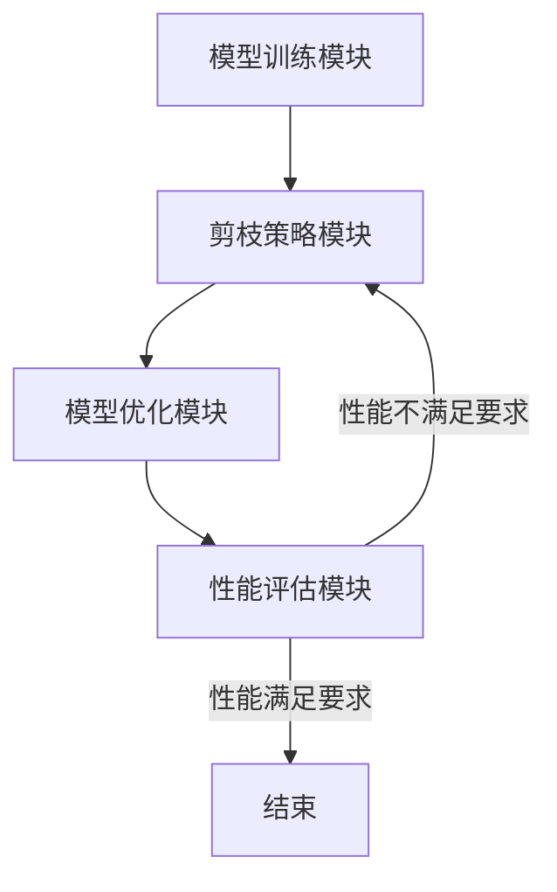
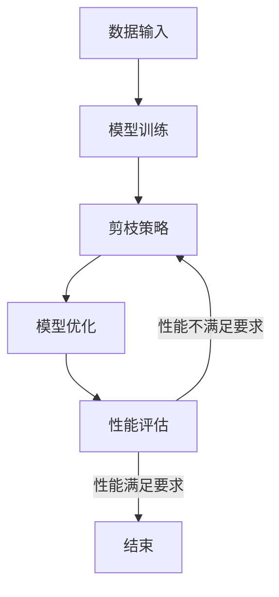
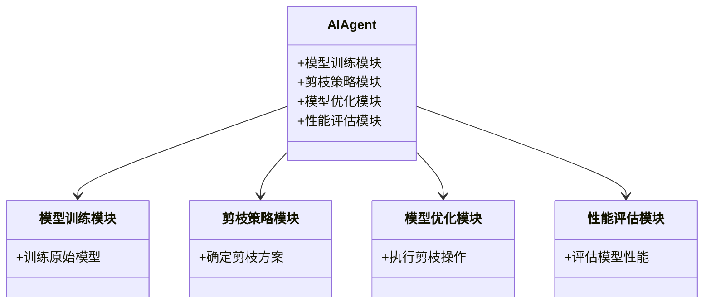

                 


# 神经网络剪枝：优化AI Agent的模型大小

## 关键词：神经网络剪枝、模型优化、AI Agent、模型压缩、深度学习

## 摘要：神经网络剪枝是一种通过移除冗余神经元或连接来优化AI Agent模型大小的技术，旨在减少计算资源消耗，提高模型部署效率。本文从背景、原理到应用，全面解析神经网络剪枝的核心概念、算法原理、系统架构设计及实战案例，帮助读者深入理解并有效应用这一技术。

---

# 第一部分: 神经网络剪枝的背景与核心概念

## 第1章: 神经网络剪枝的背景介绍

### 1.1 神经网络剪枝的背景

#### 1.1.1 神经网络的发展与挑战

神经网络的发展始于20世纪80年代，随着计算能力的提升和数据量的增加，深度学习模型逐渐变得庞大。例如，现代的大型语言模型（如GPT-3）包含1750亿个参数。虽然这些模型在性能上表现出色，但其巨大的规模带来了计算资源消耗高、部署难度大等问题。

#### 1.1.2 模型压缩的必要性

在实际应用中，AI Agent需要在资源有限的环境中运行，例如移动设备、嵌入式系统等。这些设备通常有严格的计算资源限制，包括CPU、GPU计算能力、存储空间和带宽等。因此，如何在保证模型性能的前提下，减少模型的大小和计算复杂度，成为了亟待解决的问题。

#### 1.1.3 问题背景与解决思路

神经网络剪枝是一种通过移除冗余神经元或连接来优化模型大小的技术。冗余的神经元或连接通常不会对模型的性能产生显著影响，但会增加模型的计算负担和存储需求。通过剪枝，可以显著降低模型的复杂度，从而提高部署效率和运行速度。

### 1.2 神经网络剪枝的核心概念

#### 1.2.1 剪枝技术的基本原理

剪枝技术的基本思想是通过分析模型的权重，移除对模型性能影响较小的神经元或连接。这可以通过多种方式实现，例如基于权重重要性的排序、基于梯度的信息判断等。

#### 1.2.2 剪枝技术的类型

剪枝技术可以分为以下几种类型：
- **贪心剪枝**：逐层移除对模型影响最小的神经元或连接。
- **非贪心剪枝**：通过优化算法一次性确定最优的剪枝方案。
- **动态剪枝**：在模型训练过程中动态调整剪枝策略。

#### 1.2.3 剪枝技术的优缺点

- **优点**：
  - 显著减少模型参数数量，降低存储需求。
  - 减少计算复杂度，提高推理速度。
  - 降低计算资源消耗，适合边缘计算环境。
- **缺点**：
  - 剪枝可能会导致模型性能下降，尤其是在复杂任务中。
  - 剪枝后的模型可能需要重新训练或微调，增加额外的计算成本。

#### 1.2.4 剪枝技术与其他技术的关系

剪枝技术与其他模型优化技术（如知识蒸馏、量化、低秩分解等）密切相关。这些技术可以结合使用，以进一步优化模型性能和效率。

## 第2章: 神经网络剪枝的核心概念与联系

### 2.1 神经网络剪枝的核心原理

剪枝技术的核心原理是通过分析模型的权重分布，识别并移除对模型性能影响较小的神经元或连接。例如，可以基于权重的绝对值大小进行排序，移除绝对值较小的权重，从而减少模型的参数数量。

### 2.2 神经网络剪枝的概念属性特征对比

以下是对剪枝技术的优缺点分析：

| 特性           | 优点                           | 缺点                           |
|----------------|--------------------------------|--------------------------------|
| 参数减少       | 显著减少模型参数数量           | 可能导致模型性能下降           |
| 计算效率       | 提高推理速度                   | 需要额外的训练或微调           |
| 资源消耗       | 降低存储和计算资源消耗         | 需要额外的计算资源进行剪枝     |

### 2.3 神经网络剪枝的ER实体关系图

以下是神经网络剪枝的ER实体关系图：

```mermaid
er
   _actor(AI Agent)
    action(剪枝操作)
    parameter(模型参数)
    effect(性能变化)
    actor -[执行]-> action
    action -[影响]-> parameter
    parameter -[导致]-> effect
```

---

# 第二部分: 神经网络剪枝的算法原理

## 第3章: 神经网络剪枝的算法原理

### 3.1 剪枝算法的基本原理

剪枝算法的基本原理是通过分析模型的权重分布，识别并移除对模型性能影响较小的神经元或连接。以下是一些常见的剪枝算法及其流程：

#### 3.1.1 贪心剪枝算法

贪心剪枝算法是一种逐层剪枝的方法，具体步骤如下：

1. **初始化**：训练原始模型，记录每个神经元的权重。
2. **排序**：基于权重的绝对值大小对神经元进行排序。
3. **剪枝**：移除绝对值最小的一定比例的神经元或连接。
4. **重复**：重复步骤2和3，直到达到目标模型大小。

#### 3.1.2 非贪心剪枝算法

非贪心剪枝算法通过优化算法一次性确定最优的剪枝方案：

1. **初始化**：训练原始模型。
2. **构建优化目标**：定义剪枝目标函数，例如最小化剪枝后的模型参数数量。
3. **优化**：使用优化算法（如梯度下降）找到最优的剪枝方案。
4. **剪枝**：根据优化结果移除冗余的神经元或连接。

#### 3.1.3 动态剪枝算法

动态剪枝算法在模型训练过程中动态调整剪枝策略：

1. **初始化**：训练原始模型，同时记录每个神经元的权重变化。
2. **监控**：实时监控神经元的权重变化，识别冗余神经元。
3. **剪枝**：动态移除冗余神经元，调整模型结构。
4. **微调**：对剪枝后的模型进行微调，恢复性能。

### 3.2 剪枝算法的数学模型

#### 3.2.1 贪心剪枝算法的数学模型

贪心剪枝算法的数学模型可以表示为：

$$
\theta_{\text{new}} = \{ \theta_i | |\theta_i| > \tau \}
$$

其中，$\theta_{\text{new}}$是剪枝后的参数集合，$\theta_i$是原始模型的参数，$\tau$是剪枝阈值。

#### 3.2.2 非贪心剪枝算法的数学模型

非贪心剪枝算法通常基于优化目标函数：

$$
\min_{\theta} \|\theta\|_0 + \lambda \mathcal{L}(\theta, X, Y)
$$

其中，$\|\theta\|_0$是模型参数的稀疏性度量，$\mathcal{L}(\theta, X, Y)$是损失函数，$\lambda$是正则化系数。

#### 3.2.3 动态剪枝算法的数学模型

动态剪枝算法通常结合模型训练过程中的梯度信息：

$$
\theta_{t+1} = \theta_t - \eta \frac{\partial \mathcal{L}}{\partial \theta_t} - \gamma (\theta_t - \theta_{t-1})
$$

其中，$\theta_t$是当前时刻的模型参数，$\eta$是学习率，$\gamma$是动量系数，$\frac{\partial \mathcal{L}}{\partial \theta_t}$是损失函数的梯度。

### 3.3 剪枝算法的流程图

以下是贪心剪枝算法的流程图：



---

# 第三部分: 神经网络剪枝的系统分析与架构设计

## 第4章: 神经网络剪枝的系统分析

### 4.1 系统问题场景介绍

在AI Agent的应用中，模型大小和计算效率是两个关键问题。大型模型通常需要大量的计算资源和存储空间，这限制了其在边缘设备上的应用。因此，如何通过剪枝技术优化模型大小，成为AI Agent设计中的重要问题。

### 4.2 系统功能设计

#### 4.2.1 系统功能模块划分

1. **模型训练模块**：负责训练原始模型，记录神经元权重。
2. **剪枝策略模块**：根据权重分布确定剪枝方案。
3. **模型优化模块**：执行剪枝操作，调整模型结构。
4. **性能评估模块**：评估剪枝后的模型性能。

#### 4.2.2 系统功能模块的交互设计

以下是系统功能模块的交互设计流程图：



### 4.3 系统架构设计

#### 4.3.1 系统架构的层次划分

1. **数据输入层**：接收输入数据，如图像、文本等。
2. **模型训练层**：训练原始模型，记录神经元权重。
3. **剪枝策略层**：基于权重分布制定剪枝方案。
4. **模型优化层**：执行剪枝操作，调整模型结构。
5. **性能评估层**：评估剪枝后的模型性能。

#### 4.3.2 系统架构的组件设计

以下是系统架构的组件设计图：



---

## 第5章: 神经网络剪枝的系统架构设计方案

### 5.1 系统架构的领域模型

以下是系统架构的领域模型：



---

## 第6章: 项目实战

### 6.1 环境安装

为了实现神经网络剪枝，需要以下环境配置：

- **Python**：3.6+
- **深度学习框架**：TensorFlow或PyTorch
- **GPU支持**：NVIDIA GPU（推荐）

### 6.2 系统核心实现源代码

以下是基于PyTorch的剪枝算法实现代码示例：

```python
import torch
import torch.nn as nn
import torch.optim as optim

# 定义原始模型
class OriginalModel(nn.Module):
    def __init__(self):
        super(OriginalModel, self).__init__()
        self.fc1 = nn.Linear(784, 256)
        self.fc2 = nn.Linear(256, 128)
        self.fc3 = nn.Linear(128, 10)

    def forward(self, x):
        x = x.view(-1, 784)
        x = self.fc1(x)
        x = self.fc2(x)
        x = self.fc3(x)
        return x

# 初始化模型
model = OriginalModel()

# 训练原始模型
criterion = nn.CrossEntropyLoss()
optimizer = optim.SGD(model.parameters(), lr=0.01)
for epoch in range(10):
    for inputs, labels in dataloader:
        outputs = model(inputs)
        loss = criterion(outputs, labels)
        loss.backward()
        optimizer.step()

# 剪枝操作
weight_threshold = 0.5
pruned_model = PrunedModel()
for name, param in model.named_parameters():
    if 'fc1' in name:
        pruned_weights = param.data.abs() > weight_threshold
        pruned_model.fc1.weight.data = param.data[pruned_weights]
```

### 6.3 代码应用解读与分析

1. **模型训练模块**：训练原始模型，记录神经元权重。
2. **剪枝策略模块**：基于权重绝对值大小进行排序，移除绝对值较小的权重。
3. **模型优化模块**：执行剪枝操作，调整模型结构。
4. **性能评估模块**：评估剪枝后的模型性能，检查是否满足要求。

---

## 第7章: 总结与展望

### 7.1 总结

神经网络剪枝是一种有效的模型优化技术，通过移除冗余的神经元或连接，显著减少模型的参数数量和计算复杂度。本文从背景、原理到应用，全面解析了神经网络剪枝的核心概念、算法原理、系统架构设计及实战案例。

### 7.2 未来展望

随着AI技术的不断发展，神经网络剪枝技术将更加智能化和自动化。未来的研究方向包括：
- **动态剪枝策略**：在模型训练过程中动态调整剪枝策略。
- **多目标优化**：结合模型性能和计算效率，实现多目标优化。
- **跨模态剪枝**：将剪枝技术应用于多模态模型，优化整体性能。

---

## 作者信息

作者：AI天才研究院/AI Genius Institute & 禅与计算机程序设计艺术 /Zen And The Art of Computer Programming

---

以上是《神经网络剪枝：优化AI Agent的模型大小》的完整目录大纲及文章内容。通过系统化的分析和实践，本文为读者提供了从理论到实践的全面指导，帮助读者深入理解并有效应用神经网络剪枝技术。

