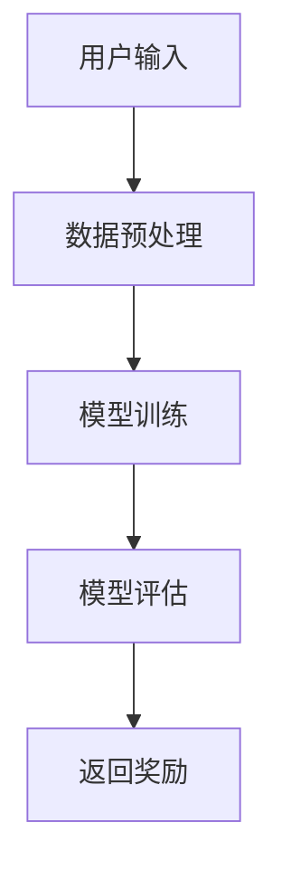

                 


# 神经网络架构搜索：为AI Agent找到最佳结构

> **关键词**：神经网络架构搜索、AI Agent、深度学习、强化学习、遗传算法  
> **摘要**：神经网络架构搜索（Neural Architecture Search, NAS）是一种自动寻找最优神经网络结构的方法，旨在为AI Agent找到最佳的网络结构，以提高模型性能和减少手动调参的时间。本文将详细探讨NAS的核心概念、算法原理、系统架构以及实际应用，帮助读者全面理解并掌握这一技术。

---

# 第1章 神经网络架构搜索概述

## 1.1 神经网络架构搜索的起源与发展

### 1.1.1 神经网络的发展历程
神经网络的发展可以追溯到20世纪50年代，从最初的感知机（Perceptron）到多层感知机（MLP），再到卷积神经网络（CNN）、循环神经网络（RNN）等。每一代神经网络的架构改进都依赖于研究者的经验和实验，这种方法耗时且效率低下。

### 1.1.2 神经网络架构搜索的提出
随着深度学习的兴起，神经网络的复杂性不断提高，手动设计网络架构变得越来越困难。为了解决这一问题，神经网络架构搜索（NAS）应运而生。NAS的目标是通过自动化方法，搜索出最优的网络架构，从而提高模型性能。

### 1.1.3 神经网络架构搜索的核心目标
NAS的核心目标是在给定任务和约束条件下，自动找到最优的神经网络结构，包括网络层数、每层的节点数、激活函数、连接方式等。这种方法可以显著减少人工调参的时间，同时提高模型的性能。

---

## 1.2 神经网络架构搜索的重要性

### 1.2.1 传统神经网络设计的局限性
传统神经网络设计依赖于研究者的经验，存在以下问题：
- **效率低下**：需要反复实验和调整网络结构。
- **次优解风险**：手动设计可能无法找到最优解。
- **复杂性高**：对于复杂的任务，手动设计网络结构难度较大。

### 1.2.2 神经网络架构搜索的优势
- **自动化**：NAS能够自动搜索最优网络架构，减少人工干预。
- **高效性**：通过自动化搜索，可以在较短时间内找到高性能的网络结构。
- **扩展性**：适用于多种任务和数据集，灵活性强。

### 1.2.3 神经网络架构搜索在AI Agent中的应用价值
AI Agent需要处理复杂的任务，如图像识别、自然语言处理、自动驾驶等。NAS可以帮助AI Agent找到最优的网络结构，从而提高任务执行的效率和准确性。

---

## 1.3 神经网络架构搜索的基本概念

### 1.3.1 神经网络架构的定义
神经网络架构是指网络的结构，包括层数、每层的节点数、节点之间的连接方式、激活函数等。

### 1.3.2 神经网络架构搜索的定义
神经网络架构搜索是一种通过自动化方法，搜索最优网络架构的过程，通常涉及定义搜索空间、设计搜索策略和评估模型性能。

### 1.3.3 神经网络架构搜索的核心要素
- **搜索空间**：定义可能的网络架构集合。
- **目标函数**：用于评估网络性能的指标，如准确率、损失函数等。
- **搜索策略**：用于在搜索空间中选择最优架构的方法，如强化学习、遗传算法等。

---

## 1.4 本章小结

本章介绍了神经网络架构搜索的背景、重要性和基本概念。通过对比传统神经网络设计的局限性和NAS的优势，我们理解了NAS在AI Agent中的应用价值。接下来，我们将深入探讨NAS的核心原理和算法。

---

# 第2章 神经网络架构搜索的核心概念与联系

## 2.1 神经网络架构搜索的原理与方法

### 2.1.1 神经网络架构搜索的基本原理
NAS的核心原理是通过自动化搜索，找到最优的网络架构。搜索空间通常包括网络的拓扑结构、超参数等。搜索策略决定了如何遍历搜索空间，目标函数用于评估候选架构的性能。

### 2.1.2 神经网络架构搜索的关键技术
- **强化学习**：通过强化学习代理（RL Agent）来搜索最优架构。
- **遗传算法**：通过模拟生物进化过程，筛选出最优架构。
- **神经进化**：通过不断变异和选择，优化网络结构。

### 2.1.3 神经网络架构搜索的搜索策略
- **随机搜索**：随机生成候选架构并评估其性能。
- **强化学习搜索**：通过强化学习代理逐步优化网络结构。
- **遗传算法搜索**：通过交叉和变异操作生成新架构。

---

## 2.2 神经网络架构搜索的关键技术对比

### 2.2.1 随机搜索与强化学习搜索的对比
| 对比维度 | 随机搜索 | 强化学习搜索 |
|----------|----------|---------------|
| 策略     | 随机生成 | 基于奖励优化 |
| 效率     | 较低     | 较高          |
| 控制能力 | 无目标   | 有目标        |

### 2.2.2 遗传算法与神经进化的对比
| 对比维度 | 遗传算法 | 神经进化 |
|----------|----------|-----------|
| 搜索方式 | 交叉和变异 | 突变和选择 |
| 应用场景 | 适用于离散搜索空间 | 适用于连续搜索空间 |

### 2.2.3 网络架构搜索的优缺点分析
- **优点**：自动化、高效性、灵活性。
- **缺点**：计算资源消耗大、搜索空间复杂性高。

---

## 2.3 神经网络架构搜索的策略对比

### 2.3.1 随机搜索与强化学习搜索的对比
随机搜索简单但效率低，强化学习搜索更高效但需要复杂的策略设计。

### 2.3.2 遗传算法与神经进化的对比
遗传算法适用于离散搜索空间，神经进化适用于连续搜索空间。

### 2.3.3 神经网络架构搜索的优缺点分析
通过对比不同搜索策略的优缺点，我们可以选择最适合特定任务的搜索方法。

---

## 2.4 本章小结

本章详细探讨了神经网络架构搜索的核心原理和关键技术，对比了不同搜索策略的优缺点。通过这些分析，我们可以更好地理解NAS的实现原理和应用场景。接下来，我们将深入探讨NAS的算法原理和数学模型。

---

# 第3章 神经网络架构搜索的算法原理

## 3.1 强化学习在神经网络架构搜索中的应用

### 3.1.1 强化学习的基本原理
强化学习通过代理（Agent）与环境交互，通过试错学习策略，最大化累计奖励。在NAS中，代理负责生成网络架构，环境负责评估架构性能。

### 3.1.2 强化学习搜索的流程
1. 代理生成候选架构。
2. 环境评估候选架构性能，返回奖励。
3. 代理根据奖励调整搜索策略。

### 3.1.3 强化学习搜索的数学模型
- **策略函数**：$P(a|s) = \pi_\theta(a|s)$，其中$a$是动作，$s$是状态，$\theta$是参数。
- **奖励函数**：$R(s, a)$，表示在状态$s$下执行动作$a$的奖励。

---

## 3.2 遗传算法在神经网络架构搜索中的应用

### 3.2.1 遗传算法的基本原理
遗传算法模拟生物进化过程，通过选择、交叉和变异操作，生成新的个体（网络架构）。

### 3.2.2 遗传算法搜索的流程
1. 初始化种群。
2. 计算种群中每个个体的适应度。
3. 根据适应度进行选择、交叉和变异，生成新一代种群。
4. 重复步骤2和3，直到满足终止条件。

### 3.2.3 遗传算法的数学模型
- **适应度函数**：$f(x)$，表示个体$x$的适应度。
- **选择操作**：根据适应度进行选择，常用方法有轮盘赌选择、锦标赛选择等。
- **交叉操作**：将两个个体的基因进行交叉，生成新的个体。
- **变异操作**：随机改变个体的基因，增加多样性。

---

## 3.3 神经进化在神经网络架构搜索中的应用

### 3.3.1 神经进化的基本原理
神经进化是一种通过模拟生物进化过程，优化神经网络结构的方法。

### 3.3.2 神经进化搜索的流程
1. 初始化种群。
2. 训练每个个体的网络，并计算其性能。
3. 根据性能进行选择、交叉和变异，生成新一代种群。
4. 重复步骤2和3，直到满足终止条件。

### 3.3.3 神经进化的数学模型
- **适应度函数**：与遗传算法类似。
- **选择、交叉和变异操作**：与遗传算法类似。

---

## 3.4 本章小结

本章详细探讨了强化学习、遗传算法和神经进化在NAS中的应用。通过这些算法的对比和分析，我们可以选择最适合特定任务的搜索方法。接下来，我们将深入探讨NAS的系统架构和实际应用。

---

# 第4章 神经网络架构搜索的系统架构

## 4.1 系统分析与架构设计

### 4.1.1 系统功能需求
- **数据预处理**：对输入数据进行归一化、增强等处理。
- **模型训练**：根据搜索策略训练候选网络。
- **模型评估**：评估候选网络的性能，并返回奖励。

### 4.1.2 系统架构设计
使用Mermaid图展示系统架构：



### 4.1.3 系统接口设计
- **输入接口**：接收任务参数和数据。
- **输出接口**：输出最优网络架构和性能指标。

---

## 4.2 项目实战：使用NAS优化图像分类任务

### 4.2.1 环境安装
安装必要的库，如TensorFlow、Keras、Scikit-learn等。

### 4.2.2 核心代码实现
```python
import numpy as np
from tensorflow.keras import layers, models

def build_model(hp):
    model = models.Sequential()
    model.add(layers.Conv2D(filters=hp.Int('conv_1_filter', min_value=32, max_value=512, step=32),
                            kernel_size=(3, 3),
                            activation='relu',
                            input_shape=(28, 28, 1)))
    model.add(layers.MaxPooling2D(pool_size=(2, 2)))
    model.add(layers.Conv2D(filters=hp.Int('conv_2_filter', min_value=32, max_value=512, step=32),
                            kernel_size=(3, 3),
                            activation='relu'))
    model.add(layers.MaxPooling2D(pool_size=(2, 2)))
    model.add(layers.Flatten())
    model.add(layers.Dense(units=hp.Int('dense_1_units', min_value=32, max_value=512, step=32),
                            activation='relu'))
    model.add(layers.Dense(10, activation='softmax'))
    return model

# 使用Tuner进行搜索
import keras_tuner as kt

tuner = kt.RandomSearch(
    build_model,
    objective='val_accuracy',
    max_trials=10,
    executions_per_trial=2,
    directory='nas_tuning',
    project_name='mnist_nas'
)

tuner.search(...)
```

### 4.2.3 代码解读与分析
上述代码通过Keras Tuner库进行随机搜索，定义了一个卷积神经网络的搜索空间，包括卷积层、池化层和全连接层的参数。

---

## 4.3 本章小结

本章通过系统架构设计和项目实战，详细展示了NAS在图像分类任务中的应用。通过代码实现，我们可以更好地理解NAS的实际操作步骤。接下来，我们将总结最佳实践和注意事项。

---

# 第5章 最佳实践与小结

## 5.1 最佳实践

### 5.1.1 确定搜索空间
合理定义搜索空间，避免过于复杂。

### 5.1.2 选择搜索策略
根据任务需求选择合适的搜索策略，如强化学习、遗传算法等。

### 5.1.3 优化评估函数
设计高效的评估函数，减少计算成本。

## 5.2 小结

本文详细探讨了神经网络架构搜索的核心概念、算法原理和系统架构。通过对比不同搜索策略的优缺点，我们理解了如何选择最适合特定任务的搜索方法。通过实际案例，我们掌握了NAS的实现步骤和注意事项。

## 5.3 注意事项

- **计算资源**：NAS需要大量的计算资源，建议使用云计算或分布式计算。
- **搜索空间设计**：合理设计搜索空间，避免过于复杂。
- **评估函数优化**：设计高效的评估函数，减少计算成本。

## 5.4 拓展阅读

- 《Neural Architecture Search: A Survey》
- 《Darts: Differentiable Architecture Search》
- 《Auto-Keras: An Open Source Library for Deep Learning Auto-design》

---

# 作者：AI天才研究院/AI Genius Institute & 禅与计算机程序设计艺术 /Zen And The Art of Computer Programming

---

以上是《神经网络架构搜索：为AI Agent找到最佳结构》的技术博客文章的目录和内容概览。如需进一步扩展或修改，请随时告知！

