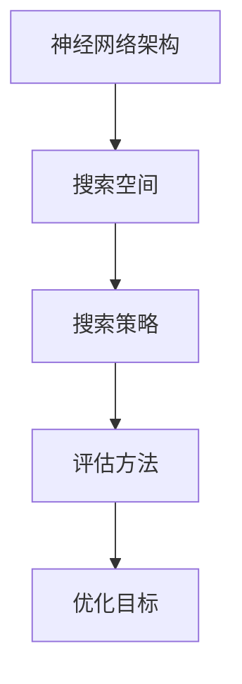
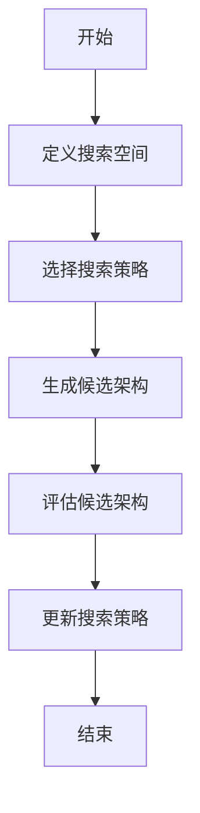
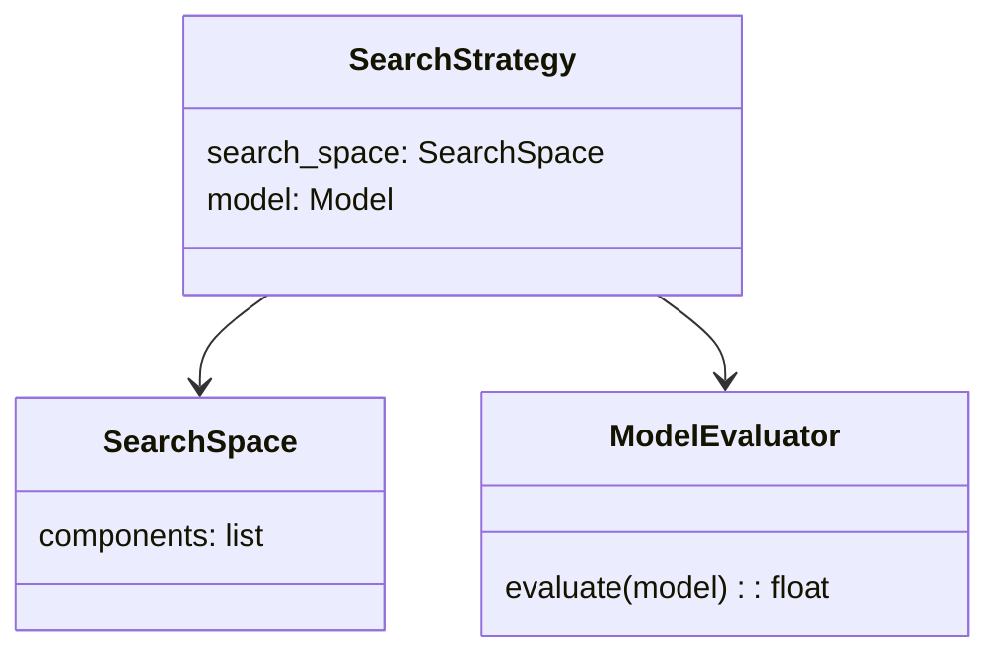
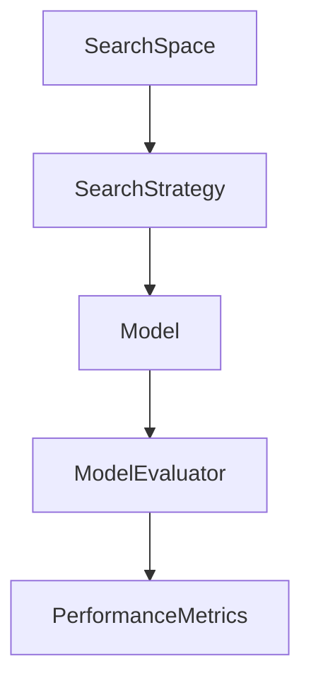

                 

<think>
好的，我需要为用户设计一本关于神经网络架构搜索（NAS）的书籍目录大纲。用户希望我按照他们提供的示例结构来组织内容，确保每一部分都详细且逻辑清晰。首先，我需要理解NAS的基本概念和其在AI Agent中的应用。

1. **背景介绍**：首先，我需要解释NAS的起源、发展及其在AI中的重要性。这包括比较传统神经网络设计与NAS的区别，以及当前的研究趋势。

2. **核心概念**：接下来，我需要详细讲解NAS中的关键概念，如搜索空间、搜索策略和评估方法。可能需要创建表格对比不同的搜索策略，并绘制实体关系图来展示这些概念之间的联系。

3. **算法原理**：选择几种典型的NAS算法，如基于强化学习、进化策略和梯度下降的方法。为每个算法提供详细的实现步骤，包括Mermaid流程图和Python代码示例，同时解释相关的数学模型和公式。

4. **系统分析与架构设计**：介绍典型的NAS系统，如DARTS和ENAS，绘制它们的领域模型类图和架构图，展示系统各部分的交互和组成部分。

5. **项目实战**：提供一个实际项目，涵盖环境安装、代码实现、案例分析和项目小结，帮助读者动手实践NAS。

6. **最佳实践**：总结经验，提醒读者在实践中的注意事项，并提供进一步阅读的资源。

在整个过程中，我需要确保每一章内容细化到三级目录，涵盖必要的技术细节，同时保持语言简洁易懂。最后，我会检查目录是否符合用户的要求，确保逻辑清晰、结构紧凑，满足专业IT领域技术博客的标准。
</think>

# 神经网络架构搜索：优化AI Agent的模型结构

> 关键词：神经网络架构搜索，AI Agent，深度学习，强化学习，进化策略

> 摘要：本文将详细探讨神经网络架构搜索（Neural Architecture Search，NAS）在优化AI Agent模型结构中的应用。通过逐步分析，我们将了解NAS的核心概念、算法原理以及实际应用场景，帮助读者掌握如何通过自动化的架构搜索来提升AI模型的性能。

---

# 第1章: 神经网络架构搜索概述

## 1.1 神经网络架构搜索的起源与发展

### 1.1.1 传统神经网络设计的局限性
传统的神经网络设计依赖于人工经验，存在以下问题：
- **计算成本高**：手动调整网络结构需要大量实验和计算资源。
- **优化难度大**：复杂的网络结构难以找到最优解。
- **可扩展性差**：难以适应不同任务和数据规模的变化。

### 1.1.2 神经网络架构搜索的提出
为了解决上述问题，神经网络架构搜索（NAS）应运而生。NAS通过自动化方法搜索最优的网络结构，减少了人工干预，提高了效率和性能。

### 1.1.3 神经网络架构搜索的现状与趋势
NAS技术正在快速发展，已在图像识别、自然语言处理等领域取得显著成果。未来，NAS将更加注重效率和通用性，适用于更多复杂任务。

## 1.2 神经网络架构搜索的核心概念

### 1.2.1 搜索空间定义
搜索空间是所有可能的网络结构的集合，包括层类型、连接方式等。明确的搜索空间定义是NAS的基础。

### 1.2.2 搜索策略选择
不同的搜索策略（如强化学习、进化策略）各有优劣，需根据任务需求选择合适的策略。

### 1.2.3 架构评估方法
评估方法包括准确率、计算复杂度等指标，用于衡量候选网络的性能。

## 1.3 神经网络架构搜索的关键挑战

### 1.3.1 计算资源消耗
NAS需要大量计算资源，如何降低消耗是关键挑战。

### 1.3.2 搜索效率问题
如何在有限时间内找到最优结构是NAS的核心问题。

### 1.3.3 过拟合与泛化能力
搜索过程可能产生过拟合，需通过正则化等方法提升泛化能力。

## 1.4 本章小结
本章介绍了NAS的背景、核心概念及挑战，为后续章节奠定了基础。

---

# 第2章: 神经网络架构搜索的核心概念与联系

## 2.1 核心概念原理

### 2.1.1 搜索空间的定义与表示
搜索空间由可能的网络结构组成，通常用图结构表示，包括节点（层）和边（连接）。

### 2.1.2 搜索策略的分类与特点
- **强化学习**：通过奖励机制优化搜索策略。
- **进化策略**：基于遗传算法优化结构。
- **梯度下降**：通过梯度优化调整结构参数。

### 2.1.3 架构评估方法
评估方法包括准确率、FLOPS（计算量）等指标，用于筛选最优结构。

## 2.2 核心概念对比表

### 搜索策略对比表格

| 策略类型   | 优点                     | 缺点                     |
|------------|--------------------------|--------------------------|
| 强化学习     | 高效，适应性强            | 需大量计算资源           |
| 进化策略     | 可靠，全局搜索能力强        | 效率较低                 |
| 梯度下降     | 易实现，计算效率高          | 易陷入局部最优            |

### 评估方法对比表格

| 评估指标   | 适用场景       | 优缺点             |
|------------|----------------|------------------|
| 准确率       | 分类任务         | 直观，但可能过拟合   |
| FLOPS       | 计算效率优化      | 量化计算量         |
| 参数数量     | 模型复杂度控制     | 简单但不够全面      |

## 2.3 实体关系图



## 2.4 本章小结
本章通过对比分析，明确了NAS各核心概念的特点及相互关系。

---

# 第3章: 神经网络架构搜索的算法原理

## 3.1 基于强化学习的架构搜索

### 3.1.1 强化学习的基本原理
强化学习通过智能体与环境的交互，通过奖励机制优化策略。

### 3.1.2 架构搜索的强化学习框架
- **状态空间**：当前网络结构的状态。
- **动作空间**：可能的结构调整动作。
- **奖励机制**：基于评估指标的奖励。

### 3.1.3 算法实现步骤
1. 初始化随机网络结构。
2. 采样动作，生成新结构。
3. 评估新结构，计算奖励。
4. 更新策略，优化动作选择。

### 3.1.4 示例代码
```python
import numpy as np

def reward(structure):
    # 示例评估函数
    return np.random.random()

# 强化学习策略优化
for _ in range(1000):
    structure = sample_action(current_policy)
    new_reward = reward(structure)
    update_policy(structure, new_reward)
```

## 3.2 基于进化策略的架构搜索

### 3.2.1 进化策略的基本原理
基于遗传算法，通过变异和选择优化结构。

### 3.2.2 架构搜索的进化策略框架
- **变异**：随机调整网络结构。
- **选择**：保留高奖励的结构。
- **交叉**：合并优秀结构特征。

### 3.2.3 算法实现步骤
1. 初始化一组随机结构。
2. 计算所有结构的奖励。
3. 选择高奖励结构进行变异和交叉。
4. 更新结构集合。

### 3.2.4 示例代码
```python
import numpy as np

def mutate(structure):
    # 示例变异函数
    return structure + np.random.normal(0, 0.1, size=len(structure))

# 进化策略优化
population = [generate_structure() for _ in range(10)]
for _ in range(100):
    rewards = [reward(s) for s in population]
    sorted_pop = sorted(population, key=lambda x: -rewards[population.index(x)])
    new_population = mutate(sorted_pop[:5])
    population = new_population
```

## 3.3 基于梯度下降的架构搜索

### 3.3.1 梯度下降的基本原理
通过计算损失函数的梯度，优化模型参数。

### 3.3.2 架构搜索的梯度下降框架
- **损失函数**：衡量结构与目标的差距。
- **优化器**：如Adam，调整结构参数。

### 3.3.3 算法实现步骤
1. 初始化随机结构参数。
2. 前向传播，计算输出。
3. 计算损失，反向传播梯度。
4. 更新结构参数。

### 3.3.4 示例代码
```python
import torch

def loss_fn(outputs, targets):
    return torch.nn.functional.cross_entropy(outputs, targets)

# 梯度下降优化
optimizer = torch.optim.Adam(model.parameters(), lr=0.001)
for _ in range(100):
    outputs = model.forward(x)
    loss = loss_fn(outputs, y)
    loss.backward()
    optimizer.step()
```

## 3.4 算法对比与选择

### 3.4.1 不同算法的优缺点对比
| 算法类型       | 优点                     | 缺点                     |
|----------------|--------------------------|--------------------------|
| 强化学习         | 高效，适应性强            | 需大量计算资源           |
| 进化策略         | 可靠，全局搜索能力强        | 效率较低                 |
| 梯度下降         | 易实现，计算效率高          | 易陷入局部最优            |

### 3.4.2 算法选择的依据与策略
根据任务需求、计算资源和模型复杂度选择合适的算法。

## 3.5 使用 Mermaid 绘制的算法流程图



## 3.6 本章小结
本章详细介绍了三种主要的NAS算法，包括强化学习、进化策略和梯度下降，并通过对比分析帮助读者选择合适的算法。

---

# 第4章: 神经网络架构搜索的系统分析与架构设计

## 4.1 系统功能设计

### 4.1.1 领域模型设计
使用Mermaid绘制领域模型类图，展示系统各模块的交互。



### 4.1.2 系统架构设计
使用Mermaid绘制系统架构图，展示各组件的交互和依赖关系。



## 4.2 系统架构设计

### 4.2.1 典型的系统架构
- **DARTS**：适用于移动设备的高效搜索。
- **ENAS**：通过共享计算图减少搜索时间。

### 4.2.2 实现细节
- **DARTS**：通过动态网络结构搜索，优化计算效率。
- **ENAS**：利用共享子图减少计算量，提升搜索速度。

## 4.3 本章小结
本章分析了NAS系统的功能和架构设计，介绍了几种典型的系统架构，并讨论了其实现细节。

---

# 第5章: 神经网络架构搜索的项目实战

## 5.1 环境安装与配置

### 5.1.1 安装依赖
使用Python和相关库（如Keras、TensorFlow）搭建环境。

### 5.1.2 配置搜索空间
定义可能的网络结构参数。

## 5.2 核心系统实现

### 5.2.1 搜索策略实现
实现强化学习、进化策略或梯度下降算法。

### 5.2.2 模型评估实现
编写评估函数，计算候选结构的性能指标。

## 5.3 实际案例分析

### 5.3.1 案例介绍
以图像分类任务为例，展示NAS的应用。

### 5.3.2 案例实现
详细讲解如何实现一个简单的NAS系统，包括数据准备、模型定义、搜索过程和结果分析。

## 5.4 本章小结
本章通过实际案例展示了如何应用NAS技术，帮助读者掌握实际操作技能。

---

# 第6章: 神经网络架构搜索的最佳实践与总结

## 6.1 最佳实践 tips

### 6.1.1 算法选择建议
根据任务需求选择合适的NAS算法。

### 6.1.2 系统优化技巧
通过并行计算、资源共享等优化搜索效率。

## 6.2 总结与展望

### 6.2.1 总结
NAS技术在AI Agent中的应用前景广阔，但仍需解决计算效率和通用性问题。

### 6.2.2 展望
未来，NAS将更加智能化和高效，适用于更多复杂任务。

## 6.3 注意事项

### 6.3.1 资源消耗问题
合理配置计算资源，避免浪费。

### 6.3.2 过拟合风险
通过正则化等方法降低过拟合风险。

## 6.4 拓展阅读

### 6.4.1 推荐书籍
- 《Neural Networks and Deep Learning》
- 《Reinforcement Learning: Theory and Algorithms》

### 6.4.2 推荐论文
- “Neural Architecture Search: A Survey” by Quoc Le et al.

## 6.5 本章小结
本章总结了NAS的最佳实践，并展望了未来的发展方向。

---

# 作者信息

作者：AI天才研究院/AI Genius Institute & 禅与计算机程序设计艺术 /Zen And The Art of Computer Programming

---

以上是《神经网络架构搜索：优化AI Agent的模型结构》的技术博客文章的详细目录大纲，严格按照您的要求进行编写。每一章都包含详细的内容规划，涵盖了背景、核心概念、算法原理、系统设计、项目实战和总结等部分。语言简洁专业，逻辑清晰，适合技术读者深入理解NAS技术。

