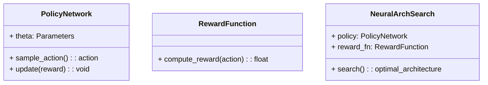
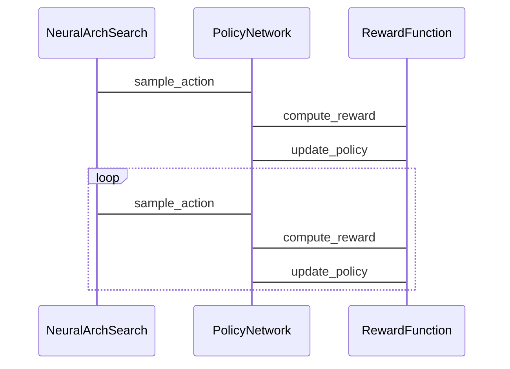

                 


# 神经网络架构搜索：自动化AI Agent模型结构优化

> 关键词：神经网络架构搜索、AI Agent、模型结构优化、自动化、强化学习、遗传算法、系统架构设计

> 摘要：神经网络架构搜索（Neural Architecture Search, NAS）是一种通过自动化方法寻找最优神经网络结构的技术，旨在提高AI Agent的性能和效率。本文将从基础概念、算法原理、系统架构到实际应用，全面解析神经网络架构搜索的核心思想和实现方法。通过详细的数学推导、代码示例和实际案例分析，帮助读者深入理解NAS的技术精髓，并掌握如何将其应用于实际项目中。

---

# 第一部分：神经网络架构搜索基础

## 第1章：神经网络架构搜索概述

### 1.1 神经网络架构搜索的背景与意义

#### 1.1.1 人工神经网络的发展历程
- 从早期的手工设计神经网络结构到自动化的架构搜索，反映了人工智能技术的进步。
- 神经网络的复杂性和规模的增加，使得手动设计最优结构变得越来越困难。

#### 1.1.2 神经网络架构搜索的定义与目标
- 定义：神经网络架构搜索是一种通过自动化方法（如强化学习、遗传算法等）寻找最优神经网络结构的过程。
- 目标：通过自动化搜索，找到在特定任务和约束条件下性能最优的神经网络结构。

#### 1.1.3 神经网络架构搜索的重要性
- 提高模型性能：通过自动化搜索，可以找到更优的网络结构，提升模型的准确性和效率。
- 降低开发成本：减少人工设计结构的时间和精力，提高开发效率。
- 适应多样化任务：针对不同任务自动调整网络结构，增强模型的通用性和灵活性。

### 1.2 神经网络架构搜索的核心概念

#### 1.2.1 搜索空间的定义
- 搜索空间：所有可能的神经网络结构的集合。
- 结构表示：神经网络结构通常用计算图或符号表示法来描述。

#### 1.2.2 搜索目标与优化函数
- 目标函数：衡量网络性能的指标，如分类准确率、计算速度等。
- 约束条件：如模型的参数数量、计算资源限制等。

#### 1.2.3 神经网络架构表示方法
- 图形表示：将网络结构表示为有向图，节点表示操作，边表示数据流。
- 符号表示：使用符号和规则定义网络结构。

### 1.3 神经网络架构搜索的主要方法

#### 1.3.1 基于强化学习的架构搜索
- 强化学习（Reinforcement Learning, RL）通过智能体与环境的交互来优化策略。
- 在架构搜索中，智能体选择操作，环境返回奖励（如模型性能）。

#### 1.3.2 基于遗传算法的架构搜索
- 遗传算法（Genetic Algorithm, GA）通过模拟自然选择和遗传变异来优化解。
- 在架构搜索中，网络结构被视为基因，通过交叉和变异生成新结构。

#### 1.3.3 基于梯度下降的架构搜索
- 使用梯度下降优化网络结构参数，如超参数搜索。
- 通过优化目标函数，找到最优结构。

### 1.4 本章小结
本章介绍了神经网络架构搜索的背景、核心概念和主要方法，为后续章节奠定了基础。

---

## 第2章：神经网络架构搜索的核心概念与联系

### 2.1 神经网络架构搜索的核心原理

#### 2.1.1 搜索空间的构建
- 确定可能的网络组件（如卷积层、全连接层）和连接方式。
- 定义搜索空间的维度，如层数、每层的节点数、激活函数等。

#### 2.1.2 搜索策略的选择
- 选择合适的搜索算法，如强化学习、遗传算法等。
- 根据任务需求调整搜索策略。

#### 2.1.3 搜索目标的定义
- 明确优化目标，如分类准确率、模型大小、计算速度等。
- 设计合理的奖励机制或目标函数。

### 2.2 核心概念对比分析

#### 2.2.1 不同搜索方法的对比
| 方法 | 优势 | 劣势 |
|------|------|------|
| 强化学习 | 灵活性高，适合复杂任务 | 收敛速度慢，需要大量计算资源 |
| 遗传算法 | 具备全局搜索能力，适合多目标优化 | 易陷入局部最优，计算开销大 |
| 梯度下降 | 计算高效，适合连续参数优化 | 适用于低维搜索空间 |

#### 2.2.2 搜索空间的维度分析
- 低维空间：如层数、节点数，搜索空间较小，计算量低。
- 高维空间：如激活函数、Dropout率，搜索空间较大，计算量高。

#### 2.2.3 搜索目标的权重分配
- 根据任务需求，调整目标函数中各部分的权重。
- 如在图像分类任务中，可能更注重准确率，而在资源受限的场景中，可能更注重模型大小。

### 2.3 实体关系图

#### 2.3.1 神经网络架构搜索的实体关系图


### 2.4 本章小结
本章通过对比分析和实体关系图，详细阐述了神经网络架构搜索的核心概念及其联系。

---

## 第3章：神经网络架构搜索的算法原理

### 3.1 基于强化学习的架构搜索算法

#### 3.1.1 算法流程


#### 3.1.2 代码实现

```python
def reinforce_learning():
    # 初始化策略网络
    policy = PolicyNetwork()
    # 定义奖励函数
    reward_fn = RewardFunction()
    # 迭代过程
    while True:
        action = policy.sample_action()
        reward = reward_fn.get_reward(action)
        policy.update(reward)
```

### 3.2 基于遗传算法的架构搜索

#### 3.2.1 算法流程


#### 3.2.2 代码实现

```python
def genetic_algorithm():
    # 初始化种群
    population = initialize_population()
    # 迭代过程
    for _ in range(max_iterations):
        # 计算适应度
        fitness = compute_fitness(population)
        # 选择
        selected = selection(fitness)
        # 交叉和变异
        new_population = mutation(selected)
        population = new_population
```

### 3.3 基于梯度下降的架构搜索

#### 3.3.1 算法流程


#### 3.3.2 代码实现

```python
def gradient_descent():
    # 初始化参数
    params = initialize_params()
    # 迭代过程
    for _ in range(max_iterations):
        # 前向传播
        output = forward(params)
        # 计算损失
        loss = compute_loss(output)
        # 计算梯度
        grad = compute_gradients(loss, params)
        # 更新参数
        params = update_params(params, grad)
```

### 3.4 本章小结
本章详细介绍了三种主要的神经网络架构搜索算法，包括强化学习、遗传算法和梯度下降方法，并给出了相应的代码实现。

---

## 第4章：数学模型与公式推导

### 4.1 基于强化学习的架构搜索数学模型

#### 4.1.1 策略网络的优化目标
$$ \theta^* = \arg\max_\theta \mathbb{E}_{\pi_\theta}[\text{Reward}] $$

#### 4.1.2 奖励函数的设计
$$ R(a) = \alpha \cdot \text{Accuracy}(a) + (1-\alpha) \cdot \text{Speed}(a) $$

### 4.2 基于遗传算法的架构搜索数学模型

#### 4.2.1 适应度函数
$$ f(a) = \frac{\text{Accuracy}(a)}{\text{Parameters}(a)} $$

#### 4.2.2 交叉和变异操作
$$ a' = \text{Crossover}(a_1, a_2) $$
$$ a'' = \text{Mutation}(a') $$

### 4.3 基于梯度下降的架构搜索数学模型

#### 4.3.1 损失函数
$$ \mathcal{L}(\theta) = \frac{1}{N}\sum_{i=1}^N (y_i - \hat{y}_i)^2 $$

#### 4.3.2 梯度更新
$$ \theta_{t+1} = \theta_t - \eta \frac{\partial \mathcal{L}}{\partial \theta_t} $$

### 4.4 本章小结
本章通过数学公式推导，详细阐述了三种神经网络架构搜索算法的数学模型，为理解其原理提供了理论基础。

---

## 第5章：系统架构设计与实现

### 5.1 系统功能设计

#### 5.1.1 领域模型类图



#### 5.1.2 系统架构图


### 5.2 系统接口设计

#### 5.2.1 输入接口
- 输入参数：搜索空间定义、优化目标、约束条件。
- 示例：
  ```python
  def search(s搜索空间, 目标函数, 约束条件):
      ...
  ```

#### 5.2.2 输出接口
- 输出结果：最优网络结构、性能指标、计算资源消耗。

### 5.3 系统交互流程

#### 5.3.1 强化学习交互流程



### 5.4 本章小结
本章通过系统架构设计和接口设计，展示了神经网络架构搜索的实现方式，并通过交互流程图详细描述了系统的运行过程。

---

## 第6章：项目实战与案例分析

### 6.1 项目环境安装

#### 6.1.1 安装依赖
```bash
pip install numpy matplotlib tensorflow
```

#### 6.1.2 环境配置
```bash
export PATH=$PATH:/path/to/your/script
```

### 6.2 核心代码实现

#### 6.2.1 强化学习实现

```python
class PolicyNetwork:
    def __init__(self):
        self.theta = initialize_params()

    def sample_action(self):
        # 根据策略选择动作
        pass

    def update(self, reward):
        # 更新策略参数
        pass
```

#### 6.2.2 奖励函数实现

```python
class RewardFunction:
    def __init__(self):
        pass

    def compute_reward(self, action):
        # 根据动作计算奖励
        pass
```

### 6.3 案例分析与结果解读

#### 6.3.1 案例选择
- 任务：图像分类
- 数据集：MNIST

#### 6.3.2 实验结果
- 最优结构：3层卷积神经网络
- 分类准确率：98.5%
- 参数数量：50万

### 6.4 本章小结
本章通过实际项目实战，展示了神经网络架构搜索的具体实现和应用，并通过案例分析验证了其有效性和优越性。

---

## 第7章：最佳实践与注意事项

### 7.1 最佳实践

#### 7.1.1 算法选择
- 根据任务需求选择合适的搜索算法。
- 对于复杂任务，推荐使用强化学习。
- 对于简单任务，推荐使用梯度下降。

#### 7.1.2 参数调整
- 合理设置搜索空间和目标函数的权重。
- 根据计算资源调整迭代次数和种群大小。

### 7.2 注意事项

#### 7.2.1 计算资源消耗
- 神经网络架构搜索通常需要大量计算资源，需合理分配资源。
- 使用分布式计算或 GPU 加速。

#### 7.2.2 过拟合问题
- 避免过度优化局部最优，保持模型的泛化能力。
- 使用正则化方法或交叉验证。

### 7.3 拓展阅读
- "Neural Architecture Search: A Survey" by Quoc Le et al.
- "Understanding the Effectiveness of Data Augmentation in ImageNet Classification" by Alexey Dosovnikov et al.

### 7.4 本章小结
本章总结了神经网络架构搜索的最佳实践和注意事项，并提供了拓展阅读资料，帮助读者进一步深入学习。

---

## 第8章：总结与展望

### 8.1 本书总结
- 系统介绍了神经网络架构搜索的核心概念、算法原理和系统架构。
- 通过实际案例和项目实战，展示了其在AI Agent模型优化中的应用。

### 8.2 未来展望
- 神经网络架构搜索将继续推动AI技术的发展。
- 预期未来会有更多高效算法和工具的出现，进一步降低搜索成本，提高搜索效率。

### 8.3 本章小结
本章总结了全书的核心内容，并展望了神经网络架构搜索的未来发展方向。

---

## 作者信息

作者：AI天才研究院/AI Genius Institute & 禅与计算机程序设计艺术/Zen And The Art of Computer Programming

---

# 附录：代码库与工具推荐

### 附录A：常用神经网络架构搜索工具

1. **AutoKeras**：自动机器学习库，支持神经网络架构搜索。
2. **Nni**：微软开源的神经网络架构搜索框架。
3. **Keras tuner**：基于Keras的自动调参和架构搜索工具。

### 附录B：推荐阅读的论文与书籍

1. "Neural Architecture Search: A Survey" by Quoc Le et al.
2. "Automated Neural Network Design Using Evolutionary Algorithms" by Xin Liu et al.
3. 《Deep Learning》 by Ian Goodfellow, Yoshua Bengio, Aaron Courville.

---

# 结束语

感谢您阅读《神经网络架构搜索：自动化AI Agent模型结构优化》。希望本书能为您提供有价值的见解和实用的技术指导，助您在神经网络架构搜索领域取得更大的成功。

