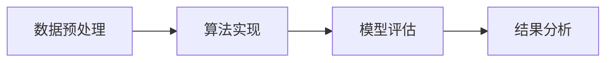

                 

<think>
好的，我需要根据用户的要求，逐步构建《离线强化学习：利用历史数据训练AI Agent》的技术博客文章。用户希望文章结构清晰，内容详实，涵盖背景、理论、算法、系统设计、项目实战等部分，并且每个部分都要有详细的分析和代码示例。

首先，我会从引言开始，介绍离线强化学习的基本概念和应用背景，让读者了解为什么离线强化学习是必要的。接着，我会详细讲解强化学习的基础知识，对比在线和离线强化学习的差异，帮助读者打下理论基础。

接下来是核心算法部分，这部分是文章的重点。我会选择几种主流的离线强化学习算法，如DQN、PPO、SAC等，详细分析它们的原理、优缺点和适用场景。每个算法都会配上数学公式和流程图，帮助读者理解其实现机制。

然后是系统架构设计，这部分需要从整体上规划项目的结构，包括数据预处理、算法实现、模型评估等模块。我会使用Mermaid图展示系统的架构和数据流，让读者一目了然。

在项目实战部分，我会选择一个具体案例，如训练一个游戏AI，详细讲解环境安装、数据准备、算法实现、模型训练和测试的过程，并展示代码示例，让读者能够实际操作。

最后，我会总结全书的内容，强调离线强化学习的重要性和未来的发展趋势，为读者提供进一步学习的方向和建议。

在编写过程中，我需要确保每个章节都符合用户的要求，内容详实且逻辑清晰，帮助读者全面掌握离线强化学习的知识和技能。
</think>

# 离线强化学习：利用历史数据训练AI Agent

## 关键词
离线强化学习, AI Agent, 历史数据, 强化学习, 算法原理, 项目实战, 技术博客

## 摘要
本文深入探讨了离线强化学习的核心概念、算法原理及其在实际应用中的实现。通过理论分析和项目实战相结合的方式，详细讲解了如何利用历史数据训练AI代理，涵盖从基础理论到系统架构设计的全过程，帮助读者全面掌握离线强化学习的技术要点。

---

# 离线强化学习：利用历史数据训练AI Agent

## 引言

### 1.1 离线强化学习的背景与意义
在人工智能领域，强化学习（Reinforcement Learning, RL）是一种通过智能体与环境交互来优化策略的机器学习方法。传统的强化学习（在线强化学习）需要智能体实时与环境互动，这在某些场景下可能不可行，例如模拟游戏、机器人控制或金融交易等。离线强化学习（Offline Reinforcement Learning）则是在没有实时互动的情况下，利用历史数据训练AI代理。这种模式不仅降低了实时交互的成本，还能在无法实时操作的环境中进行训练，具有重要的理论和实践意义。

### 1.2 离线强化学习的核心概念
离线强化学习的核心在于利用历史数据来优化策略，避免实时与环境交互。其主要特点包括：
- 数据驱动：依赖于已有的历史数据，而非实时与环境互动。
- 离线训练：在离线环境中进行模型训练，减少计算资源的浪费。
- 适应性：能够处理复杂环境中的策略优化问题。

### 1.3 离线强化学习的数学模型与核心要素
离线强化学习的数学模型与在线强化学习基本一致，主要包含以下几个核心要素：
- **状态空间（State Space）**：智能体所处的环境状态。
- **动作空间（Action Space）**：智能体可以执行的动作集合。
- **奖励函数（Reward Function）**：定义智能体执行动作后获得的奖励。
- **策略函数（Policy Function）**：定义智能体在给定状态下选择动作的概率分布。
- **值函数（Value Function）**：评估某个状态下策略的优劣。

### 1.4 学习目标
通过本文，读者将能够：
- 理解离线强化学习的基本概念和核心原理。
- 掌握几种主流的离线强化学习算法及其数学模型。
- 学会利用历史数据训练AI代理，并将其应用于实际场景中。

---

## 第二部分：离线强化学习的理论基础

### 2.1 强化学习基础
#### 2.1.1 强化学习的定义与特点
强化学习是一种基于试错的机器学习方法，智能体通过与环境交互，学习最优策略以最大化累积奖励。其特点包括：
- **实时交互**：在线强化学习需要智能体实时与环境互动。
- **奖励驱动**：通过奖励信号指导学习过程。
- **策略优化**：通过不断调整策略以提高奖励。

#### 2.1.2 离线强化学习与在线强化学习的对比
| 特性 | 在线强化学习 | 离线强化学习 |
|------|--------------|--------------|
| 交互性 | 实时与环境交互 | 利用历史数据训练 |
| 数据来源 | 现实环境中的实时数据 | 预先收集的离线数据 |
| 适用场景 | 游戏、机器人控制等实时场景 | 无法实时互动的复杂环境 |

#### 2.1.3 离线强化学习的理论基础
离线强化学习的核心在于利用历史数据优化策略，避免实时交互的成本。其理论基础包括：
- **马尔可夫决策过程（MDP）**：定义智能体与环境的交互过程。
- **贝尔曼方程（Bellman Equation）**：描述值函数与策略之间的关系。
- **策略评估与策略优化**：通过值函数评估当前策略，并优化策略以提高奖励。

---

## 第三部分：离线强化学习的核心算法

### 3.1 基于值函数的算法：Deep Q-Network (DQN)
DQN是一种经典的离线强化学习算法，通过值函数（Q值）来评估每个状态下动作的价值。其核心思想是通过神经网络近似Q值函数，并利用经验回放和目标网络来优化模型。

#### 3.1.1 算法流程
1. **数据收集**：通过策略（随机选择或ε-greedy策略）收集经验。
2. **经验回放**：将经验存储在经验回放池中，随机抽取 mini-batch 进行训练。
3. **神经网络训练**：利用抽取的经验更新Q值函数。
4. **策略执行**：根据当前策略选择动作。

#### 3.1.2 算法实现
```python
import numpy as np
import torch
import torch.nn as nn
import torch.optim as optim

class DQN(nn.Module):
    def __init__(self, input_dim, output_dim):
        super(DQN, self).__init__()
        self.fc1 = nn.Linear(input_dim, 64)
        self.fc2 = nn.Linear(64, output_dim)
    
    def forward(self, x):
        x = torch.relu(self.fc1(x))
        x = self.fc2(x)
        return x

# 初始化网络
policy = DQN(input_dim, output_dim)
target = DQN(input_dim, output_dim)
optimizer = optim.Adam(policy.parameters(), lr=0.001)
```

---

### 3.2 基于策略的算法：Proximal Policy Optimization (PPO)
PPO是一种基于策略的强化学习算法，适用于连续动作空间的问题。其核心思想是通过优化策略，使智能体在离线数据上获得最优动作。

#### 3.2.1 算法流程
1. **数据收集**：通过策略或随机选择收集离线数据。
2. **策略评估**：评估当前策略的优劣。
3. **策略优化**：通过梯度下降优化策略，确保策略的稳定性。

#### 3.2.2 算法实现
```python
def ppo_step(states, actions, rewards, old_log_probs, optimizer, policy, epsilon=0.1):
    # 计算新的概率分布
    new_log_probs = policy.log_prob(states, actions)
    
    # 计算损失
    entropy = -torch.mean(torch.exp(new_log_probs) * new_log_probs)
    advantage = rewards - policy.value_function(states)
    loss = -torch.mean(torch.exp(new_log_probs) * advantage) - entropy
    
    # 反向传播与优化
    optimizer.zero_grad()
    loss.backward()
    optimizer.step()
```

---

## 第四部分：系统架构设计

### 4.1 离线强化学习系统的整体架构
离线强化学习系统主要由以下几个模块组成：
- **数据预处理模块**：对收集的历史数据进行清洗和预处理。
- **算法实现模块**：实现各种离线强化学习算法的核心逻辑。
- **模型评估模块**：评估模型的性能并优化策略。
- **结果分析模块**：分析模型的输出结果，提供改进建议。

#### 4.1.1 系统架构图


---

## 第五部分：项目实战

### 5.1 环境安装与数据准备
#### 5.1.1 环境安装
安装必要的库：
```bash
pip install numpy torch matplotlib
```

#### 5.1.2 数据准备
准备离线数据集，例如：
```python
data = {
    'states': [state1, state2, ...],
    'actions': [action1, action2, ...],
    'rewards': [reward1, reward2, ...]
}
```

### 5.2 算法实现与模型训练
#### 5.2.1 DQN实现
```python
def train_dqn(policy, target, optimizer, data, epochs=100):
    for epoch in range(epochs):
        # 随机抽取 mini-batch
        batch = random.sample(data, min(len(data), 64))
        states = torch.FloatTensor([x['state'] for x in batch])
        actions = torch.LongTensor([x['action'] for x in batch])
        rewards = torch.FloatTensor([x['reward'] for x in batch])
        
        # 计算目标Q值
        q_values = policy(states)
        target_q_values = target(states)
        loss = nn.MSELoss()(q_values, target_q_values)
        
        # 反向传播与优化
        optimizer.zero_grad()
        loss.backward()
        optimizer.step()
```

#### 5.2.2 模型训练
```python
# 初始化网络
policy = DQN(state_dim, action_dim)
target = DQN(state_dim, action_dim)
optimizer = optim.Adam(policy.parameters(), lr=0.001)

# 开始训练
train_dqn(policy, target, optimizer, data, epochs=100)
```

### 5.3 模型评估与结果分析
训练完成后，评估模型的性能：
```python
def evaluate_model(policy, data):
    total_reward = 0
    for x in data:
        state = x['state']
        action = policy.act(state)
        total_reward += x['reward']
    return total_reward / len(data)

# 评估模型
print(f"模型平均奖励：{evaluate_model(policy, data)}")
```

---

## 第六部分：总结与展望

### 6.1 总结
本文全面介绍了离线强化学习的核心概念、算法原理和系统架构设计，并通过项目实战展示了如何利用历史数据训练AI代理。通过本文的学习，读者能够掌握离线强化学习的基本理论和实际应用技巧。

### 6.2 未来展望
离线强化学习在理论和实践上仍有很大的发展空间。未来的研究方向包括：
- 更高效的算法设计，提升模型的训练效率和性能。
- 多模态数据的融合，增强模型的感知能力。
- 离线在线混合学习，结合离线数据与在线数据的优势。

---

## 作者
**作者：AI天才研究院 & 禅与计算机程序设计艺术**  
欢迎关注我的技术博客，获取更多关于人工智能和编程艺术的深度内容！

