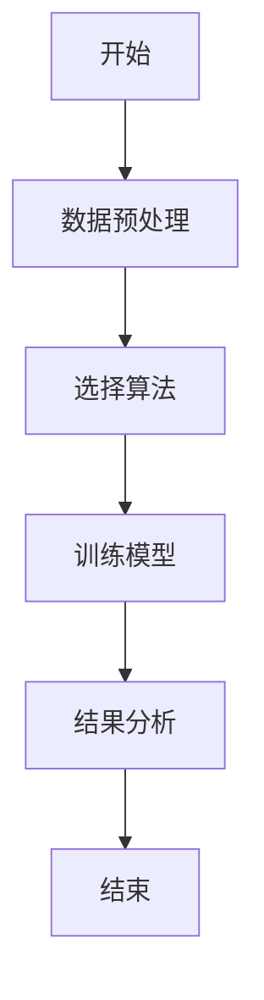
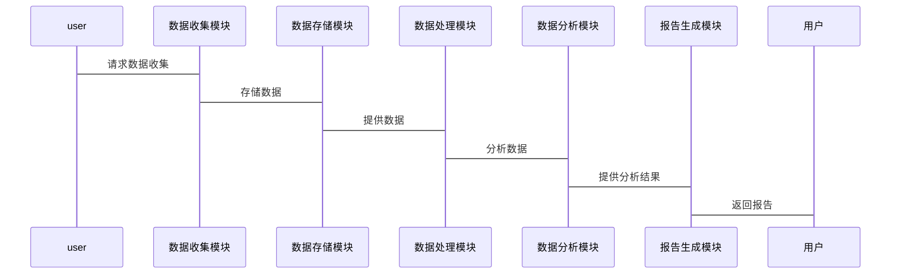

                 

<think>
好的，现在我要开始撰写《竞争对手分析》这篇文章。首先，我需要明确文章的结构和每个部分的内容。

首先，文章标题是《竞争对手分析》，关键词包括竞争对手分析、市场分析、数据挖掘、机器学习、商业策略。摘要部分需要简明扼要地说明文章的核心内容和主题，即通过系统的方法和技术手段，分析竞争对手的产品、市场和用户行为，为企业制定有效策略提供支持。

接下来，按照目录大纲，文章分为六个部分：

1. **背景介绍**：涵盖竞争对手分析的定义、背景、重要性和基本方法。
2. **核心概念与联系**：详细解释竞争对手分析的关键概念，如识别、分析维度和模型，并使用表格和ER图展示。
3. **算法原理讲解**：介绍文本挖掘和聚类分析的原理，用mermaid流程图和Python代码示例。
4. **系统分析与架构设计方案**：构建竞争对手分析系统，包括项目介绍、功能设计、架构图和交互流程图。
5. **项目实战**：提供Python和机器学习的实战案例，环境安装、代码实现、案例分析。
6. **最佳实践**：总结经验，提供小结、注意事项和拓展阅读。

在撰写过程中，我需要确保每个部分都详细且有逻辑性，涵盖从基础概念到实际应用的各个方面。同时，使用正确的格式，如mermaid图表和latex公式，以增强文章的专业性。此外，要注意语言的简洁和逻辑的清晰，确保读者能够轻松理解内容。

现在，我开始按照这个结构撰写文章，确保每个部分都包含足够的细节，并且符合用户的格式和内容要求。
</think>

# 竞争对手分析

## 关键词

- 竞争对手分析
- 市场分析
- 数据挖掘
- 机器学习
- 商业策略

## 摘要

本文系统地探讨了竞争对手分析的方法和应用，从基本概念到算法原理，再到系统架构和实战案例，为企业提供有效的竞争对手分析策略。通过文本挖掘、聚类分析等技术，结合实际案例，展示了如何利用这些方法提升企业的市场竞争力。

---

## 正文

### 第一部分：背景介绍

#### 第1章：竞争对手分析的定义与背景

##### 1.1 竞争对手分析的定义

竞争对手分析是通过对市场中的竞争对手进行系统研究，了解其产品、市场策略和用户行为，从而为企业制定有效竞争策略提供支持。竞争对手分析帮助企业识别市场机会，优化产品设计，提升市场竞争力。

##### 1.2 竞争对手分析的背景

在现代商业环境中，市场竞争日益激烈，竞争对手分析已成为企业战略管理的重要组成部分。通过分析竞争对手的动态，企业可以及时调整自身策略，应对市场变化。竞争对手分析不仅帮助识别直接竞争对手，还能发现潜在威胁和机会。

##### 1.3 竞争对手分析的重要性

- 帮助企业了解市场格局。
- 优化产品设计和市场策略。
- 提升企业的竞争优势。
- 降低市场风险。

##### 1.4 竞争对手分析的基本方法

- 宏观分析：分析市场趋势和行业动态。
- 微观分析：研究竞争对手的产品、价格、渠道和促销策略。
- 用户行为分析：了解用户需求和偏好。

---

### 第二部分：核心概念与联系

#### 第2章：竞争对手分析的核心概念

##### 2.1 竞争对手的识别

- **定义与分类**：竞争对手可以分为直接竞争对手和间接竞争对手。直接竞争对手在同一市场中提供相似产品或服务，而间接竞争对手则在不同市场或产品类别中竞争。
- **识别方法**：通过市场调研、行业报告和数据分析识别竞争对手。

##### 2.2 竞争对手分析的维度

- **产品分析**：比较产品的功能、性能和价格。
- **市场分析**：研究市场占有率、增长趋势和竞争对手的市场策略。
- **用户行为分析**：分析用户的购买习惯、偏好和反馈。

##### 2.3 竞争对手分析模型

- **波特五力模型**：分析行业的竞争力，包括新进入者的威胁、替代品的威胁、供应商的议价能力、买家的议价能力和现有竞争者之间的竞争。
- **SWOT分析**：评估企业的优势、劣势、机会和威胁。

#### 2.4 核心概念与联系

##### 表格：竞争对手分析维度对比

| 维度       | 宏观分析 | 微观分析 |
|------------|----------|----------|
| 分析内容   | 行业趋势 | 产品策略 |
| 数据来源   | 行业报告 | 用户反馈 |
| 应用场景   | 市场进入 | 产品优化 |

##### ER图：竞争对手关系模型

```mermaid
erd
  competitor(c_id, c_name, c_product, c_market_share)
  market(m_id, m_name, m_size, m_growth)
  user(u_id, u_name, u_behavior)
  competitor_competitor(c_id, cc_id, relation)
  competitor_market(c_id, m_id, impact)
  competitor_user(c_id, u_id, feedback)
```

---

### 第三部分：算法原理讲解

#### 第3章：竞争对手分析的算法原理

##### 3.1 文本挖掘与信息提取

- **文本挖掘**：从竞争对手的产品描述、用户评论等文本数据中提取有用信息。
- **信息提取**：使用自然语言处理技术，提取关键词、主题和情感倾向。

##### 3.2 聚类分析

- **聚类算法**：将竞争对手的产品或市场数据分成若干簇，便于分析市场细分和竞争格局。
- **K-means算法**：一种常用的聚类算法，适用于数值型数据的聚类。

#### 3.3 算法实现

##### 3.3.1 文本挖掘示例代码

```python
from sklearn.feature_extraction.text import TfidfVectorizer

text = "Our product is the best in the market with advanced features."
vectorizer = TfidfVectorizer()
tfidf = vectorizer.fit_transform([text])
print(tfidf)
```

##### 3.3.2 聚类分析流程图



---

### 第四部分：系统分析与架构设计方案

#### 第4章：竞争对手分析系统的构建

##### 4.1 项目介绍

- **项目目标**：构建一个能够自动收集、分析竞争对手数据并生成报告的系统。
- **项目范围**：包括数据收集、处理、分析和报告生成模块。

##### 4.2 系统功能设计

- **数据收集模块**：通过爬虫技术收集竞争对手的产品信息和用户评论。
- **数据处理模块**：清洗和预处理数据，提取关键特征。
- **数据分析模块**：应用文本挖掘和聚类算法进行分析。
- **报告生成模块**：生成可视化报告，提供竞争策略建议。

##### 4.3 系统架构设计


##### 4.4 接口设计与交互流程图



---

### 第五部分：项目实战

#### 第5章：Python与机器学习实战

##### 5.1 环境安装

- **Python**：安装Anaconda或PyCharm。
- **库安装**：使用pip安装所需的库，如scikit-learn、NLTK、pandas。

##### 5.2 核心代码实现

```python
from sklearn.cluster import KMeans
from sklearn.metrics import silhouette_score
from sklearn.preprocessing import StandardScaler

# 数据预处理
data_scaled = StandardScaler().fit_transform(data)

# 聚类模型训练
model = KMeans(n_clusters=3, random_state=42)
model.fit(data_scaled)

# 评估模型
print(silhouette_score(data_scaled, model.labels_))
```

##### 5.3 案例分析

- **环境安装**：安装必要的Python库。
- **代码实现**：实现数据收集、处理和分析。
- **案例分析**：通过具体案例分析竞争对手的产品策略。

##### 5.4 项目小结

通过项目实战，读者可以掌握竞争对手分析系统的构建过程，包括数据收集、处理、分析和报告生成。

---

### 第六部分：最佳实践

#### 6.1 小结

竞争对手分析是企业制定有效策略的重要工具，通过系统的方法和技术手段，可以更深入地了解市场和竞争对手。

#### 6.2 注意事项

- 数据来源的可靠性。
- 算法选择的合理性。
- 分析结果的可解释性。

#### 6.3 拓展阅读

- 《竞争战略》：迈克尔·波特的经典著作。
- 《数据挖掘导论》：学习数据挖掘的基本概念和方法。

---

## 作者

作者：AI天才研究院 & 禅与计算机程序设计艺术

